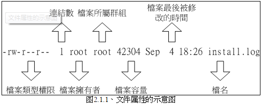
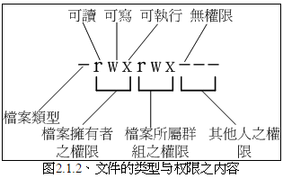
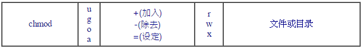
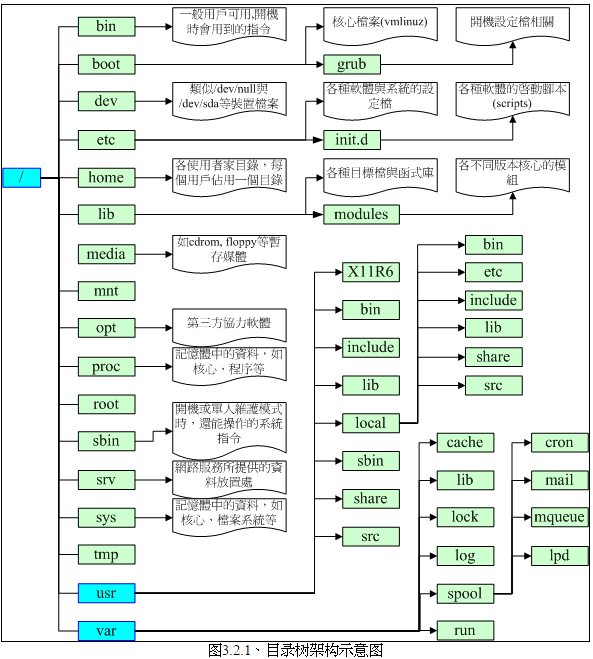

<!-- @import "[TOC]" {cmd="toc" depthFrom=1 depthTo=6 orderedList=false} -->

<!-- code_chunk_output -->

- [文件权限与目录配置](#文件权限与目录配置)
  - [文件权限](#文件权限)
  - [Linux 文件种类与扩展名](#linux-文件种类与扩展名)
  - [Linux 目录配置标准: FHS](#linux-目录配置标准-fhs)
  - [目录树](#目录树)

<!-- /code_chunk_output -->

# 文件权限与目录配置

## 文件权限

- Linux 中默认情况下, 所有系统上的账户相关信息都保存在/etc/passwd 这个文件内. 个人密码记录在/etc/shadow 文件下. 所有的组名都记录在/etc/group 这个文件中. 这三个文件是 Linux 的账户、密码、用户组集中地.
- 如果文件名前面多一个".", 则代表这个文件为"隐藏文件".
- ls -al 解析:



- 第一个字符代表这个文件是"文件、目录或链接文件":
  - [d]: 目录
  - [-]: 文件
  - [l]: 连接文件(linkfile)
  - [b]: 设备文件里面的可供存储的接口文件
  - [c]: 设备文件里面的串行端口设备, 例如键盘、鼠标(一次性读取设备)
- 文件大小默认单位是 B
- 时间显示的是创建或者文件最近一次修改的时间. 时间太久远会显示年份.



- chgrp: 改变文件所属用户组
  - 被改变的组名必须在/etc/group 文件内存在
- chown: 改变文件的所有者
  - 用户必须是已经存在与系统中的账号, 即/etc/passwd 文件中的.
  - 还可以顺便修改用户组名称. chown user:group file
  - cp 会复制之前的属性与权限
- chmod: 改变权限, 有两种方式, 符号法和数字法, 数字法中, r、w、x 分数为 4, 2, 1.
  - 符号法命令使用方式如下图:



- 例如:

```
设置特定权限: chmod u=rwx, go=rx test
所有人去掉 w 权限: chmod a-w test
```

- 权限对于文件(一般包括文本文件、数据库内容文件、二进制可执行文件)的意义如下, 对于文件, r,w,x 主要针对文件内容:

>r(read): 可读取此文件的实际内容, 如读取文本文件的文字内容.
w(write): 可编辑、新增或修改文件内容(但不包含删除文件, 删除与目录权限有关, 目录记录了所有文件名以及 inode 号码).
x(execute): 被系统执行的权限. Windows 下文件执行通过扩展名判断(.bat 等), Linux 下文件是否能被执行由这个权限决定, 和文件名没关系.

-权限对于目录的意义:

>r(read contents in directory): 具有读取目录结构列表的权限, 可以查询该目录下所有文件文件名数据.
w(modify contents of directory): 更改该目录结构列表的权限, 即: 新建文件或目录、删除已存在的文件与目录(无论该文件权限如何)、将已存在的文件或目录进行重命名、转移该目录内文件或目录位置.
x(access directory): 目录只是记录文件名, 但是目录可以执行, 代表用户能否进入该目录成为工作目录的用途.

- 有一个目录权限如下:

```
drwxr--r-- 3 root root 4096 Jun 25 08:35 .ssh
```

  问: 系统有个账户名称为 vbird, 这个账号并没有支持 root 用户组, 请问 vbird 对这个目录有什么权限?是否可切换到此目录中?
  答: vbird 对这个目录(目录也是文件)有 r 权限, 因此 vbird 可以查询此目录下的文件名列表(block 存储文件名与 inode 号码, 具体原理见文件系统). 因为 vbird 不具有 x 的权限, 所以 vbird 并不能切换到此目录下.
- 能不能进入某个目录, 只与该目录的 x 权限有关系.
- 假设有一个账号名称是 dmtsai, **他的主文件夹在/home/dmtsai/, dmtsai 对此目录有 rwx 权限**. 若此文件夹下面有一个文件, 权限如下:

```
-rwx------ 1 root root 4365 Sep 19 23:20 data
```

问: dmtsai 对此文件的权限是什么?是否可以删除?
答: 由于 dmtsai 对于此文件来说是"others"的身份, 因此这个文件无法读取、无法编辑、无法执行. 但是由于这个文件在他的主文件夹下面, 他在此目录下有 rwx 的完整权限, 因此对于这个文件, 他是有删除权限的.

## Linux 文件种类与扩展名

- Linux 下任何设备都是文件, 连数据通信的接口也有专门的文件负责.
- 设备与设备文件: 与系统外设及存储等相关的一些文件, 通常都集中在/dev/这个目录下. 通常又分为两种:
  - 块(block)设备文件: 就是一些存储数据, 以提供系统随机访问的接口设备, 例如硬盘、软盘等. 你可以随机地在硬盘的不同块读写, 这种设备就是成组设备, 第一个属性为[b].
  - 字符(character)设备文件: 即一些串行端口的接口设备, 例如键盘、鼠标等. 这些设备的特征就是"一次性读取"的, 不能够截断输出. 举例来说, 你不可能让鼠标"跳到"另一个界面, 而是"滑动"到另一个地方. 其第一个属性为[c].
- 套接字(sockets): 网络上的数据连接. 可以启动一个程序来监听客户端的请求, 而客户端就可以通过这个 sockets 来进行数据的通信了. 其第一个属性为[s]. 通常在/var/run 可以看到.
- 管道(FIFO, pipe): 主要目的解决多个程序同时访问一个文件所造成的错误问题. 第一个属性为[p].
- 从网络上传输文件到自己的 Linux 系统, 文件的属性与权限确实是会被改变的.
- Linux 文件长度限制:
  - Linux 下默认使用 Ext2/Ext3 文件系统, 针对文件的文件名长度限制:
  - 单一文件或目录的最大容许文件名为 255 字符
  - 包含完整路径名称与目录(/)的完整文件名为 4096 字符.

---

## Linux 目录配置标准: FHS

- Linux 目录配置标准: FHS(Filesystem Hierarchy Standard)
- FHS 针对目录树架构仅定义出三层目录:
  - /(root, 根目录): 与开机系统有关
  - /usr(Unix software resource): 与软件安装/执行有关
  - /var(variable): 与系统运作过程有关
- FHS 标准建议: 根目录(/)所在分区应该越小越好, 且应用程序所安装的软件最好不要与根目录放置在同一个分区内, 保持根目录越小越好. 如此不但性能较好, 根目录所在的文件系统也较不容易发生问题.
- usr(UNIX Software Resource)是软件目录, FHS 建议所有软件开发者应该将数据合理放置到这个目录下. 类似于 Windows 的"C:\Windows\"和"C:\Program file\"目录的综合体.
- 详细见《鸟哥的 Linux 私房菜基础篇》的第 6.3.1 章节

## 目录树

- 目录树的起始点为根目录(/,  root)
- 每个目录不仅能使用本地端的文件系统, 也可以使用网络上的文件系统. 目录树如下:



注: 通过 uname -r 可以查看实际的内核版本; 通过 lsb_release -a(Linux 标准, Linux Standard Base)查看具体的 distribution 信息.