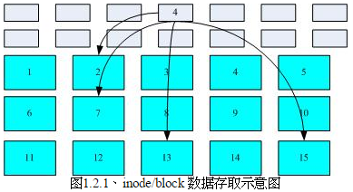
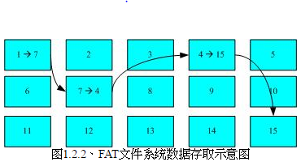
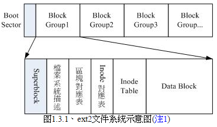
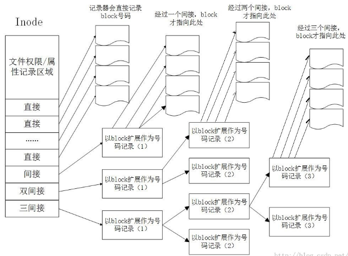
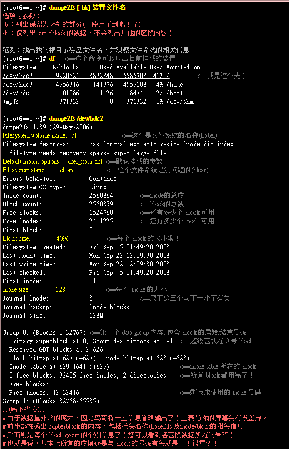
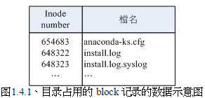
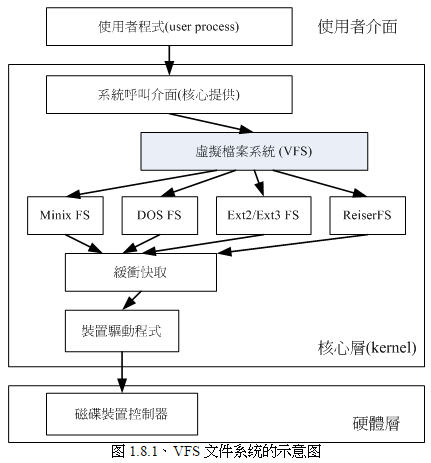

<!-- @import "[TOC]" {cmd="toc" depthFrom=1 depthTo=6 orderedList=false} -->

<!-- code_chunk_output -->

- [文件系统](#文件系统)
  - [文件系统特性](#文件系统特性)
  - [Linux 的 Ext2 文件系统 ##](#linux-的-ext2-文件系统-)
  - [与目录树的关系 ##](#与目录树的关系-)
  - [日志文件系统(Journaling file system) ##](#日志文件系统journaling-file-system-)
  - [Linux 文件系统的操作 ##](#linux-文件系统的操作-)
  - [挂载点(mount point)的意义 ##](#挂载点mount-point的意义-)
  - [其他 Linux 支持的文件系统与 VFS ##](#其他-linux-支持的文件系统与-vfs-)
  - [参考资料 ##](#参考资料-)

<!-- /code_chunk_output -->

# 文件系统

## 文件系统特性

磁盘分区完毕后必须进行**格式化**, 因为每种操作系统所配置的文件属性/权限不同, 为了存放这些文件所需的数据, 因此就需要将分区进行格式化, 从而成为操作系统能够使用的文件系统格式.

>Windows 利用的文件系统主要是 FAT, Linux 是 Ext2

传统的磁盘与文件系统应用中, 一个分区就只能被格式化为一个文件系统, 所以一个 filesystem 就是一个 partition. 新技术(LVM, 软件磁盘阵列<software raid>)可以将一个分区格式化为多个文件系统, 也能将多个分区合成一个文件系统(LVM, RAID). 现在我们称呼**一个可被挂在的数据为一个文件系统而不是一个分区**.

Linux 的 Ext2 文件系统内的主要信息是:

 1. superblock: 记录文件系统的整体信息, 包括 inode/block 的总量、使用量、剩余量, 以及文件系统的格式与相关信息等.
 2. inode: 记录文件的属性(权限<rwx>和属性<所有者、群组、时间参数等>), 一个文件占用一个 inode, 同时记录此文件的数据所在的 block 号码.
 3. block: 实际记录文件的内容, 若文件过大, 会占用多个 block.

文件系统会先格式化出来 inode 与 block 的块, 假设某个文件的属性与权限数据放置到 inode4 号, 而这个 inode 记录了文件数据的实际放置是在 2、7、13、15 这 4 个 block 号码, 此时就可根据此来排列磁盘的阅读顺序, 可一次性将 4 个 block 内容读出来, 如下图:

此数据访问方式是**索引式文件系统**(indexed allocation)

U 盘(闪存)一般是 FAT 格式. FAT 没有 inode 存在, 每个 block 号码都记录在前一个 block 中, 读取方式如下:

如果同一个文件数据写入的 block 过于分散, 则磁头需要转好几圈才能获取所有数据.
>碎片整理也是因为上面这个原因, 将同一个文件所属的 blocks 汇集在一起. Ext2 就不太需要.


----------


## Linux 的 Ext2 文件系统 ##
文件系统一开始就将 inode 与 block 规划好了, 除非重新格式化(或者使用 resizefs 等命令更改文件系统大小), 否则 inode 与 block 固定后就不变.

如果文件系统高达数百 GB, 那么将所有 inode 与 block 放置在一起是不明智的, 因为 inode 与 block 数量太大, 不易管理. 因而 Ext2 系统在格式化时候基本上是区分为多个块组(block group)的, 每个块组都有独立的 inode/block/superblock 系统.

在整体规划中, 文件系统最前面有一个启动扇区(boot sector), 这个启动扇区可以安装引导装载程序, , 这样可以将不同的引导装载程序安装到个别的文件系统最前端, 而不用覆盖整块硬盘唯一的 MBR, 这样也才能制作出多重引导的环境.

Ext2 文件系统示意图:

下面针对每个块进行阐述.

----------

 **data block(数据块)**

 - 放置文件内容的地方, ext2 文件系统所支持的 block 大小有 1KB,2KB,4KB 三种而已. 格式化时候 block 大小就固定了, 而且每个 block 都有编号, 方便 inode 记录.
 - block 大小会引起 Ext 文件系统限制, block 大小的区别, 单个文件容量和最大文件系统总容量不相同.
 - 每个 block 内最多只能放置一个文件的数据.

----------

**inode table(inode 表格)**

 - 该 block group 的所有文件 inode.
 - inode 主要记录文件的属性(权限<rwx>和属性<所有者、群组、时间参数等>), 一个文件占用一个 inode, 同时记录此文件的数据所在的 block 号码.
 - inode 记录的文件数据至少有下面这些:

>
1. 该文件的访问模式(read/write/excute)
2. 该文件的所有者与组(owner/group)
3. 该文件的大小
4. 该文件创建或者状态改变的时间(ctime)
5. 最后一次读取的时间(atime)
6. 最近修改的时间(mtime)
7. 定义文件特性的标志(flag),  如 SetUID 等
8. 该文件真正内容的指向(pointer)

 - 每个 inode 的大小固定为 128bytes, 记录一个 block 号码要 4byte
 - 每个文件仅占用一个 inode, 因此文件系统能够创建的文件数量与 inode 的数量有关
 - 系统读取文件会先找到 inode, 并分析 inode 所记录的权限与用户是否符合, 符合才会实际读取 block 的内容.
 - inode 记录 block 号码的区域定义为 12 个直接, 1 个间接, 1 个双间接与 1 个三间接记录区. 如下图:


>
问: 这样 inode 可以记录多少个 block?一个文件可以多大?以较小的 1KB 的 block 来说明.
答:
1. 12 个直接指向: 12,  12 * 1K = 12K,  记录器直接记录, 所以 12 条
2. 间接, 一个 block 间接作为记录器, 1K / 4byte = 256,  256 * 1K = 256K,  记录一个 block 号码需要 4byte, 1K 大概可以记录 256 条
3. 双间接, 256 * 256 = 65535,  65535 * 1K = 65535K, 双间接可以记录 65535 条
4. 三间接, 256 * 256 * 256 = 16776960,  16776960 * 1K = 16776960K, 三间接可以记录 16776960 条
总结: block 大小=12 + 256 + 65535 + 16776960 = 16842763 条,  单个文件大小可以有 16G. 比较一下文件系统限制表的结果可发现是一致的！但这个方法不能用在 2K 及 4K block 大小的计算中,  因为大于 2K 的 block 将会受到 Ext2 文件系统本身的限制, 所以计算的结果会不太符合之故.

----------

**Superblock(超级块)**

 -  记录整个文件系统基本相关信息的地方. 记录的主要信息如下:
 >
1. block 与 inode 的数量
2. 未使用和已使用的 block/inode 数量
3. block 与 inode 的大小(block 为 1K、2K、4K, inode 大小为 128 bytes)
4. 文件系统的挂载时间、最近一次写入数据的时间、最近一次检验磁盘(fsck)的时间等文件系统相关信息
5. 一个 valid bit 数值, 若此文件系统已被挂载, 则 valid bit 为 0, 未被挂载, 则为 1

 - superblock 一般大小为 1024bytes, 相关信息可通过 dumpe2fs 命令查看.
 - 每个 block group 都可能含有 superblock, 但是一个文件系统只有一个 superblock. 除了第一个 block group 内含有 superblock, 后续的 block group 不一定含有, 而若含有主要作为第一个 block group 内的 superblock 的备份, 这样可以用来救援.

----------
**File System Description(文件系统描述)**

 - 记录当前 block group 的开始与结束的 block 号码, 以及说明每个区段(superblock、bitmap、inodemap、datablock)分别位于哪一个 block 号码之间, 也可通过 dumpe2fs 查看.

----------
**block bitmap(块对照表)**

- 记录当前 block group 中哪些 block 是空的. 当删除某些文件时候, 在 block bitmap 中相应到该 block 的标志位就要修改成"未使用".

----------
**inode bitmap(inode 对照表)**

 - 记录当前 block group 中使用于未使用的 inode 号码

每个区段和与 superblock 信息都可以使用 dumpe2fs 命令查询.



上半部分是 superblock 的内容, 下半部分是每个 block group 信息.

----------


## 与目录树的关系 ##

**目录**

- 当在一个 ext2 系统下新建一个目录时候, ext2 会分配一个 inode 与至少一块 block 给该目录. 其中, inode 记录该目录的相关权限与属性, 并可记录分配到的那块 block 号码, 而 block 则是记录这个目录下的文件名与该文件名占用的 inode 号码数据, 也就是说目录所占用的 block 内容记录如下信息:



- 通过 ls -li 可以查看目录下文件的占用的 inode 号码(注意上下两图内容的关系)


**文件**

- 当新建一个文件时候, ext2 会分配一个 inode 与相对于该文件大小的 block 数量给该文件.

> 假设一个 block 为 4K, 而新建一个 100KB 的文件, 那么 linux 会分配一个 inode 与 25 个 block 来存储该文件. 但注意, 由于 inode 仅有 12 个直接指向, 因此还需要多一个 block 来作为块号码的记录.
注: block 大小(4K) / 记录一个 block 需要 4byte = 一个 block 可以记录的 block 数量

**目录树读取**

- 从上面可以看出来, inode 本身并不记录文件名, 文件名记录是在目录的 block 中. (因而, 增删改文件名文件与目录的 w 权限有关系). 当我们读取文件时, 务必会经过目录的 inode 与 block, 然后才能找到那个待读取文件的 inode 号码, 才能最终读取到正确的文件的 block 内数据.
- 由于目录树是由根目录开始读起, 因此系统通过挂载的信息可以找到挂载点的 inode 号码(通常一个文件系统最顶层的 inode 号码是由 2 号开始), 此时就能得到根目录的 inode 内容, 并根据该 inode 读取根目录的 block 内的文件名数据(文件名与占用的 inode 号码), 然后一层一层往下读到正确的文件名.
- 假设想要读取/etc/passwd 这个文件时候, 系统如何读取?


该文件的读取流程为:
1. /的 inode:
通过挂载点的信息找到/dev/hdc2 的 inode 号码为 2 的根目录 inode, 并且 inode 规范的权限让我们可以读取该 block 的内容(有 r 与 x)
2. /的 block:
经过上面步骤得到 block 的号码, 并找到该内容有 etc/目录的 inode 号码(1912545)
3. etc/的 inode:
读取 1912545 号得知 vbird 具有 r 与 x 的权限, 因此可以读取 etc/的 block 内容
4. etc/的 block:
上步骤获取 block 号码, 通过该 block 的内容, 得知 passwd 文件的 inode 号码(1914888)
5. passwd 的 inode:
读取 1914888 号 inode 得知 vbird 具有 r 权限, 因此可以读取 passwd 的 block 内容
6. passwd 的 block:
最好将该 block 内容的数据读出来

**新建一个文件或目录**

假设新增一个文件, 此时文件系统的行为:
1. 先确定用户对欲添加文件的目录是否具有 w 与 x 的权限, 若有才能添加.
2. 根据 inode bitmap 找到没有使用的 inode 号码, 并将新文件的权限/属性写入.
3. 根据 block bitmap 找到没有使用中的 block 号码, 并将实际的数据写入 block 中, 并更新 inode 的 block 指向数据.
4. 将刚写入的 inode 与 block 数据同步更新 inode bitmap 与 block bitmap, 并更新 superblock 的内容.

- 一般, 将 inode table 与 data block 称为数据存放区域, 至于其他例如 super block、block bitmap 与 inode bitmap 等区段就被称为 metadata(中间数据), 因为这几个数据经常变动.

**数据不一致**

- 上面创建文件, 写入的数据仅有 inode table 与 data block, 最后一个同步到中间数据的步骤并未做完, 这时, meta data 的内容与实际数据存放区不一致.
- 早期的 ext2 系统, 系统重启后, 会通过 superblock 中记录的 valid bit(是否有挂载)与文件系统的 state(clean 与否)等状态来判断是否强制进行数据一致性校验. 如需要则以 e2fsck 程序来进行.

## 日志文件系统(Journaling file system) ##
- 为避免上面问题, 在文件系统中规划一个块, 用来专门记录写入或修改文件时的步骤. 即:

```
1. 预备: 当系统要写入一个文件, 会先在日志记录块中记录某个文件准备要写入的信息.
2. 实际写入: 开始写入文件的权限与数据; 开始更新 meta data 的数据.
3. 结束: 完成数据与 meta data 的更新后, 在日志记录块中完成该文件的记录.
```

- 当数据记录过程出现问题, 系统检查日志记录块就可以知道哪个文件发生问题, 针对该问题进行一致性检查即可, 而不必针对整个文件系统.
- Ext3 已实现日志功能. 当时 dumpe2fs 输出信息, 可以发现下面信息:

```
Journal inode:       8
Journal backup:      inode blocks
Journal size:        128M
```

- 通过 inode8 号记录 journal 块的 block 指向, 而且具有 128M 的容量来处理日志.

## Linux 文件系统的操作 ##

- 所有数据都得加载到内存后 CPU 才能对该数据进行处理. 如果经常编辑一个很大的文件, 编辑过程中又频繁地要系统来写入磁盘中, 由于磁盘写入速度比内存慢很多, 因此会经常耗在等待硬盘的写入/读取上.
- 为解决这个问题, Linux 使用的方式是通过一个称为异步处理(asynchronously)的方式. 所谓异步处理是这样的:
- 当系统加载一个文件到内存中, 如果文件没有修改过, 则在内存区段的文件数据会被设置为(clean)的. 但如果内存中的文件数据被更改过了(比如用 vim 编辑过), 此时该内存中数据会被设置为 Dirty. 此时所有的操作都还在内存中进行, 并没有写入磁盘中. 系统会不定时将内存中设置为 Dirty 的数据写回磁盘, 以保持数据一致性. 也可以利用**sync**命令来手动强迫写回磁盘.
- 内存写入速度比硬盘快得多, 因此如果将常用的文件放置到内存中, 就会增加系统性能, Linux 系统上文件系统与内存有很大关系:

>
1. 系统会将常用文件数据放置到主存储器的缓冲区, 以加速文件系统的读/写.
2. 承上, Linux 的物理内存最后会被用光.
3. 可手动使用 sync 强迫内存中设置为 Dirtry 的文件回写到磁盘中.
4. 若正常关机, 关机命令会主动调用 sync 将内存中数据回写入磁盘中.
5. 若异常关机, 由于数据没有回写到磁盘中, 因此重新启动后可能会花很多时间在进行磁盘校验, 甚至可能导致文件系统的损毁(非磁盘损坏).

## 挂载点(mount point)的意义 ##

- 每个文件系统要能够链接到目录树才能被我们使用, 即挂载. 挂载点一定是目录, 该目录为进入该文件系统的入口.
- 同一个文件系统, 可以通过判断 inode 号码确认不同文件名是否是相同文件. 所以可以这样看:


>
上面信息由于挂载点为/, 因此三个文件(/,  /.,  /..)均在同一文件系统中, 而这三个文件的 inode 号码均为 2 号, 因此这三个文件都指向同一 inode 号码, 所以这三个文件完全一模一样. 也就是说, 根目录的上层(/...)就是它自己.

## 其他 Linux 支持的文件系统与 VFS ##

- 常见的支持文件系统有:
  - 传统文件系统: ext2/minix/MS-DOS/FAT(用 vfat 模块)/iso9660(光盘)等;
  - 日志文件系统: ext3/ReiserFS/Windows'NTFS/IBM'sJFS/SGI'sXFS 等;
  - 网络文件系统: NFS/SMBFS 等
- 想知道你的 Linux 支持的文件系统有哪些, 可以查看下面目录:

> ls -l /lib/modules/$(uname -r)/kernel/fs

- 系统目前已加载到内存中支持的文件系统则有:

> cat /proc/filesystem

- VFS(Viurtual Filesystem Switch, 虚拟文件系统)用来管理所有文件系统. 如下图:



## 参考资料 ##

1. Ext2/Ext3: [中文链接](http://cn.linux.vbird.org/linux_basic/1010appendix_B.php),  [英文链接](http://www.freeos.com/articles/3912/)
2.
