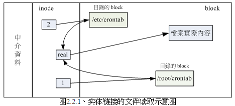
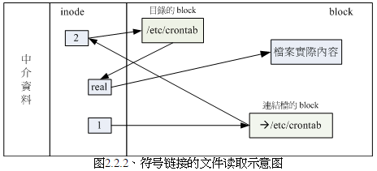

<!-- @import "[TOC]" {cmd="toc" depthFrom=1 depthTo=6 orderedList=false} -->

<!-- code_chunk_output -->

- [文件系统的简单操作](#文件系统的简单操作)
  - [1. 磁盘与目录的容量: df、du](#1-磁盘与目录的容量-df-du)
    - [1.1 命令 df](#11-命令-df)
    - [1.2 du 命令](#12-du-命令)
  - [2. 连接文件: ln](#2-连接文件-ln)
    - [2.1 hard link(硬连接或实际连接)](#21-hard-link硬连接或实际连接)
    - [2.2 Symbolic Link (符号链接, 亦即是快捷方式)](#22-symbolic-link-符号链接-亦即是快捷方式)

<!-- /code_chunk_output -->

# 文件系统的简单操作

## 1. 磁盘与目录的容量: df、du

磁盘的整体数据是在 superblock 块中, 但是每个各别文件的容量则 inode 当中记录.

- df: 列出文件系统整体的磁盘使用量. 读取的数据几乎是针对整个文件系统的, 所以读取的范围主要是 Super Block 内的信息, 所以这个命令的速度很快.
- du: 评估文件系统的磁盘使用量(常用于评估目录所占容量)

### 1.1 命令 df

- 使用-a 会显示/proc 这个挂载点, 但是里面是 0. 因为/proc 东西都是 Linux 所需要加载的系统数据, 而且挂载在内存中, 所以不占硬盘空间.
- 那个 /dev/shm/ 目录, 其实是利用内存虚拟出来的磁盘空间！由于是透过内存仿真出来的磁盘, 因此你在这个目录底下创建任何数据文件时, 访问速度是非常快速的！(在内存内工作)不过, 也由于他是内存仿真出来的, 因此这个文件系统的大小在每部主机上都不一样, 而且创建的东西在下次启动时就消失了！ 因为是在内存中嘛！

### 1.2 du 命令

- 与 df 不一样的是, du 这个命令其实会直接到文件系统内去搜寻所有的文件数据, 所以上述第三个范例命令的运行会运行一小段时间.
- 此外, 在默认的情况下, 容量的输出是以 KB 来设计的,  如果你想要知道目录占了多少 MB , 那么就使用 -m 这个参数即可啰！而,  如果你只想要知道该目录占了多少容量的话, 使用 -s 就可以啦！
- 至于 -S 这个选项部分, 由于 du 默认会将所有文件的大小均列出, 因此假设你在 /etc 底下使用 du 时,  所有的文件大小, 包括 /etc 底下的次目录容量也会被计算一次. 然后最终的容量 (/etc) 也会加总一次,  因此很多朋友都会误会 du 分析的结果不太对劲. 所以啰, 如果想要列出某目录下的全部数据,  或许也可以加上 -S 的选项, 减少次目录的加总喔！

## 2. 连接文件: ln

在 Linux 底下的连结档有两种, 一种是类似 Windows 的快捷方式功能的文件, 可以让你快速的链接到目标文件(或目录);  另一种则是透过文件系统的 inode 连结来产生新档名, 而不是产生新文件！这种称为实体链接 (hard link).

### 2.1 hard link(硬连接或实际连接)

每个文件都会占用一个 inode, 文件内容由 inode 的记录来指向; 想要读取该文件, 必须要经过目录记录的文件名来指向到正确的 inode 号码才能读取. 也就是说, 其实文件名只与目录有关, 但是文件内容则与 inode 有关. 那么想一想, 有没有可能有多个文件名对应到同一个 inode 号码呢?有的！那就是 hard link 的由来.  所以简单的说: hard link 只是在某个目录下新建一条文件名链接到某 inode 号码的关连记录而已.

举个例子来说, 假设我系统有个/root/crontab 它是/etc/crontab 的实体链接, 也就是说这两个档名连结到同一个 inode, 自然这两个文件名的所有相关信息都会一模一样(除了文件名之外). 实际的情况可以如下所示:

```
[root@www ~]# ln /etc/crontab .   <==创建实体链接的命令
[root@www ~]# ll -i /etc/crontab /root/crontab
1912701 -rw-r--r-- 2 root root 255 Jan  6  2007 /etc/crontab
1912701 -rw-r--r-- 2 root root 255 Jan  6  2007 /root/crontab
```

你可以发现两个文件名都连结到 1912701 这个 inode 号码, 是否文件的权限/属性完全一样呢? 因为这两个『文件名』其实是一模一样的『文件』啦！而且你也会发现第二个字段由原本的 1 变成 2 了！ 那个字段称为『连接』, 这个字段的意义为: 『有多少个文件名连接到这个 inode 号码』的意思.  如果将读取到正确数据的方式画成示意图, 就类似如下画面:



上图的意思是, 你可以通过 1 或 2 的目录 inode 指定的 block 找到两个不同的文件名, 而不管使用哪个文件名均可以指到 real 那个 inode 去读取到最终数据！那这样有什么好处呢?最大的好处就是『安全』！如同上图中,  如果你将任何一个『文件名』删除, 其实 inode 与 block 都还是存在的！ 此时你可以透过另一个『文件名』来读取到正确的文件数据喔！此外, 不论你使用哪个『文件名』来编辑,  最终的结果都会写入到相同的 inode 与 block 中, 因此均能进行数据的修改！

一般来说, 使用 hard link 配置链接文件时, 磁盘的空间与 inode 的数目都不会改变！ 我们还是由图 来看, 由图中可以知道,  hard link 只是在某个目录下的 block 多写入一个关连数据而已, 既不会添加 inode 也不会耗用 block 数量！

>
hard link 的制作中, 其实还是可能会改变系统的 block 的, 那就是当你新增这笔数据却刚好将目录的 block 填满时, 就可能会新加一个 block 来记录文件名关连性, 而导致磁盘空间的变化！不过, 一般 hard link 所用掉的关连数据量很小, 所以通常不会改变 inode 与磁盘空间的大小！

由图其实我们也能够知道, 事实上 hard link 应该仅能在单一文件系统中进行的, 应该是不能够跨文件系统才对！所以 hard link 是有限制的:

- 不能跨 Filesystem;
- 不能 link 目录.

如果使用 hard link 链接到目录时, 链接的数据需要连同被链接目录底下的所有数据都创建链接, 举例来说, 如果你要将 /etc 使用实体链接创建一个 /etc_hd 的目录时, 那么在 /etc_hd 底下的所有文件名同时都与/etc 底下的文件名要创建 hard link 的, 而不是仅连结到 /etc_hd 与 /etc 而已.  并且, 未来如果需要在 /etc_hd 底下创建新文件时, 连带的,  /etc 底下的数据又得要创建一次 hard link , 因此造成环境相当大的复杂度.  所以, 目前 hard link 对于目录暂时还是不支持的！

### 2.2 Symbolic Link (符号链接, 亦即是快捷方式)

Symbolic link 就是在创建一个独立的文件, 而这个文件会让数据的读取指向它 link 的那个文件的文件名！由于只是利用文件来做为指向的动作,  所以, 当源文件被删除之后, symbolic link 的文件会一直说『无法打开某文件！』. 实际上就是找不到原始『文件名』而已！

```
[root@www ~]# ln -s /etc/crontab crontab2
[root@www ~]# ll -i /etc/crontab /root/crontab2
1912701 -rw-r--r-- 2 root root 255 Jan  6  2007 /etc/crontab
654687 lrwxrwxrwx 1 root root  12 Oct 22 13:58 /root/crontab2 -> /etc/crontab
```

连结文件的重要内容就是目标文件的『文件名』,  你可以发现为什么上面连结文件的大小为 12 bytes 呢? 因为箭头(-->)右边的档名『/etc/crontab』总共有 12 个英文, 每个英文占用 1 个 byes , 所以文件大小就是 12bytes 了！

如下图:



由 1 号 inode 读取到连结文件的内容仅有文件名, 根据文件名链接到正确的目录去取得目标文件的 inode ,  最终就能够读取到正确的数据了. 你可以发现的是, 如果目标文件(/etc/crontab)被删除了, 那么就会出错！

这个 Symbolic Link 与 Windows 的快捷方式可以给他划上等号, 由 Symbolic link 所创建的文件为一个独立的新的文件, 所以会占用掉 inode 与 block！


