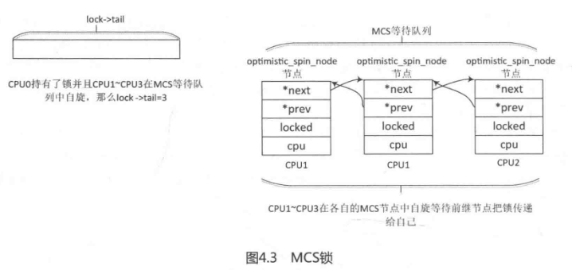
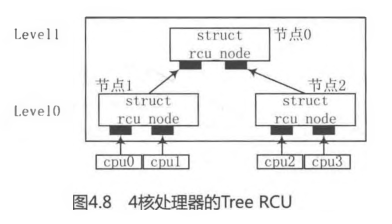
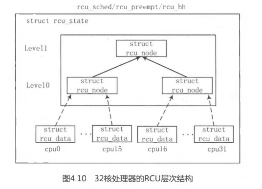
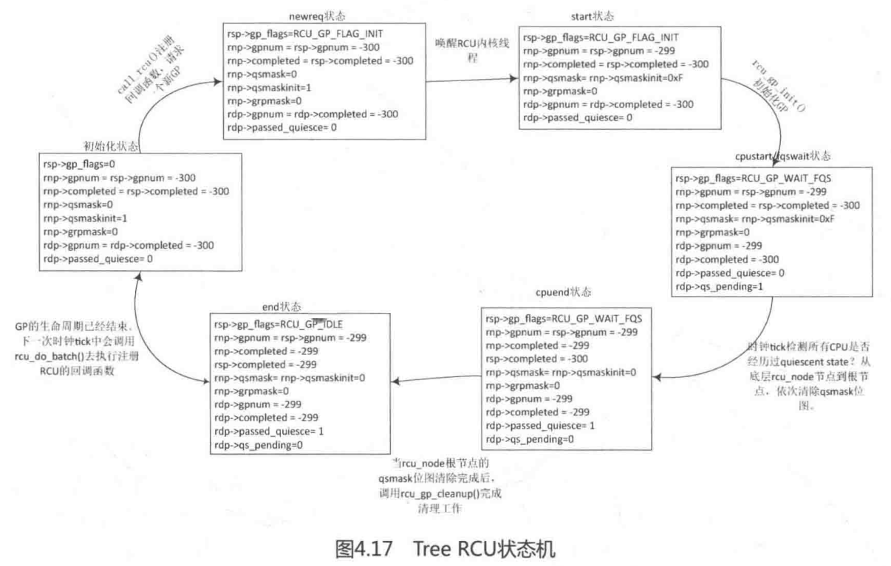
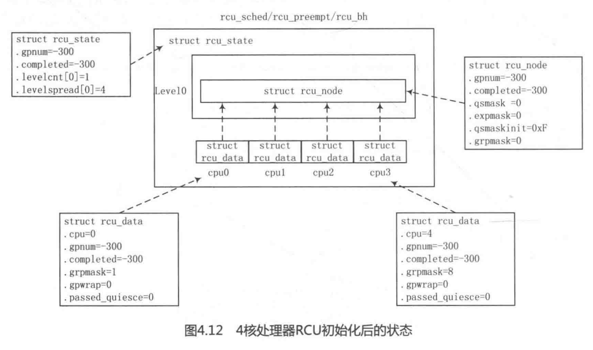
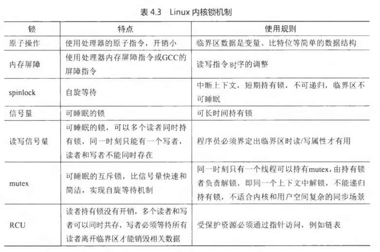

<!-- @import "[TOC]" {cmd="toc" depthFrom=1 depthTo=6 orderedList=false} -->

<!-- code_chunk_output -->

- [1 原子操作](#1-原子操作)
- [2 内存屏障](#2-内存屏障)
- [3 spinlock](#3-spinlock)
- [4 信号量 semaphore](#4-信号量-semaphore)
- [5 Mutex 和 MCS 锁](#5-mutex-和-mcs-锁)
  - [5.1 MCS 锁](#51-mcs-锁)
  - [5.2 Mutex 锁](#52-mutex-锁)
- [6 读写锁](#6-读写锁)
- [7 RCU](#7-rcu)
  - [7.1 背景和原理](#71-背景和原理)
  - [7.2 操作接口](#72-操作接口)
  - [7.3 基本概念](#73-基本概念)
  - [7.4 Linux 实现](#74-linux-实现)
    - [7.4.1 相关数据结构定义](#741-相关数据结构定义)
    - [7.4.2 内核启动进行 RCU 初始化](#742-内核启动进行-rcu-初始化)
    - [7.4.3 开启一个 GP](#743-开启一个-gp)
    - [7.4.4 初始化一个 GP](#744-初始化一个-gp)
    - [7.4.5 检测 QS](#745-检测-qs)
    - [7.4.6 GP 结束](#746-gp-结束)
    - [7.4.7 回调函数](#747-回调函数)
- [8 总结](#8-总结)

<!-- /code_chunk_output -->

# 1 原子操作

原子操作保证**指令以原子的方式执行**(不是代码编写, 而是由于 CPU 的行为导致, 先加载变量到本地寄存器再操作再写内存). **x86**的**atomic 操作**通常通过**原子指令**或**lock 前缀**实现.

# 2 内存屏障

内存屏障是程序在运行时的实际内存访问顺序和程序代码编写的访问顺序不一致, 会导致内存乱序访问. 分为**编译时编译器优化**和**运行时多 CPU 间交互**.

- 编译优化使用**barrier**()**防止编译优化**

```c
[include/linux/compiler-gcc.h]
#define barrier() __asm__ __volatile__ ("" ::: "memory")
```

"memory"强制**gcc 编译器**假设 RAM**所有内存单元均被汇编指令修改**, 这样**cpu 中的 registers 和 cache**中已缓存的内存单元中的**数据将作废(！！！**). **cpu**将不得不在需要的时候**重新读取内存中的数据**. 这就阻止了 cpu 又将 registers, cache 中的数据用于去优化指令, 而避免去访问内存. 目的是**防止编译乱序(！！！**).

- x86 提供了三个指令: sfence(该指令前的写操作必须在该指令后的写操作前完成), lfence(读操作), mfence(读写操作)

# 3 spinlock

操作系统中**锁的机制分为两类(！！！**), 一类是**忙等待**, 另一类是**睡眠等待**.

**spinlock**主要针对**数据操作集合的临界区**, 临界区是**一个变量**, **原子变量**可以解决. 抢到锁的**进程不能睡眠**, 并要**快速执行**(这是 spinlock 的**设计语义**).

"FIFO ticket\-based 算法":

锁由 slock(和\<next, owner\>组成 union)构成

- 获取锁: CPU 先领 ticket(当前 next 值), 然后锁的 next 加 1, owner 等于 ticket, CPU 获得锁, 返回, 否则循环忙等待
- 释放锁: 锁的 owner 加 1

获取锁接口(这里只提这两个):

- spin\_lock(): 关内核抢占, 循环抢锁, 但来中断(中断会抢占所有)可能导致死锁
- spin\_lock\_irq(): 关本地中断, 关内核抢占(内核不会主动抢占), 循环抢锁

spin\_lock()和 raw\_spin\_lock():

- 在绝对不允许被抢占和睡眠的临界区, 使用 raw\_spin\_lock
- Linux 实时补丁 spin\_lock()允许**临界区抢占**和**进程睡眠**, 否则 spin\_lock()直接调用 raw\_spin\_lock()

spin\_lock 特点:

- 忙等待, 不断尝试
- **同一时刻只能有一个获得**
- spinlock 临界区尽快完成, 不能睡眠
- 可以在中断上下文使用

# 4 信号量 semaphore

信号量**允许进程进入睡眠状态(即睡眠等待**), 是计数器, 支持两个操作原语 P(down)和 V(up)

```c
struct semaphore{
    raw_spinlock_t		lock;       //对 count 和 wait_list 的保护
	unsigned int		count;      // 允许持锁数目
	struct list_head	wait_list;  // 没成功获锁的睡眠的进程链表
};
```

初始化: sema\_init()

获得锁:

- down(struct semaphore \*sem): 失败进入**不可中断的睡眠**状态
- down\_interruptible(struct semaphore \*sem): **失败**则进入**可中断的睡眠**状态. 1)关闭**本地中断(防止中断来导致死锁**); 2)count 大于 0, 当前进程获得 semaphore, count 减 1, 退出; 3)count 小于等于 0, 将**当前进程加入 wait\_list 链表**, 循环: 设置**进程 TASKINTERRUPTIBLE**, 调用**schedule\_timeout()让出 CPU<即睡眠**>, 判断被调度到的原因(**能走到这儿说明又被调度**到了), 如果 waiter.up 为 true, 说明**被 up 操作唤醒**, 获得信号量,退出; 4)打开本地中断
- 等等

释放锁:

up(struct semaphore \*sem): wait\_list 为空, 说明没有进程等待信号量, count 加 1, 退出; wait\_list 不为空, 等待队列是先进先出, 将第一个移出队列, 设置 waiter.up 为 true, wake\_up\_process()唤醒 waiter\-\>task 进程

**睡眠等待, 任意数量的锁持有者**

# 5 Mutex 和 MCS 锁

## 5.1 MCS 锁

传统自旋等待锁, 在多 CPU 和 NUMA 系统, 所有自旋等待锁在同一个共享变量自旋, 对同一个变量修改, 由 cache 一致性原理(例如 MESI)导致参与自旋的 CPU 中的 cache line 变的无效, 从而导致 CPU 高速缓存行颠簸现象(CPU cache line bouncing), 即多个 CPU 上的 cache line 反复失效.

MCS 减少 CPU cache line bouncing, 核心思想是每个锁的申请者只在本地 CPU 的变量上自旋, 而不是全局的变量.

```c
[include/linux/osq_lock.h]
// Per-CPU 的, 表示本地 CPU 节点
struct optimistic_spin_node {
	struct optimistic_spin_node *next, *prev; // 双向链表
	int locked; /* 1 if lock acquired */ // 加锁状态, 1 表明当前能申请
	int cpu; /* encoded CPU # + 1 value */ // CPU 编号, 0 表示没有 CPU, 1 表示 CPU0, 类推
};
// 一个 MCS 锁一个
struct optimistic_spin_queue {
	/*
	 * Stores an encoded value of the CPU # of the tail node in the queue.
	 * If the queue is empty, then it's set to OSQ_UNLOCKED_VAL.
	 */
	atomic_t tail;
};
```

初始化: osq\_lock\_init()

申请 MCS 锁: osq\_lock()

- 给当前进程所在 CPU 编号, 将 lock\-\>tail 设为当前 CPU 编号, 如果原有 tail 是 0, 表明没有 CPU, 那直接申请成功
- 通过原有 tail 获得前继 node, 然后将当前 node 节点加入 MCS 链表
- 循环自旋等待, 判断当前 node 的 locked 是否是 1, 1 的话说明前继释放了锁, 申请成功, 退出; 不是 1, 判断是否需要重新调度(抢占或调度器要求), 是的话放弃自旋等待, 退出 MCS 链表, 删除 MCS 链表节点, 申请失败



释放 MCS 锁: osq\_unlock()

- lock\-\>tail 是当前 CPU, 说明没人竞争, 直接设 tail 为 0, 退出
- 当前节点的后继节点存在, 设置后继 node 的 locked 为 1, 相当于传递锁

## 5.2 Mutex 锁

```c
[include/linux/mutex.h]
struct mutex {
	/* 1: unlocked, 0: locked, negative: locked, possible waiters */
	// 1 表示没人持有锁; 0 表示锁被持有; 负数表示锁被持有且有人在等待队列中等待
	atomic_t		count;
	// 保护 wait_list 睡眠等待队列
	spinlock_t		wait_lock;
	// 所有在该 Mutex 上睡眠的进程
	struct list_head	wait_list;
#if defined(CONFIG_MUTEX_SPIN_ON_OWNER)
    // 锁持有者的 task_struct
	struct task_struct	*owner;
#endif
#ifdef CONFIG_MUTEX_SPIN_ON_OWNER
    // MCS 锁
	struct optimistic_spin_queue osq; /* Spinner MCS lock */
#endif
};
```

初始化: 静态 DEFINE\_MUTEX 宏, 动态使用 mutex\_init()函数

申请 Mutex 锁:

- mutex\-\>count 减 1 等于 0, 说明没人持有锁, 直接申请成功, 设置 owner 为当前进程, 退出
- 申请 OSQ 锁, 减少 CPU cache line bouncing, 会将所有等待 Mutex 的参与者放入 OSQ 锁队列, 只有第一个等待者才参与自旋等待
- while 循环自旋等待锁持有者释放, 这中间1)锁持有者变化 2)锁持有进程被调度出去, 即睡眠(task\-\>on\_cpu=0), 3)调度器需要调度其他进程(need\_resched())都会**退出循环**, 但**不是锁持有者释放了锁(lock\-\>owner 不是 NULL**); 如果是锁持有者释放了锁(lock\-\>owner 是 NULL), 当前进程获取锁, 设置 count 为 0, 释放 OSQ 锁, 申请成功, 退出.
- 上面自旋等待获取锁失败, 再尝试一次申请, 不成功的话只能走睡眠唤醒的慢车道.
- 将当前进程的 waiter 进入 mutex 等待队列 wait\_list
- 循环: 获取锁, 失败则让出 CPU, 进入睡眠态, 成功则退出循环, 收到异常信号也会退出循环
- 成功获取锁退出循环的话, 设置进程运行态, 从等待队列出列, 如果等待队列为空, 设置 lock\-\>count 为 0(表明锁被人持有且队列无人)
- 设置 owner 为当前进程

释放 Mutex 锁:

- 清除 owner
- count 加 1 若大于 0, 说明队列没人, 成功
- 释放锁, 将 count 设为 1, 然后唤醒队列第一个进程(waiter\-\>task)

从 **Mutex**实现细节的分析可以知道, **Mutex**比**信号量**的实现要**高效很多**.

- Mutex**最先**实现**自旋等待机制**.
- Mutex 在**睡眠之前尝试获取锁(！！！**).
- Mutex 实现**MCS 锁**来**避免多个 CPU 争用锁**而导致**CPU 高速缓存行颠簸**现象.

正是因为**Mutex**的**简洁性**和**高效性**, 因此**Mutex 的使用场景**比**信号量**要**更严格**, 使用 Mutex 需要注意的**约束条件**如下.

- **同一时刻**只有**一个线程**可以持有 Mutex.
- 只有**锁持有者可以解锁**. 不能在一个进程中持有 Mutex, 而在另外一个进程中释放它. 因此 Mutex**不适合内核同用户空间复杂的同步场景(！！！**), 信号量和读写信号量比较适合.
- **不允许递归地加锁和解锁**.
- 当**进程持有 Mutex**时, 进程**不可以退出(！！！**).
- Mutex 必须使用**官方 API 来初始化**.
- Mutex 可以**睡眠**, 所以**不允许**在**中断处理程序**或者**中断下半部**中使用, 例如 tasklet、定时器等.

在实际工程项目中, 该**如何选择 spinlock、信号量和 Mutex**呢?

在**中断上下文**中毫不犹豫地使用**spinlock**, 如果**临界区**有**睡眠、隐含睡眠的动作**及**内核 API**, 应**避免选择 spinlock**. 在**信号量**和**Mutex**中该如何选择呢?除非代码场景**不符合上述 Mutex 的约束**中有某一条, **否则都优先使用 Mutex**.

# 6 读写锁

**信号量缺点**: 没有区分临界区的**读写属性**

读写锁特点:

- 允许**多个读者**同时进入临界区, 但**同一时刻写者不能进入**.
- **同一时刻**只允许**一个写者**进入临界区.
- **读者和写者不能同时进入临界区**.

读写锁有**两种**, 分别是**spinlock 类型**和**信号量类型**. 分别对应**typedef struct rwlock\_t**和**struct rw\_semaphore**.

**读写锁**在内核中应用广泛, 特别是在**内存管理**中, 全局的**mm\->mmap\_sem 读写信号量**用于保护进程地址空间的一个读写信号量, 还有**反向映射 RMAP 系统中的 anon\_vma\->rwsem**, 地址空间**address\_space**数据结构中**i\_mmap\_rwsem**等.

再次总结**读写锁的重要特性**.

- **down\_read**(): 如果一个进程持有了**读者锁**, 那么允许继续申请**多个读者锁**, 申请**写者锁**则要**睡眠等待**.
- **down\_write**(): 如果一个进程持有了**写者锁**, 那么第二个进程申请该**写者锁**要**自旋等待(配置了 CONFIG\_RWSEM\_SPIN\_ON\_OWNER 选项不睡眠**), 申请**读者锁**则要**睡眠等待**.
- **up\_write**()/**up\_read**():如果**等待队列**中**第一个成员是写者**, 那么**唤醒该写者**, 否则**唤醒排在等待队列**中**最前面连续的几个读者**.

# 7 RCU

## 7.1 背景和原理

spinlock、读写信号量和 mutex 的实现, 它们都使用了原子操作指令, 即原子地访问内存, 多 CPU 争用共享的变量会让 cache 一致性变得很糟(！！！), 使得性能下降. 读写信号量还有一个致命缺点, 只允许多个读者同时存在, 但读者和写者不能同时存在.

RCU 实现目标是, 读者线程没有同步开销(不需要额外的锁, 不需要使用原子操作指令和内存屏障); 同步任务交给写者线程, 写者线程等所有读者线程完成把旧数据销毁, 多个写者则需要额外保护机制.

原理: RCU 记录所有指向共享数据的指针的使用者, 当修改该共享数据时, 首先创建一个副本, 在副本中修改. 所有读访问线程都离开读临界区之后, 指针指向新的修改后副本的指针, 并且删除旧数据.

## 7.2 操作接口

接口如下:

- rcu\_read\_lock()/rcu\_read\_unlock(): 组成一个**RCU 读临界**.
- rcu\_dereference(): 用于获取**被 RCU 保护的指针**(RCU protected pointer), **读者线程**要访问**RCU 保护的共享数据**, 需要使用**该函数创建一个新指针(！！！**), 并且**指向 RCU 被保护的指针**.
- rcu\_assign\_pointer(): 通常用在**写者线程**. 在**写者线程**完成新数据的**修改**后, 调用该接口可以让**被 RCU 保护的指针**指向**新创建的数据**, 用 RCU 的术语是发布(Publish) 了更新后的数据.
- synchronize\_rcu(): 同步等待**所有现存的读访问完成**.
- call\_rcu(): 注册一个**回调函数(！！！**), 当**所有**现存的**读访问完成**后, 调用这个回调函数**销毁旧数据**.

```c
[RCU 的一个简单例子]
#include <linux/kernel.h>
#include <linux/module.h>
#include <linux/init.h>
#include <linux/slab.h>
#include <linux/spinlock.h>
#include <linux/rcupdate.h>
#include <linux/kthread.h>
#include <linux/delay.h>

struct foo {
	int a;
	struct rcu_head rcu;
};

static struct foo *g_ptr;

static void myrcu_reader_thread(void *data) //读者线程
{
    struct foo *p = NULL;

    while(1){
        msleep(200);
        // 重点 1
        rcu_read_lock();
        // 重点 2
        p = rcu_dereference(g_ptr);
        if(p)
            printk("%s: read a=%d\n", __func__, p->a);
        // 重点 3
        rcu_read_unlock();
    }
}

static void myrcu_del(struct rcu_head *rh)
{
    struct foo *p = container_of(rh, struct foo, rcu);
    printk ("%s: a=%d\n", __func__, p->a);
    kfree(p);
}

static void myrcu_writer_thread(void *p)    //写者线程
{
    struct foo *mew;
    struct foo *old;
    int value = (unsigned long)p;

    while(1){
        msleep(400);
        struct foo *new_ptr = kmalloc(sizeof(struct foo), GFP_KERNEL);
        old = g_ptr;
        printk("%s: write to new %d\n", __func__, value);
        *new_ptr = *old;
        new_ptr->a = value;
        // 重点
        rcu_assign_pointer(g_ptr, new_ptr);
        // 重点
        call_rcu(&old->rcu, myrcu_del);
        value++;
    }
}

static int __init my_test_init(void){
    struct task_struct *reader_thread;
    struct task_struct *writer_thread ;
    int value = 5;

    printk("figo: my module init\n");
    g_ptr = kzalloc(sizeof (struct foo), GFP_KERNEL);

    reader_thread = kthread_run(myrcu_reader_thread, NULL, "rcu_reader");
    writer_thread = kthread_run(myrcu_writer_thread, (void *)(unsigned long)value, "rcu_writer")
    return 0;
}

static void __exit my_test_exit(void)
{
    printk("goodbye\n");
    if(g_ptr)
        kfree(g_ptr);
}
MODULE_LICENSE("GPL");
module_init(my_test_init);
```

该例子的目的是通过 RCU 机制保护**my\_test\_init**()**分配的共享数据结构 g\_ptr**, 另外创建了一个读者线程和一个写者线程来模拟同步场景.

对于**读者线程**myrcu\_reader\_thread:

- 通过**rcu\_read\_lock**()和**rcu\_read\_unlock**()来构建一个**读者临界区**.
- 调用 rcu\_dereference()获取**被保护数据 g\_ptr 指针**的一个**副本(！！！**), 即**指针 p**, 这时**p 和 g\_ptr**都指向**旧的被保护数据**.
- 读者线程每隔 200 毫秒读取一次被保护数据.

对于**写者线程**myrcu\_writer\_thread:

- 分配一个**新的保护数据 new\_ptr**, 并修改相应数据.
- **rcu\_assign\_pointer**()让 g\_ptr 指向**新数据**.
- call\_rcu()注册一个**回调函数(！！！**), 确保**所有对旧数据的引用都执行完成**之后, 才调用回调函数来删除旧数据 old\_data.
- 写者线程每隔 400 毫秒修改被保护数据.

在所有的**读访问完成**之后, 内核可以释放旧数据, 对于**何时释放旧数据**, 内核提供了**两个 API 函数(！！！**): **synchronize\_rcu**()和 **call\_rcu**().

## 7.3 基本概念

Grace Period, 宽限期: **GP 开始**到**所有读者临界区的 CPU 离开**算一个 GP, GP 结束调用回调函数

Quiescent State, 静止状态: 一个 CPU 处于读者临界区, 说明活跃, 离开读者临界区, 静止态

经典 RCU 使用全局 cpumask 位图, 每个比特一个 CPU. 每个 CPU 在 GP 开始设置对应比特, 结束清相应比特. 多 CPU 会竞争使用, 需要使用 spinlock, CPU 越多竞争越惨烈.

Tree RCU 解决 cpumask 位图竞争问题.



以 4 核处理器为例, 假设 Tree RCU 把**两个 CPU**分成**1 个 rcu\_node 节点**, 这样**4 个 CPU**被分配到**两个 rcu\_node**节点上, 另外还有**1 个根 rcu\_node**节点来**管理这两个 rcu\_node 节点**. 如图 4.8 所示, **节点 1**管理**cpuO**和**cpul**, 节点 2 管理 cpu2 和 cpu3, 而节点 0 是根节点, 管理节点 1 和节点 2. **每个节点**只需要**两个比特位的位图(！！！**)就可以**管理各自的 CPU**或者节点, **每个节点(！！！**)都有**各自的 spinlock 锁(！！！**)来**保护相应的位图**.

注意: **CPU 不算层次 level！！！**

假设**4 个 CPU**都经历过**一个 QS 状态**, 那么**4 个 CPU**首先在**Level 0 层级**的**节点 1**和**节点 2**上**修改位图**. 对于**节点 1**或者**节点 2**来说, **只有两个 CPU 来竞争锁**, 这比经典 RCU 上的锁争用要减少一半. 当**Level 0**上**节点 1**和**节点 2**上**位图都被清除干净后(！！！**), 才会清除**上一级节点的位图**, 并且**只有最后清除节点的 CPU(！！！**)才有机会去**尝试清除上一级节点的位图(！！！**). 因此对于节点 0 来说, 还是两个 CPU 来争用锁. 整个过程都是只有两个 CPU 去争用一个锁, 比经典 RCU 实现要减少一半.

## 7.4 Linux 实现

### 7.4.1 相关数据结构定义

Tree RCU 实现, 定义了 3 个很重要的数据结构, 分别是 struct rcu\_data、struct rcu\_node 和 struct rcu\_state, 另外还维护了一个比较隐晦的状态机(！！！).

- struct rcu\_data 数据结构定义成 Per\-CPU 变量. gpnum 和 completed 用于 GP 状态机的运行状态, 初始两个都等于\-300, 新建一个 GP, gpnum 加 1; GP 完成, completed 加 1. passed\_quiesce(bool): 当时钟 tick 检测到 rcu\_data 对应的 CPU 完成一次 Quiescent State, 设这个为 true. qs\_pending(bool): CPU 正等待 QS.
- struct rcu\_node 是 Tree RCU 中的组成节点, 它有根节点(Root Node)和叶节点之分. 如果 Tree RCU 只有一层, 那么根节点下面直接管理着一个或多个 rcu\_data;如果 Tree RCU 有多层结构, 那么根节点管理着多个叶节点, **最底层的叶节点**管理者**一个或多个 rcu\_data**.
- RCU 系统支持多个不同类型的 RCU 状态, 使用 struct rcu\_state 数据结构来描述这些状态. 每种 RCU 类型都有独立的层次结构(！！！), 即根节点和 rcu\_data 数据结构. 也有 gpnum 和 completed.

Tree 通过三个维度确定层次关系: **每个叶子的 CPU 数量(CONFIG\_RCU\_FANOUT\_LEAF**), 每层的最多叶子数量(CONFIG\_RCU\_FANOUT), 最多层数(MAX\_RCU\_LVLS 宏定义, 是 4, CPU 不算 level 层次！！！)



在**32 核处理器**中, 层次结构分成两层, **Level 0**包括**两个 struct rcu\_node(！！！**), 其中**每个 struct rcu\_node**管理**16 个 struct rcu\_data(！！！**)数据结构, 分别表示**16 个 CPU 的独立 struct rcu\_data**数据结构; 在**Level 1**层级, 有**一个 struct rcu\_node(！！！**)节点**管理**着**Level 0 层级**的**两个 rcu\_node**节点, **Level 1**层级中的**rcu\_node**节点称为**根节点**, **Level 0**层级的**两个 rcu\_node**节点是**叶节点**.

如图 4.17 所示是 Tree RCU 状态机的运转情况和一些重要数据的变化情况.



### 7.4.2 内核启动进行 RCU 初始化



(1) 初始化 3 个 rcu\_state, rcu\_sched\_state(普通进程上下文的 RCU)、rcu\_bh\_state(软中断上下文)和 rcu\_preempt\_state(系统配置了 CONFIG\_PREEMPT\_RCU, 默认使用这个)

(2) 注册一个 SoftIRQ 回调函数

(3) 初始化每个 rcu\_state 的层次结构和相应的 Per\-CPU 变量 rcu\_data

(4) 为**每个 rcu\_state 初始化一个内核线程**, 以 rcu\_state 名字命名, 执行函数是 rcu\_gp\_kthread(), 设置当前 rcu\_state 的 GP 状态是"**reqwait**", 睡眠等待, 直到**rsp\-\>gp\_flags**设置为**RCU\_GP\_FLAG\_INIT**, 即收到**初始化一个 GP 的请求**, 被唤醒后, 就会调用 rcu\_gp\_init()去初始化一个 GP, 详见下面

### 7.4.3 开启一个 GP

1. **写者程序注册 RCU 回调函数**:

**RCU 写者程序(！！！**)通常需要调用**call\_rcu**()、**call\_rcu\_bh**()或**call\_rcu\_sched**()等函数来**通知 RCU**系统**注册一个 RCU 回调函数(！！！**). 对应上面的三种 state.

- 参数: rcu_head(每个 RCU 保护的数据都会内嵌一个), 回调函数指针(GP 结束<读者执行完>, 被调用销毁)

- 将 rcu\_head 加入到本地 rcu\_data 的 nxttail 链表

2. 总结: 每次**时钟中断**处理函数**tick\_periodic**(), 检查**本地 CPU**上**所有的 rcu\_state(！！！**)对应的**rcu\_data**成员**nxttail 链表有没有写者注册的回调函数**, 有的话**触发一个软中断 raise\_softirq**().

3. **软中断处理函数**, 针对**每一个 rcu\_state(！！！**): 检查 rcu\_data 成员 nxttail 链表**有没有写者注册的回调函数**, 有的话, 调整链表, 设置**rsp\->gp\_flags**标志位为**RCU\_GP\_FLAG\_INIT**, rcu\_gp\_kthread\_wake()唤醒**rcu\_state 对应的内核线程(！！！**), 现在的状态变成了"**newreq**", 表示有**一个新的 GP 请求**, **rcu\_gp\_kthread\_wake**()唤醒**rcu\_state 对应的内核线程(！！！**)

### 7.4.4 初始化一个 GP

RCU 内核线程就会继续执行, 继续上面初始化后的动作, 执行里面的**rcu\_gp\_init**(), 去真正初始化一个 GP, 这个线程是 rcu\_state 的

(1) 当前 rcu\_state 的 rsp\-\>completed 和 rsp\-\>gpnum 不相等, 说明当前已经有一个 GP 在运行, 不能开启一个新的, 返回

(2) 将 rsp\-\>gpnum 加 1

(3) 遍历所有 node, 将所有 node 的 gpnum 赋值为 rsp\-\>gpnum

(4) 对于当前 CPU 对应的节点 rcu\_node,

- 若 rdp\-\>completed 等于 rnp\-\>completed(当前 CPU 的 completed 等于对应节点的 completed), 说明当前 CPU 完成一次 QS;
- 不相等, 说明要开启一个 GP, 将**所有节点 rcu\_node\-\>gpnum**赋值为**rsp\-\>gpnum**, rdp\-\>passed\_quiesce 值初始化为 0, rdp\-\>qs\_pending 初始化为 1, 现在状态变成"**newreq\-\>start\-\>cpustart**".

(5) 初始化 GP 后, 进入 fswait 状态, 继续睡眠等待

### 7.4.5 检测 QS

时钟中断处理函数判断当前 CPU 是否经过了一个 quiescent state, 即退出了 RCU 临界区, 退出后自下往上清理 Tree RCU 的 qsmask 位图, 直到根节点 rcu\_node\-\>qsmask 位图清理后, 唤醒 RCU 内核线程

### 7.4.6 GP 结束

接着上面的 RCU 内核线程执行, 由于**Tree RCU 根节点**的**rnp\-\>qsmask 被清除干净**了.

(1) 将**所有节点(！！！CPU 的不是节点)rcu\_node**\->completed 都设置成 rsp\-\>gpnum, 当前 CPU 的 rdp\-\>completed 赋值为 rnp\-\>completed, GP 状态"cpuend"

(2) **rsp\-\>completed**值也设置成与**rsp\-\>gpnum 一样**, 把状态标记为"end", 最后把**rsp\-\>fqs\_state**的状态设置为**初始值 RCU\_GP\_IDLE**, 一个 GP 的生命周期真正完成

### 7.4.7 回调函数

整个 GP 结束, RCU 调用回调函数做一些销毁动作, 还是在**RCU 软中断中触发**.

从代码中的**trace 功能定义**的状态来看, **一个 GP 需要经历的状态转换**为: "**newreq \-\> start \-\> cpustart \-\> fqswait \-\> cpuend \-\>end**".

总结 Tree RCU 的实现中有如下几点需要大家再仔细体会.

- Tree RCU 为了避免**修改 CPU 位图带来的锁争用**, 巧妙设置了树形的层次结构, **rcu\_data**、**rcu\_node**和**rcu\_state**这 3 个数据结构组成一棵完美的树.
- Tree RCU 的实现维护了一个**状态机**, 这个状态机若隐若现, 只有把**trace 功能打开**了才能感觉到该状态机的存在, trace 函数是 trace\_rcu\_grace\_period().
- 维护了一些以 rcu\_data\-\>nxttail\[\]二级指针为首的链表, 该链表的实现很巧妙地运用了二级指针的指向功能.
- rcu\_data、rcu\_node 和 rcu\_state 这 3 个数据结构中的 gpnum、completed、grpmask、passed\_quiesce、qs\_pending、qsmask 等成员, 正是这些成员的值的变化推动了 Tree RCU 状态机的运转.

# 8 总结

Linux 中各个锁的特点和使用场景

