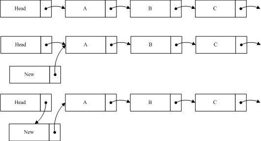

<!-- @import "[TOC]" {cmd="toc" depthFrom=1 depthTo=6 orderedList=false} -->

<!-- code_chunk_output -->

- [简介](#简介)
- [宽限期](#宽限期)
- [订阅——发布机制](#订阅发布机制)
- [数据读取的完整性](#数据读取的完整性)
- [小结](#小结)
- [参考](#参考)

<!-- /code_chunk_output -->

# 简介

RCU(Read-Copy Update)是**数据同步的一种方式**, 在当前的 Linux 内核中发挥着重要的作用. RCU 主要针对的**数据对象是链表**, 目的是**提高遍历读取数据的效率**, 为了达到目的**使用 RCU 机制读取数据的时候不对链表进行耗时的加锁操作**. 这样在同一时间可以有**多个线程同时读取该链表, 并且允许一个线程对链表进行修改(修改的时候, 需要加锁)**. RCU 适用于需要**频繁的读取数据, 而相应修改数据并不多的情景**, 例如在文件系统中, 经常需要查找定位目录, 而对目录的修改相对来说并不多, 这就是 RCU 发挥作用的最佳场景. 

Linux 内核源码当中,关于 RCU 的文档比较齐全, 你可以在 /Documentation/RCU/ 目录下找到这些文件. Paul E. McKenney 是内核中 RCU 源码的主要实现者, 他也写了很多 RCU 方面的文章. 他把这些文章和一些关于 RCU 的论文的链接整理到了一起. http://www2.rdrop.com/users/paulmck/RCU/

在 RCU 的实现过程中, 我们主要解决以下问题: 

1. 在读取过程中, 另外一个线程删除了一个节点. 删除线程可以把这个节点从链表中移除, 但它不能直接销毁这个节点, 必须等到所有的读取线程读取完成以后, 才进行销毁操作. RCU 中把这个过程称为宽限期(Grace period). 

2. 在读取过程中, 另外一个线程插入了一个新节点, 而读线程读到了这个节点, 那么需要保证读到的这个节点是完整的. 这里涉及到了发布-订阅机制(Publish-Subscribe Mechanism). 

3. 保证读取链表的完整性. 新增或者删除一个节点, 不至于导致遍历一个链表从中间断开. 但是 RCU 并不保证一定能读到新增的节点或者不读到要被删除的节点. 

# 宽限期

通过例子, 方便理解这个内容. 以下例子修改于 Paul 的文章. 

```
struct foo {  
           int a;  
           char b;  
           long c;  
 };  
  
DEFINE_SPINLOCK(foo_mutex);  
  
struct foo *gbl_foo;  
  
void foo_read (void)  
{  
     foo *fp = gbl_foo;  
     if ( fp != NULL )  
            dosomething(fp->a, fp->b , fp->c );  
}  
  
void foo_update( foo* new_fp )  
{  
     spin_lock(&foo_mutex);  
     foo *old_fp = gbl_foo;  
     gbl_foo = new_fp;  
     spin_unlock(&foo_mutex);  
     kfee(old_fp);  
}  
```

如上的程序, 是针对于全局变量 gbl\_foo 的操作. 假设以下场景. 有两个线程同时运行 foo\_read 和 foo\_update 的时候, 当 foo\_read 执行完赋值操作后, 线程发生切换; 此时另一个线程开始执行 foo\_update 并执行完成. 当 foo\_read 运行的进程切换回来后, 运行 dosomething 的时候, fp 已经被删除, 这将对系统造成危害. 为了防止此类事件的发生, RCU 里增加了一个新的概念叫宽限期(Grace period). 如下图所示: 


图中每行代表一个线程, 最下面的一行是删除线程, 当它**执行完删除操作后, 线程进入了宽限期**. 宽限期的意义是, **在一个删除动作发生后, 它必须等待所有在宽限期开始前已经开始的读线程结束, 才可以进行销毁操作**. 这样做的原因是这些线程有可能读到了要删除的元素. 图中的宽限期必须等待 1 和 2 结束; 而读线程 5 在宽限期开始前已经结束, 不需要考虑; 而 3,4,6 也不需要考虑, 因为在宽限期结束后开始后的线程不可能读到已删除的元素. 为此 RCU 机制提供了相应的 API 来实现这个功能. 

```cpp
void foo_read(void)  
{  
    rcu_read_lock();  
    foo *fp = gbl_foo;  
    if ( fp != NULL )  
            dosomething(fp->a,fp->b,fp->c);  
    rcu_read_unlock();  
}  
  
void foo_update( foo* new_fp )  
{  
    spin_lock(&foo_mutex);  
    foo *old_fp = gbl_foo;  
    gbl_foo = new_fp;  
    spin_unlock(&foo_mutex);  
    synchronize_rcu();  
    kfee(old_fp);  
}
```

其中 foo\_read 中增加了 rcu\_read\_lock 和 rcu\_read\_unlock, 这两个函数用来标记一个 RCU 读过程的开始和结束. 其实作用就是帮助检测宽限期是否结束. foo\_update 增加了一个函数 synchronize_rcu(), 调用该函数意味着一个宽限期的开始, 而直到宽限期结束, 该函数才会返回. 我们再对比着图看一看, 线程 1 和 2, 在 synchronize_rcu 之前可能得到了旧的 gbl_foo, 也就是 foo_update 中的 old_fp, 如果不等它们运行结束, 就调用 kfee(old_fp), 极有可能造成系统崩溃. 而 3,4,6 在 synchronize_rcu 之后运行, 此时它们已经不可能得到 old_fp, 此次的 kfee 将不对它们产生影响. 

宽限期是 RCU 实现中最复杂的部分,原因是在提高读数据性能的同时, 删除数据的性能也不能太差. 

# 订阅——发布机制

当前使用的编译器大多会对代码做一定程度的优化, CPU 也会对执行指令做一些优化调整,目的是提高代码的执行效率, 但这样的优化, 有时候会带来不期望的结果. 如例: 

```cpp
void foo_update( foo* new_fp )  
{  
    spin_lock(&foo_mutex);  
    foo *old_fp = gbl_foo;  
      
    new_fp->a = 1;  
    new_fp->b = 'b';  
    new_fp->c = 100;  
      
    gbl_foo = new_fp;  
    spin_unlock(&foo_mutex);  
    synchronize_rcu();  
    kfee(old_fp);  
}  
```

这段代码中, 我们期望的是 6, 7, 8 行的代码在第 10 行代码之前执行. 但优化后的代码并不对执行顺序做出保证. 在这种情形下, 一个读线程很可能读到 new\_fp, 但 new\_fp 的成员赋值还没执行完成. 当读线程执行 dosomething(fp->a, fp->b , fp->c ) 的 时候, 就有不确定的参数传入到 dosomething, 极有可能造成不期望的结果, 甚至程序崩溃. 可以通过优化屏障来解决该问题, RCU 机制对优化屏障做了包装, 提供了专用的 API 来解决该问题. 这时候, 第十行不再是直接的指针赋值, 而应该改为 :

```cpp
rcu_assign_pointer(gbl_foo,new_fp);
```

rcu\_assign\_pointer 的实现比较简单, 如下: 

```cpp
<include/linux/rcupdate.h>
```

```cpp
#define rcu_assign_pointer(p, v) \   
         __rcu_assign_pointer((p), (v), __rcu)  
  
#define __rcu_assign_pointer(p, v, space) \   
         do { \  
                 smp_wmb(); \  
                 (p) = (typeof(*v) __force space *)(v); \  
         } while (0)  
```

我们可以看到它的实现只是在赋值之前加了优化屏障 smp\_wmb 来确保代码的执行顺序. 另外就是宏中用到的\_\_rcu, 只是作为编译过程的检测条件来使用的. 

在 DEC Alpha CPU 机器上还有一种更强悍的优化, 如下所示: 

```cpp
void foo_read(void)  
{         
    rcu_read_lock();  
    foo *fp = gbl_foo;  
    if ( fp != NULL )  
        dosomething(fp->a, fp->b ,fp->c);  
    rcu_read_unlock();  
} 
```

第六行的 fp->a,fp->b,fp->c 会在第 3 行还没执行的时候就预先判断运行, 当他和 foo\_update 同时运行的时候, 可能导致传入 dosomething 的一部分属于旧的 gbl\_foo, 而另外的属于新的. 这样导致运行结果的错误. 为了避免该类问题, RCU 还是提供了宏来解决该问题: 

```cpp
<include/linux/rcupdate.h>

#define rcu_dereference(p) rcu_dereference_check(p, 0)   
  
  
#define rcu_dereference_check(p, c) \   
         __rcu_dereference_check((p), rcu_read_lock_held() || (c), __rcu)  
  
#define __rcu_dereference_check(p, c, space) \   
         ({ \  
                 typeof(*p) *_________p1 = (typeof(*p)*__force )ACCESS_ONCE(p); \  
                 rcu_lockdep_assert(c, "suspicious rcu_dereference_check()" \  
                                       " usage"); \  
                 rcu_dereference_sparse(p, space); \  
                 smp_read_barrier_depends(); \  
                 ((typeof(*p) __force __kernel *)(_________p1)); \  
         })  
  
static inline int rcu_read_lock_held(void)  
{  
         if (!debug_lockdep_rcu_enabled())  
                 return 1;  
         if (rcu_is_cpu_idle())  
                 return 0;  
         if (!rcu_lockdep_current_cpu_online())  
                 return 0;  
         return lock_is_held(&rcu_lock_map);  
}  
```

这段代码中加入了调试信息, 去除调试信息, 可以是以下的形式(其实这也是旧版本中的代码): 

```
#define rcu_dereference(p)     ({ \   
                    typeof(p) _________p1 = p; \  
                    smp_read_barrier_depends(); \  
                    (_________p1); \  
                    })
```

在赋值后加入优化屏障 smp\_read\_barrier\_depends(). 

我们之前的第四行代码改为 foo *fp = rcu\_dereference(gbl\_foo);, 就可以防止上述问题. 

# 数据读取的完整性

还是通过例子来说明这个问题: 



如图我们在原 list 中加入一个节点 new 到 A 之前, 所要做的第一步是将 new 的指针指向 A 节点, 第二步才是将 Head 的指针指向 new. 这样做的目的是当插入操作完成第一步的时候, 对于链表的读取并不产生影响, 而执行完第二步的时候, 读线程如果读到 new 节点, 也可以继续遍历链表. 如果把这个过程反过来, 第一步 head 指向 new, 而这时一个线程读到 new, 由于 new 的指针指向的是 Null, 这样将导致读线程无法读取到 A, B 等后续节点. 从以上过程中, 可以看出 RCU 并不保证读线程读取到 new 节点. 如果该节点对程序产生影响, 那么就需要外部调用做相应的调整. 如在文件系统中, 通过 RCU 定位后, 如果查找不到相应节点, 就会进行其它形式的查找, 相关内容等分析到文件系统的时候再进行叙述. 

我们再看一下删除一个节点的例子: 


如图我们希望删除 B, 这时候要做的就是将 A 的指针指向 C, 保持 B 的指针, 然后删除程序将进入宽限期检测. 由于 B 的内容并没有变更, 读到 B 的线程仍然可以继续读取 B 的后续节点. B 不能立即销毁, 它必须等待宽限期结束后, 才能进行相应销毁操作. 由于 A 的节点已经指向了 C, 当宽限期开始之后所有的后续读操作通过 A 找到的是 C, 而 B 已经隐藏了, 后续的读线程都不会读到它. 这样就确保宽限期过后, 删除 B 并不对系统造成影响. 

# 小结

RCU 的原理并不复杂, 应用也很简单. 但代码的实现确并不是那么容易, 难点都集中在了宽限期的检测上, 后续分析源代码的时候, 我们可以看到一些极富技巧的实现方式. 

# 参考

- https://blog.csdn.net/xabc3000/article/details/15335131