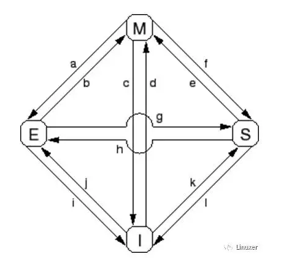

<!-- @import "[TOC]" {cmd="toc" depthFrom=1 depthTo=6 orderedList=false} -->

<!-- code_chunk_output -->

- [1. 来自于霍金的难题](#1-来自于霍金的难题)
- [2. 原子操作有多慢?](#2-原子操作有多慢)
- [3. 变量可以拥有多个值](#3-变量可以拥有多个值)
- [4. 为什么需要 MESI](#4-为什么需要-mesi)
- [5. MESI 的四种状态](#5-mesi-的四种状态)
- [6. MESI 消息](#6-mesi-消息)
- [7. MESI 状态转换](#7-mesi-状态转换)
- [参考](#参考)

<!-- /code_chunk_output -->


# 1. 来自于霍金的难题

据说斯蒂芬·霍金曾经声称**半导体制造商**面临两个基本问题: 

(1)有限的光速

(2)物质的原子本质

第一个难题, 决定了在一个 CPU 周期内, 电信号无法在整个系统所有 CPU 中广播. 换句话说, 某个 CPU 指令对一个内存地址的写操作, 不会在这条指令执行完毕后, 马上被其他 CPU 识别到操作结果. 例如: CPU0 对全局变量 foo 执行 foo = 1, 当 CPU 0 执行完相应的汇编代码后, 其他 CPU 核仍然看到 foo 赋值前的值. 刚接触操作系统的读者, 需要注意这一点. 

第二个难题, 导致我们至少需要一个原子来存储二进制位. 没有办法在一个原子中存储一个字、一段内存、一个完整的寄存器内容......最终的结果是, 硬件工程师没有办法缩小芯片流片面积. 当 CPU 核心增加时, 核间通信的负担会变得更加沉重. 

当然, 作为理论物理学家, 霍金的这两个问题都是理论性的. 半导体制造商很有可能已经逼近这两个限制. 虽然如此, 还是有一些研发报告关注于如何规避这两个基本限制. 

其中一个绕开物质原子本质的办法是一种称为"high-K 绝缘体"的材料, 这种材料允许较大的器件模拟超小型器件的电气属性. 这种材料存在一些重大的生产困难, 但是总算能将研究的前沿再推进一步. 另一个比较奇异的解决方法是在单个电子上存储多个比特位, 这是建立在单个电子可以同时存在于多个能级的现象之上. 不过这种方法还有待观察, 才能确定能否在产品级的半导体设备中稳定工作. 

还有一种称为"量子点"的解决方法, 使得可以制造体积小得多的半导体设备, 不过该方法还处于研究阶段. 

第一个限制不容易被绕过, 虽然量子技术、甚至弦论, 理论上允许通信速度超过光速. 但是这仅仅是理论研究, 实际工程中还未应用. 

# 2. 原子操作有多慢?

这里的原子操作, 是特指 Linux 内核中, 类似于`atomic_long_add_return`这样的 API. 简单的说, 就是当**某个原子操作完成**时, 确保**所有 CPU 核**已经**识别到对原子变量的修改**, 并且在**原子操作期间**, **其他 CPU 核不会同步对该变量进行修改**. 这必然要求相应的电信号在所有的 CPU 之间广播. 如下图: 


对于普通变量操作(非原子操作)来说, 电信号则不必在所有 CPU 核之间传播并来回传递: 


不能忘记一点: **Linux 操作系统可以运行在超过 1024 个 CPU 的大型系统中. 在这些大型系统中, 在所有 CPU 之间广播传递电信号, 需要花费"很长"的时间**. 

但是, 很长究竟是多长?


在上表中, 一次"CAS cache miss"的 CPU 周期是 266, 够长了吧?而这个测试结果, 是在比较新的、4 核 CPU 的多核系统中进行的. 在老一点的系统中, 或者在更多 CPU 核心的系统中, 这个时间更长. 

# 3. 变量可以拥有多个值

这不是天方夜谭. 

假设**CPU 0**向全局变量 foo 写入一个值 1, 我们会很自然的认为: 其他 CPU 会立即识别到 foo 的值为 1. 即使有所疑惑, 我们可能也会退一步认为, 在稍后某个时刻, 其他"所有"CPU 都会"同时"识别到 foo 的值为 1. 而不会出现一种奇怪的现象: 在某个时刻, CPU 1 识别到其值为 1, 而 CPU 2 识别到其值为 0. 不幸的是, 是时候告别这种想法了. 并行计算就是这么神奇和反直觉. 如果不能理解这一点, 就没办法真正理解 RCU. 

要明白这一点, 考虑下面的代码片段. 它被**几个 CPU 并行的执行**. **第 1 行**设置共享变量的值为**当前 CPU 的 ID**, 第 2 行调用`gettb()`函数对几个值进行初始化, 该函数**读取硬件时间计数**, 这个计数值由**SOC 硬件**给出, 并且在**所有 CPU 之间共享**. 当然, 这个硬件计数值主要是在 power 架构上有效, 笔者在 powerpce500 架构上经常使用它. 第 3-8 行的循环, 记录变量在当前 CPU 上保持的时间长度. 

```cpp
state.variable = mycpu;
lasttb = oldtb = firsttb = gettb();
while (state.variable == mycpu) {
    lasttb = oldtb;
    oldtb = gettb();
    if (lasttb - firsttb >1000)
    break;
}
```

在退出循环前, `firsttb` 将保存一个时间戳, 这是赋值的时间. lasttb 也保存一个时间戳, 它是对共享变量保持最后赋予的值时刻的采样值, 如果在进入循环前, 共享变量已经变化, 那么就等于 firsttb. 

这个数据是在一个 1.5GHz POWER5 8 核系统上采集的. 每一个核包含一对硬件线程. CPU 1、2、3 和 4 记录值, 而 CPU 0 控制测试. 时间戳计数器周期是 5.32ns, 这对于我们观察缓存状态来说是足够了. 


上图的结果, 展示出每个 CPU 识别到变量保持的时间. 每一个水平条表示该 CPU 观察到变量的时间, 左边的黑色区域表示相应的 CPU 第一次计数的时间. 在最初 5ns 期间, 仅仅 CPU 3 拥有变量的值. 在接下来的 10ns, CPU 2 和 3 看到不一致的变量值, 但是随后都一致的认为其值是"2".  但是, CPU 1 在整个 300ns 内认为其值是"1", 并且 CPU 4 在整个 500ns 内认为其值是"4". 

这真是一个匪夷所思的测试结果. 同一个变量, 竟然在不同的 CPU 上面被看到不同的值！！！！

如果不理解硬件, 就不会接受这个匪夷所思的测试结果. 当然了, 此时如果有一位大师站在你的面前, 你也不能够跟随大师的节奏起舞. 

# 4. 为什么需要 MESI

请不要说: 我还不知道 MESI 是什么?

简单的说, MESI 是一种**内存缓存一致性协议**. 

现代 CPU 的速度比现代内存系统的速度快得多. 2006 年的 CPU 可以在每纳秒内执行十条指令. 但是需要很多个十纳秒才能从物理内存中取出一个数据. 它们的速度差异(超过 2 个数量级)导致在现代 CPU 中出现了数兆级别的缓存. 这些缓存与 CPU 是相关联的, 如下图. 典型的, 缓存可以在几个时钟周期内被访问. 借助于 CPU 流水线的帮助, 我们暂且可以认为, 缓存能够抵消内存对 CPU 性能的影响. 


CPU 缓存和内存之间的数据流是固定长度的块, 称为"缓存行", 其大小通常是 2 的 N 次方. 范围从 16 到 256 字节不等. 当一个特定的数据第一次被 CPU 访问时, 它在**缓存**中还**不存在**, 这称为"**cache miss**"(或者可被更准确的称为"`startup cache miss`"或者"`warmupcache miss`"). "cache miss"意味着: CPU 在**从物理内存中读取数据(cache 主要用于读数据)**时, 它必须等待(或处于"**stalled**"状态) 数百个 CPU 周期. 但是, 数据将被装载入 CPU 缓存以后, 后续的访问将在缓存中找到, 因此可以全速运行. 

经过一段时间后, CPU 的缓存将会被填满, 后续的缓存缺失需要换出缓存中现有的数据, 以便为最近的访问项腾出空间. 这种"cache miss"被称为"`capacity miss`", 因为它是由于**缓存容量限制**而造成的. 但是, 即使此时缓存还没有被填满, 大量缓存也可能由于一个新数据而被换出. 这是由于**大量的缓存是通过硬件哈希表来实现的, 这些哈希表有固定长度的哈希桶**(或者叫"sets", CPU 设计者是这样称呼的), 如下图. 


这个缓存有 16 个"sets"和 2"路", 共 32 个"缓存行", 每个节点包含一个 256 字节的"缓存行"(一行/2 路是 256 字节大小), 它是一个 256 字节对齐的内存块. 这个缓存行稍微显得大了一点, 但是这使得十六进制的运行更简单. 从硬件的角度来说, 这是一个两路组相联缓存, 类似于带 16 个桶的软件哈希表, 每个桶的哈希链最多有两个元素. **大小(本例中是 32 个缓存行) 和相连性(本例中是 2)都被称为缓存的"geometry"**. 由于缓存是硬件实现的, 哈希函数非常简单: **从内存地址中取出 4 位**(哈希桶数量 16)作为哈希键值. 

在程序代码位于地址 0x43210E00- 0x43210EFF, 并且程序依次访问地址 0x12345000-0x12345EFF 时, 图中的情况就可能发生. 假设程序正准备访问地址 0x12345F00, 这个地址会哈希到 0xF 行, 该行的两路都是空的, 因此可以提供对应的 256 字节缓存行. 如果程序访问地址 0x1233000, 将会哈希到第 0 行, 相应的 256 字节缓存行可以放到第 1 路. 但是, 如果程序访问地址 0x1233E00, 将会哈希到第 0xE 行, 必须有一个缓存行被替换出去, 以腾出空间给新的行. 如果随后访问被替换的行, 会产生一次"cache miss", 这样的缓存缺失被称为"associativitymiss". 

更进一步说, 我们仅仅考虑了读数据的情况. 当写的时候会发生什么呢?

由于在一个**特定的 CPU 写数据前**, 让**所有 CPU**都意识到**数据被修改**这一点是非常重要的. 因此, 它必须首先**从其他 CPU 缓存中移除, 或者叫"invalidated"(使无效！！！)**. 一旦"使无效"操作完成, CPU 可以安全的修改数据项. 如果数据**存在于该 CPU 缓存**中, 但是是**只读的**(共享 shared), 这个过程称为"**write miss！！！**". 一旦某个特定的 CPU 使其他 CPU 完成了"**使无效**"操作, 该 CPU 可以反复的重新写(或者读)数据. 

注: **所以这里说的写数据, 只是发送了"使无效"！！！**, 但是下面又说当前缓存行没有则发送"**读使无效**"?????

最后, 如果另外某个 CPU 试图访问数据项, 将会引起一次缓存缺失, 此时, 由于第一个 CPU**为了写而使得缓存项无效**, 这被称为"`communication miss`". 因为这通常是由于几个 CPU 使用缓存通信造成的(例如, 一个用于互斥算法的锁使用这个数据项在 CPU 之间进行通信). 

很明显, 所有 CPU 必须小心的维护数据的一致性视图. 这些问题由"缓存一致性协议"来防止, 常用的缓存一致性是 MESI. 

# 5. MESI 的四种状态

MESI 存在"modified", "exclusive", "shared"和"invalid"四种状态, 协议可以在一个指定的缓存行中应用这四种状态. 因此, 协议在**每一个缓存行**中维护一个**两位的状态标记**, 这个标记附着在缓存行的物理地址和数据后面. 

处于"**modified**"状态的缓存行是由于**相应的 CPU 最近进行了内存存储**. 并且相应的内存确保**没有在其他 CPU 的缓存中出现！！！**. 因此, "modified"状态的缓存行可以被认为**被 CPU 所"拥有**". 由于该缓存保存了"最新"的数据, 因此**缓存**最终有责任**将数据写回到内存**, 也应当**为其他缓存提供数据**, 并且必须在缓存其他数据之前完成这些事情. 

"**exclusive**"状态非常类似于"modified"状态, 唯一的差别是该**缓存行还没有被相应的 CPU 修改**, 这也表示**缓存行中的数据**及**内存中的数据**都是**最新**的. 但是, 由于 CPU 能够在任何时刻将数据存储到该行, 而不考虑其他 CPU, 因此, 处于"exclusive"状态也可以认为**被相应的 CPU 所"拥有**". 也就是说, 由于**物理内存中的值是最新的**, 该行可以直接丢弃而**不用回写到内存**, 也不用通知其他 CPU. 

处于"**shared**"状态的缓存行可能已经被复制到**至少一个其他 CPU 的缓存**中, 这样在**没有得到其他 CPU 的许可时**, **不能向缓存行存储数据**. 与"exclusive"状态相同, 此时**内存中的值是最新**的, 因此可以不用向内存回写值而直接丢弃缓存中的值, 也不用通知其他 CPU. 

处于"**invalid**"状态的行是空的, 换句话说, 它**没有保存任何有效数据**. 当**新数据进入缓存**时, 它被放置到一个处于"**invalid**"状态的**缓存行**. 这个方法是比较好的, 因为替换其他状态的缓存行将引起大量的缓存缺失. 

由于所有 CPU 必须维护缓存行中的数据一致性视图, 因此缓存一致性协议提供消息以标识系统中缓存行的动作. 

缓存行有 4 种不同的状态:

已修改 Modified (M)

缓存行是脏的(dirty), 与主存的值不同. 如果别的 CPU 内核要读主存这块数据, 该缓存行必须回写到主存, 状态变为共享(S).

独占 Exclusive (E)

缓存行只在当前缓存中, 但是干净的(clean)--缓存数据同于主存数据. 当别的缓存读取它时, 状态变为共享; 当前写数据时, 变为已修改状态. 

共享 Shared (S)

缓存行也存在于其它缓存中且是干净的. 缓存行可以在任意时刻抛弃. 

无效 Invalid (I)

缓存行是无效的


# 6. MESI 消息

MESI 协议需要在 CPU 之间通信. 如果 CPU 在**单一共享总线**上, 只需要如下消息就足够了: 

- **读消息**: "读"消息包含**要读取的缓存行！！！的物理地址**. 

- **读响应消息**: "读响应"消息包含**较早前**的"**读**"消息的**数据**. 这个"**读响应**"消息可能由**物理内存！！！** 或者**其他 CPU**的**缓存！！！**提供. 例如, 如果**一个缓存**处于"**modified！！！**" 状态, 那么, **它的缓存**必须提供"**读响应**"消息. 

- **使无效消息**: "使无效"消息包含要**使无效的缓存行的物理地址**. **其他的缓存**必须从它们的缓存中**移除相应的数据**并且**响应此消息**. 

- **使无效应答**: 一个接收到"**使无效**"消息的 CPU 必须在**移除指定数据后**响应一个"使无效应答"消息. 

- **读使无效**: "读使无效"消息包含**缓存行要读取的物理地址**. 同时**指示其他缓存移除数据**. 因此, 它同时包含一个"**读**"消息和一个"**使无效**"消息. "读使无效"消息同时需要"**读响应**"消息以及"**使无效应答**"消息**进行答应**. 

- **写回**: "写回"消息包含要**回写到物理内存的地址和数据**. (并且也许会"探测"其他 CPU 的缓存). 这个消息允许缓存在**必要时换出**处于"**modified**"状态的数据以腾出空间. 

再次重申, 所有这些消息均需要在 CPU 之间传播电信号, 都面临霍金提出的那两个 IT 难题. 

# 7. MESI 状态转换



- Transition (a): **缓存行被写回到物理内存**, 但是 CPU 仍然将它**保留在缓存**中, 并在以后修改它. 这个转换需要一个"**写回**"消息. 

- Transition (b): CPU 将数据**写到缓存行**, 该缓存行目前处于**排它访问**. 不需要发送或者接收任何消息. 

- Transition (c): CPU 收到一个"**读使无效**"消息, 相应的缓存行已经被修改. CPU 必须使**无效本地副本**, 然后响应"**读响应**"和 "**使无效应答**"消息, 同时**发送数据给请求的 CPU**, 标示它的**本地副本不再有效**. 

- Transition (d): CPU 进行一个`原子读—修改—写操作`, 相应的**数据没有在它的缓存！！！** 中. 它发送一个"**读使无效**"消息, 通过"读响应"消息接收数据. 一旦它接收到一个完整的"使无效应答"响应集合, CPU 就完成此转换. 

- Transition (e): CPU 进行一个`原子读—修改—写操作`, 相应的数据在**缓存中是只读！！！**的(shared???). 它必须发送一个"**使无效**"消息, 并等待"使无效应答"**响应集合**以完成此转换. 

- Transition (f): 其他某些 CPU 读取缓存行, 其数据由本 CPU 提供, 本 CPU 包含一个只读副本. 数据只读的原因, 可能是由于数据已经回写到内存中. 这个转换开始于接收到一个"读"消息, 最终本 CPU 响应了一个"读响应" 消息. 

- Transition (g): 其他 CPU 读取数据, 并且数据是从本 CPU 的缓存或者物理内存中提供的. 无论哪种情况, 本 CPU 都会保留一个只读副本. 这个事务开始于接收到一个"读"消息, 最终本 CPU 响应一个"读响应"消息. 

- Transition (h): 当前 CPU 很快将要**写入一些数据到缓存行**, 于是发送一个"**使无效！！！**"消息. 直到它接收到所有"使无效应答"消息后, CPU 才完成转换. 可选的, 所有其他 CPU 通过"写回"消息**将缓存行的数据换出**(可能是为其他缓存行腾出空间). 这样, 当前 CPU 就是**最后一个缓存该数据的 CPU**. 

- Transition (i): 其他某些 CPU 进行了一个**原子读—修改—写操作**, 相应的缓存行**仅仅被本 CPU 持有**. 本 CPU 将缓存行变成无效状态. 这个转换开始于接收到"读使无效"消息, 最终本 CPU 响应一个"读响应"消息以及一个"使无效应答"消息. 

- Transition (j): **本 CPU 保存一个数据到缓存行**, 但是数据还**没有在它的缓存行！！！** 中. 因此发送一个"**读使无效！！！**" 消息. 直到它接收到"**读响应**"消息以及**所有"使无效应答"消息**后, 才完成事务. 缓存行可能会很快转换到"**修改**"状态, 这是在存储完成后由 Transition (b)完成的. 

**读使无效可以获取独享缓存行！！！**

- Transition (k): 本 CPU 装载一个数据, 但是数据还没有在缓存行中. CPU 发送一个"读"消息, 当它接收到相应的"读响应"消息后完成转换. 

- Transition (l): 其他 CPU**存储一个数据到缓存行**, 但是该缓存行处于**只读状态！！！**(因为**其他 CPU 也持有该缓存行**). 这个转换开始于接收到一个"**使无效**"消息, 当前 CPU 最终响应一个"使无效应答"消息. 


一致性要求是指, 若 cache 中某个字被修改, 那么在主存(以及更高层次)上, 该字的副本必须立即或最后加以修改, 并确保它者引用主存上该字内容的正确性.  
　　当代多处理器系统中, 每个处理器大都有自己的 cache. 同一主存块的拷贝能同时存于不同 cache 中, 若允许处理器各自独立地修改自己的 cache, 就会出现不一致问题. 解决此问题有软件办法和硬件办法. 硬件办法能动态地识别出不一致产生的条件并予以及时处理, 从而使 cache 的使用有很高的效率. 并且此办法对程序员和系统软件开发人员是透明的, 减轻了软件研制负担, 从而普遍被采用. 
　　MESI 协议是一种采用写--无效方式的监听协议. 它要求每个 cache 行有两个状态位, 用于描述该行当前是处于修改态(M)、专有态(E)、共享态(S)或者无效态(I)中的哪种状态, 从而决定它的读/写操作行为. 这四种状态的定义是:  
　　·修改态(Modified)－－此 cache 行已被修改过(脏行), 内容已不同于主存并且 为此 cache 专有;  
　　·专有态(Exclusive)－－此 cache 行内容同于主存, 但不出现于其它 cache 中;  
　　·共享态(Shared)－－此 cache 行内容同于主存, 但也出现于其它 cache 中;  
　　·无效态(Invalid)－－此 cache 行内容无效(空行).  
　　MESI 协议适合以总线为互连机构的多处理器系统. 各 cache 控制器除负责响应自己 CPU 的内存读写操作(包括读/写命中与未命中)外, 还要负责监听总线上的其它 CPU 的内存读写活动(包括读监听命中与写监听命中)并对自己的 cache 予以相应处理. 所有这些处理过程要维护 cache 一致性, 必须符合 MESI 协议状态转换规则. 


下面由图的四个顶点出发, 介绍转换规则: (规则中与上图 的相应位置以*数字序号对照给出)
　　*1 该无效行在自身 Cache 读未命中将被相应内存块填充以建立新行时, 读监听命中, 说明其它 Cache 正在读同地址的内存块, 以建立新行. 故为多 Cache 共享行, 应为 S 状态, 并应继续发出读监听广播, 使其它 Cache 的类似情况效仿. 
　　*2 该无效行在自身 Cache 读未命中将被相应内存块填充以建立新行时, 未读监听命中, 为本 Cache 专有, 故新建行应为 E 状态. 
　　*3 该无效行在自身 Cache 写未命中时, 将先读入相应内存块填充新行后, 再进行写修改, 与原内存正本的数据不一至, 故新建行为 M 状态. 
　　*4 该共享行写监听命中, 说明别的 Cache 由于写命中修改了同此地址的行, 根据写无效原则, 此共享行应改变为无效(I)状态. 
　　*5 该共享行读命中, 状态不变. 
　　*6 该共享行读监听命中, 说明其它 Cache 正在读同地址内存块, 以建立新行, 此时该共享行状态不必改变, 但应继续发读监听广播, 供它者监听. 
　　*7 该共享行被写命中, 其中某字被改写, 与内存正本不一至, 故应改为 M 状态, 且应发出共享行写命中监听广播, 使其它 Cache 同地址行作废(同*4). 
　　*8 该 E 态行读监听命中说明别的 Cache 正在读同地址的内存正本, 以建立新行, 故其状态应改为 S 状态, 并发出读监听广播, 以使同此情况及* 1 效仿之. 
　　*9 该 E 态行读命中不必改变状态. 
　　*10 该 E 态行写监听命中, 说明别的 Cache 由于写未命中而访问同地址的内存正本, 该 E 态行内容即将过时, 故应作废. 
　　*11 该 E 态行写命中, 只改变状态为 M 态即可, 无须他者监听. 
　　*12 该 M 态行写命中状态不变. 
　　*13 该 M 态行读命中状态不变. 
　　*14 该 M 态行读监听命中, 应将该行最新数据写回内存正本后变为 S 状态. 并发出读监听广播, 供他者监听. 
　　*15 该 M 态行写监听命中, 说明别的 Cache 由于写未命中而访问了同地址的内存块(同* 3), 将实行先读后修改, 此时本地 M 态行应抢先写回主存, 然后作废, 以保证别的 Cache 读出整行而未被修改数据的正确性. 
　　*16 该 M 态行写监听命中, 说明别的 Cache 由于写未命中而访问了同地址的内存块, 将实行先读后整行的修改, 此时本地 M 态行不必写回主存, 只作废即可. 
　　上述分析可以看出, 虽然各 cache 控制器随时都在监听系统总线, 但能监听到的只有读未命中、写未命中以及共享行写命中三种情况. 读监听命中的有效行都要进入 S 态并发出监听命中指示, 但 M 态行要抢先写回主存; 写监听命中的有效行都要进入 I 态, 但收到 RWITM 时的 M 态行要抢先写回主存. 总之监控逻辑并不复杂, 增添的系统总线传输开销也不大, 但 MESI 协议却有力地保证了主存块脏拷贝在多 cache 中的唯一性, 并能及时写回, 保证 cache 主存存取的正确性. 


# 参考

https://blog.csdn.net/zhuliting/article/details/6210921 (未整理)