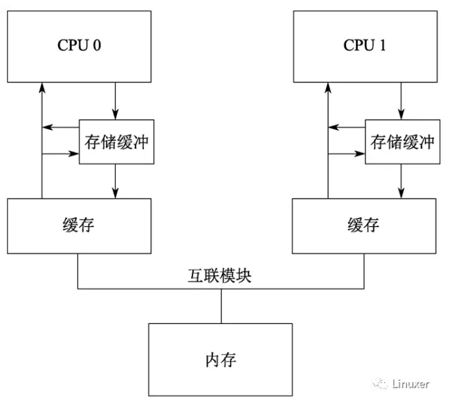

# 内存 Cache 的不足

上一篇文章我们谈到了内存 Cache, 并且描述了典型的 Cache 一致性协议 MESI. **Cache**的**根本目的**, 是解决**内存与 CPU 速度**多达两个数量级的**性能差异**. 

一个包含 Cache 的计算机系统, 其结构可以简单的表示为下图: 


仅仅只有 Cache 的计算机系统, 它还存在如下问题: 

1、**Cache 的速度**, 虽然比内存有了极大的提升, 但是仍然**比 CPU 慢几倍**. 

2、在发生"`warmup cache miss`"、"`capacity miss`"、"`associativity miss`"时, **CPU**必须等待**从内存中读取数据**, 此时 CPU 会处于一种**Stall 的状态**. 其等待时间可能达到几百个 CPU 指令周期. 

显然, 这是现代计算机不能承受之重

# Write buffer 的存在

如果 CPU**仅仅**是执行`foo = 1`这样的语句, 它其实**无须！！！从内存或者缓存中读取！！！foo 现在的值**. 因为无论 foo 当前的值是什么, 它**都会被覆盖！！！**. 在仅仅**只有 Cache**的系统中, `foo = 1` 这样的操作也会形成**写停顿**. 

**那为何写数据需要发送"读使无效", 而不是只发送"使无效"???** 因为 write buffer 的存在, 写的时候写入 write buffer, 不会保证数据到缓存行, 而读操作会到缓存行, 是因为这样吗???也就是说**读使无效可以获取独享缓存行！！！**, 这也是它的目的??

自然而然的, CPU 设计者应当会想到在**Cache 和 CPU 之间**再**添加一级缓存**. 由于这样的缓存主要是应对**写操作引起！！！** 的**Cache Miss！！！**, 并且缓存的数据与写操作相关, 因此 CPU 设计者将它命名为"`Write buffer`". 调整后的结构示意图如下(图中的 store buffer 即为 write buffer): 


通过**增加这些 Write buffer**, CPU 可以简单的将要保存的数据放到 Write buffer 中, 并且继续运行, 而不会真正去等待 Cache 从内存中读取数据并返回. 

对于**特定 CPU**来说, 这些 Write buffer 是属于**本地**的. 或者在**硬件多线程系统**中, 它对于**特定核**来说, 是属于**本地**的. 无论哪一种情况, **一个特定 CPU 仅仅允许访问分配给它的 Writebuffer**. 例如, 在上图中, CPU 0 不能访问 CPU 1 的存储缓冲, 反之亦然. 

Write buffer 进一步提升了系统性能, 但是它也会为硬件设计者带来一些困扰: 

## 违反自身一致性: 

**第一个困扰: 违反了自身一致性**. 

考虑如下代码: 

变量"a"和"b"都初始化为 0, 包含**变量"a"缓存行**, 最初被**CPU 1**所拥有, 而包含**变量"b"的缓存行**最初被**CPU0**所拥有: 

```cpp
a = 1;
b = a + 1;
assert(b == 2);
```

没有哪一位软件工程师希望断言被触发！

然而, 如果采用上图中的简单系统结构, 断言确实会被触发. 理解这一点的关键在于: **a**最初被**CPU 1**所拥有, 而**CPU 0**在执行**a = 1**时, 将**a 的新值**存储在**CPU 0**的**Write buffer**中. 

在这个简单系统中, 触发断言的事件顺序可能如下: 

1. **CPU 0** 开始执行**a = 1**. 

2. CPU 0 在**缓存**中查找"a", 并且发现**缓存缺失！！！**. 

3. 因此, **CPU 0**发送一个"**读使无效！！！**(read-invalidate message)"消息, 以**获得包含"a"的独享缓存行！！！**. 

**为何要"读"呢???** **读使无效可以获取独享缓存行！！！**

4. **CPU 0**将"a(值 1)"记录到**存储缓冲区(write buffer, 不是缓存行)**. 

5. **CPU 1**接收到"**读使无效**"消息, 它通过**发送 a 的缓存行数据！！！**, 并**从它的缓存行！！！** 中**移除 a 数据！！！** 来**响应**这个消息. 

6. **CPU 0**开始执行**b = a + 1**. 

7. CPU 0 从**CPU 1**接收到**缓存行**(也就是将来自**CPU 1 的 a=0 数据存到缓存行！！！**), 它仍然拥有一个为"**0**"的"a"值. 

write buffer 是为了写操作用, 所以从 CPU 1 接收到以后, 就会放入**缓存行**.

这里为什么不使用 write buffer 的值替换到缓存行呢?? 如果有

8. **CPU 0**从它的**缓存行**中读取到"a"的值, 发现**其值为 0**, 因为这时候的**存储缓冲区的值还没写到缓存行**. 

9. CPU 0 将**存储队列**(write buffer)中的条目应用到**最近到达的缓存行**, 设置**缓存行**中的"a"的值为**1**. 

10. CPU 0 将前面加载的"a"值 0(因为所有使用的**数据都是读取的**, 也就是说从**缓存行**来, 而**不是存储队列**)加 1, 并存储该值到包含"b"的**缓存行！！！**中(假设**已经被 CPU 0 所拥有**, 所以一旦拥有则直接写到缓存行, 而不是 write buffer???). 

11. CPU 0 执行`assert(b == 2)`, 并**引起错误**. 

针对这种情况, 硬件设计者对软件工程师还是给予了必要的同情. 他们会对系统进行稍许的改进, 如下图: 



在调整后的架构中, **每个 CPU 在执行加载操作时, 将考虑(或者嗅探)它的 Writebuffer！！！**. 这样, 在前面执行顺序的**第 8 步**, 将在**存储缓冲区**中为"a"找到**正确的值 1** , 因此**最终的"b"值将是 2**, 这正是我们期望的. 

## 违反全局内存序: 接收到使无效太晚

Write buffer 带来的第二个困扰, 是违反了**全局内存序**. 考虑如下的代码顺序, 其中变量"a"、"b"的初始值是 0. 

```cpp
// CPU 0
void foo(void)
{
    a = 1;
    b = 1;
}

// CPU 1
void bar(void)
{
    while (b == 0) continue;
    assert(a == 1);
}
```

假设**CPU 0**执行`foo()`, **CPU1**执行`bar()`, 再进一步假设**包含"a"的缓存**行仅仅位于**CPU1 的缓存**中, **包含"b"的缓存行**被**CPU 0**所拥有. 

那么操作顺序可能如下: 

1. CPU 0 执行 a = 1. 缓存行**不在 CPU0 的缓存**中, 因此**CPU0**将"a"的**新值**放到**Write buffer**, 并发送一个"**读使无效**"消息. 

2. CPU 1 执行`while (b == 0) continue`, 但是包含"b"的缓存行**不在它的缓存**中, 因此它发送一个"**读**"消息. 

3. CPU 0 执行 **b = 1**, 它已经**拥有了该缓存行**(换句话说, 缓存行要么已经处于"modified", 要么处于"exclusive"状态), 因此它存储**新**的"**b**"值到它的**缓存行**中. 

**为何不是写入 Write buffer??** **因为有了缓存行???**

4. CPU 0 接收到"**读**"消息, 并且发送缓存行中的最近更新的"b"的值到**CPU1**, 同时将缓存行设置为"**shared**"状态. 

5. CPU 1 接收到包含"**b**"值的缓存行, 并将其值写到**它的缓存行**中. 

6. CPU 1 现在结束执行`while (b ==0) continue`, 因为它发现"b"的**值是 1**, 它开始处理下一条语句. 

7. CPU 1 执行`assert(a == 1)`, 并且, 由于 CPU 1 工作在**旧的"a"的值**(值 0), 因此断言验证失败. **但是实际上 a 已经是 1 了**

因为**接收到"使无效"太晚**

8. CPU 1 接收到"**读使无效**"消息, 并且**发送包含"a"的缓存行**到**CPU 0**, 同时在它的缓存中, **将该缓存行变成无效**. 但是已经太迟了. 

9. CPU 0 接收到**包含"a"的缓存行**, 并且及时将**存储缓冲区**(a=1)的数据保存到**缓存行**中, CPU1 的断言失败**受害于该缓存行！！！**. 

请注意, "内存屏障"已经在这里隐隐约约露出了它锋利的爪子！！！！

# 使无效队列

一波未平, 另一波再起. 

问题的复杂性还不仅仅在于 Writebuffer, 因为仅仅有 Write buffer, 硬件还会形成严重的**性能瓶颈**. 

问题在于, 每一个核的 Writebuffer 相对而言都**比较小**, 这意味着执行一段较小的存储操作序列的 CPU, 很快就会**填满**它的 Writebuffer. 此时, CPU 在能够继续执行前, 必须**等待 Cache 刷新操作完成**, 以清空它的 Write buffer. 

清空 Cache 是一个耗时的操作, 因为必须要在所在**CPU 之间广播 MESI 消息**(**使无效消息**), 并等待对这些 MESI 消息的响应. 为了加快 MESI 消息响应速度, CPU 设计者增加了**使无效队列**. 也就是说, **CPU 将接收到的使无效消息！！！暂存起来, 在发送使无效消息应答时, 并不真正将 Cache 中的值无效**. 而是等待在合适的时候, 延迟使无效操作. 

下图是增加了使无效队列的系统结构: 


将一个条目放进**使无效队列**, 实际上是由 CPU 承诺: **在发送任何与该缓存行相关！！！的 MESI 协议消息前, 处理该条目**. 在 Cache 竞争不太剧烈的情况下, CPU 会很出色地完成此事. 

使无效队列带来的问题是: 在**没有真正将 Cache 无效之前**, 就**告诉其他 CPU 已经使无效**了. 这多少有一点欺骗的意思. 然而现代 CPU 确实是这样设计的. 

## 无效队列的内存乱序

这个事实带来了额外的**内存乱序**的机会, 看看如下示例: 

```cpp
// CPU 0
void foo(void)
{
    a = 1;
    smp_mb();
    b = 1;
}

// CPU 1
void bar(void)
{
    while (b == 0) continue;
    assert(a == 1);
}
```

假设"a"和"b"被初始化为**0**, "a"是只读的(MESI"**shared**"状态, CPU 0 和 CPU 1 都有其缓存), "b"被**CPU 0**拥有(MESI"**exclusive**"或者"**modified**"状态, 因为这两个状态就表明 CPU 1 不具有). 然后假设 CPU 0 执行 foo()而 CPU1 执行 bar(), 

操作顺序可能如下: 

1. CPU 0 执行**a = 1**. 在 CPU0 中, 相应的缓存行是**只读**的, 因此 CPU 0 将"a"的新值放入**存储缓冲区**, 并发送一个"**使无效**"消息, 这是为了使**CPU1**的缓存中相应的**缓存行失效**. 

**因为有了缓存行, 所以不发读了???**

2. CPU 1 执行`while (b == 0)continue`, 但是包含"b"的缓存行**不在它的缓存**中, 因此它发送一个"**读**"消息. 

3. CPU 1 接收到 CPU 0 的"**使无效**"消息, 将**该消息排队**, 并**立即响应该消息**. 

4. CPU 0 接收到来自于 CPU 1 的**响应消息**, 因此它放心的通过第 4 行的`smp_mb()`, 从**存储缓冲区**移动"**a**"的值到**缓存行！！！**. 

5. CPU 0 执行 b = 1. 它已经拥有这个**缓存行**(也就是说, 缓存行已经处于"modified"或者"exclusive"状态), 因此它将"b"的新值**存储到缓存行！！！** 中. 

独占

6. CPU 0**接收**到"**读**"消息, 并且发送包含"b"的**新值**的缓存行到**CPU 1**, 同时**在自己的缓存**中, 标记缓存行为"**shared！！！**"状态. 

7. CPU 1 接收到包含"b"的缓存行并且将其**应用到本地缓存**(并且会标记"shared"吧??). 

8. CPU 1 现在可以完成`while (b ==0) continue`, 因为它发现"b"的值为 1, 接着处理下一条语句. 

9. CPU 1 执行·, 并且, 由于**旧的"a"值**还在 CPU 1 的**缓存**中, 因此**陷入错误**. (就是因为在排队, 还未从本地缓存行移除 a, 尽管**a 已经在 CPU 0 设置为了 1**,  但是 CPU 1 还是从本地缓存能得到, 值是 0,  所以导致内存乱序！！！)

10. 虽然陷入错误, **CPU 1**处理已经排队的"**使无效**"消息, 并且(迟到)在**自己的缓存**中**刷新包含"a"值的缓存行**. 

# 内存屏障

既然硬件设计者通过**Write buffer**和**使无效队列**引入了额外的**内存乱序**问题, 那么就应当为软件工程师提供某种方法来解决这个问题. 即使相应的解决方法会折磨软件工程师. 

答案就是内存屏障. 对于 Linux 内核资深工程师来说, 这个答案也显得比较沉重, 它太折磨人了: )

我们先看看 Write buffer 一节中, 触发断言的例子, 应该怎么修改. 

在那个例子中, 硬件设计者不能直接帮助我们, **因为 CPU 没有办法识别那些相关联的变量(例子中的 a 和 b)**, 更不用说它们如何关联. 因此, 硬件设计者提供**内存屏障指令, 以允许软件告诉 CPU 这些关系的存在**. 程序必须修改, 以包含内存屏障: 

```cpp
// CPU 0
void foo(void)
{
    a = 1;
    smp_mb();
    b = 1;
}

// CPU 1
void bar(void)
{
    while (b == 0) continue;
    assert(a == 1);
}
```

内存屏障`smp_mb()`将导致 CPU 在**刷新后续的缓存行！！！**(包含 b 的缓存行)**之前**, 前面的**Write buffer！！！被先刷新**到缓存行. 在**继续处理之前**, CPU 可能采取的动作是: 

1、简单的停顿下来, 直到**存储缓冲区变成空**; 

2、也可能是使用**存储缓冲区(不是直接的缓存行)** 来 **持有后续的存储操作！！！**, 直到**前面所有！！！的存储缓冲区**已经被保存到**缓存行！！！** 中. 

理解其中第 2 点, 能够帮助我们理解"内存屏障"这个单词的来历！！

**后一种情况下！！！**, 操作序列可能如下所示, 假设**CPU 0**执行`foo()`, **CPU1**执行`bar()`, 再进一步假设**包含"a"的缓存**行仅仅位于**CPU1 的缓存**中, **包含"b"的缓存行**被**CPU 0**所拥有. 

1. CPU 0 执行`a = 1`. 缓存行**不在 CPU0 的缓存**中, 因此**CPU 0**将"a"的**新值**放到**存储缓冲区**中, 并发送一个"**读使无效**"消息. 

- 读: 
- 使无效: 

2. CPU 1 执行`while(b == 0) continue`, 但是包含"b"的缓存行**不在它的缓存**中, 因此它发送一个"**读**"消息. 

3. CPU 0 执行`smp_mb()`, 并**标记当前所有存储缓冲区的条目！！！**. (也就是说**a = 1 这个条目**). 

4. CPU 0 执行 b= 1. 它**已经拥有这个缓存行**了. (也就是说, **缓存行**已经处于"**modified**"或者"**exclusive**"状态), 但是在**存储缓冲区**中存在一个**标记条目！！！**. 因此, 它**不将"b"的新值**存放到**缓存行**, 而是存放到**存储缓冲区**中. (但是"b"**不是一个标记条目**). 

因为`smp_mb()`, 所以`a=1`要**先写入缓存行**后才会写 b??

5. CPU 0 接收"读"消息, 随后发送包含**原始！！！"b"值的缓存行！！！** 给**CPU1**. 它也标记**该缓存行**的复制为"**shared**"状态. 

给的是`b=0`, 而**不是 b=1**.

6. CPU 1 读取到包含"b"的缓存行, 并将它复制到**本地缓存**中. **这里 b=0**, 但**其实已经 b=1 了**.

7. CPU 1 现在可以装载"b"的值了, 但是, 由于它发现其值**仍然为"0"**, 因此它**重复执行 while 语句**. "b"的新值被安全的隐藏在**CPU0**的**存储缓冲区！！！**中. 

8. CPU 1 接收到"**读使无效**"消息, 发送**包含"a"的缓存行**给**CPU 0**, 并且使它的**缓存行无效**. 

CPU 1 执行"读使无效"耗时较长, 通常会将该消息存放到**无效队列**中, 马上返回响应给 CPU 0. 这时**CPU 0 收到响应后**会接着执行`b = 1`.

等**cpu 1**执行到`assert(a == 1)`时在无效队列中的"**读使无效**"有可能**还没来得及执行！！！**, 这时会直接使用 cpu 1 缓存中值为 0 的 a, 导致**断言错误**. 这也是下面两个函数都加内存屏蔽的原因.

9. CPU 0**接收到包含"a"的缓存行**, 使用**存储缓冲区的值！！！替换缓存行**, 将这一行设置为"**modified**"状态. 

这里肯定不是接收到了所以才真正更新 a=1 到缓存行???

10. 由于被存储的"a"是**存储缓冲区**中唯一被`smp_mb()`**标记**的条目, 因此 CPU0 能够**存储"b"的新值！！！** 到**缓存行！！！** 中, 除非包含"b"的缓存行当前处于"**shared**"状态. 

由于 smp_mb 仅仅标记了 a, 而在第 9 步中, a 已经**进入缓存行**并被标记为**mod 状态**, 因此, 此时**b 可以放心的进入缓存行**. 只要此时**b 不是 share 状态**, 就不用与其他核交换 MESI 消息**以获得独占权限**, 也就是说, 此时**可以直接将 b 的值放入缓存行**中. 

11. CPU 0 发送一个"**使无效**"消息给 CPU 1, b 无效消息. (因为 shared, 所以要发送"使无效")

12. CPU 1 接收到"使无效"消息, **使包含"b"的缓存行无效**, 并且发送一个"**使无效应答**"消息给 CPU 0. 

13. CPU 1 执行`while(b == 0) continue`, 但是包含"b"的缓存行**不在它的缓存！！！**中, 因此它发送一个"**读**"消息给 CPU 0. 

14. CPU 0 接收到"使无效应答"消息, 将包含"b"的**缓存行**设置成"**exclusive**"状态. CPU 0 现在存储**新的"b"值到缓存行**. 

15. CPU 0 接收到"**读**"消息, 同时发送包含**新的"b"值的缓存行**给 CPU 1. 它也标记该缓存行的复制为"**shared**"状态. 

16. CPU 1 接收到包含"b"的缓存行, 并将它复制到**本地缓存**中. 

17. CPU 1 现在能够装载"b"的值了, 由于它发现"**b"的值为 1**, 它退出 while 循环并执行下一条语句. 

18. CPU 1 执行`assert(a== 1)`, 但是包含"a"的缓存行**不在它的缓存**中. 一旦它**从 CPU0 获得这个缓存行**, 它将使用**最新的"a"的值**, 因此断言语句将通过. 

正如你看到的那样, 这个过程涉及不少工作. 即使某些事情从直觉上看是简单的操作, 就像"加载 a 的值"这样的操作, 都会包含大量复杂的步骤. 

前面提到的, 其实是**写端的屏障**, 它解决**Write buffer**引入的**内存乱序**. 

接下来我们看看**读端的屏障**, 它解决**使无效队列**引入的**内存乱序**. 

要避免使无效队列例子中的错误, 应当再使用**读端内存屏障**: 

读端内存屏障指令能够与使无效队列交互, 这样, 当一个特定的 CPU 执行一个内存屏障时, 它标记无效队列中的所有条目, 并强制所有后续的装载操作进行等待, 直到所有标记的条目都保存到 CPU 的 Cache 中. 因此, 我们可以在 bar 函数中添加一个内存屏障, 如下: 

```cpp
void foo(void)
{
    a = 1;
    smp_mb();
    b = 1;
}

void bar(void)
{
    while (b == 0) continue;
    smp_mb();
    assert(a == 1);
}
```

有了这个变化后, 操作顺序可能如下: 

1. CPU 0 执行 a= 1. 相应的缓存行在 CPU0 的缓存中是只读的, 因此 CPU0 将"a"的新值放入它的存储缓冲区, 并且发送一个"使无效"消息以刷新 CPU1 相应的缓存行. 

2. CPU 1 执行 while(b == 0) continue, 但是包含"b"的缓存行不在它的缓存中, 因此它发送一个"读"消息. 

3. CPU 1 接收到 CPU 0 的"使无效"消息, 将它排队, 并立即响应它. 

4. CPU 0 接收到 CPU1 的响应, 因此它放心的通过第 4 行的 smp_mb()语句, 将"a"从它的存储缓冲区移到缓存行. 

5. CPU 0 执行 b= 1. 它已经拥有该缓存行(换句话说, 缓存行已经处于"modified"或者"exclusive"状态), 因此它存储"b"的新值到缓存行. 

6. CPU 0 接收到"读"消息, 并且发送包含新的"b"值的缓存行给 CPU1, 同时在自己的缓存中, 标记缓存行为"shared"状态. 

7. CPU 1 接收到包含"b"的缓存行并更新到它的缓存中. 

8. CPU 1 现在结束执行 while (b == 0) continue, 因为它发现"b"的值为 1, 它处理下一条语句, 这是一条内存屏障指令. 

9. CPU 1 必须停顿, 直到它处理完使无效队列中的所有消息. 

10. CPU 1 处理已经入队的"使无效"消息, 从它的缓存中使无效包含"a"的缓存行. 

11. CPU 1 执行 assert(a== 1), 由于包含"a"的缓存行已经不在它的缓存中, 它发送一个"读"消息. 

12. CPU 0 以包含新的"a"值的缓存行响应该"读"消息. 

13. CPU 1 接收到该缓存行, 它包含新的"a"的值 1, 因此断言不会被触发. 

即使有很多 MESI 消息传递, CPU 最终都会正确的应答. 这一节阐述了 CPU 设计者为什么必须格外小心地处理它们的缓存一致性优化操作. 

但是, 这里真的需要一个读端内存屏障么?在 assert()之前, 不是有个循环么?

难道在循环结束之前, 会执行 assert(a == 1)?

对此有疑问的读者, 您需要补充一点关于猜测(冒险)执行的背景知识！可以找 CPU 参考手册看看. 简单的说, 在循环的时候, a== 1 这个比较条件, 有可能会被 CPU 预先加载 a 的值到流水线中. 临时结果不会被保存到 Cache 或者 Write buffer 中, 而是在 CPU 流水线中的临时结果寄存器中暂存起来 . 

这是不是非常的反直觉?然而事实就是如此. 

对 CPU 世界中反直觉的东西有兴趣的朋友, 甚至可以看看量子力学方面的书, 量子计算机真的需要懂量子力学. 让《深入理解并行编程》一书中提到的"薛定谔的猫"来烧一下脑, 这只猫已经折磨了无数天才的大脑. 除了霍金, 还有爱因斯坦的大脑！

## 五、关于内存屏障进一步的思考

本文仅仅从硬件的角度, 引申出内存屏障. 其目的是为了后续文章中, 更好的讲解 RCU. 因此, 并不会对内存屏障进行深入的剖析. 但是, 对于理解 RCU 来说, 本文中的内存屏障知识已经可以了. 

更深入的思考包括: 

1、读屏障、写屏障、读依赖屏障的概念

2、各个体系架构中, 屏障的实现、及其微妙的差别

3、深入思考内存屏障是否是必须的, 有没有可能通过修改硬件, 让屏障不再有用?

4、内存屏障的传递性, 这是 Linux 系统中比较微妙而难于理解的概念. 

5、单核架构中的屏障, 是为了解决什么问题?怎么使用?

6、屏障在内核同步原语中的使用, 满足了什么样的同步原语语义?

感兴趣的读者, 可以参考如下资料: 

1、我在 CLK 2015 大会上关于内存屏障的演讲:

http://download.csdn.net/user/xiebaoyou

2、《深入理解并行编程》中文版本: 

http://item.jd.com/12109309.html
