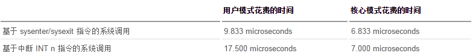
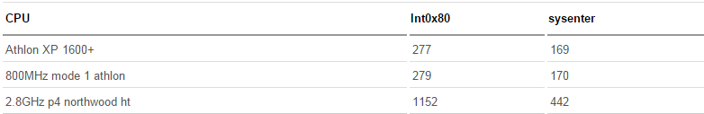

<!-- @import "[TOC]" {cmd="toc" depthFrom=1 depthTo=6 orderedList=false} -->

<!-- code_chunk_output -->

- [1 系统调用简介](#1-系统调用简介)
- [2 Linux 系统调用实现方式的演进](#2-linux-系统调用实现方式的演进)
  - [2.1 通过 INT 0x80 中断方式进入系统调用](#21-通过-int-0x80-中断方式进入系统调用)
  - [2.2 通过 sysenter 指令方式直接进入系统调用](#22-通过-sysenter-指令方式直接进入系统调用)
- [3 通过 INT 0x80 中断方式进入系统调用](#3-通过-int-0x80-中断方式进入系统调用)
- [4 通过 sysenter 指令方式直接进入系统调用](#4-通过-sysenter-指令方式直接进入系统调用)
  - [4.1 sysenter/sysexit 机制简介](#41-sysentersysexit-机制简介)
    - [4.1.1 sysenter 指令](#411-sysenter-指令)
    - [4.1.2 SYSEXIT 指令](#412-sysexit-指令)
  - [4.2 sysenter/sysexit 和 int n/iret 的区别](#42-sysentersysexit-和-int-niret-的区别)
    - [4.2.1 sysenter/sysexit](#421-sysentersysexit)
    - [4.2.2 int n/iret](#422-int-niret)
  - [4.3 sysenter 执行流程](#43-sysenter-执行流程)
  - [4.4 sysexit 执行流程](#44-sysexit-执行流程)
- [5 sysenter/sysexit 编程示例](#5-sysentersysexit-编程示例)
- [6 Linux SCI](#6-linux-sci)
  - [6.1 基于多路分解的系统调用实现](#61-基于多路分解的系统调用实现)
  - [6.2 直接内核态子函数调用实现系统调用](#62-直接内核态子函数调用实现系统调用)
- [7 参考](#7-参考)

<!-- /code_chunk_output -->

# 1 系统调用简介

由操作系统实现提供的所有系统调用所构成的集合即程序接口或应用编程接口(Application Programming Interface, API). 是应用程序同系统之间的接口 

\linux\-3.15.5\arch\x86\kernel\entry\_32.S

```assembly
syscall_call:
    /*
    调用系统函数
    sys_call_table 也定义在是一张由指向实现各种系统调用的内核函数的函数指针组成的表: 
    linux-2.6.32.63\arch\x86\kernel\syscall_table_32.S
        ENTRY(sys_call_table)
            .long sys_restart_syscall    /* 0 - old "setup()" system call, used for restarting */
            .long sys_exit
            .long ptregs_fork
            .long sys_read
            .long sys_write
            .long sys_open        /* 5 */
            .long sys_close
            .long sys_waitpid
            .long sys_creat
            .long sys_link
            .long sys_unlink    /* 10 */
            .long ptregs_execve
            .long sys_chdir
            .long sys_time
            .long sys_mknod
            .long sys_chmod        /* 15 */
            .long sys_lchown16
            .long sys_ni_syscall    /* old break syscall holder */
            .long sys_stat
            .long sys_lseek
            .long sys_getpid    /* 20 */
            .long sys_mount
            .long sys_oldumount
            .long sys_setuid16
            .long sys_getuid16
            .long sys_stime        /* 25 */
            .long sys_ptrace
            .long sys_alarm
            .long sys_fstat
            .long sys_pause
            .long sys_utime        /* 30 */
            .long sys_ni_syscall    /* old stty syscall holder */
            .long sys_ni_syscall    /* old gtty syscall holder */
            .long sys_access
            .long sys_nice
            .long sys_ni_syscall    /* 35 - old ftime syscall holder */
            .long sys_sync
            .long sys_kill
            .long sys_rename
            .long sys_mkdir
            .long sys_rmdir        /* 40 */
            .long sys_dup
            .long sys_pipe
            .long sys_times
            .long sys_ni_syscall    /* old prof syscall holder */
            .long sys_brk        /* 45 */
            .long sys_setgid16
            .long sys_getgid16
            .long sys_signal
            .long sys_geteuid16
            .long sys_getegid16    /* 50 */
            .long sys_acct
            .long sys_umount    /* recycled never used phys() */
            .long sys_ni_syscall    /* old lock syscall holder */
            .long sys_ioctl
            .long sys_fcntl        /* 55 */
            .long sys_ni_syscall    /* old mpx syscall holder */
            .long sys_setpgid
            .long sys_ni_syscall    /* old ulimit syscall holder */
            .long sys_olduname
            .long sys_umask        /* 60 */
            .long sys_chroot
            .long sys_ustat
            .long sys_dup2
            .long sys_getppid
            .long sys_getpgrp    /* 65 */
            .long sys_setsid
            .long sys_sigaction
            .long sys_sgetmask
            .long sys_ssetmask
            .long sys_setreuid16    /* 70 */
            .long sys_setregid16
            .long sys_sigsuspend
            .long sys_sigpending
            .long sys_sethostname
            .long sys_setrlimit    /* 75 */
            .long sys_old_getrlimit
            .long sys_getrusage
            .long sys_gettimeofday
            .long sys_settimeofday
            .long sys_getgroups16    /* 80 */
            .long sys_setgroups16
            .long old_select
            .long sys_symlink
            .long sys_lstat
            .long sys_readlink    /* 85 */
            .long sys_uselib
            .long sys_swapon
            .long sys_reboot
            .long sys_old_readdir
            .long old_mmap        /* 90 */
            .long sys_munmap
            .long sys_truncate
            .long sys_ftruncate
            .long sys_fchmod
            .long sys_fchown16    /* 95 */
            .long sys_getpriority
            .long sys_setpriority
            .long sys_ni_syscall    /* old profil syscall holder */
            .long sys_statfs
            .long sys_fstatfs    /* 100 */
            .long sys_ioperm
            .long sys_socketcall
            .long sys_syslog
            .long sys_setitimer
            .long sys_getitimer    /* 105 */
            .long sys_newstat
            .long sys_newlstat
            .long sys_newfstat
            .long sys_uname
            .long ptregs_iopl    /* 110 */
            .long sys_vhangup
            .long sys_ni_syscall    /* old "idle" system call */
            .long ptregs_vm86old
            .long sys_wait4
            .long sys_swapoff    /* 115 */
            .long sys_sysinfo
            .long sys_ipc
            .long sys_fsync
            .long ptregs_sigreturn
            .long ptregs_clone    /* 120 */
            .long sys_setdomainname
            .long sys_newuname
            .long sys_modify_ldt
            .long sys_adjtimex
            .long sys_mprotect    /* 125 */
            .long sys_sigprocmask
            .long sys_ni_syscall    /* old "create_module" */
            .long sys_init_module
            .long sys_delete_module
            .long sys_ni_syscall    /* 130:    old "get_kernel_syms" */
            .long sys_quotactl
            .long sys_getpgid
            .long sys_fchdir
            .long sys_bdflush
            .long sys_sysfs        /* 135 */
            .long sys_personality
            .long sys_ni_syscall    /* reserved for afs_syscall */
            .long sys_setfsuid16
            .long sys_setfsgid16
            .long sys_llseek    /* 140 */
            .long sys_getdents
            .long sys_select
            .long sys_flock
            .long sys_msync
            .long sys_readv        /* 145 */
            .long sys_writev
            .long sys_getsid
            .long sys_fdatasync
            .long sys_sysctl
            .long sys_mlock        /* 150 */
            .long sys_munlock
            .long sys_mlockall
            .long sys_munlockall
            .long sys_sched_setparam
            .long sys_sched_getparam   /* 155 */
            .long sys_sched_setscheduler
            .long sys_sched_getscheduler
            .long sys_sched_yield
            .long sys_sched_get_priority_max
            .long sys_sched_get_priority_min  /* 160 */
            .long sys_sched_rr_get_interval
            .long sys_nanosleep
            .long sys_mremap
            .long sys_setresuid16
            .long sys_getresuid16    /* 165 */
            .long ptregs_vm86
            .long sys_ni_syscall    /* Old sys_query_module */
            .long sys_poll
            .long sys_nfsservctl
            .long sys_setresgid16    /* 170 */
            .long sys_getresgid16
            .long sys_prctl
            .long ptregs_rt_sigreturn
            .long sys_rt_sigaction
            .long sys_rt_sigprocmask    /* 175 */
            .long sys_rt_sigpending
            .long sys_rt_sigtimedwait
            .long sys_rt_sigqueueinfo
            .long sys_rt_sigsuspend
            .long sys_pread64    /* 180 */
            .long sys_pwrite64
            .long sys_chown16
            .long sys_getcwd
            .long sys_capget
            .long sys_capset    /* 185 */
            .long ptregs_sigaltstack
            .long sys_sendfile
            .long sys_ni_syscall    /* reserved for streams1 */
            .long sys_ni_syscall    /* reserved for streams2 */
            .long ptregs_vfork    /* 190 */
            .long sys_getrlimit
            .long sys_mmap_pgoff
            .long sys_truncate64
            .long sys_ftruncate64
            .long sys_stat64    /* 195 */
            .long sys_lstat64
            .long sys_fstat64
            .long sys_lchown
            .long sys_getuid
            .long sys_getgid    /* 200 */
            .long sys_geteuid
            .long sys_getegid
            .long sys_setreuid
            .long sys_setregid
            .long sys_getgroups    /* 205 */
            .long sys_setgroups
            .long sys_fchown
            .long sys_setresuid
            .long sys_getresuid
            .long sys_setresgid    /* 210 */
            .long sys_getresgid
            .long sys_chown
            .long sys_setuid
            .long sys_setgid
            .long sys_setfsuid    /* 215 */
            .long sys_setfsgid
            .long sys_pivot_root
            .long sys_mincore
            .long sys_madvise
            .long sys_getdents64    /* 220 */
            .long sys_fcntl64
            .long sys_ni_syscall    /* reserved for TUX */
            .long sys_ni_syscall
            .long sys_gettid
            .long sys_readahead    /* 225 */
            .long sys_setxattr
            .long sys_lsetxattr
            .long sys_fsetxattr
            .long sys_getxattr
            .long sys_lgetxattr    /* 230 */
            .long sys_fgetxattr
            .long sys_listxattr
            .long sys_llistxattr
            .long sys_flistxattr
            .long sys_removexattr    /* 235 */
            .long sys_lremovexattr
            .long sys_fremovexattr
            .long sys_tkill
            .long sys_sendfile64
            .long sys_futex        /* 240 */
            .long sys_sched_setaffinity
            .long sys_sched_getaffinity
            .long sys_set_thread_area
            .long sys_get_thread_area
            .long sys_io_setup    /* 245 */
            .long sys_io_destroy
            .long sys_io_getevents
            .long sys_io_submit
            .long sys_io_cancel
            .long sys_fadvise64    /* 250 */
            .long sys_ni_syscall
            .long sys_exit_group
            .long sys_lookup_dcookie
            .long sys_epoll_create
            .long sys_epoll_ctl    /* 255 */
            .long sys_epoll_wait
             .long sys_remap_file_pages
             .long sys_set_tid_address
             .long sys_timer_create
             .long sys_timer_settime        /* 260 */
             .long sys_timer_gettime
             .long sys_timer_getoverrun
             .long sys_timer_delete
             .long sys_clock_settime
             .long sys_clock_gettime        /* 265 */
             .long sys_clock_getres
             .long sys_clock_nanosleep
            .long sys_statfs64
            .long sys_fstatfs64
            .long sys_tgkill    /* 270 */
            .long sys_utimes
             .long sys_fadvise64_64
            .long sys_ni_syscall    /* sys_vserver */
            .long sys_mbind
            .long sys_get_mempolicy
            .long sys_set_mempolicy
            .long sys_mq_open
            .long sys_mq_unlink
            .long sys_mq_timedsend
            .long sys_mq_timedreceive    /* 280 */
            .long sys_mq_notify
            .long sys_mq_getsetattr
            .long sys_kexec_load
            .long sys_waitid
            .long sys_ni_syscall        /* 285 */ /* available */
            .long sys_add_key
            .long sys_request_key
            .long sys_keyctl
            .long sys_ioprio_set
            .long sys_ioprio_get        /* 290 */
            .long sys_inotify_init
            .long sys_inotify_add_watch
            .long sys_inotify_rm_watch
            .long sys_migrate_pages
            .long sys_openat        /* 295 */
            .long sys_mkdirat
            .long sys_mknodat
            .long sys_fchownat
            .long sys_futimesat
            .long sys_fstatat64        /* 300 */
            .long sys_unlinkat
            .long sys_renameat
            .long sys_linkat
            .long sys_symlinkat
            .long sys_readlinkat        /* 305 */
            .long sys_fchmodat
            .long sys_faccessat
            .long sys_pselect6
            .long sys_ppoll
            .long sys_unshare        /* 310 */
            .long sys_set_robust_list
            .long sys_get_robust_list
            .long sys_splice
            .long sys_sync_file_range
            .long sys_tee            /* 315 */
            .long sys_vmsplice
            .long sys_move_pages
            .long sys_getcpu
            .long sys_epoll_pwait
            .long sys_utimensat        /* 320 */
            .long sys_signalfd
            .long sys_timerfd_create
            .long sys_eventfd
            .long sys_fallocate
            .long sys_timerfd_settime    /* 325 */
            .long sys_timerfd_gettime
            .long sys_signalfd4
            .long sys_eventfd2
            .long sys_epoll_create1
            .long sys_dup3            /* 330 */
            .long sys_pipe2
            .long sys_inotify_init1
            .long sys_preadv
            .long sys_pwritev
            .long sys_rt_tgsigqueueinfo    /* 335 */
            .long sys_perf_event_open
```

在 entry\_32.S 中列出了 Linux 操作系统所支持的所有系统调用

# 2 Linux 系统调用实现方式的演进


## 2.1 通过 INT 0x80 中断方式进入系统调用

在 2.6 以前的 Linux 2.4 内核中, 用户态 Ring3 代码请求内核态 Ring0 代码完成某些功能是通过系统调用完成的, 而系统调用的是通过软中断指令(int 0x80) 实现的. 在 x86 保护模式中, 处理 INT 中断指令时

1) CPU 首先从中断描述表 IDT 取出对应的门描述符

2) 判断门描述符的种类

3) 检查门描述符的级别 DPL 和 INT 指令调用者的级别 CPL, 当 CPL<=DPL 也就是说 INT 调用者级别高于描述符指定级别时, 才能成功调用

4) 根据描述符的内容, 进行压栈、跳转、权限级别提升

5) 内核代码执行完毕之后, 调用 IRET 指令返回, IRET 指令恢复用户栈, 并跳转会低级别的代码 

在发生系统调用, 由 Ring3 进入 Ring0 的这个过程浪费了不少的 CPU 周期, 例如, 系统调用必然需要由 Ring3 进入 Ring0, 权限提升之前和之后的级别是固定的, CPL 肯定是 3, 而 INT 80 的 DPL 肯定也是 3, 这样 CPU 检查门描述符的 DPL 和调用者的 CPL 就是完全没必要. 正是由于如此, Intel x86 CPU 从 PII 300(Family 6, Model 3, Stepping 3)之后, 开始支持新的系统调用指令 sysenter/sysexit

## 2.2 通过 sysenter 指令方式直接进入系统调用

sysenter 指令用于由 Ring3 进入 Ring0, SYSEXIT 指令用于由 Ring0 返回 Ring3. 由于**没有特权级别检查**的处理, 也**没有压栈**的操作, 所以执行速度比 INT n/IRET 快了不少. 

sysenter 和 sysexit 都是 CPU 原生支持的指令集

不同系统调用方法的性能比较:





相关链接:

http://www.ibm.com/developerworks/cn/linux/kernel/l-k26ncpu/

# 3 通过 INT 0x80 中断方式进入系统调用

通过 80 中断(软中断)进入系统调用的方式是 Linux 2.6 之前的做法, 关于这块的内容请参阅另一篇文章

http://www.cnblogs.com/LittleHann/p/3871630.html

# 4 通过 sysenter 指令方式直接进入系统调用

## 4.1 sysenter/sysexit 机制简介

### 4.1.1 sysenter 指令

1) 用于特权级 3 的用户代码调用特权级 0 的系统内核代码

2) sysenter 指令可以在 3, 2, 1 这三个特权级别调用(Linux 中只用到了特权级 3)

### 4.1.2 SYSEXIT 指令

1) 用于特权级 0 的系统代码返回用户空间中

2) SYSEXIT 指令只能从特权级 0 调用

## 4.2 sysenter/sysexit 和 int n/iret 的区别

### 4.2.1 sysenter/sysexit

1) 目标 Ring 0 代码段必须是平坦模式(Flat Mode)的 4GB 的可读可执行的非一致代码段

2) 目标 RING 0 堆栈段必须是平坦模式(Flat Mode)的 4GB 的可读可写向上扩展的栈段 

3) sysenter/sysexit 指令并不成对, sysenter 指令并不会把 SYSEXIT 所需的返回地址压栈, sysexit 返回的地址并不一定是 sysenter 指令的下一个指令地址. 调用 sysenter/sysexit 指令地址的跳转是通过设置一组特殊寄存器实现的, 这些寄存器可以通过 wrmsr 指令来设置. 这些寄存器包括: 

3.1) SYSENTER_CS_MSR: 用于指定要执行的 Ring 0 代码的代码段选择符, 由它还能得出目标 Ring 0 所用堆栈段的段选择符 

3.2) SYSENTER_EIP_MSR: 用于指定要执行的 Ring 0 代码的起始地址

3.3) SYSENTER_ESP_MSR: 用于指定要执行的 Ring 0 代码所使用的栈指针

### 4.2.2 int n/iret

1) int n/iret 是成对出现的, iret 返回的地址并一定是 int n 指令的下一个指令地址

需要明白的是, 不管是以前的 INT 0x80 中断方式进入系统调用, 还是使用 sysenter 方式进入系统调用, 对于系统调用来说, 最终都是通过"**sys\_call\_table**"来根据**调用号**寻址, 跳转到对应的系统调用处理例程里面的, 所以我们对 sys\_call\_table 进行 hijack replace hook 不管在 linux 2.4 还是 2.6 以后都是有效的

## 4.3 sysenter 执行流程

在 Ring3 的代码调用了 sysenter 指令之后, CPU 会做出如下的操作: 

1. 将 SYSENTER_CS_MSR 的值装载到 cs 寄存器
2. 将 SYSENTER_EIP_MSR 的值装载到 eip 寄存器
3. 将 SYSENTER_CS_MSR 的值加 8(Ring0 的堆栈段描述符)装载到 ss 寄存器 
4. 将 SYSENTER_ESP_MSR 的值装载到 esp 寄存器
5. 将特权级切换到 Ring0
6. 如果 EFLAGS 寄存器的 VM 标志被置位, 则清除该标志
7. 开始执行指定的 Ring0 代码

## 4.4 sysexit 执行流程

在 Ring0 代码执行完毕, 调用 SYSEXIT 指令退回 Ring3 时, CPU 会做出如下操作: 

1. 将 SYSENTER_CS_MSR 的值加 16(Ring3 的代码段描述符)装载到 cs 寄存器
2. 将寄存器 edx 的值装载到 eip 寄存器
3. 将 SYSENTER_CS_MSR 的值加 24(Ring3 的堆栈段描述符)装载到 ss 寄存器
4. 将寄存器 ecx 的值装载到 esp 寄存器
5. 将特权级切换到 Ring3
6. 继续执行 Ring3 的代码

相关链接:

http://www.ibm.com/developerworks/cn/linux/kernel/l-k26ncpu/

http://chenyufei.info/blog/2007-05-12/post-070512-221011-78/

http://articles.manugarg.com/systemcallinlinux2_6.html

# 5 sysenter/sysexit 编程示例

```c
#include <stdio.h>

int pid;

int main() {
        __asm__(
                "movl $20, %eax    \n"
                "call *%gs:0x10    \n"   /* offset 0x10 is not fixed across the systems */
                "movl %eax, pid    \n"
        );
        printf("pid is %d\n", pid);
        return 0;
}
```

# 6 Linux SCI

Linux 中系统调用的实现会根据不同的架构而有所变化, 而且即使在某种给定的体架构上也会不同. 例如, 早期的 x86 处理器使用了中断机制从用户空间迁移到内核空间中, 不过新的 IA\-32 处理器则提供了一些指令对这种转换进行优化(使用 sysentersysexit 指令)

## 6.1 基于多路分解的系统调用实现

在 Linux 内核中, 多路分解是一种很常见的逻辑架构, **每个系统调用**都是通过一个**单一的入口点多路**传入内核. eax 寄存器用来标识应当调用的某个系统调用. 例如, BSD(Berkeley Software Distribution)socket 调用(socket、bind、 connect 等)都与一个单独的系统调用索引(\_\_NR\_socketcall)关联在一起, 不过在内核中会进行多路分解, 通过另外一个参数进入适当的调用. 请参看 ./linux/net/socket.c 中的 sys\_socketcall 函数

关于 BSD sys\_socketcall 的相关知识, 请参阅另一篇文章

```
http://www.cnblogs.com/LittleHann/p/3875451.html
//搜索: 2. connect() API 原理
```

## 6.2 直接内核态子函数调用实现系统调用

通过一个系统调用, 将工作委托给多个其他函数, 是内核前期的常见做法, 内核后来移植的某些体系结构(例如 IA\-64、AMD64)没有实现多路分解, 而是直接使用原始多路复用的子函数直接作为系统调用

例如 socketcall 的多路分解就演变成了直接的子函数系统调用

Relevant Link:

http://www.ibm.com/developerworks/cn/linux/l-system-calls/

http://blog.chinaunix.net/uid-29643701-id-4240657.html 

# 7 参考

https://www.cnblogs.com/LittleHann/p/4111692.html

https://www.ibm.com/developerworks/cn/linux/kernel/l-k26ncpu/index.html

http://www.cnblogs.com/LittleHann/p/3871630.html

http://blog.chinaunix.net/uid-29643701-id-4240657.html 

http://www.ibm.com/developerworks/cn/linux/l-system-calls/