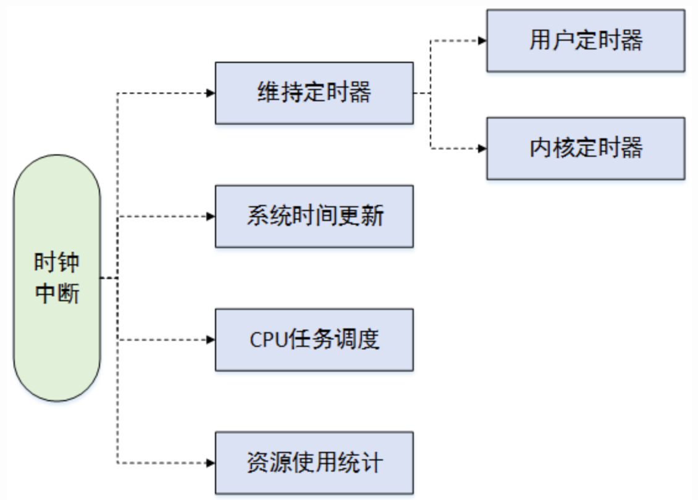

# 1. 硬件基础

参见`Architecture/x86/7. 时钟.md`

操作系统时钟从作用上分为两种: 计时和定时器

硬件方面, x86 主流平台, 计时靠tsc, 定时靠local apic timer. 

软件方面, linux, 低精度, 高精度, 先低精度然后切换到高精度. 

通过timer的中断, OS实现的功能包括但不局限于上图: 

定时器的维护, 包括用户态和内核态, 当指定时间段过去后触发事件操作, 比如IO操作注册的超时定时器等; 
更新系统的运行时间、wall time等, 此外还保存当前的时间和日期, 以便能通过time()等接口返回给用户程序, 内核中也可以利用其作为文件和网络包的时间戳; 
调度器在调度任务分配给CPU时, 也会去对task的运行时间进行统计计算, 比如CFS调度, Round-Robin调度等; 
资源使用统计, 比如系统负载的记录等, 此外用户使用top命令也能进行查看; 

