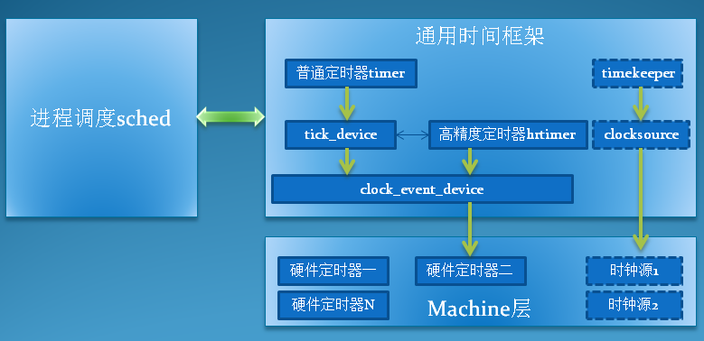

# 1. 简介

**早期**的内核版本中, **进程的调度**基于一个称之为**tick**的**时钟滴答**, 通常使用**时钟中断**来**定时地产生tick信号**, 每次tick定时中断都会进行**进程的统计**和**调度**, 并对tick进行计数, 记录在一个**jiffies变量**中, **定时器的设计**也是基于**jiffies**. 这时候的内核代码中, 几乎所有关于**时钟的操作**都是在**machine级的代码**中实现, 很多公共的代码要在每个平台上重复实现. 

随后, 随着**通用时钟框架**的引入, 内核需要支持**高精度的定时器**, 为此, 通用时间框架为**定时器硬件**定义了一个**标准的接口**: `clock_event_device`, machine级的代码只要按这个标准接口实现相应的硬件控制功能, 剩下的与平台无关的特性则统一由通用时间框架层来实现. 

# 2. 时钟事件软件架构

本系列文章的第一节中, 我们曾经讨论了时钟源设备: clocksource, 现在又来一个时钟事件设备: `clock_event_device`, 它们有何区别?

看名字, 好像都是给系统提供时钟的设备, 实际上, **clocksource不能被编程**, **没有产生事件的能力**, 它主要被用于**timekeeper**来实现**对真实时间进行精确的统计**, 而`clock_event_device`则是可编程的, 它可以工作在**周期触发**或**单次触发模式**, 系统可以对它进行编程, 以确定下一次事件触发的时间, `clock_event_device`主要用于**实现普通定时器**和**高精度定时器**, 同时也用于**产生tick事件**, 供给**进程调度子系统**使用. 

**时钟事件设备**与**通用时间框架**中的其他模块的关系如下图所示: 

clock_event_device软件架构:

* 与clocksource一样, 系统中可以存在**多个**`clock_event_device`, 系统会根据它们的**精度和能力**, 选择**合适的**`clock_event_device`对系统提供**时钟事件服务**. 在**smp系统**中, 为了**减少处理器间的通信开销**, 基本上**每个cpu**都会具备一个属于自己的**本地clock\_event\_device**, 独立地为该cpu提供时钟事件服务, smp中的**每个cpu**基于**本地**的`clock_event_device`, 建立自己的`tick_device`, **普通定时器**和**高精度定时器**. 
* 在软件架构上看, `clock_event_device`被分为了**两层**, 与**硬件相关**的被放在了**machine层**, 而**与硬件无关**的通用代码则被集中到了**通用时间框架层**, 这符合内核对软件的设计需求, 平台的开发者只需实现平台相关的接口即可, 无需关注复杂的上层时间框架. 
* `tick_device`是基于`clock_event_device`的进一步封装, 用于**代替原有的时钟滴答中断**, 给内核提供tick事件, 以完成进程的调度和进程信息统计, 负载平衡和时间更新等操作. 

# 3. 时钟事件设备相关数据结构

## 3.1. struct clock_event_device

## 3.2. 全局变量clockevent_devices

## 3.3. 全局变量clockevents_chain

# 4. clock_event_device的初始化和注册

# 5. tick_device

# 6. tick事件的处理--最简单的情况

# 7. 参考

————————————————
版权声明: 本文为CSDN博主「DroidPhone」的原创文章, 遵循 CC 4.0 BY-SA 版权协议, 转载请附上原文出处链接及本声明. 
原文链接: https://blog.csdn.net/DroidPhone/article/details/8017604
