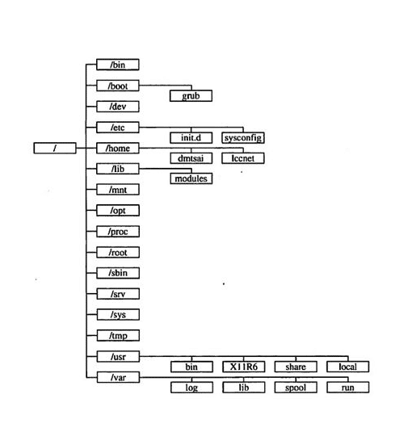
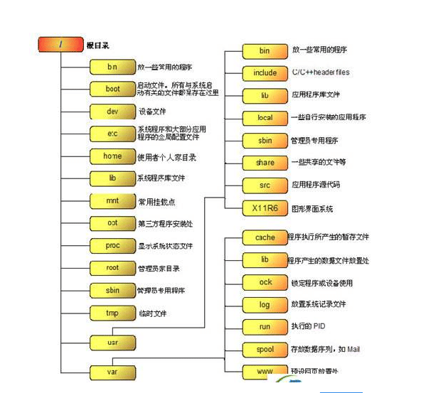

/boot 该目录默认下存放的是 Linux 的启动文件和内核. 

/initrd 它的英文含义是 boot loader initialized RAM disk,就是由 boot loader 初始化的内存盘. 在 linux

内核启动前, boot loader 会将存储介质(一般是硬盘)中的 initrd 文件加载到内存, 内核启动时会在访问真正的根文件系统前先访问该内存中的 initrd 文件系统. 

/bin 该目录中存放 Linux 的常用命令. 

/sbin 该目录用来存放系统管理员使用的管理程序. 

/var 该目录存放那些经常被修改的文件, 包括各种日志、数据文件. 

/etc 该目录存放系统管理时要用到的各种配置文件和子目录, 例如网络配置文件、文件系统、X 系统配置文件、设备配置信息、设置用户信息等. 

/dev 该目录包含了 Linux 系统中使用的所有外部设备, 它实际上是访问这些外部设备的端口, 访问这些外部设备与访问一个文件或一个目录没有区别. 

/mnt 临时将别的文件系统挂在该目录下. 

/root 如果你是以超级用户的身份登录的, 这个就是超级用户的主目录. 

/home 如果建立一个名为"xx"的用户, 那么在/home 目录下就有一个对应的"/home/xx"路径, 用来存放该用户的主目录. 

/usr 用户的应用程序和文件几乎都存放在该目录下. 

/lib 该目录用来存放系统动态链接共享库, 几乎所有的应用程序都会用到该目录下的共享库. 

/opt 第三方软件在安装时默认会找这个目录,所以你没有安装此类软件时它是空的,但如果你一旦把它删除了,以后在安装此类软件时就有可能碰到麻烦. 

/tmp 用来存放不同程序执行时产生的临时文件, 该目录会被系统自动清理干净. 

/proc 可以在该目录下获取系统信息, 这些信息是在内存中由系统自己产生的, 该目录的内容不在硬盘上而在内存里. 

/misc 可以让多用户堆积和临时转移自己的文件. 

/lost＋found 该目录在大多数情况下都是空的. 但当突然停电、或者非正常关机后, 有些文件就临时存放在这里. 

文件颜色的含义: 蓝色为文件夹; 绿色是可执行文件; 浅蓝色是链接文件; 红框文件是加了 SUID 位, 任意限权; 红色为压缩文件; 褐色为设备文件. 

linux 目录详解

linux 目录架构

/ 根目录

/bin 常用的命令 binary file 的目錄

/boot 存放系统启动时必须读取的档案, 包括核心 (kernel) 在内

/boot/grub/menu.lst GRUB 设置

/boot/vmlinuz 内核

/boot/initrd 核心解壓縮所需 RAM Disk

/dev 系统周边设备

/etc 系统相关设定文件

/etc/DIR_COLORS 设定颜色

/etc/HOSTNAME 设定用户的节点名

/etc/NETWORKING 只有 YES 标明网络存在

/etc/host.conf 文件说明用户的系统如何查询节点名

/etc/hosts 设定用户自已的 IP 与名字的对应表

/etc/hosts.allow 设置允许使用 inetd 的机器使用

/etc/hosts.deny 设置不允许使用 inetd 的机器使用

/etc/hosts.equiv 设置远端机不用密码

/etc/inetd.conf 设定系统网络守护进程 inetd 的配置

/etc/gateways 设定路由器

/etc/protocols 设定系统支持的协议

/etc/named.boot 设定本机为名字服务器的配置文件

/etc/sysconfig/network-scripts/ifcfg-eth0 设置 IP

/etc/resolv.conf 设置 DNS

/etc/X11 X Window 的配置文件,xorg.conf 或 XF86Config 這兩個 X Server 的設定檔

/etc/fstab 记录开机要 mount 的文件系统

/etc/inittab 设定系统启动时 init 进程将把系统设置成什么样的 runlevel

/etc/issue 记录用户登录前显示的信息

/etc/group 设定用户的组名与相关信息

/etc/passwd 帐号信息

/etc/shadow 密码信息

/etc/sudoers 可以 sudo 命令的配置文件

/etc/securetty 设定哪些终端可以让 root 登录

/etc/login.defs 所有用户登录时的缺省配置

/etc/exports 设定 NFS 系统用的

/etc/init.d/ 所有服務的預設啟動 script 都是放在這裡的, 例如要啟動或者關閉

/etc/xinetd.d/ 這就是所謂的 super daemon 管理的各項服務的設定檔目錄

/etc/modprobe.conf 内核模块额外参数设定

/etc/syslog.conf 日志设置文件

/home 使用者家目录

/lib 系统会使用到的函数库

/lib/modules kernel 的相关模块

/var/lib/rpm rpm 套件安装处

/lost+found 系統不正常產生錯誤時, 會將一些遺失的片段放置於此目錄下

/mnt 外设的挂载点

/media 与/mnt 类似

/opt 主机额外安装的软件

/proc 虚拟目录, 是内存的映射

/proc/version 内核版本

/proc/sys/kernel 系统内核功能

/root 系统管理员的家目录

/sbin 系统管理员才能执行的指令

/srv 一些服務啟動之後, 這些服務所需要取用的資料目錄

/tmp 一般使用者或者是正在執行的程序暫時放置檔案的地方

/usr 最大的目录, 存许应用程序和文件

/usr/X11R6:  X-Window 目录

/usr/src:  Linux 源代码

/usr/include: 系统头文件

/usr/openwin 存放 SUN 的 OpenWin

/usr/man 在线使用手册

/usr/bin 使用者可執行的 binary file 的目錄

/usr/local/bin 使用者可執行的 binary file 的目錄

/usr/lib 系统会使用到的函数库

/usr/local/lib 系统会使用到的函数库

/usr/sbin 系统管理员才能执行的指令

/usr/local/sbin 系统管理员才能执行的指令

/var 日志文件

/var/log/secure 記錄登入系統存取資料的檔案, 例如 pop3, ssh, telnet, ftp 等都會記錄在此檔案中

/var/log/wtmp 記錄登入者的訊息資料, last

/var/log/messages 幾乎系統發生的錯誤訊息

/var/log/boot.log 記錄開機或者是一些服務啟動的時候, 所顯示的啟動或關閉訊息

/var/log/maillog 紀錄郵件存取或往來( sendmail 與 pop3 )的使用者記錄

/var/log/cron 記錄 crontab 這個例行性服務的內容

/var/log/httpd, /var/log/news, /var/log/mysqld.log, /var/log/samba, /var/log/procmail.log: 分別是幾個不同的網路服務的記錄檔

参考

https://mparticle.uc.cn/article.html?uc_param_str=frdnsnpfvecpntnwprdssskt&btifl=100&app=uc-iflow&title_type=1&wm_id=76d1e8961cbe45e6accbd078a0487ff8&wm_cid=309569681249796096&pagetype=share&client=&uc_share_depth=1