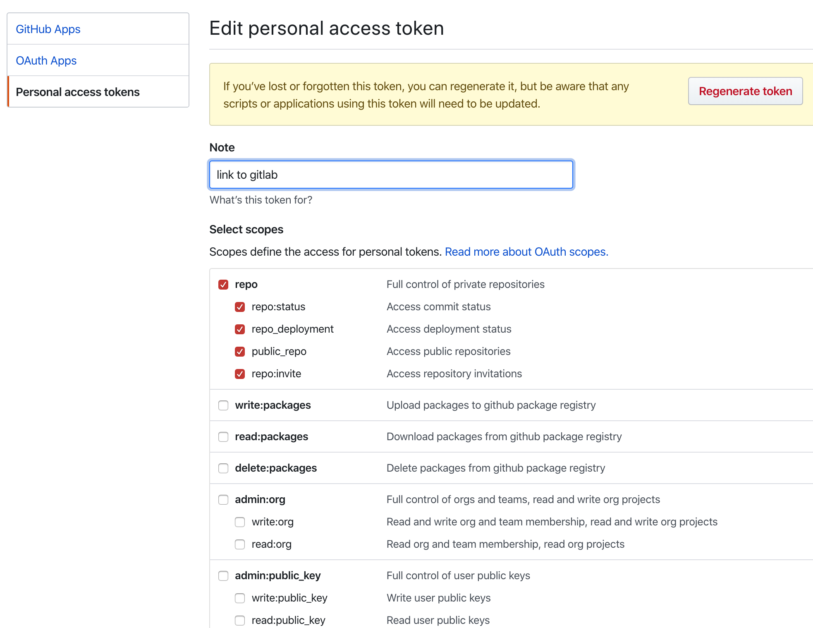
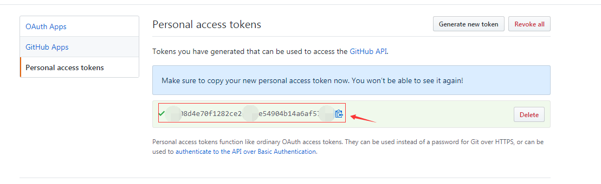
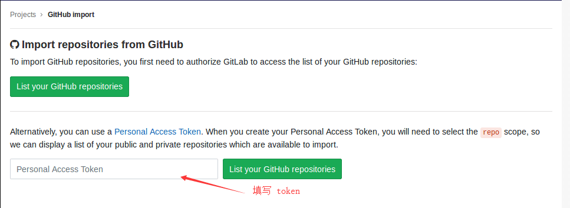
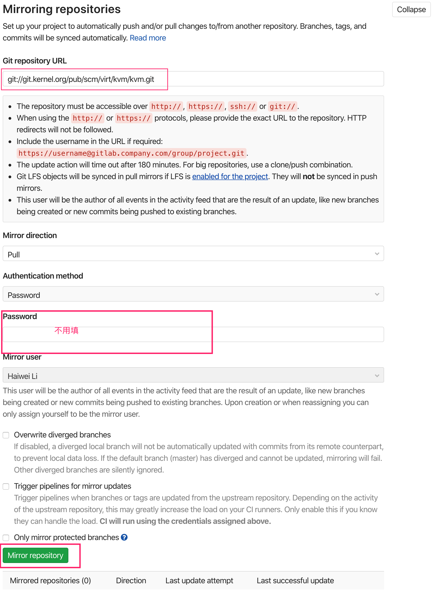
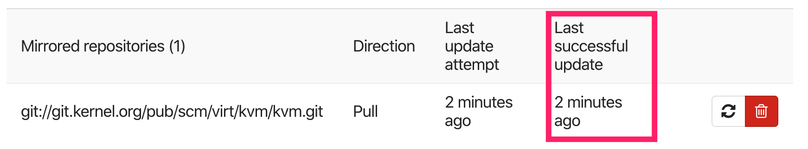
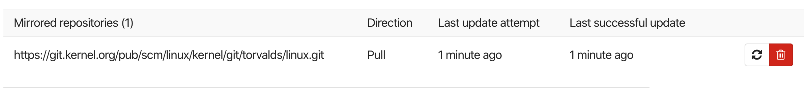

<!-- @import "[TOC]" {cmd="toc" depthFrom=1 depthTo=6 orderedList=false} -->

<!-- code_chunk_output -->

- [1. GitLab -> GitHub](#1-gitlab---github)
  - [1.1. 在 GitHub 上生成 token](#11-在-github-上生成-token)
  - [1.2. 在 GitHub 上建立空仓库用来同步](#12-在-github-上建立空仓库用来同步)
  - [1.3. 在 GitLab 上配置镜像地址](#13-在-gitlab-上配置镜像地址)
- [2. GitHub -> GitLab](#2-github---gitlab)
- [3. GitLab 同步其他开源库](#3-gitlab-同步其他开源库)

<!-- /code_chunk_output -->

# 1. GitLab -> GitHub

>将 gitlab 的 repo push 给 github

大致需要三步

1. 在 **GitHub** 上创建**私有访问 Token**,token 就是**只有一部分权限的密码**(和你的登录密码相比, 你的**登录密码**拥有**完全的权限**), 所以本步骤可以不进行, 直接使用 github 的登录密码也是可以的】【1-6 步】

2. 需要在**github**上创建一个**空代码库**, 提供**URL 地址**, 供 gitlab 使用【7 步】

3. 在**GitLab**上**配置镜像地址**, 完成同步【8-13 步】

## 1.1. 在 GitHub 上生成 token

登录 GitHub, 进入 `setting -> Develop settings -> Personal access tokens`

生成 token, `generate new token`, 选择想要给新 token 赋予的权限



保存生成的新的 token 到其他地方, 之后就看不到了, 因为这个相当于密码



## 1.2. 在 GitHub 上建立空仓库用来同步

生成空的项目后, 记录 URL, 类似

```
https://github.com/haiwei-li/test.git
```

## 1.3. 在 GitLab 上配置镜像地址

登录 GitLab, 进入需要同步的项目, 进入 `settings -> repository -> Mirroring repositories`, 填写 GitHub 的空代码库地址

注意地址需要添加用户名(自然是为了和 token 对应)

原本 URL 是

```
https://github.com/haiwei-li/test.git
```

这里要填写的是

```
https://haiwei-li@github.com/haiwei-li/test.git
```

Mirror direction 填写 Push

Authentication method 选择 PassWord; 当然如果选择 SSH public key, 下面就填写已添加到 GitHub 的 ssh public key, 然后上面的 URL 就可以直接使用`git@gitlab.com:haiwei-li/test.git`.

密码处填写的就是上面获取的 token. 

如果 github 中创建的是公有的仓库, 可以尝试自己的**github 的登录密码**填写此处, 以或许更多更完整的权限

最后可以测试一下

# 2. GitHub -> GitLab

> 从 github 同步 repo 给 gitlab

这个方向很简单, 只需要上面第一模块在 github 上生成的 token. 

在 gitlab 上新建一个项目, 选择 Import project 导入项目, 并选择从 github 导入, 点击从 github 导入后, 需要在框中填入第一模块中在 github 中创建的 token

注意说明, gitlab 要求 github 提供的 token 所包含的权限, 是需要选择【repo】权限的, 而第一模块中, 咱们获取的 token 是勾选了 repo 权限的



填写以后, 点击右侧 List your GitHub repositories, 展示你的 GitHub 资源库列表

那现在选择你想拉取到 gitlab 的项目, 点击后面的导入即可

# 3. GitLab 同步其他开源库

比如 kernel 的 git://git.kernel.org/pub/scm/linux/kernel/git/torvalds/linux.git 或 kvm 的 git://git.kernel.org/pub/scm/virt/kvm/kvm.git , url 可以直接填这个或 https 的链接, 不用密码



最后结果如下: 



可以看到 2min 前成功更新

Linux 的:



这里用的是 https, 1min 前更新成功