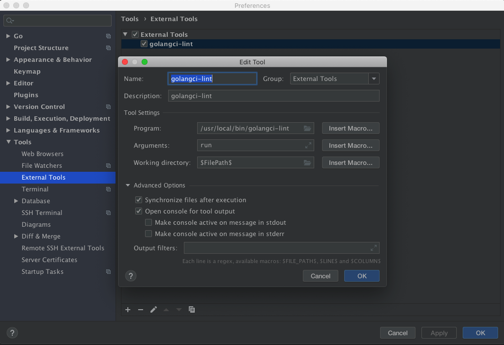

<!-- @import "[TOC]" {cmd="toc" depthFrom=1 depthTo=6 orderedList=false} -->

<!-- code_chunk_output -->

- [Go 开发环境](#go-开发环境)
- [安装 GoLand](#安装-goland)
- [Deployment 配置](#deployment-配置)
  - [第一种](#第一种)
  - [第二种](#第二种)
- [配置 golangci-lint](#配置-golangci-lint)

<!-- /code_chunk_output -->

# Go 开发环境

参照 Golang 内容

# 安装 GoLand

```
# sudo vim /etc/hosts
0.0.0.0 account.jetbrains.com
0.0.0.0 www.jetbrains.com
```

激活群

# Deployment 配置

SFTP

## 第一种

Connection:

Root path: /

Mappings:

Local path: /Volume/Main/Codes/go/src/test

Deployment path: /root/go/src/test

## 第二种

Connection:

Root path: /root

Mappings:

Local path: /Volume/Main/Codes/go/src/test

Deployment path: /go/src/test

# 配置 golangci-lint

先安装 golangci-lint

```
brew install golangci/tap/golangci-lint
brew upgrade golangci/tap/golangci-lint
```

```
# which golangci-lint
/usr/local/bin/golangci-lint
```

打开"Preference"  ->  "Tools"  ->  "External Tools"



可以设置一个快捷键

"Preference"  ->  "Keymap"