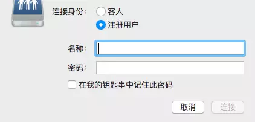

<!-- @import "[TOC]" {cmd="toc" depthFrom=1 depthTo=6 orderedList=false} -->

<!-- code_chunk_output -->

- [1. 需求背景](#1-需求背景)
- [2. samba 简介](#2-samba-简介)
- [3. Linux 配置](#3-linux-配置)
  - [3.1. 安装 samba](#31-安装-samba)
  - [3.2. 共享文件夹](#32-共享文件夹)
  - [3.3. 配置 samba.conf](#33-配置-sambaconf)
  - [3.4. 添加 samba 账户和密码](#34-添加-samba-账户和密码)
  - [3.5. 重启 smb.service](#35-重启-smbservice)
- [4. 在 mac 上连接](#4-在-mac-上连接)
  - [4.1. .DS_Store 安全隐患](#41-ds_store-安全隐患)

<!-- /code_chunk_output -->

# 1. 需求背景

最近需要在 Mac 上远程连接一台 Linux 服务器, 管理一些文件. 不仅需要进行常规的本地文件操作, 还需要上传、下载、编辑.

虽然有一些付费或免费的 App, 也可以完成类似工作. 但其实 Mac OS X 自带的 Finder 就可以搞定了！

# 2. samba 简介

samba, 是一个基于 GPL 协议的自由软件. 它重新实现了 SMB/CIFS 协议, 可以在各个平台共享文件和打印机.

# 3. Linux 配置

## 3.1. 安装 samba

```
yum install samba
```

## 3.2. 共享文件夹

先创建一个需要共享的文件夹, 这里用 shared\_directory. 如果已经有, 直接执行 chmod 改变它的权限.

```
mkdir /home/USER_NAME/shared_directory
sudo chmod 777 /home/USER_NAME/shared_directory
```

USER\_NAME 就是你的用户名.

我是将根目录直接全部 share 了

## 3.3. 配置 samba.conf

可以直接修改/etc/samba/smb.conf, 在文件末尾添加:

```
[share]
      path = /home/USER_NAME/shared_directory
      available = yes
      browseable = yes
      public = yes
      writable = yes
```

我的配置是

```
[share]
	path = /
	available = yes
	browseable = yes
	public = yes
	writable = yes
    valid users = root
    create mask = 0777
    directory mask = 0777
```

## 3.4. 添加 samba 账户和密码

```
sudo touch /etc/samba/smbpasswd
sudo smbpasswd -a USER_NAME
```

我是用了 root 用户

## 3.5. 重启 smb.service

```
systemctl restart smb.service
```

# 4. 在 mac 上连接

打开 Finder(或在桌面), CMD + k, 可以得到以下页面:




## 4.1. .DS_Store 安全隐患

由于 Finder 自带的.DS\_Store 包含了太多信息, 如果在服务器产生.DS_Store 会造成安全隐患. 如果没有特殊配置, 你用 Finder 管理远程的文件夹会自动产生.DS\_Store.

在云端检查你的共享文件夹, 如果发现\.DS\_Store, 立即删除！

```
ls -a /home/USER_NAME/shared_directory
```

如何让 Finder 不在远程连接时产生.DS\_Store?

打开 Mac 的 Terminal, 输入

```
defaults write com.apple.desktopservices DSDontWriteNetworkStores true
```

然后重启 Mac, 再试试远程连接.