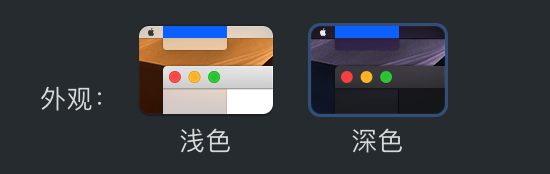
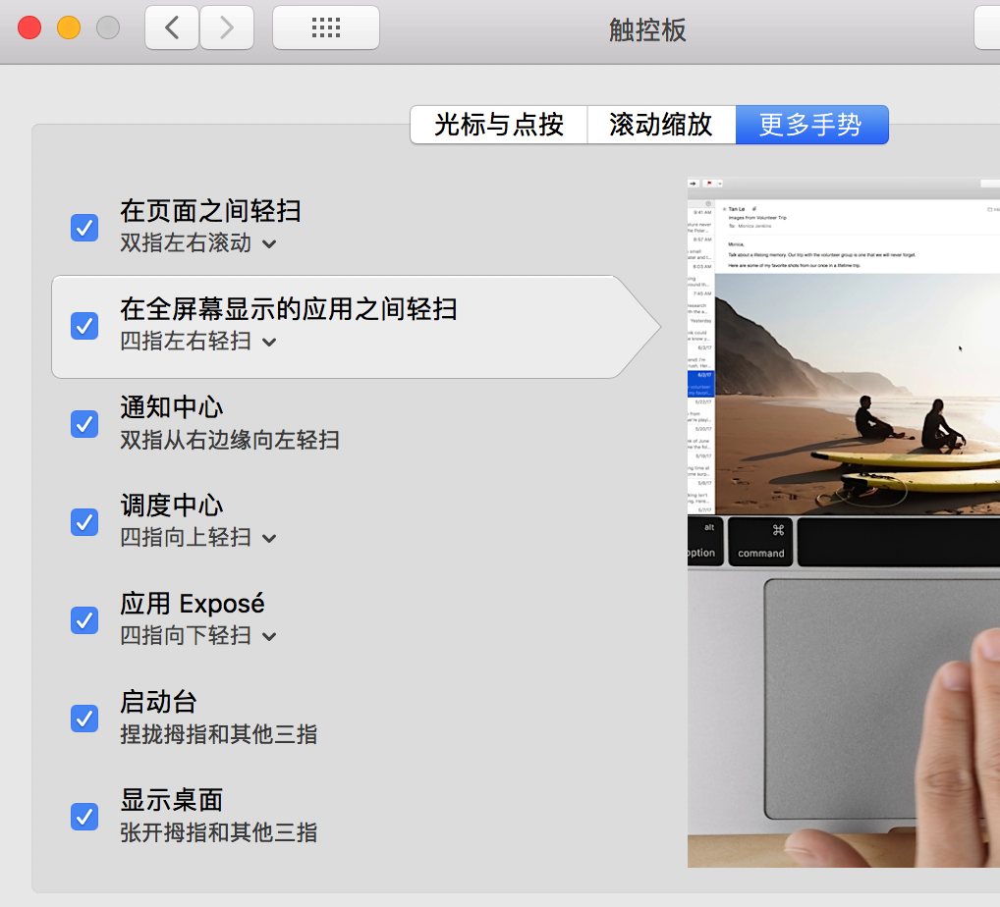
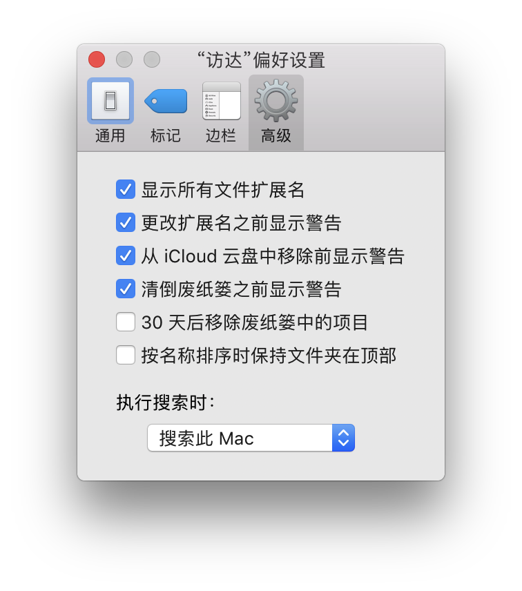
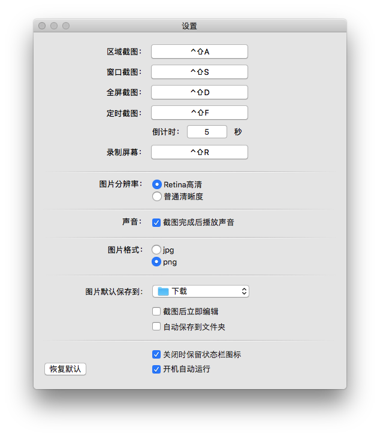
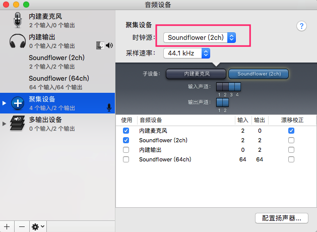

<!-- @import "[TOC]" {cmd="toc" depthFrom=1 depthTo=6 orderedList=false} -->

<!-- code_chunk_output -->

- [1. 系统初始化](#1-系统初始化)
  - [1.1. 账号设置以及更新](#11-账号设置以及更新)
    - [1.1.1. 登录 iCloud 账号以及其他互联网账户](#111-登录-icloud-账号以及其他互联网账户)
    - [1.1.2. 设置 Mac 用户](#112-设置-mac-用户)
    - [1.1.3. 系统更新](#113-系统更新)
    - [1.1.4. HostName、ComputeName、LocalHostName 设置](#114-hostname-computename-localhostname-设置)
      - [1.1.4.1. 介绍](#1141-介绍)
      - [1.1.4.2. 设置](#1142-设置)
        - [1.1.4.2.1. 系统设置](#11421-系统设置)
        - [1.1.4.2.2. hostname](#11422-hostname)
        - [1.1.4.2.3. scutil](#11423-scutil)
  - [1.2. 磁盘设置](#12-磁盘设置)
    - [1.2.1. 基本介绍](#121-基本介绍)
      - [1.2.1.1. 选择卷宗](#1211-选择卷宗)
      - [1.2.1.2. 创建卷宗](#1212-创建卷宗)
      - [1.2.1.3. 删除宗卷](#1213-删除宗卷)
      - [1.2.1.4. 装载宗卷卸载宗卷](#1214-装载宗卷卸载宗卷)
      - [1.2.1.5. 创建多个容器或者分区](#1215-创建多个容器或者分区)
      - [1.2.1.6. 删除容器或者分区](#1216-删除容器或者分区)
    - [1.2.2. 设置](#122-设置)
    - [1.2.3. samba 设置](#123-samba-设置)
  - [1.3. 系统偏好设置](#13-系统偏好设置)
    - [1.3.1. 通用](#131-通用)
    - [1.3.2. 桌面与屏幕保护程序](#132-桌面与屏幕保护程序)
      - [1.3.2.1. 桌面](#1321-桌面)
      - [1.3.2.2. 屏幕保护程序](#1322-屏幕保护程序)
    - [1.3.3. 程序坞](#133-程序坞)
    - [1.3.4. 调度中心](#134-调度中心)
    - [1.3.5. 语言与地区](#135-语言与地区)
    - [1.3.6. 安全性与隐私](#136-安全性与隐私)
      - [1.3.6.1. 通用](#1361-通用)
      - [1.3.6.2. 隐私](#1362-隐私)
    - [1.3.7. 聚焦](#137-聚焦)
    - [1.3.8. 通知](#138-通知)
    - [1.3.9. Extensions](#139-extensions)
      - [1.3.9.1. Touch Bar](#1391-touch-bar)
    - [1.3.10. 显示器](#1310-显示器)
      - [1.3.10.1. 显示器](#13101-显示器)
    - [1.3.11. 节能](#1311-节能)
    - [1.3.12. 键盘](#1312-键盘)
      - [1.3.12.1. 键盘](#13121-键盘)
      - [1.3.12.2. 文本](#13122-文本)
      - [1.3.12.3. 快捷键](#13123-快捷键)
      - [1.3.12.4. 输入法](#13124-输入法)
    - [1.3.13. 鼠标](#1313-鼠标)
    - [1.3.14. 触控板](#1314-触控板)
    - [1.3.15. 辅助功能](#1315-辅助功能)
      - [1.3.15.1. 鼠标与触控板](#13151-鼠标与触控板)
  - [1.4. Finder (访达)](#14-finder-访达)
    - [1.4.1. 偏好设置](#141-偏好设置)
    - [1.4.2. 自定义工具栏](#142-自定义工具栏)
    - [1.4.3. 显示完整路径](#143-显示完整路径)
    - [1.4.4. 显示](#144-显示)
    - [1.4.5. 默认打开方式](#145-默认打开方式)
  - [1.5. 添加 ll、la、l 等 ls 别名命令](#15-添加-ll-la-l-等-ls-别名命令)
  - [1.6. HomeBrew 配置](#16-homebrew-配置)
  - [1.7. 字体下载和安装](#17-字体下载和安装)
  - [1.8. "连续互通":  连同 Mac、iPhone、iPad、iPod touch 和 Apple Watch](#18-连续互通--连同-mac-iphone-ipad-ipod-touch-和-apple-watch)
    - [1.8.1. 信息转发](#181-信息转发)
      - [1.8.1.1. 设置信息转发](#1811-设置信息转发)
    - [1.8.2. 接力](#182-接力)
      - [1.8.2.1. 设置接力](#1821-设置接力)
      - [1.8.2.2. 使用接力](#1822-使用接力)
    - [1.8.3. 拨打和接听电话](#183-拨打和接听电话)
      - [1.8.3.1. 设置 iPhone 蜂窝移动网络通话](#1831-设置-iphone-蜂窝移动网络通话)
    - [1.8.4. 在 Mac 上使用"隔空投送"](#184-在-mac-上使用隔空投送)
      - [1.8.4.1. 通过"隔空投送"共享内容](#1841-通过隔空投送共享内容)
      - [1.8.4.2. 如果您在"隔空投送"中看不到其他设备](#1842-如果您在隔空投送中看不到其他设备)
- [2. 软件安装与设置](#2-软件安装与设置)
  - [2.1. Karabiner Elements: 键位定制神器](#21-karabiner-elements-键位定制神器)
  - [2.2. CheatSheet: 快捷键辅助软件](#22-cheatsheet-快捷键辅助软件)
  - [2.3. Alfred: Mac 下的 Everything](#23-alfred-mac-下的-everything)
    - [2.3.1. Preference 设置](#231-preference-设置)
      - [2.3.1.1. General](#2311-general)
      - [2.3.1.2. Appearance](#2312-appearance)
    - [2.3.2.](#232)
  - [2.4. snap: 快捷键神器](#24-snap-快捷键神器)
  - [2.5. Clipy: 剪切板工具](#25-clipy-剪切板工具)
  - [2.6. Tencent Lemon Lite: Mac 清理工具](#26-tencent-lemon-lite-mac-清理工具)
  - [2.7. iTerm 2: 终端软件](#27-iterm-2-终端软件)
    - [2.7.1. 设置](#271-设置)
    - [2.7.2. 安装 brew](#272-安装-brew)
    - [2.7.3. 安装配置 zsh, oh-my-zsh](#273-安装配置-zsh-oh-my-zsh)
      - [2.7.3.1. 使用 zsh](#2731-使用-zsh)
      - [2.7.3.2. oh-my-zsh](#2732-oh-my-zsh)
      - [2.7.3.3. 插件](#2733-插件)
        - [2.7.3.3.1. 自动补全插件(不建议安装)](#27331-自动补全插件不建议安装)
  - [2.8. 搜狗输入法](#28-搜狗输入法)
  - [2.9. 腾讯截图](#29-腾讯截图)
  - [2.10. soundflower](#210-soundflower)
    - [2.10.1. Mac 现状](#2101-mac-现状)
    - [2.10.2. soundflower 安装检查](#2102-soundflower-安装检查)
    - [2.10.3. 系统设置](#2103-系统设置)
  - [2.11. QuickTime Player](#211-quicktime-player)
    - [2.11.1. 系统声音设置](#2111-系统声音设置)
    - [2.11.2. QuickTime Player 设置](#2112-quicktime-player-设置)
  - [2.12. OBS](#212-obs)
    - [2.12.1. 系统声音设置](#2121-系统声音设置)
    - [2.12.2. OBS 设置](#2122-obs-设置)
  - [2.13. iText](#213-itext)
  - [2.14. Eclipse](#214-eclipse)
  - [2.15. Understand](#215-understand)
  - [2.16. VS Code](#216-vs-code)
  - [2.17. IINA](#217-iina)
  - [2.18. vnc viewer](#218-vnc-viewer)
  - [2.19. Spectacle](#219-spectacle)
  - [2.20. keka](#220-keka)
  - [2.21. VMware Fusion](#221-vmware-fusion)
  - [2.22. 安装 qemu](#222-安装-qemu)
  - [2.23. Bartender 3](#223-bartender-3)
  - [2.24. Snipaste](#224-snipaste)
- [3. 系统设置确认](#3-系统设置确认)
  - [3.1. 登录自动打开](#31-登录自动打开)
  - [3.2. bash\_profile 文件](#32-bash_profile-文件)
- [4.](#4)

<!-- /code_chunk_output -->


# 1. 系统初始化

## 1.1. 账号设置以及更新

### 1.1.1. 登录 iCloud 账号以及其他互联网账户

系统偏好设置  ->  iCloud

系统偏好设置  ->  互联网账户

登录 "iCloud"、Outlook 账户(Exchange)、Google、Hotmail 以及公司邮箱


### 1.1.2. 设置 Mac 用户

系统偏好设置  ->  用户与群组

删除其它用户, 只留管理员用户, 关闭客人用户, 设置密码, 密码提示设为

```
请联系 16601053927, 或邮件 haiwei.lee@hotmail.com, 万分感谢!
```

### 1.1.3. 系统更新

App Store 中更新

### 1.1.4. HostName、ComputeName、LocalHostName 设置

#### 1.1.4.1. 介绍

使用 hostname 查看系统 hostname 设置, 该值会按优先级取决于下列值

- hostname 命令设置的值
- HostName 属性值
- LocalHostName 属性值(通常系统都会设置此属性)

关于 hostname 相关属性, scutil 命令手册(info scutil 或 man scutil)中有如下描述:

ComputerName: The user\-friendly name for the system.

LocalHostName: The local (Bonjour) host name.

HostName: The name associated with hostname(1) and gethostname(3).

#### 1.1.4.2. 设置

三种方式设置

- System Preferences
- 命令行工具 hostname
- 命令行工具 scutil

##### 1.1.4.2.1. 系统设置

在这里可以查看和设置 ComputerName 和 LocalHostName, 但不能设置 HostName 的值.

对于普通用户通常使用这种方式就可以了, 因为通常情况下都没有用 hostname 和 scutil 来设置, 所以就会取 LocalHostName 的值.

系统偏好设置  ->  共享

"电脑名称": "Gerry-Mac"

##### 1.1.4.2.2. hostname

```
hostname Gerry-Mac
```

注意: 这种方式不能保持到重启后

根据 hostname 命令的手册(info hostname 或 man hostname), 可以使用 scutil 命令来持久修改 hostname

##### 1.1.4.2.3. scutil

查看各属性值:

```
$ sudo scutil --get ComputerName
Gerry-Mac
$ sudo scutil --get LocalHostName
Gerry-Mac
$ sudo scutil --get HostName
GerryLee
```

设置 HostName 属性值:

```
scutil --set HostName GerryLee
```

scutil 可以修改 ComputerName, LocalHostName 和 HostName 任意一个值.

## 1.2. 磁盘设置

### 1.2.1. 基本介绍

#### 1.2.1.1. 选择卷宗

打开"磁盘工具", 点击软件左上角的"显示"符号, 然后选择显示所有设备, 如图那样子, 点击后看到所有的设备, 分别是物理磁盘, 容器以及宗卷, 点击图中的 Macintosh HD 看到宗卷两个字.


在 Mac 上面宗卷代表的是分区又不是分区. 这句话是什么意思呢?因为 APFS 在里面加入了容器的概念. **一般**我们理解的分区就是把**硬盘分为几个部分**, 在电脑上面会看到**几个盘符**, **不同的盘符代表不同的分区**. 但是 APFS 加入了**容器**的概念, 一切变得不同. 注意在 APFS 里面, 增加宗卷, 或者增加分区, 在 finder 里面都可以实现看到几个分区的效果. 但是它们本质是不同的. **宗卷只能在容器**里增加或者删除, 而分区则是在物理硬盘上面分的. 最大的不同在于共享存储池. **容器**可以达到**共享存储空间**的效果, 而**分区不能**.

举个例子:

**普通分区**的效果, 把**普通的硬盘**分成**两个分区**, 意味着你**其中一个分区**使用完了剩余的空间, **另外一个分区**的剩余空间则你**不能够使用**的. 是属于**完全的隔离**分开的.

**APFS 文件系统分区**是, 先在**物理硬盘**上建立个**存储池**就是叫做**容器**的东西, 然后你要**分区**的话就是**在这个容器**上面建立**一个宗卷**, 等于**容器包含了宗卷**, 如果**再需要分区**就**再次建立一个宗卷**. 因为它们是包含的关系, 意味着你可以实现**两个宗卷公用剩余空间**. 不用再担心其中一个分区已经没有剩余空间了, 因为是公用的关系, 实际上你**写入文件**, 无论把文件放到**哪个宗卷**, 归根到底都是在**同一个容器内**. 视觉上面看起来是不同的分区, 实际上它使用的同一个容器. 所以说宗卷代表的是分区又不是分区, 两个分区(宗卷)剩余的容量都是一样的. 这是这个新的文件系统的最大特色.

#### 1.2.1.2. 创建卷宗

因为**宗卷**是在 APFS 中是**建立在容器上面**的, 所以**点击左侧的容器**或者**宗卷**(基于容器所以可以创建), **才可以创建宗卷**, 点击**硬盘**则是**灰色**. **只有**在**硬盘**上面创建了**容器**, 才可以**创建宗卷**. 如图


点击**宗卷的加号**, 然后**输入宗卷名称**, 可以中英文, 注意**选择格式！！！**可以选择区分大小写, 然后点击确定即可. 这时候就会创建一个**容量大小相同剩余空间相同**的**两个不同名字的宗卷**, 打开磁盘工具后就会看到有了**两个宗卷分区**. 但是跟普通的分区又有点不同, 普通分区其中一个用完了, 第二分区的剩余容量不会合并到第一分区. 而容器中的两个宗卷则是恰恰相反. 两个剩余的空间都是一样的.


比如下面两个, Data 是区分大小写的, Macintosh HD 是不区分大小写的:


#### 1.2.1.3. 删除宗卷

要删除宗卷, 首先是点击**容器下面的宗卷**, 然后右键选择删除即可. 需要注意的是**删除后**这个**宗卷分区的数据将会消失殆尽**.

如果**点击容器选项**, 那么**宗卷删除选项则是灰色**. 因为**容器不是宗卷**, 只能建立宗卷, 要删除宗卷当然得先选择宗卷.


在**容器里面建立的分区**都是**剩余容量空间都是一样**的, 或者**不想弄一样**的怎么办, 那么就需要在创建时候选择**大小选项**, 接着会有**保留大小**, **配额大小**选项, **保留大小**就是**宗卷最小的容量**是多少不会低于这个值, 配额大小就是当这个宗卷设置了某个**最大值**放入的文件已经存储满了, 那么容器内剩余的空间就不会再分给它.


#### 1.2.1.4. 装载宗卷卸载宗卷

当**创建卷宗**后, 会**自动装载到系统**, 装载点是/Volume/_卷宗 name_, 卸载后重新装载也是装载在这个目录.

要实现**卸载宗卷**的功能首先是**需要最少两个宗卷才可以实现**. 因为带有系统的宗卷是无法卸载的.

点击宗卷, 右键它或者点击磁盘工具右上角的卸载即可.


这个功能的作用是, **隐藏自己的私密文件**, 在需要**查看私密文件**时候**把宗卷装载过去**, 然后打开 finder 在设备里面看到自己创立的未命名宗卷. 不需要的时候把它卸载了, 那么打开 finder 就不会看到宗卷了. 这样子就达到了隐藏文件的目的. 当然这个只能针对不了解 Mac 的用户.

#### 1.2.1.5. 创建多个容器或者分区

首先是**点击左侧的内置任意一个分区或物理磁盘**, 然后**点击分区**, 在**饼图**里面**点击加号**, 然后**设置容器的大小**, 如果**不设置**就会**把硬盘所有的剩余空间**作为**第二个容器**. 如果格式选择**fat 之类**就只是会生成分区, 而**不会带有容器**. 设置**名字**, 如果是**其他类型文件系统(fat 之类的**), 这里会是**分区的名字**. **APFS**下则是**宗卷的名称**, 设置好了点击应用, 稍等一会就会生成一个容器以及容器下面的 _name_ 宗卷.


一般情况下最好是**一个硬盘**创建**一个容器**就可以了, 因为这样子就可以在容器上创建分区**充分使用一个硬盘**空间. 如果硬要创建**两个容器**在**一个硬盘**上面, 就**等于旧的分区模式**. 当然本着探索的精神, 尝试一下是怎么实现的. 因为 Mac 上面没有两个 ssd, 如果有的话, 或者自己添加能够将**两个硬盘**只创建**一个容器**, 那么这个文件系统就厉害了, 类似 lvm 两个硬盘当一个用.

#### 1.2.1.6. 删除容器或者分区

容器删除后宗卷分区也会删除. 点击**需要删除的容器对应的硬盘**, **点击分区**, 然后在蓝色饼图内**点击减号**, 选择应用稍微等待一会就会把容器删除了. 注意只能够删除自己建立的容器, 不能够删除带有系统的容器, 除非使用启动盘删除.


### 1.2.2. 设置

因为我的电脑只有一个硬盘, 所以也就将这个硬盘作为一个容器.

Mac 默认的卷宗是非区分大小写的. 这其实对于 git 等使用是有缺陷的, 所以这里需要**建立了一个新的宗卷**.

名称设为"Main", 格式"APFS(区分大小写)", 从而会创建一个宗卷并挂载到/Volume/Main, 将所有自己的数据都放在这里面, 不要放在系统卷宗中.

如下图, 打开 Finder, 点击"设备"下的"Main", 分别创建文件夹:

- Codes: 存放代码
- Data: 存放个人 Repo. 比如, 当前`Study`和`Materials`等就在这个下面
- Docs: 存放文档, 分别建立子目录
- Downloads: 存放下载的软件等
- Local: 存放解压缩的 APP 之类的, 比如 eclipse
- Work: 一些软件所需要的项目数据之类的, 比如 eclipse 的 workspace、Understand 的项目数据, 个人 win10 的虚拟机镜像, Images 存放虚拟机镜像, VSCode 的 workspace

并将上面的目录以及 Study 添加到左边的个人收藏, 删除其余没用的, 保留"隔空投送" "最近使用" "应用程序" "桌面" "个人用户"


### 1.2.3. samba 设置

这是一个用于在各个平台共享文件和打印机的功能.

我因为有个 centos, 所以设置有 centos 共享给 Mac 使用.

具体设置见另外文章.

最终在个人收藏也添加一个, 从下方"路径栏"即可拖动到左侧, 不要弹出


## 1.3. 系统偏好设置

### 1.3.1. 通用

外观使用"深色"



如果是 Retina 屏幕的 Mac, 可以取消勾选「使用 LCD 平滑字体」.


LCD 渲染会使字体更浓郁、且边缘出现彩色, 严重破坏字体美感. 虽然低分辨率屏幕可以更清晰地显示字体, 但 Retina 屏幕就没有这个必要了.

### 1.3.2. 桌面与屏幕保护程序

#### 1.3.2.1. 桌面

#### 1.3.2.2. 屏幕保护程序

选择"信息", 勾选"与时钟一起显示", "屏幕保护程序选项"为:

```
Haiwei Li
I do what i do.
```


### 1.3.3. 程序坞

勾选「自动显示和隐藏 Dock」.

### 1.3.4. 调度中心

将 Dashboard(仪表盘)关闭


"触发角"


### 1.3.5. 语言与地区

列表排列顺序建议改为「通用」, 让 Finder 等软件的名称排序更准确.

### 1.3.6. 安全性与隐私

#### 1.3.6.1. 通用

"停用自动登录", 允许"任何来源"的应用


"设定锁定信息", 如下:

```
Gerry Lee
16601053927
gerryleefocus@gmail.com
```

#### 1.3.6.2. 隐私

关闭"分析"中的改进


### 1.3.7. 聚焦

### 1.3.8. 通知

关闭"微信" "QQ" "企业微信"等预览功能


### 1.3.9. Extensions

#### 1.3.9.1. Touch Bar

自定义


### 1.3.10. 显示器

"隔空播放": 关闭

勾选"在菜单栏中显示镜像选项(可用时)"


#### 1.3.10.1. 显示器

分辨率选择"显示器默认", 或者"缩放"选择一个分辨率字体适中的.

### 1.3.11. 节能

### 1.3.12. 键盘

#### 1.3.12.1. 键盘

#### 1.3.12.2. 文本

#### 1.3.12.3. 快捷键

把底部的全键盘控制改为「所有控制」


修改后, 我们就可以直接用键盘控制对话框. 对于深蓝色背景的按钮, 默认就可以按回车键点击; 而开启全键盘控制后, 还可以用 Tab 键切换, 用空格键点击浅蓝色边框的按钮.

#### 1.3.12.4. 输入法

输入法有两种切换方式, 分别为「选择上一个输入源」和「选择『输入』菜单的下一个输入源」.

如果你使用了超过 2 种输入法, 建议关闭第一种, 然后勾选第二种并设置快捷键.

### 1.3.13. 鼠标


### 1.3.14. 触控板




### 1.3.15. 辅助功能

#### 1.3.15.1. 鼠标与触控板

「系统偏好设置」-「辅助功能」-「鼠标与触控板」-「触控板选项」-「启用拖移」


## 1.4. Finder (访达)

### 1.4.1. 偏好设置

"通用"


"边栏"


"高级"



### 1.4.2. 自定义工具栏

在 Finder 窗口顶部工具栏空白处右键, 选择「自定工具栏」


### 1.4.3. 显示完整路径

Finder 默认的标题栏只显示当前目录的名字, 可以打开终端 (Terminal.app), 复制粘贴以下命令

```
defaults write com.apple.finder _FXShowPosixPathInTitle -bool YES
```

然后回车, 即可让 Finder 在顶部显示文件目录的完整路径.


### 1.4.4. 显示

菜单栏显示


### 1.4.5. 默认打开方式

选择文件后右键, 单击「显示简介」, 然后将「打开方式」改为想要使用的软件, 并点击「全部更改」, 就设置了此类文件的默认打开方式.


## 1.5. 添加 ll、la、l 等 ls 别名命令

在`~/.bash_profile`中添加

```bash
alias ll='ls -alF'

alias la='ls -A'

alias l='ls -CF'
```


然后执行 source \~/.bash\_profile


## 1.6. HomeBrew 配置


## 1.7. 字体下载和安装

参见 Font 下内容

Nerd Fonts 是一个使用大量字体图标来解决程序员在开发过程中缺少合适字体的问题的项目.

- 下载 SourceCodePro Nerd Font 系列字体: [点击下载](https://github.com/ryanoasis/nerd-fonts/releases/download/v2.0.0/SourceCodePro.zip)

在 "字体册" 中添加

## 1.8. "连续互通":  连同 Mac、iPhone、iPad、iPod touch 和 Apple Watch

官方: https://support.apple.com/zh-cn/HT204681

- 所有设备均使用同一 Apple ID 登录 iCloud.
- 所有设备均已开启蓝牙.
- 所有设备均已开启 Wi-Fi.
- 所有设备均已开启 Handoff:
- 在 Mac 上, 选取苹果菜单 () >"系统偏好设置", 然后点按"通用". 选中"允许在这台 Mac 和 iCloud 设备之间使用 Handoff".
- 在 iPhone、iPad 或 iPod touch 上, 前往"设置">"通用">"Handoff", 然后开启 Handoff.

### 1.8.1. 信息转发

借助信息转发功能, 您在 iPhone 上发送和接收的短信/彩信可以显示在您的 Mac、iPad 和 iPod touch 上. 可以在距离您最近的任一设备上继续对话.

当某人向您的 iPhone 发送一条短信或彩信时, 这条信息将显示为绿色气泡 — iMessage 信息显示为蓝色气泡.

#### 1.8.1.1. 设置信息转发

1. 在您的所有 iOS 设备上, 前往"设置">"信息">"发送与接收". 在您的 Mac 上, 打开"信息", 选取"信息">"偏好设置", 然后点按"iMessage 信息". 确保您已在所有设备上使用同一 Apple ID 登录 iMessage 信息.

2. 在您的 iPhone 上, 前往"设置">"信息">"信息转发".

3. 选取哪些设备可以发送和接收来自您 iPhone 的信息.


只要您的 iPhone 已开机并已连接到 Wi-Fi 或蜂窝移动网络, 就可在您已添加的设备上发送和接收新短信/彩信.

iCloud 现在能够让您的整个信息历史记录保持更新, 并且可供您在所有设备上查看, 即使您在设置新设备时也是如此.

### 1.8.2. 接力

借助接力, 您可以在一台设备上开始工作, 再切换到附近的另一台设备上继续工作.

#### 1.8.2.1. 设置接力

接力兼容任何满足"连续互通"系统要求的 Mac、iPhone、iPad、iPod touch 或 Apple Watch. 当设备位于彼此附近并且进行了如下设置时, 接力便可有效工作:

- 每台设备均已使用同一 Apple ID 登录 iCloud.
- 要查看 Apple Watch 上所用的 Apple ID, 可在 iPhone 上打开 Apple Watch 应用, 再前往"通用">"Apple ID".
- 所有设备均已开启蓝牙.
- 所有设备均已开启 Wi-Fi.
- 所有设备均已打开接力.

在您的设备上打开接力的方法如下:

- 在 Mac 上: 选取苹果 () 菜单 >"系统偏好设置", 然后点按"通用". 选择"允许在这台 Mac 和 iCloud 设备之间使用'接力'".
- 在 iPhone、iPad 或 iPod touch 上: 前往"设置">"通用">"接力", 然后打开"接力".
- 在 Apple Watch 上: 在 iPhone 上的 Apple Watch 应用中, 轻点"通用", 然后打开"启用接力".
- Apple Watch 支持从 Watch 到 iPhone 进行接力, 或者从 Watch 到运行 OS X Yosemite 或更高版本的 Mac 进行接力.

在您打开接力后, "通用剪贴板"也将打开.

#### 1.8.2.2. 使用接力

1. 打开一个支持接力的应用.

支持接力的应用包括"邮件"、"地图"、Safari 浏览器、"提醒事项"、"日历"、"通讯录"、Pages 文稿、Numbers 表格、Keynote 讲演, 以及许多第三方应用.

2. 使用该应用开始一项任务, 例如撰写电子邮件或文稿.

3. 在另一台设备上继续完成任务:

- 如果要切换到 Mac, 请点按"程序坞"上该应用的图标:


- 如果您要切换到 iPhone、iPad 或 iPod touch, 请像切换应用时那样打开应用切换器, 然后轻点屏幕底部的应用横幅.


### 1.8.3. 拨打和接听电话

借助 iPhone 蜂窝移动网络通话, 可以从 Mac、iPad 或 iPod touch 拨打和接听电话, 只要这些设备与 iPhone 连接到**同一网络**.

#### 1.8.3.1. 设置 iPhone 蜂窝移动网络通话

iPhone 蜂窝移动网络通话兼容满足"'连续互通'系统要求"的任何 Mac、iPhone、iPad 或 iPod touch. 当设备位于彼此附近并且进行了如下设置时, 此功能便可有效工作:

- 所有设备均使用同一 Apple ID 登录 iCloud.
- 所有设备均使用同一 Apple ID 登录 FaceTime 通话.
- 所有设备均已开启 Wi-Fi.
- 所有设备均通过 Wi-Fi 或以太网连接到同一网络.
- 在 iPhone 上, 前往"设置">"电话">"在其他设备上通话", 然后打开"允许'在其他设备上通话'".
- 在 iPad 或 iPod touch 上, 前往"设置">"FaceTime 通话", 然后打开"来自 iPhone 的通话".
- 在 Mac 上, 打开 FaceTime 通话应用, 然后选取"FaceTime 通话">"偏好设置". 点按"设置", 然后选择"来自 iPhone 的呼叫".

### 1.8.4. 在 Mac 上使用"隔空投送"

借助"隔空投送", 您可以通过无线方式将文稿、照片、视频、网站、地图位置等发送到附近的 iPhone、iPad、iPod touch 或 Mac 上.

#### 1.8.4.1. 通过"隔空投送"共享内容

从"访达"共享内容:

1. 从"访达"的菜单栏中, 选取"前往">"隔空投送". 或者, 在"访达"窗口的边栏中选择"隔空投送".
2. "隔空投送"窗口随即会显示附近的"隔空投送"用户. 只需将一个或多个文稿、照片或其他文件拖移到窗口中显示的接收者即可.


或者, 也可以使用"共享"功能:

1. 打开要发送的文件, 然后点按应用中的"共享""共享"按钮. 或者, 在"访达"中按住 Control 键点按相应文件, 然后从快捷键菜单中选取"共享".
2. "共享"菜单随即会列出几个共享选项. 请选取"隔空投送".
3. 从"隔空投送"表单中选择一位接收者. 在接收者已接受并且文件已发送后, 请点按"完成".


#### 1.8.4.2. 如果您在"隔空投送"中看不到其他设备

如果某台设备没有显示为"隔空投送"接收者, 请确保两台设备均已打开 Wi-Fi 和蓝牙, 并且彼此之间的距离不超过 9 米(30 英尺). 如果这样做不起作用, 请检查 Mac 或 iOS 设备上的以下设置.

在 Mac 上:

- 从"访达"的菜单栏中选取"前往">"隔空投送", 然后确保"隔空投送"已打开.
- 选中"隔空投送"窗口底部的"允许这些人发现我"设置. 如果"隔空投送"设置为仅接收来自联系人的内容, 则两台设备都必须登录到 iCloud, 并且与发送者的 Apple ID 相关联的电子邮件地址或电话号码必须位于 Mac 的"通讯录"应用中.
- 确保在接收内容的 Mac 上的"安全性与隐私"偏好设置中已关闭"阻止所有传入连接".

在 iPhone、iPad 或 iPod touch 上:

- 检查"控制中心"中的"隔空投送"设置. 如果"隔空投送"设置为仅接收来自联系人的内容, 则两台设备都必须登录到 iCloud, 并且与发送者的 Apple ID 相关联的电子邮件地址或电话号码必须位于 iOS 设备的"通讯录"应用中.
- 确保在接收内容的 iOS 设备的"设置">"蜂窝移动网络"中已关闭"个人热点".


# 2. 软件安装与设置

## 2.1. Karabiner Elements: 键位定制神器

https://github.com/PegasusWang/linux_config/tree/master/mac_karabiner

所有信息: https://github.com/pqrs-org/Karabiner-Elements

官方下载地址: https://pqrs.org/osx/karabiner/

目前 Mac 上比较好用的改键软件是 Karabiner, 不过对于最新的 Sierra 系统, Karabiner 失效了. 这里介绍的实际上是 Karabiner-Elements, 能运行在 Sierra 上的 Karabiner, 只不过功能比 Karabiner 少了些, 但基础功能都在, 够用了.

安装完后会有两个应用, 一个是 Karabiner-Elements, 另一个是 Karabiner-EventViewer.

第一个是改键用的主程序, 第二个是键鼠事件的监听器, 一般用不到第二个.


## 2.2. CheatSheet: 快捷键辅助软件

在任意界面只要你长按"⌘"键便可以呼出此 app, 它会显示当前操作下所有可执行的快捷键

"系统偏好设置"  ->  "安全性与隐私"  ->  "隐私"  ->  "辅助功能"


## 2.3. Alfred: Mac 下的 Everything

### 2.3.1. Preference 设置

#### 2.3.1.1. General

1. 设置自动启动

2. hotkey: 设为 double CMD

3. Where are you: China

#### 2.3.1.2. Appearance

1. Theme: Dark and Smooth

### 2.3.2.

## 2.4. snap: 快捷键神器

用来自定义应用的打开快捷键

1. 基本设置

打开: 登录即启动

关闭: 菜单栏图标显示, 因为没必要

打开: 通过 Option + _Num_ 打开 dock 栏的第 num 个应用, 因为 CMD+ _num_ 会和 iTerm2 等冲突

2. 打开应用快捷键设置

注: 不是特别常用的可以通过"Splot"或"Alfred"搜索到

dock 栏:

- 0: 永远是 Finder
- 1: App Store
- 2: 印象笔记
- 3: iTerm2
- 4: 系统邮件 Mail
- 5: 系统偏好设置

打开应用, 使用 Ctrl+CMD+

- E【Finder 访达】
- G【Google Chrome 浏览器】
- O【OBS】
- P【QuickTime Player】
- V【VS Code】
- W【微信】
- X【Xmind】
- Y【网易云音乐】

## 2.5. Clipy: 剪切板工具

添加 Common 片断用来放置常用的内容, 并给这个添加快捷键"Option+\`"

修改快捷键:

⓵ 菜单:

- 主体: Shift+CMD+V
- 历史: CMD+Esc
- 片断: 清零

⓶ 历史

- 清空历史: 清零

## 2.6. Tencent Lemon Lite: Mac 清理工具

## 2.7. iTerm 2: 终端软件

### 2.7.1. 设置

Preference

1.

3. Profile

* General

working directory:

选择 Advanced Configure; 打开新 window 选 Directory(/Volumes/Main/); 其余选择 Previous session

* keys

为了适配 vim:

* left Option(⌥) key: ESC+
* right Option(⌥) key: ESC+

### 2.7.2. 安装 brew

首先要安装 brew

参照:

https://mirrors.tuna.tsinghua.edu.cn/help/homebrew/

### 2.7.3. 安装配置 zsh, oh-my-zsh

Mac 终端默认 shell 为 bash.

zsh 可能是目前最好的 shell

#### 2.7.3.1. 使用 zsh

查看当前使用的 shell

```
# echo $SHELL
/bin/zsh
```


查看安装的 shell

```
# cat /etc/shells

/bin/bash
/bin/csh
/bin/ksh
/bin/sh
/bin/tcsh
/bin/zsh
```

使用 brew 更新 zsh

```
brew install zsh
```

切换为 zsh

```
chsh -s /bin/zsh
```

重启终端即可使用 zsh

#### 2.7.3.2. oh-my-zsh

安装

执行从 oh-my-zsh 的 GitHub 下载的安装脚本

```
sh -c "$(wget -O- https://raw.githubusercontent.com/robbyrussell/oh-my-zsh/master/tools/install.sh)"
```

#### 2.7.3.3. 插件

##### 2.7.3.3.1. 自动补全插件(不建议安装)

下载 incr 自动补全插件 http://mimosa-pudica.net/src/incr-0.2.zsh

将插件放在 oh-my-zsh 自定义插件目录中`~/.oh-my-zsh/custom/plugins/incr/`

打开 oh-my-zsh 配置文件

```
vim ~/.zshrc
```

在 plugins 中添加 incr

在配置文件结束添加:

```
source $ZSH/custom/plugins/incr/incr*.zsh
```


## 2.8. 搜狗输入法

1. 登录账号

2. "外观"  ->  "候选词字数", 选择 5 个, 减少对后面数字按键

3. "高级"  ->  "词库管理", 导入词库

## 2.9. 腾讯截图

https://jietu.qq.com/

"系统偏好设置"  ->  "安全性与隐私"  ->  "隐私"  ->  "辅助功能", 见上图

配置如下:



## 2.10. soundflower

### 2.10.1. Mac 现状

mac 下录屏默认是没办法录入系统本身声音的, 只能录入麦克风声音, 我的理解是这样的.

打开 mac 下的"音频 MIDI 设置", 只会看到下面两个设备


- 内建麦克风: 从外部获取声音到系统, 但是这个设备不是输出设备, "0 个输出"
- 内建输出: 将声音从系统输出到外面, 但是这个设备不是输入设备, "0 个输入"

但是录屏的时候系统声音是需要一个设备: 该设备能从系统获取声音, 然后将声音输出到录屏软件, 也就是说该设备要既是输入设备<对于录屏软件>, 又是输出设备<对于系统>, 然而 MAC 本身没有, 如下图

```
+-------+    音频设置
|       |      |      +---------+            +------+
|       |------|----->| 内建输出 |----------->|      |
|       |      |      +---------+            | 外部 |
|  OS   |      |      +---------+            |      |
|  以及  |<-----|------| 内建麦克 |<-----------|      |
|  软件  |      |      +---------+            +------+
|       |      |      +-------------+
|       |<-----|----->| Soundflower |
|       |      |      +-------------+
+-------+
```

让 macOS 下录屏, 能同时保留系统声音, 参考: https://www.zhihu.com/question/20251726

### 2.10.2. soundflower 安装检查

在 mac 上面**虚拟出音频设备**的软件

下载 soundflower, 链接: https://github.com/mattingalls/Soundflower/releases/tag/2.0b2 , 安装

打开"音频 MIDI 设置"

- 选中左边的"Soundflower(2ch)", 点击右上方"输入", "主声道"调到最大; 选中右边的"静音", 然后再取消"静音"; 点击"输出", 同样操作

- 左边选中"Soundflower(64ch)", 对它的"输入""输出"中的"主音量"进行同样的操作. (如果 64ch 设了"静音", 那么 2ch 也没声音了. )

检查安装情况: 往往是这个有问题

系统设置 -> 声音 -> **输出**和"**输入**"

"Soundflower(2ch)"和"Soundflower(64ch)"下面的**静音需要取消**并且**音量要调整到最大**


在系统有声音播放时, 如果"输出"选择"Soundflower(2ch)", 那么输入那里的"输入电平"应该是有音量的.


### 2.10.3. 系统设置

打开"音频 MIDI 设置"

- 点左下角"+", 新建一个"聚集设备", 勾选右边的"内建麦克风"和"Soundflower(2ch)", 并将 Soundflower(2ch)设为主要. 这样, 这个"聚集设备"就同时有麦克风声音和系统的声音.



- 再新建一个"多输出设备", 勾选"内建输出"和"Soundflower(2ch)". 这个"多输出设备"就同时把声音传到"内建输出"(也就是我们听到的声音)和操作系统(系统内部识别)


系统偏好设置 -> 声音, 勾选"在菜单栏中显示音量", 方便在菜单栏调整输出

- "输入", 选"聚集设备". 这样这个输入设备就同时有了麦克风声音和系统的声音.

这个决定的是声音的输入源, 如上面的图, 外部声音肯定会到麦克设备, 但是不一定进入到系统中. 这个决定了设备的声音源是否传入到系统中.


- "输出", 不想要外放声音可以先不要选"多输出设备", 必要时候选择. 可以选择"Soundflower(2ch)", 这样的话相当于静音. 强烈建议不用动 soundflower 下面的音量, 否则会导致系统没声音.

这个是决定系统中声音的输出出口, 如上面的图, 系统本身的声音不一定到内建输出或 soundflower 设备. 如果到内建输出, 那么就会被外放出去; 如果到 Soundflower, 音频流又会根据"输入"设置, 看是否到 OS 中.


注: 这个软件有个不完美的地方, 在切换"输出"之前, 要先调整好系统音量, 因为一旦你切换设备后, 将无法改变音量大小. 所以说当有必要的时候再设置为输出设备.

## 2.11. QuickTime Player

### 2.11.1. 系统声音设置

系统偏好设置 -> 声音. 或者在**菜单栏设置**

设置**输出**, 注意"内建麦克风"和"耳机"是一个, 有耳机时也就没有"内建麦克风"了.

- 如果想让我们听到(即外放), 那么设置为"**多输出设备**"

- 不想外放听到, 设置为"**Soundflower**(2ch)", 你自己听不见声音(因为没有选择内建输出). 但是录制好的视频是有声音的. 因为 Soundflower 设备不是外放设备, 音频流还是会根据配置走回系统".

注: 无论如何"**输出**"得有"Soundflower(2ch)", 因为需要将系统中的声音传入到这个设备, 然后录屏软件将这个软件的输出作为输入来得到声音.

确保**输入**是"聚集设备".

### 2.11.2. QuickTime Player 设置

在设置之前, 检查下, 打开"系统偏好设置 -> 声音 -> **输入**",

- 点击"内置麦克风", 看下面"输入电平", 确保外部声音能被录入

- 在系统放一段声音, 点击"Soundflower(2ch)", 看下面"输入电平", 确保系统能被录入(注意这个取决于**输出**)

最后记得将"输入"设为"聚集设备"

打开 QuickTime, 文件 \-> 新建屏幕录制, 点小三角, 麦克风选"**聚集设备**", 这里选的是对这个软件而言的 "输入设备"


录的时候就既有**系统的声音**也有**麦克风的声音**.

如果想**只录系统的声音**, 则选择**Soundflower**(2ch)就**只有系统发出的声音**而**没有麦克风声音**了.

## 2.12. OBS

### 2.12.1. 系统声音设置

系统偏好设置 -> 声音. 或者在菜单栏设置

设置**输出**为"多输出设备"或"Soundflower(2ch)", 原因同上.

确保**输入**是"**聚集设备**".

### 2.12.2. OBS 设置

"输出":

- 录像质量: 高质量

- 录像格式设置为"mov", 因为 Mac 自带的 quicktime player 不能打开 mkv

- 录像路径修改

"音频":

- 设置桌面音频设备, "Soundflower(2ch)"
- 设置麦克风/辅助音频设备, "内置麦克风"

"视频":

- 两个分辨率都设为"1920x1080"

## 2.13. iText

OCR 软件, 既能捕获截图, 又能进行翻译

使用场景:
- 从扫描版 PDF 中提取文字
- 从朋友发来的图片中识别文字
- 从任意图片中识字

取图方便:
- 自带截图功能, 截图即识字
- 拖拽图片至菜单栏图标识字
- 选择图片文件识字
- 连续识别时, 自动拼接文字

识别精准:
- 腾讯、百度、Google 三引擎, 文字识别精准可靠
- 自动识别段落, 优化排版
- 亦可预览原图, 方便校对

自动翻译:
- Google、百度双引擎
- 支持 100+ 种语言

简洁高效:
- 不占用 Dock、仅存在于菜单栏
- 多种快捷键, 操作方便

## 2.14. Eclipse

## 2.15. Understand

代码阅读软件

在 /Volume/Main/Work 下面建 Understand 文件夹作为 Understand 的项目数据库

具体设置和操作见 Understand 说明

## 2.16. VS Code

参见 vs code

## 2.17. IINA

视频、音频播放软件, chrome 安装相应插件

## 2.18. vnc viewer


## 2.19. Spectacle

Mac 分屏软件, 从官网下载

解压后放到应用程序中, 在"系统偏好设置"中的"安全性与隐私"


## 2.20. keka

压缩软件, https://www.keka.io/zh-cn/

## 2.21. VMware Fusion


## 2.22. 安装 qemu

参考 https://wiki.qemu.org/Hosts/Mac

如果是下载的话, 会有下面文件

```
ll
total 920
drwxr-xr-x@  7 gerry  staff   224B  8 12 14:08 Programs
-rwxrwxrwx@  1 gerry  staff   3.2K 10 27  2017 Read Me.rtf
drwxr-xr-x@ 14 gerry  staff   448B 10 27  2017 libs
drwxr-xr-x@ 60 gerry  staff   1.9K 10  3  2017 pc-bios
-rw-r--r--@  1 gerry  staff   454K 10 27  2017 qemu-doc.html
```

Programs 是程序文件, 其中:

- qemu\-system\-ppc is a PowerPC Macintosh emulator.
- qemu\-system\-x86_64 is a 64\-bit PC emulator.
- qemu\-system\-i386 is a 32\-bit PC emulator.
- qemu\-img is an image file creation program.

pc\-bios 是为模拟提供的固件文件

libs 是程序使用的库

所有将

- 将 libs 下的所有文件拷贝到/usr/local/lib/下面
- 将 pc\-bios 下所有文件拷贝到/usr/local/share/qemu/下面
- 将 Programs 下所有文件拷贝到/usr/local/bin/下面

## 2.23. Bartender 3

菜单栏图标管理

## 2.24. Snipaste

截图工具, 不用腾讯截图了

https://zh.snipaste.com/


# 3. 系统设置确认

放在这一步, 是因为软件安装后会对系统相关设置有影响

## 3.1. 登录自动打开

系统偏好设置  ->  用户与群组  ->  登录项

确认自动打开的有:

- TickTick
- Clipy
- Alfred
- 印象笔记
- Snap
- CheatSheet
- Mail

## 3.2. bash\_profile 文件

```
cat ~/.bash_profile

export HOMEBREW_BOTTLE_DOMAIN=https://mirrors.tuna.tsinghua.edu.cn/homebrew-bottles

#export HOMEBREW_BOTTLE_DOMAIN=https://mirrors.ustc.edu.cn/homebrew-bottles
export GTAGSLABEL=pygments

alias ll='ls -alF'

alias la='ls -A'

alias l='ls -CF'
```


- snap: 快捷键神器, 可自定义

可以构建自己的快捷键


- keynote: 幻灯片

- xmind: 思维导图工具

- Noizio: 精心工具

播放各种自然地声音

- Mac 内分屏

按住任一打开的窗口左上角的绿色的全屏按钮.

按住该按钮时窗口会缩小, 可以将其拖至屏幕的左侧或右侧.

松开该按钮, 然后点按另一个窗口, 就可以并排使用这两个窗口, 也可以调整两个页面的占比.

- 截屏

cmd+shift+3: 对整个屏幕进行截图;

cmd+shift+4: 对自行选择的区域进行截图;

cmd+shift+4+space(空格键): 对选定的某个应用程序界面窗口进行截图.

使用 Snip 滚动截图, 实现对一个网页的长截图

使用腾讯"截图"

- 安装 brew

首先要通过如下命令安装 brew

```
/usr/bin/ruby -e "$(curl -fsSL https://raw.githubusercontent.com/Homebrew/install/master/install)"
```

-

- 快捷键设置


- Clipy: 剪切板工具

添加 Common 片断用来放置常用的内容, 并给这个添加快捷键"CMD+\`"

修改快捷键:

⓵ 菜单:

- 主体: Option+CMD+V
- 历史: CMD+Esc
- 片断: 清零

⓶ 历史

- 清空历史: 清零

# 4.