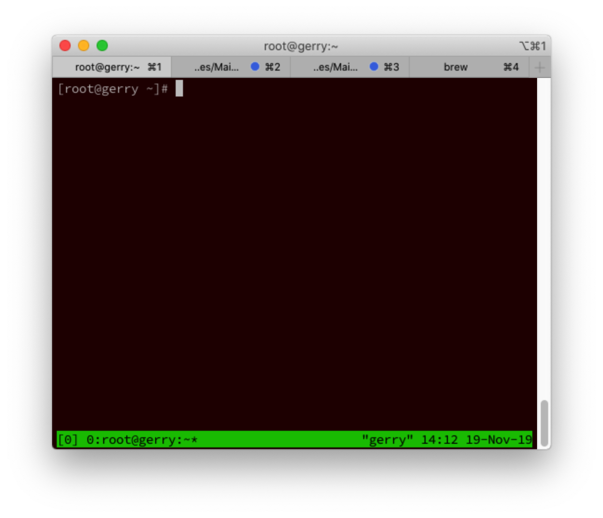

<!-- @import "[TOC]" {cmd="toc" depthFrom=1 depthTo=6 orderedList=false} -->

<!-- code_chunk_output -->

- [1. Tmux 是什么](#1-tmux-是什么)
  - [1.1. 会话与进程](#11-会话与进程)
  - [1.2. Tmux 的作用](#12-tmux-的作用)
- [2. 基本用法](#2-基本用法)
  - [2.1. 安装](#21-安装)
  - [2.2. 启动与退出](#22-启动与退出)
  - [2.3. 前缀键](#23-前缀键)
- [3. 会话管理](#3-会话管理)
  - [3.1. 新建会话](#31-新建会话)
  - [3.2. 分离会话](#32-分离会话)
  - [3.3. 查看会话](#33-查看会话)
  - [3.4. 接入会话](#34-接入会话)
  - [3.5. 杀死会话](#35-杀死会话)
  - [3.6. 切换会话](#36-切换会话)
  - [3.7. 重命名会话](#37-重命名会话)
  - [3.8. 会话快捷键](#38-会话快捷键)
- [4. 最简操作流程](#4-最简操作流程)
- [5. 窗格操作](#5-窗格操作)
  - [5.1. 划分窗格](#51-划分窗格)
  - [5.2. 移动光标](#52-移动光标)
  - [5.3. 交换窗格位置](#53-交换窗格位置)
  - [5.4. 窗格快捷键](#54-窗格快捷键)
- [6. 窗口管理](#6-窗口管理)
  - [6.1. 新建窗口](#61-新建窗口)
  - [6.2. 切换窗口](#62-切换窗口)
  - [6.3. 重命名窗口](#63-重命名窗口)
  - [6.4. 窗口快捷键](#64-窗口快捷键)
- [7. 其他命令](#7-其他命令)
- [8. 插件管理系统](#8-插件管理系统)
  - [8.1. 下载和安装](#81-下载和安装)
  - [8.2. 初始化](#82-初始化)
  - [8.3. 安装、升级和卸载插件](#83-安装-升级和卸载插件)
  - [8.4. tmux-resurrect](#84-tmux-resurrect)
    - [8.4.1. 安装](#841-安装)
    - [8.4.2. 使用](#842-使用)
  - [8.5. Tmux Continuum](#85-tmux-continuum)
- [9. 参考](#9-参考)

<!-- /code_chunk_output -->

# 1. Tmux 是什么

## 1.1. 会话与进程

命令行的典型使用方式是, 打开一个终端窗口(terminal window, 以下简称"窗口"), 在里面输入命令. 用户与计算机的这种临时的交互, 称为一次 "会话"(session) .

会话的一个重要特点是, **窗口**与**其中启动的进程**是**连在一起**的.

* 打开窗口, 会话开始;
* 关闭窗口, 会话结束, 会话内部的进程也会随之终止, 不管有没有运行完.

一个典型的例子就是, SSH 登录远程计算机, 打开一个远程窗口执行命令. 这时, 网络突然断线, 再次登录的时候, 是找不回上一次执行的命令的. 因为上一次 SSH 会话已经终止了, 里面的进程也随之消失了.

为了解决这个问题, **会话**与**窗口**可以"**解绑**": 窗口关闭时, 会话并不终止, 而是继续运行, 等到以后需要的时候, 再让会话"绑定"其他窗口.

## 1.2. Tmux 的作用

Tmux 就是会话与窗口的"解绑"工具, 将它们彻底分离.

(1)它允许在**单个窗口**中, 同时访问**多个会话**. 这对于同时运行多个命令行程序很有用.

(2) 它可以让**新窗口**"接入"**已经存在的会话**.

(3)它允许**每个会话**有**多个连接窗口**, 因此可以多人**实时共享会话**.

(4)它还支持**窗口任意的垂直和水平拆分**.

类似的终端复用器还有 **GNU Screen**. Tmux 与它功能相似, 但是更易用, 也更强大.

# 2. 基本用法

## 2.1. 安装

Tmux 一般需要自己安装.

```
# Ubuntu 或 Debian
$ sudo apt-get install tmux

# CentOS 或 Fedora
$ sudo yum install tmux

# Mac
$ brew install tmux
```

## 2.2. 启动与退出

安装完成后, 键入 tmux 命令, 就进入了 Tmux 窗口.

```
$ tmux
```

上面命令会启动 Tmux 窗口, **底部有一个状态栏**.

状态栏的**左侧**是**窗口信息**(编号和名称), **右侧**是**系统信息**.



按下 Ctrl+d 或者显式输入 exit 命令, 就可以退出 Tmux 窗口.

## 2.3. 前缀键

Tmux 窗口有大量的快捷键. 所有快捷键都要通过前缀键唤起. **默认的前缀键**是**Ctrl+b**, 即先按下 Ctrl+b, 快捷键才会生效.

举例来说, 帮助命令的快捷键是 Ctrl+b ?. 它的用法是, 在 Tmux 窗口中, 先按下 Ctrl+b, 再按下?, 就会显示帮助信息.

然后, 按下 ESC 键或 q 键, 就可以退出帮助.

注: 很多将其改为 `Ctrl+a`

# 3. 会话管理

## 3.1. 新建会话

第一个启动的 Tmux 窗口, 编号是 0, 第二个窗口的编号是 1, 以此类推. 这些窗口对应的会话, 就是 0 号会话、1 号会话.

使用编号区分会话, 不太直观, 更好的方法是为会话起名.

```
$ tmux new -s <session-name>
```

上面命令新建一个指定名称的会话.

## 3.2. 分离会话

在 Tmux 窗口中, 按下 Ctrl+b d 或者输入 tmux detach 命令, 就会将当前会话与窗口分离.

```
$ tmux detach
```

上面命令执行后, 就会退出当前 Tmux 窗口, 但是会话和里面的进程仍然在后台运行.

## 3.3. 查看会话

tmux ls 命令可以查看当前所有的 Tmux 会话.

```
$ tmux ls
# or
$ tmux list-session
```

## 3.4. 接入会话

tmux attach 命令用于重新接入某个已存在的会话.

```
# 使用会话编号
$ tmux attach -t 0

# 使用会话名称
$ tmux attach -t <session-name>
```

## 3.5. 杀死会话

tmux kill-session 命令用于杀死某个会话.

```
# 使用会话编号
$ tmux kill-session -t 0

# 使用会话名称
$ tmux kill-session -t <session-name>
```

## 3.6. 切换会话

tmux switch 命令用于切换会话.

```
# 使用会话编号
$ tmux switch -t 0

# 使用会话名称
$ tmux switch -t <session-name>
```

## 3.7. 重命名会话
tmux rename-session 命令用于重命名会话.

```
$ tmux rename-session -t 0 <new-name>
```

上面命令将 0 号会话重命名.

## 3.8. 会话快捷键

下面是一些会话相关的快捷键.

```
Ctrl+b d: 分离当前会话.
Ctrl+b s: 列出所有会话.
Ctrl+b $: 重命名当前会话.
```

# 4. 最简操作流程

综上所述, 以下是 Tmux 的最简操作流程.

1. 新建会话 tmux new -s my_session.
2. 在 Tmux 窗口运行所需的程序.
3. 按下快捷键 Ctrl+b d 将会话分离.
4. 下次使用时, 重新连接到会话 tmux attach-session -t my_session.

# 5. 窗格操作

Tmux 可以将窗口分成多个窗格(pane), 每个窗格运行不同的命令.

以下命令都是在 **Tmux 窗口**中执行.

## 5.1. 划分窗格

tmux split-window 命令用来划分窗格.

```
# 划分上下两个窗格
$ tmux split-window

# 划分左右两个窗格
$ tmux split-window -h
```

## 5.2. 移动光标

tmux select\-pane 命令用来移动光标位置.

```
# 光标切换到上方窗格
$ tmux select-pane -U

# 光标切换到下方窗格
$ tmux select-pane -D

# 光标切换到左边窗格
$ tmux select-pane -L

# 光标切换到右边窗格
$ tmux select-pane -R
```

## 5.3. 交换窗格位置

tmux swap\-pane 命令用来交换窗格位置.

```
# 当前窗格上移
$ tmux swap-pane -U

# 当前窗格下移
$ tmux swap-pane -D
```

## 5.4. 窗格快捷键

下面是一些窗格操作的快捷键.

```
Ctrl+b %: 划分左右两个窗格.
Ctrl+b ": 划分上下两个窗格.
Ctrl+b <arrow key>: 光标切换到其他窗格. <arrow key>是指向要切换到的窗格的方向键, 比如切换到下方窗格, 就按方向键↓.
Ctrl+b ;: 光标切换到上一个窗格.
Ctrl+b o: 光标切换到下一个窗格.
Ctrl+b {: 当前窗格左移.
Ctrl+b }: 当前窗格右移.
Ctrl+b Ctrl+o: 当前窗格上移.
Ctrl+b Alt+o: 当前窗格下移.
Ctrl+b x: 关闭当前窗格.
Ctrl+b !: 将当前窗格拆分为一个独立窗口.
Ctrl+b z: 当前窗格全屏显示, 再使用一次会变回原来大小.
Ctrl+b Ctrl+<arrow key>: 按箭头方向调整窗格大小.
Ctrl+b q: 显示窗格编号.
```

# 6. 窗口管理

除了将一个窗口划分成多个窗格, Tmux 也允许新建多个窗口.

## 6.1. 新建窗口

tmux new\-window 命令用来创建新窗口.

```
$ tmux new-window

# 新建一个指定名称的窗口
$ tmux new-window -n <window-name>
```

## 6.2. 切换窗口

tmux select\-window 命令用来切换窗口.

```
# 切换到指定编号的窗口
$ tmux select-window -t <window-number>

# 切换到指定名称的窗口
$ tmux select-window -t <window-name>
```

## 6.3. 重命名窗口

tmux rename\-window 命令用于为当前窗口起名(或重命名).

```
$ tmux rename-window <new-name>
```

## 6.4. 窗口快捷键

下面是一些窗口操作的快捷键.

```
Ctrl+b c: 创建一个新窗口, 状态栏会显示多个窗口的信息.
Ctrl+b p: 切换到上一个窗口(按照状态栏上的顺序).
Ctrl+b n: 切换到下一个窗口.
Ctrl+b <number>: 切换到指定编号的窗口, 其中的<number>是状态栏上的窗口编号.
Ctrl+b w: 从列表中选择窗口.
Ctrl+b ,: 窗口重命名.
```

# 7. 其他命令
下面是一些其他命令.

```
# 列出所有快捷键, 及其对应的 Tmux 命令
$ tmux list-keys

# 列出所有 Tmux 命令及其参数
$ tmux list-commands

# 列出当前所有 Tmux 会话的信息
$ tmux info

# 重新加载当前的 Tmux 配置
$ tmux source-file ~/.tmux.conf
```

# 8. 插件管理系统

Tmux 也有一个插件管理系统, 名字就叫做 `Tmux Plugin Manager`.

详细使用参照: https://github.com/tmux-plugins/tpm

## 8.1. 下载和安装

`Tmux Plugin Manager`托管在 GitHub 上, 地址: https://github.com/tmux-plugins/tpm .

下载:

```
git clone https://github.com/tmux-plugins/tpm ~/.tmux/plugins/tpm
```

在 Tmux 配置文件`~/.tmux.conf`底部加上:

```
# List of plugins
set -g @plugin 'tmux-plugins/tpm'
set -g @plugin 'tmux-plugins/tmux-sensible'

# Other examples:
# set -g @plugin 'github_username/plugin_name'
# set -g @plugin 'git@github.com/user/plugin'
# set -g @plugin 'git@bitbucket.com/user/plugin'

# Initialize TMUX plugin manager (keep this line at the very bottom of tmux.conf)
run '~/.tmux/plugins/tpm/tpm'
```

注: 注意, 最后的 `run '~/.tmux/plugins/tpm/tpm'` 一定要放在整个 `~/.tmux.conf` 的最后一行.


如果你尚未启动 Tmux, 那么现在就可以执行 `tmux new -s foobar` 打开一个新的窗口了. 如果你已经启动了 Tmux, 那么需要在 Tmux 环境里重新加载配置文件:

```
tmux source ~/.tmux.conf
```

## 8.2. 初始化

在默认的配置中, 我们已经添加了两个插件: tpm 和 tmux-sensible.

* tpm 是 Tmux Plugin Manager 本身;
* tmux-sensible 在 tmux 的 session 窗口之间切换, `前缀键+g`

然而, tpm 本身是已经通过 git clone 命令下载到本地了, `tmux-sensible` 却没有. 所以, 我们这里需要通过 `prefix shift-i` 来安装它. `prefix shift-i` 中, i 是 install 的缩写. 执行它会根据配置文件中的插件列表, 安装所有插件.

如果你的环境里命令执行正常, 那么 Tmux 会提示:

```
Already installed "tpm"
Installing "tmux-sensible"
  "tmux-sensible" download success

TMUX environment reloaded.

Done, press ESCAPE to continue.
```

可以查看

```
# ll ~/.tmux/plugins/
total 0
drwxr-xr-x 3 root root 116 Dec 10 11:52 tmux-sensible
drwxr-xr-x 9 root root 264 Dec 10 11:25 tpm
```

## 8.3. 安装、升级和卸载插件

添加插件内容`set -g @plugin '...'`在配置文件`~/.tmux.conf`

在 Tmux Plugin Manager 中安装、升级和反安装插件都很简单, 他们的 Tmux 快捷键分别是:

```
prefix shift-i      # install
prefix shift-u      # update
prefix alt-u        # uninstall plugins not on the plugin list
```

安装后会在`~/.tmux/plugins/`目录下存在

## 8.4. tmux-resurrect

Tmux 一个缺点, Tmux 会话无法在系统重启之后比较容易地恢复.

`tmux-resurrect` 插件也是托管在 Github 上, https://github.com/tmux-plugins/tmux-resurrect .

### 8.4.1. 安装

方法一:

修改`~/.tmux.conf`, 在插件列表加上:

```
set -g @plugin 'tmux-plugins/tmux-resurrect'
```

在执行 `prefix shift-i` 的时候, Tmux Plugin Manager 就会到 GitHub 上的相应位置寻找相应插件并下载安装.

方法二:

把代码克隆到目录(随意):

```
git clone https://github.com/tmux-plugins/tmux-resurrect ~/.tmux/plugins/tmux-resurrect
```

在自己的 tmux 配置文件 `~/.tmux.conf` 里, 加上这一行:

```
run-shell ~/.tmux/plugins/tmux-resurrect/resurrect.tmux
```

最后载入新配置:

```
tmux source-file ~/.tmux.conf
```

### 8.4.2. 使用

快捷键是:

```
prefix Ctrl-s       # save tmux session to local file
prefix Ctrl-r       # reload tmux session from local file
```

## 8.5. Tmux Continuum

Tmux Resurrect 工作很好, 只是备份和还原都是手动完成. 而 Tmux Resurrect 是将 Tmux 会话的保存及还原自动化, 定时备份, 在 Tmux 启动时还原.

类似处理

```
git clone https://github.com/tmux-plugins/tmux-continuum.git ~/.tmux/plugins/tmux-continuum
```

添加配置

```
run-shell ~/.tmux/plugins/tmux-continuum/continuum.tmux
```

Tmux Continuum 默认每隔 15 分钟备份一次, 如果你觉得频率过高, 可以设置为 1 小时一次

```
set -g @continuum-save-interval '60'
```

需要重载 Tmux 配置 `tmux source-file ~/.tmux.conf`.

# 9. 参考

* 阮一峰分享: https://www.ruanyifeng.com/blog/2019/10/tmux.html
* [A Quick and Easy Guide to tmux](https://www.hamvocke.com/blog/a-quick-and-easy-guide-to-tmux/)
* [Tactical tmux: The 10 Most Important Commands](https://danielmiessler.com/study/tmux/)
* [Getting started with Tmux](https://linuxize.com/post/getting-started-with-tmux/)