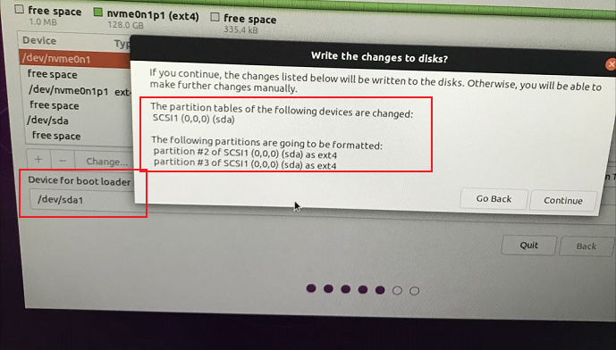
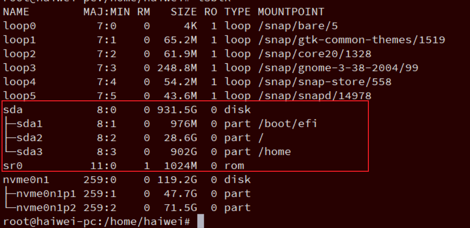

<!-- @import "[TOC]" {cmd="toc" depthFrom=1 depthTo=6 orderedList=false} -->

<!-- code_chunk_output -->

- [1. 分区方案](#1-分区方案)
- [2. 虚拟机](#2-虚拟机)
- [3. grub 修改](#3-grub-修改)
- [4. 磁盘扩容](#4-磁盘扩容)
- [5. 网络代理](#5-网络代理)
- [6. 重要配置](#6-重要配置)
- [7. 软件卸载](#7-软件卸载)
- [8. 网络](#8-网络)
- [9. 时区时间](#9-时区时间)

<!-- /code_chunk_output -->

# 1. 分区方案

https://www.jianshu.com/p/fe4e3915495e

建议: 先创建 **EFI 系统分区**, 再创建 `/` **根分区**, 最后是 `/home` 或其他数据分区, 这样

* **缩小 home 分区**时候, 不会影响启动
* **扩大 home 分区**时候, 不会影响启动

> 如果是直接使用 root 用户, 那就可以最后创建 `/` 分区;
> 
> 强烈建议保留 home 分区或者其他数据分区, 这样重装不会影响数据

分区方案:

1. 新建 EFI 系统分区, 选中 "逻辑分区(或主分区)" 和 "空间起始位置", 给 512MB. 重点！分配完之后去上边的列表里找一下, 刚刚这个分区的盘符一会儿会用到哦

> 我分配了 1G, /dev/sda1, 作用类似于 /boot 分区

2. swap 交换空间, 这个也就是虚拟内存的地方, 选择"逻辑分区"和"空间起始位置". 其大小最好和你的物理内存相等.

> 我没分配

3. 挂载"/", 类型为"EXT4 日志文件系统", 选中"主分区"和"空间起始位置". 这个空间可以理解成共用空间, 尽量大一些, 因为有些软件是无法更改他的安装位置到自己的个人目录下的, 只能放在这个空间里边.

> 如果 root 用户没有特殊容量要求, 可以 30G, 如果盘容量足够, 直接 50G

4. 挂载"/home", 类型为"EXT4 日志文件系统", 选中"逻辑分区"和"空间起始位置", 这个相当于你的个人文件夹, 类似 Windows 里的 User, 建议最好能分配稍微大点, 因为你的图片、视频、下载内容、有些自定义的软件安装路径基本都在这里面, 这些东西可不像在 Win 上面你想移动就能移动的.

> 其他的空间, 一定要创建, 防止数据有问题

5. nvme 盘

> 我格式化为 ext4, 既可以当数据盘, 又可以测试 vfio 等功能

6. 不要 boot 分区了

> /boot : 启动分区, 系统的启动文件, 大小一般分 200M

> efi 逻辑分区作用相当于/boot 分区

如果经常重装系统, 也可以单独建立 boot 挂载点

7. 安装引导启动器的设备, 一定要选择刚才 EFI 分区的盘符

> 这里是 /dev/sda1

最终配置如下:





如果很少使用 root 用户, 那么建议 `/` 分区最少 `20G`, 以便后续重装系统或其他使用

很多坑见: https://zhuanlan.zhihu.com/p/90746103

# 2. 虚拟机

系统盘 和 数据盘 一定要分开

系统盘 30G 以上, 两个分区即可: `/boot/efi`(先创建这个) 和 `/`, 以后还很方便扩容 `/`

数据盘 50G 起步

```
sda      8:0    0    30G  0 disk
├─sda1   8:1    0   487M  0 part /boot/efi
└─sda2   8:2    0  29.5G  0 part /
sdb      8:16   0    50G  0 disk
└─sdb1   8:17   0    50G  0 part /data
```

# 3. grub 修改

修改 `/etc/default/grub`

```
GRUB_DEFAULT="0> 4"
#GRUB_DEFAULT="Advanced options for Ubuntu>Ubuntu, with Linux 5.4"
GRUB_TIMEOUT_STYLE=menu
GRUB_TIMEOUT=10
GRUB_DISTRIBUTOR=`lsb_release -i -s 2> /dev/null || echo Debian`
GRUB_CMDLINE_LINUX_DEFAULT="quiet splash"
GRUB_CMDLINE_LINUX=""
```

然后更新 grub

```
update-grub
```

# 4. 磁盘扩容

见 `Virtualization\Tools\MyVm.md`

# 5. 网络代理

https://blog.csdn.net/kan2016/article/details/90411137

其实在终端配置代理就可行了, 即通过 export 能解决大多数

# 6. 重要配置

* `~/.bashrc`
* `~/.gitconfig`
* `~/XXrc`, 自定义代理配置

>export http_proxy=http://XXX.com:port
>export https_proxy=$http_proxy
>export ftp_proxy=
>export socks_proxy='http://XXX.com:port'
>export no_proxy='XXX.com,.XXX.com,localhost,127.0.0.1,10.0.0.0/8,192.168.0.0/16,172.16.0.0/12'

* `~/.ssh/config`,
* `~/.tmux.conf` 和 `~/.tmux/*`
* `~/.cargo/config`

# 7. 软件卸载

通过 `dpkg --list | grep -i XXX` 查找相关 package, 好处在于可以查找 description 中的信息

然后通过 `apt remove XXX && sudo apt autoremove` 卸载

或者使用系统的 "Ubuntu Software" 来卸载

# 8. 网络

有两套网络管理软件: server 版对应 netplan, desktop 版对应 NetworkManager. 可能因此 netplan 的默认 renderer 仍然没有改成 NetworkManager.

全部让通过 NetworkManager 管理

```
# sudo apt install netplan.io
# sudo apt install network-manager
```

```
$ cat /etc/netplan/01-network-manager-all.yaml
# Let NetworkManager manage all devices on this system
network:
  version: 2
  renderer: NetworkManager
  ethernets:
    ens33:
      dhcp4: true
```

`netplan apply`

https://blog.csdn.net/liyilong2000/article/details/113705942

systemctl status NetworkManager

# 9. 时区时间

data -R

`tzselect` 选择时区

cp /usr/share/zoneinfo/Asia/Shanghai  /etc/localtime

data -R 再次查看

修改时间

```
sudo date -s MM/DD/YY //修改日期
sudo date -s hh:mm:ss //修改时间
```

在修改时间以后, 修改硬件 CMOS 的时间

```
sudo hwclock --systohc //非常重要, 如果没有这一步的话, 后面时间还是不准
```