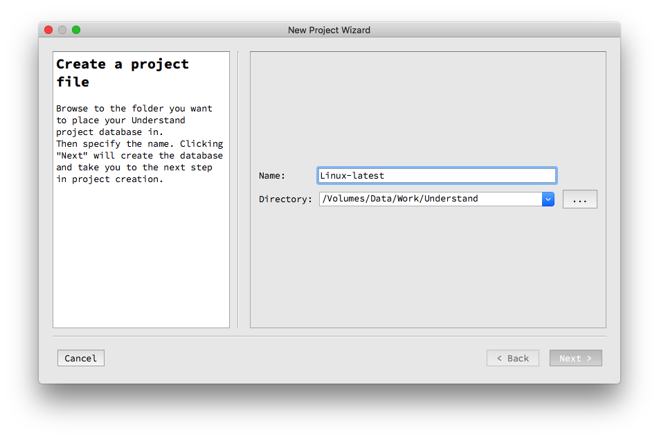
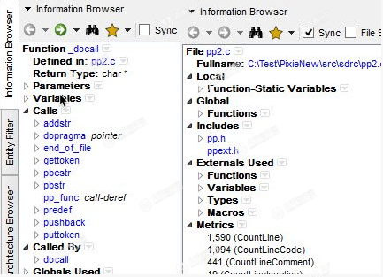
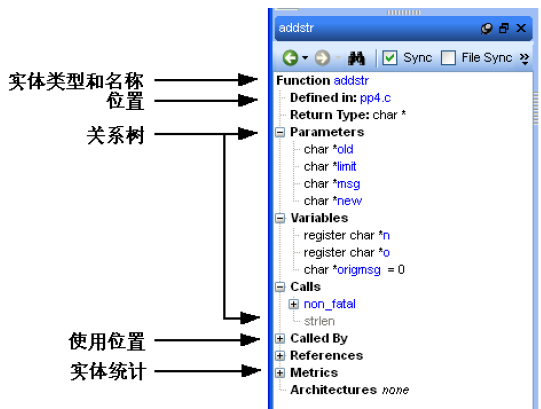

<!-- @import "[TOC]" {cmd="toc" depthFrom=1 depthTo=6 orderedList=false} -->

<!-- code_chunk_output -->

- [1. 设置](#1-设置)
- [2. 导入项目](#2-导入项目)
- [3. 主要功能](#3-主要功能)
  - [3.1. 代码知识](#31-代码知识)
  - [3.2. 指标和报告](#32-指标和报告)
  - [3.3. 制图](#33-制图)
  - [3.4. 标准测试](#34-标准测试)
  - [3.5. 依赖性分析](#35-依赖性分析)
  - [3.6. 编辑](#36-编辑)
  - [3.7. 搜索](#37-搜索)
  - [3.8. 语言](#38-语言)
- [4. 搜索功能](#4-搜索功能)
- [5. 项目视图](#5-项目视图)
  - [5.1. 层级关系视图分类](#51-层级关系视图分类)
  - [5.2. 结构关系视图分类](#52-结构关系视图分类)
- [6. 术语 Terminology](#6-术语-terminology)
  - [6.1. Architecture 层级:](#61-architecture-层级)
  - [6.2. Database 数据库](#62-database-数据库)
  - [6.3. Entity 实体](#63-entity-实体)
  - [6.4. Project 工程](#64-project-工程)
  - [6.5. Relationship 关联](#65-relationship-关联)
  - [6.6. Script 脚本](#66-script-脚本)
  - [6.7. parts 部件](#67-parts-部件)
- [7. 常用词汇](#7-常用词汇)
- [8. 右键菜单](#8-右键菜单)
- [9. Project Configuration](#9-project-configuration)
- [10. Entity Filter 窗口](#10-entity-filter-窗口)
- [11. 信息浏览器](#11-信息浏览器)
- [12. 引用查看](#12-引用查看)
- [13. 工程浏览器](#13-工程浏览器)
- [14. 上下文信息边栏](#14-上下文信息边栏)
- [15. Structure Browser](#15-structure-browser)
- [16. 大小写修改](#16-大小写修改)
- [17. 层级结构浏览器](#17-层级结构浏览器)

<!-- /code_chunk_output -->

# 1. 设置

1. 设置字体和颜色风格

修改默认字体: Preference  ->  Editor  ->  Default style 

>"SourceCodePro Nerd Font Mono" 13

修改颜色: Preference  ->  Editor  ->  Styles

>Predefined 选为"onyx"

Preference  ->  General  ->  Application Font

>"SourceCodePro Nerd Font Mono" 12

Preference  ->  User Interface  ->  Command Window Font

>"SourceCodePro Nerd Font Mono" 10

2. 

# 2. 导入项目

1. new  ->  project, 输入项目名称(linux\-latest), understand 的项目数据库(之前的目录)

2. 语言选择

Assembly、C/C\+\+、Python、Web

注: 其中 Strict 模式包含 Object-C 和 Object—C\+\+, 还有 Web 的注释

3. 导入文件和设置, 这里选第一个

4. 添加目录和文件, 这里添加目录

5. 代码分析

有两个选项, 一个是立即分析代码, 一个选择配置, 对于我们来说只需要默认即可, 然后点击 OK 按钮, 此时软件开始分析代码

# 3. 主要功能

## 3.1. 代码知识

理解为您提供有关您的代码的相关信息. 快速查看关于函数, 类, 变量等的所有信息, 如何使用, 调用, 修改和交互. 轻松查看您想要了解代码的呼叫树, 指标, 参考信息和任何其他信息. 

## 3.2. 指标和报告

理解非常有效地收集有关代码的度量标准并为您提供不同的查看方式. 当我们没有完全满足您的需求时, 可以快速获得大量标准指标以及编写您自己的自定义指标的选项. 

## 3.3. 制图

了解提供图表, 使您可以查看代码连接(依赖关系), 流程如何(控制流程图), 使用哪些函数调用其他函数(调用图表)等等. 有许多自定义选项可轻松让您仅显示您感兴趣的内容, 因此该图最适合您的需求. 

## 3.4. 标准测试

理解提供了一种使用已发布的编码标准或您自己的自定义标准来检查代码的方法. 这些检查可用于验证命名准则, 度量标准要求, 已发布的最佳做法或对您的团队而言重要的任何其他规则或约定. 

## 3.5. 依赖性分析

查看代码中的所有依赖关系以及它们如何连接. 使用 Understanding 的交互式图形或使用文本依赖浏览器查看这些依赖关系. 两者都可以让您快速轻松地查看所有依赖关系, 或者深入了解详细信息. 

## 3.6. 编辑

## 3.7. 搜索

在"理解"中搜索有多个选项. 要获得即时结果, 请使用我们的"即时搜索"功能, 该功能可在打字完成之前提供结果. 了解还提供更多自定义和复杂搜索的搜索选项, 例如正则表达式和通配符搜索. 

## 3.8. 语言

了解支持十几种语言, 并且可以处理以多种语言编写的代码库. 这允许您查看语言之间的调用和依赖关系, 以便您可以获取有关完整系统的信息. 

# 4. 搜索功能

1. 搜索文件: 在这个搜索中你可以快速搜索你要查看的文件, 

快捷键, 鼠标点击左侧上面项目结构窗口, 然后按 command + F 键会出现如下图所示的搜索框, 在框中输入你想要的类回车即可

2. 在打开的文件中搜索: 将鼠标定位到右侧代码中, 点击 command + F, 会弹出搜索框, 输入方法回车即可: 

3. 全局搜索: 快捷键 F5 或者去上面菜单栏中的 search 栏中查找

4. 实体搜索: 菜单栏的 find entity, 根据结构体、方法等搜索

# 5. 项目视图

项目视图包含很多的功能, 能够自动生成各种流程图结构图, 帮助你快速理清代码逻辑、结构等, 以便快速理解项目流程, 快速开发.

视图查看方式有两种, 

一种是鼠标点击你要查看的类或者方法等上面, 然后右键弹出菜单, 鼠标移动到 Graphical Views, 然后弹出二级菜单, 如下图所示: 

另一种方式是点击要查看的类或者方法, 然后找到代码上面菜单栏中的如下图标: 

然后点击图标右下角的下拉箭头, 弹出如下菜单, 即可选择查看相关视图: 

## 5.1. 层级关系视图分类

1. Butterfly: 如果两个实体间存在关系, 就显示这两个实体间的调用和被调用关系; 

如下图为 Activity 中的一个方法的关系图: 

2. Calls: 展示从你选择的这个方法开始的整个调用链条; 

3. Called By: 展示了这个实体被哪些代码调用, 这个结构图是从底部向上看或者从右到左看; 

4. Calls Relationship/Calledby Relationship:展示了两个实体之间的调用和被调用关系, 操作方法: 首先右键你要选择的第一个实体, 然后点击另一个你要选择的实体, 如果选择错误, 可以再次点击其他正确即可, 然后点击 ok; 

5. Contains:展示一个实体中的层级图, 也可以是一个文件, 一条连接线读作"x includes y"; 

6. Extended By:展示这个类被哪些类所继承, 

7. Extends:展示这个类继承自那个类: 

## 5.2. 结构关系视图分类

1.Graph Architecture: 展示一个框架节点的结构关系; 

2.Declaration:展示一个实体的结构关系, 例如: 展示参数, 则返回类型和被调用函数, 对于类, 则展示私有成员变量(谁继承这个类, 谁基于这个类)

3.Parent Declaration:展示这个实体在哪里被声明了的结构关系; 

4.Declaration File:展示所选的文件中所有被定义的实体(例如函数, 类型, 变量, 常量等); 

5.Declaration Type:展示组成类型; 

6.Class Declaration:展示定义类和父类的成员变量; 

7.Data Members:展示类或者方法的组成, 或者包含的类型; 

8.Control Flow:展示一个实体的控制流程图或者类似实体类型; 

9.Cluster Control Flow:展示一个实体的流程图或者类似实体类型, 这个比上一个更具有交互性; 

10.UML Class Diagram:展示这个项目中或者一个文件中定义的类以及与这个类关联的类

11.UML Sequence Diagram:展示两个实体之间的时序关系图; 

12.Package:展示给定包名中声明的所有实体

13.Task:展示一个任务中的参数, 调用, 实体

14.Rename Declaration:展示实体中被重命名的所有实体

由于视图比较多, 所以就一一贴上代码, 主要还是需要自己去调试, 查看各个功能视图的展示结构以及作用, 孰能生巧, 多操作几下就会了, 所以不再做过多的解释. 最终希望这款软件能够帮助你快速开发, 快速阅读别人的或者自己的代码. 

# 6. 术语 Terminology

## 6.1. Architecture 层级:

An architecture is a hierarchical aggregation of source code units (entities). An architecture can be user created or automatically generated. Architectures need not be complete (that is, an architecture's flattened expansion need not reference every source entity in the database), nor unique (that is, an architecture's flattened expansion need not maintain the set property).

层级表示代码单元(或者实体)组成的层次结构, 可以由用户手动创建, 也可由本软件自动生成. 一个层级可以不完整(例如一个层级的扁平化扩展有可能不会关联数据库中的所有代码实体), 也可能不唯一(扁平化扩展的层级可能不会处理其预设属性). 

## 6.2. Database 数据库

The database is where the results of the source code analysis, as well as project settings, are stored. By default, this is a project's ".udb" file.

代码经分析后产生的中间结果, 以及工程设置保存在数据库, 其缺省扩展名为".udb". 

## 6.3. Entity 实体

An Understand "entity" is anything it has information about. In practice this means anything declared or used in your source code and the files that contain the project. Subroutines, variables, and source files are all examples of entities.

Understand 描述的"实体"表示任何包含信息的事物, 具体来说, 代码中声明或 
者使用的标识、包含工程的文件、子程序、变量、源文件都可以被称为实体. 

## 6.4. Project 工程

The set of source code you have analyzed and the settings and parameters chosen. A "project file" contains the list of source files and the project settings.

表示源代码的集合以及相关的配置和参数, 工程文件包含源文件清单和工程设置. 

## 6.5. Relationship 关联

A particular way that entities relate to one another. The names of relationships come from the syntax and semantics of a programming language. For instance, subroutine entities can have "Call" relationships and "CalledBy" relationships.

互作用的实体之间的关系, 关联的名称来源于编程语言的语法和语义, 例如过程式实体具有"调用"和"被调用"的关联对象. 

## 6.6. Script 脚本

Generally a Perl script. These can be run from within Understand's GUI, or externally via the "uperl" command. The Understand Perl API provides easy and direct access to all information stored in an Understand database.
通常指 perl 脚本, 脚本可以通过 Understand 2.5 的图形用户界面或者外部的脚本命令执行. Understand Perl API 提供了快捷的访问 Understand 数据库所有信息的接口. 

## 6.7. parts 部件

下面的图形展示了一些 Understand 图形用户界面(GUI) 中常用的部件:

# 7. 常用词汇

# 8. 右键菜单

代码编辑窗口的右键菜单提供了很多浏览编辑操作的快捷方式, 也提供了相关实体的特定信息. 

以下介绍了右键菜单包含的典型的浏览操作(与点击对象有关): 

View Information 信息查看(参见信息浏览器)

Graphic Views 图形视图(参见)

Edit Source/Definition 代码编辑(参见)

User Tools 用户工具(参见)

Explore 浏览(参见层级查看)

Find In... 查找(参见多文件查找)

Add Favorite 添加到收藏夹(参见收藏夹)

Metrics Chart 度量图表(参见)

以下介绍了右键菜单包含的典型的编辑操作(与点击对象有关): 

Undo/Redo 撤销/重做

Cut/Copy/Past 剪切/复制/粘贴(参见文本选择和拷贝)

Select All 全选(参见文本选择和拷贝)

Jump to Marching Brace 跳到块末

Select Block 块选择

Hide/Show Inactive Lines 行显示/隐藏

Fold All 折叠所有分支

Soft Wrap 软包装

Comment Selection/Uncomment Selection 注释选择/代码选择

Change Case 大小写切换

Revert 反转

Add Bookmark 添加书签活动

# 9. Project Configuration

使用菜单栏 Project\>Configure Project, 选择 C\+\+可以打开如下窗口. 

C\+\+\>Option 配置页面包括如下区域: 

Compiler:  

选择当前工程使用的编译器或者平台, 编译器相关的宏定义根据选择自动设置. 需要注意的是, 编译器的某些特性有可能没有得到很好的支持. 

Compiler Include Paths:  

输入编译器使用的头文件的所在路径, 如\%include\%. 

Allow nested comments: >>默认情况下, 该选项禁止. 打开的状态下, Understand 允许 C 语言的注释符(/**/)可以嵌套使用(这种风格被 ANSI 禁止, 但是有一些编译器支持). 

Prepend the names of externally linkable entities with:  

使用一个随意的字符串作为工程中其他语言编写的代码中定义的实体的前缀. 

Append the names of externally linkable entities with:  

使用一个随意的字符串作为工程中其他语言编写的代码中定义的实体的后缀. 

Create implicit special member functions:  

源代码没有类和结构实体的相关语句时, Understand 数据库自动创建默认构造函数, 析构函数和隐式声明引用, 从而为分析时提供相关的引用实体. 该选项默认禁止. 

Create references in inactive code:  

如果希望将条件编译控制的非激活代码排除在外, 需要取消该选项, 默认选中. 

Create references to local objects:  

默认情况下, Understand 数据库包含所有局部对象, 如果希望不包含函数中声明的变量需要取消该选项. Understand 2.5 的主窗口可以选择是否需要在 HTML 报告中包含局部对象. 

Create references to macros during macro expansion:  

选中情况下, 数据库保存宏解析时的引用关系. 有时候, 该选择有用. 注意, 该选项选中导致数据库增加很多引用关系, 会变得很慢. 默认关闭. 

Create references to parameters:  

关闭该选项取消参数的引用关系, 默认开启. 

Save comments associated with entities:  

此选项控制代码实体前后注释与实体的关联. 

Save duplicate references:  

默认情况下, 引用关系只在数据库保存一份, 选中该选项, 会记录重复的引用关系. 

Save macro expansion text:  

选中该选项的情况下, 可以在选中宏的右键菜单下选择 Expanded Macro Text 来查看宏定义值. 

Use Include cache:  

由于头文件通常被多个源文件使用, 默认情况下, 分析阶段头文件都采用高速缓存, 这样能够加速分析过程, 但是需要更多的内存, 如果分析过程碰到内存问题, 可以将此选项关闭. 同时需要注意的是, 高速缓存的使用会影响到分析结果. 

# 10. Entity Filter 窗口

根过滤器

Root Calls:  

仅显示调用而不被调用的实体, 如上层代码(mains), 硬件调用的代码(中断处理函数)以及哑(不被使用)代码. 

Root CallBys:  

仅显示只被调用而不调用其他实体的实体, 即最底层的函数. 

Root IncludeBys:  

仅显示被其他文件包含的文件, 即基础头文件. 

Root Classes:  

仅显示不依赖于其他类的类, 包括底层类和库类. 

Root Decls:  

仅显示最高层的声明过程(Ada). 

Root Withs:  

仅显示被其他单元使用, 而不使用其他单元的程序单元(包括包, 任务, 子程序等)(Ada). 

# 11. 信息浏览器

信息浏览器同步

取消 Sync 勾选可以打开多个信息浏览器窗口, Sync 勾选的情况下, 选中一个实体或者选择 View Information 则会更新当前信息浏览器. 

选中 File Sync 可以保证信息浏览器内容始终与激活的代码编辑器保持同步. 

# 12. 引用查看

信息浏览器的"References"区域显示了所有引用选中实体的相关信息: 

# 13. 工程浏览器

# 14. 上下文信息边栏

显示当前激活的编辑窗口的结构和信息, 标签页包含了以下信息: 

# 15. Structure Browser

提供当前文件的扩展范围列表, 列出了文件中函数, 头文件包含, 宏定义, 类及其他各种结构的名称. 名称旁边的图标指示了实体类型. 将鼠标移动到一个条目, 弹出显示实体类型和名称的活动文本框. 使用 Ctrl+F 可以在标签页范围内进行查找. 

File Information 

提供当前文件的信息浏览器. 

Scope Information 

显示 Structure Browser 中选中实体的相关信息. 

Context Browser 

在左侧显示当前实体在层级结构中的位置, 右侧显示当前实体包含的其他实体. 文件信息标签页右上角的图标(或者使用 Ctrl+,)可以将编辑窗口和 CIS 中的文件替换为同目录下同名但不同扩展名的文件. 例如, 使用这种方法可以在.p/.cpp 和.h 文件之间快速切换. 

右键菜单也提供了多种快捷的操作选择. 

# 16. 大小写修改

Understand 2.5 代码编辑器支持选中文本进行快速的大小写修改, 方法如下: 

1. 选中代码中的一个或者多个单词. 
2. 通过菜单栏 Edit\>Change Case, 或者右键菜单中选择 Change Case. 
3. 选择需要使用的大小写修改方式, 选项包括:  

# 17. 层级结构浏览器

层级结构节点(如文件系统目录节点和本季度修改节点)的右键菜单包含了以下一些其他对象的右键菜单没有提供的额外选项: 

Graphical Views>Dependency Graphs:  显示层级结构各节点的依赖关系, 参见. 

Metrics Summary: 提供选中节点各实体的度量数据, 这些度量数据基于当前节点下的实体, 不包括子节点中的实体, 参见. 

Metrics Export: 将度量总结导出到一个 CSV 文件, 参见. 

XML Export: 将层级结构中选中节点及子节点包含的实体以 XML 格式导出, 参见. 

Edit Architecutre: 为用户自己创建的层级结构打开一个层级结构构建器, Understand 
自动构建的层级结构不能被修改, 参见. 

Rename Architecture: 为用户自己创建的层级结构或者节点打开一个层级结构重命名窗口供用户对其中名称进行修改, Understand 2.5 自动构建的层级结构不能被重命名, 参见. 

Duplicate Architecture: 打开层级结构复制窗口对选中层级结构的副本进行命名, 参见. 

Manage Architecture: 打开层级结构管理窗口, 参见. 

