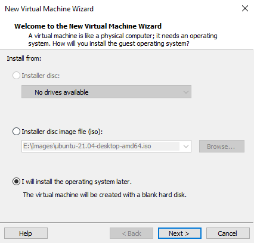
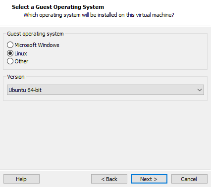
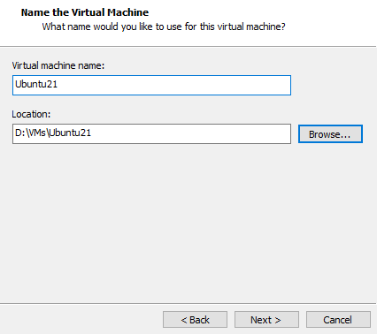
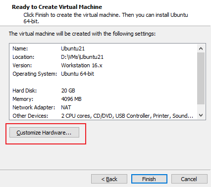
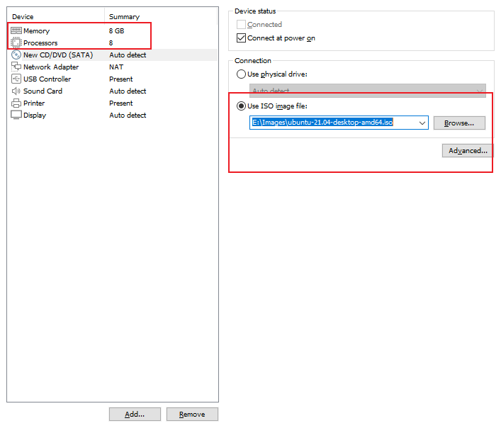
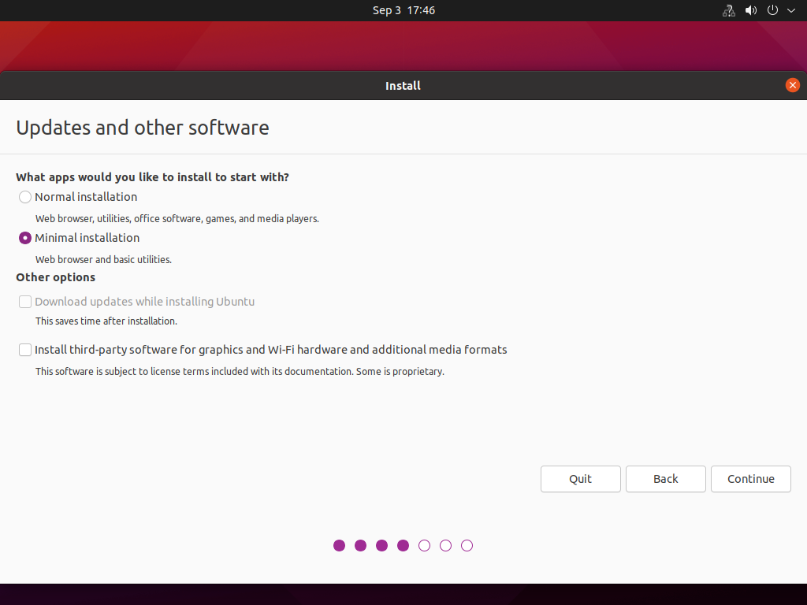
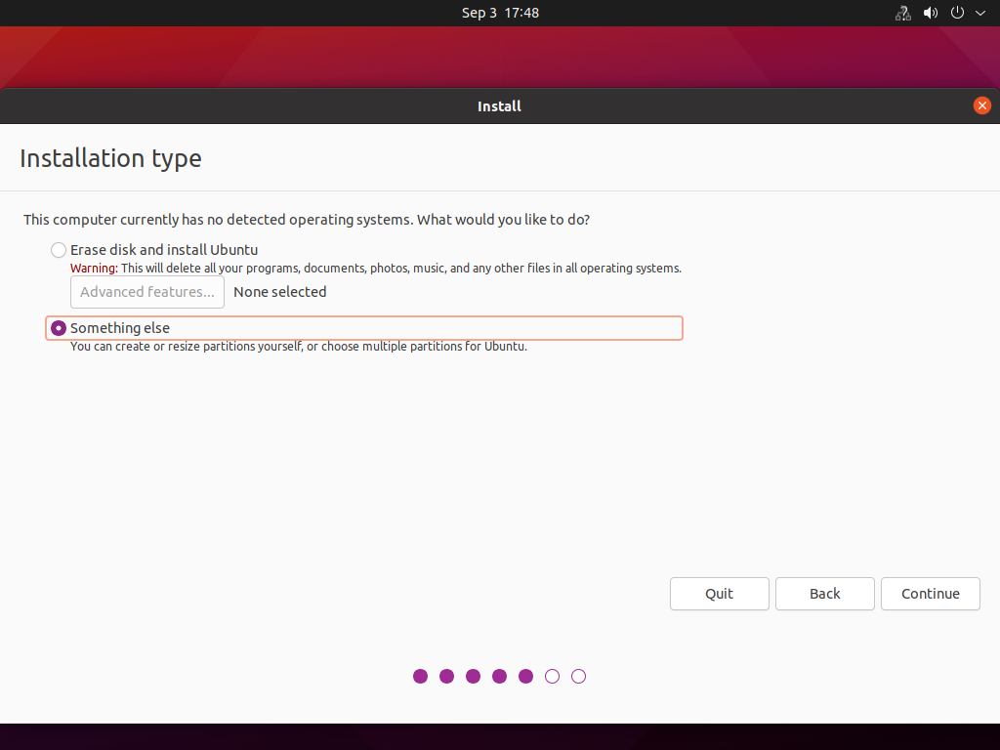
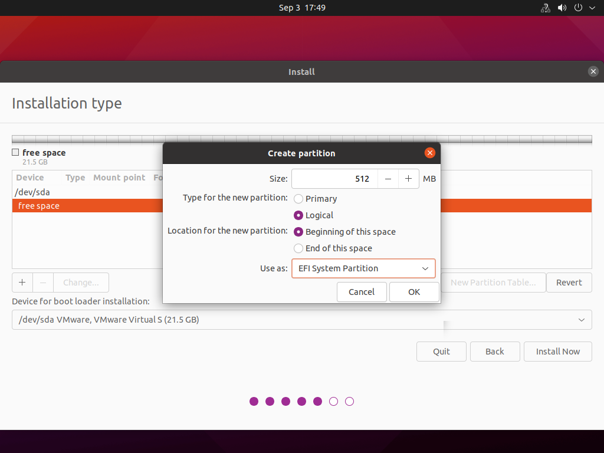
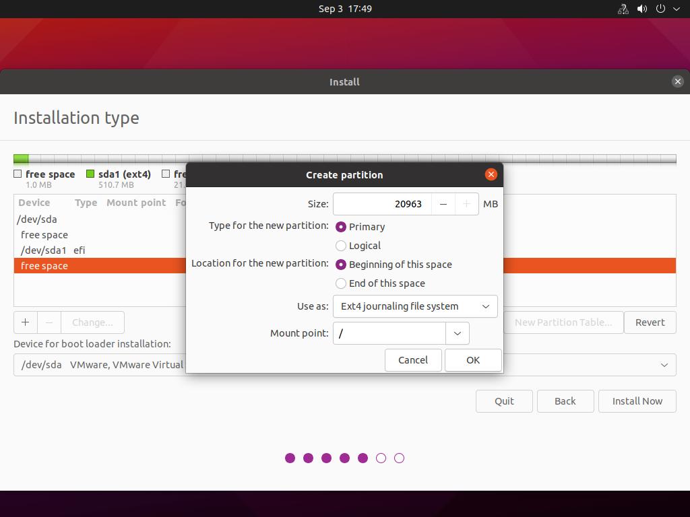
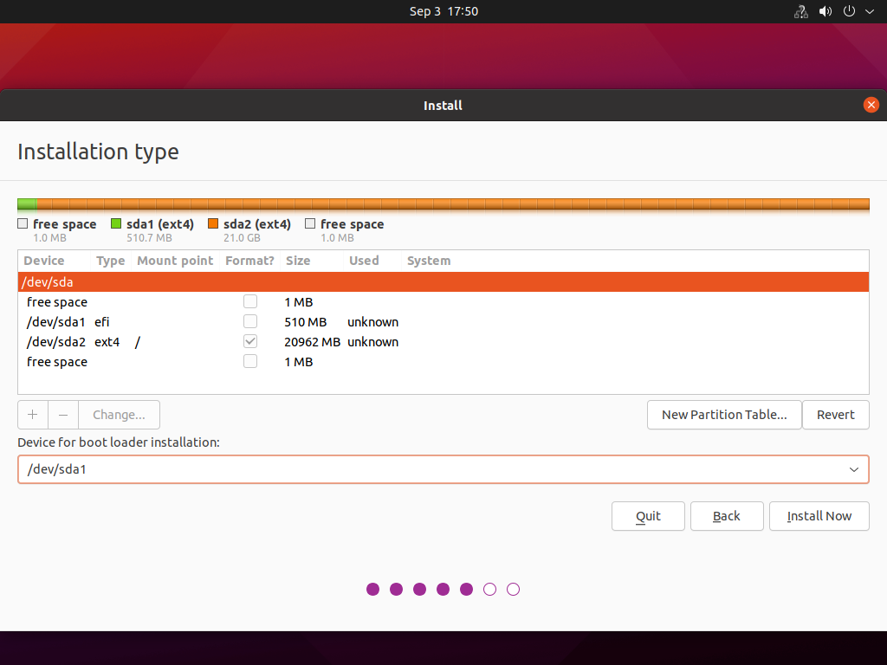

系统盘和数据盘分开, 且系统盘必要时进行备份

# 安装系统盘

创建新的虚拟机


手动安装系统







系统盘只需要 20G 即可, 使用单个磁盘, 便于备份和拷贝




第一次安装配置给高点, 这样安装就会快很多.



设置 UEFI 启动, 尽量从 VMware 上面设置. 如果 VMware 上没有这个设置, 在虚拟机工作目录下找到 `.vmx` 格式文件, 在文件中添加

```
firmware = "efi"
```

在 VMware Player 中启用 UEFI 模式: https://vvl.me/2018/03/use-uefi-in-vmware-player/

开发环境, 所以选择 mini 安装





因为是 EFI 启动, 所以 创建 EFI 系统分区, 逻辑分区, 空间从头开始



剩余空间全部给根分区即可, 主分区, 空间从头开始



boot loader 安装位置一定要选择刚才的 EFI 系统分区



注意, 如果这里提示让安装 /boot 分区, 那参考上面的链接再配置 UEFI 启动

# 安装数据盘

推荐方式有两种:

* 使用 lvm 方式, 以便后续扩容. 具体见 `修改磁盘空间.md`

* 使用磁盘, 但是只建立一个分区, 后续可以扩容该磁盘, 同时扩容那个分区. 具体见 `Virtualization/Tools/MyVm.md`

我这里使用了第二种方法

# 设置代理

在 ~ 下面创建, 动态选择 source

# 键盘输入设置

ubuntu 中启用 page up/down 进行补全功能: https://blog.csdn.net/jingtaohuang/article/details/109628105

`/etc/inputrc` 中这两行取消注释

```
# alternate mappings for "page up" and "page down" to search the history
"\e[5~": history-search-backward
"\e[6~": history-search-forward
```

# 设置 grub

防止内核出错, 打开 menu 选项以及超时

```
# vim /etc/default/grub
// 选择的内核
GRUB_DEFAULT="Advanced options for Ubuntu>Ubuntu, with Linux 6.3.0-dirty"
// 打开菜单
GRUB_TIMEOUT_STYLE=menu
// 超时 10s
GRUB_TIMEOUT=10
GRUB_DISTRIBUTOR=`lsb_release -i -s 2> /dev/null || echo Debian`
GRUB_CMDLINE_LINUX_DEFAULT="quiet splash"
GRUB_CMDLINE_LINUX=""

# update-grub
```

ubuntu 修改默认启动内核: https://cdmana.com/2021/03/20210328153654881n.html