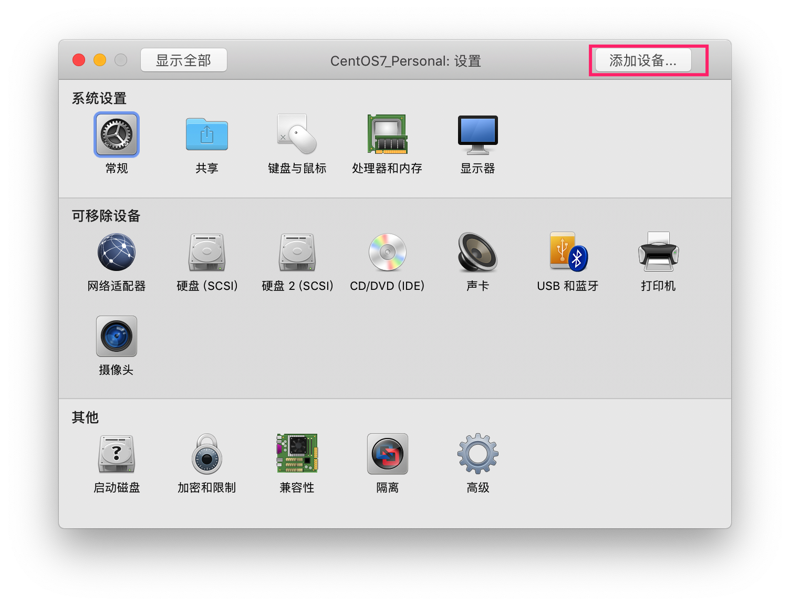
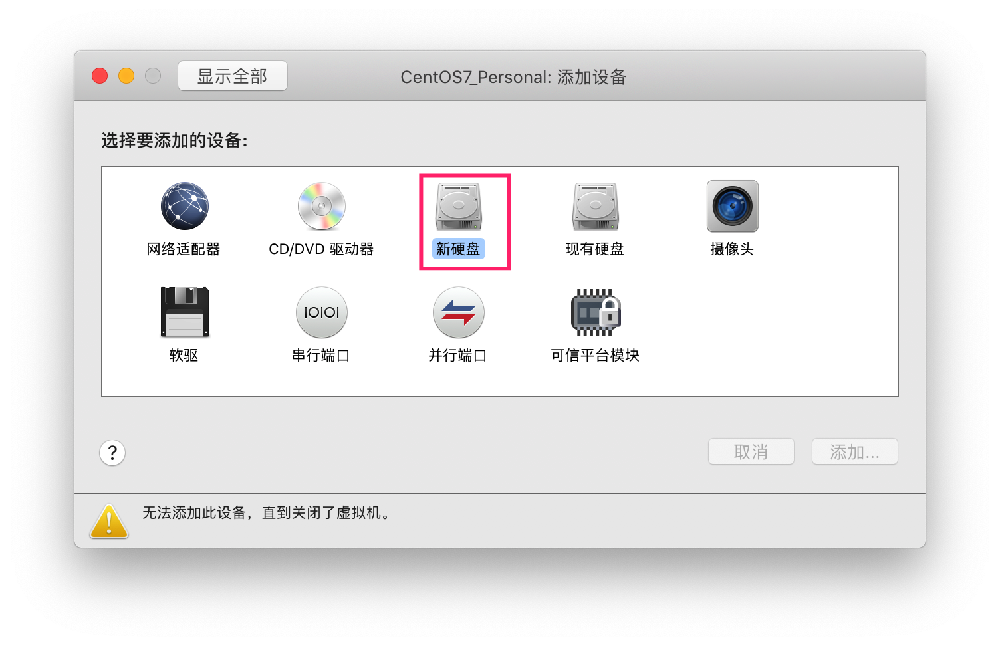

<!-- @import "[TOC]" {cmd="toc" depthFrom=1 depthTo=6 orderedList=false} -->

<!-- code_chunk_output -->

- [1. 现状](#1-现状)
  - [1.1. 当前系统情况](#11-当前系统情况)
  - [1.2. 系统设备信息](#12-系统设备信息)
  - [1.3. 系统 LVM 信息](#13-系统-lvm-信息)
- [2. 方式一: 增加磁盘数](#2-方式一-增加磁盘数)
  - [2.1. VMware Fusion 设置](#21-vmware-fusion-设置)
  - [2.2. CentOS 虚拟机设置](#22-centos-虚拟机设置)
    - [2.2.1. 添加新的挂载点](#221-添加新的挂载点)
      - [2.2.1.1. 设置自动挂载](#2211-设置自动挂载)
    - [2.2.2. 扩大 LV: 仅使用于用了 LVM 的根分区](#222-扩大-lv-仅使用于用了-lvm-的根分区)
      - [2.2.2.1. 磁盘分区](#2221-磁盘分区)
      - [2.2.2.2. 格式化新分区为 ext4 文件系统](#2222-格式化新分区为-ext4-文件系统)
      - [2.2.2.3. 创建 PV](#2223-创建-pv)
      - [2.2.2.4. 扩展卷组](#2224-扩展卷组)
      - [2.2.2.5. 扩容空间到 root 下](#2225-扩容空间到-root-下)
      - [2.2.2.6. 扩大未挂载文件系统](#2226-扩大未挂载文件系统)
- [3. 方式二: 增加当前磁盘大小](#3-方式二-增加当前磁盘大小)
  - [3.1. VMware Fusion 设置](#31-vmware-fusion-设置)
  - [3.2. CentOS 虚拟机设置](#32-centos-虚拟机设置)
- [4. 参考](#4-参考)

<!-- /code_chunk_output -->
# 1. 现状

## 1.1. 当前系统情况

查看当前系统正在使用的磁盘以及挂载点

```
# fdisk -l
磁盘 /dev/sda: 53.7 GB, 53687091200 字节, 104857600 个扇区
Units = 扇区 of 1 * 512 = 512 bytes
扇区大小(逻辑/物理): 512 字节 / 512 字节
I/O 大小(最小/最佳): 512 字节 / 512 字节
磁盘标签类型: gpt
Disk identifier: E548BE10-0098-4851-A617-C93F292271F6


#         Start          End    Size  Type            Name
 1         2048       411647    200M  EFI System      EFI System Partition
 2       411648     21383167     10G  Microsoft basic
 3     21383168    104855551   39.8G  Linux LVM

磁盘 /dev/mapper/centos-root: 62.1 GB, 62058921984 字节, 121208832 个扇区
Units = 扇区 of 1 * 512 = 512 bytes
扇区大小(逻辑/物理): 512 字节 / 512 字节
I/O 大小(最小/最佳): 512 字节 / 512 字节


磁盘 /dev/mapper/centos-swap: 2147 MB, 2147483648 字节, 4194304 个扇区
Units = 扇区 of 1 * 512 = 512 bytes
扇区大小(逻辑/物理): 512 字节 / 512 字节
I/O 大小(最小/最佳): 512 字节 / 512 字节
```

```
# df -h
文件系统                 容量  已用  可用 已用% 挂载点
/dev/mapper/centos-root   38G   34G  4.1G   90% /
devtmpfs                 893M     0  893M    0% /dev
tmpfs                    910M     0  910M    0% /dev/shm
tmpfs                    910M   11M  899M    2% /run
tmpfs                    910M     0  910M    0% /sys/fs/cgroup
/dev/sda2                 10G  218M  9.8G    3% /boot
/dev/sda1                200M   12M  189M    6% /boot/efi
tmpfs                    182M  4.0K  182M    1% /run/user/42
tmpfs                    182M   28K  182M    1% /run/user/0
```

根分区容量不够了

## 1.2. 系统设备信息

```
# lsblk
NAME            MAJ:MIN RM  SIZE RO TYPE MOUNTPOINT
sda               8:0    0   50G  0 disk
├─sda1            8:1    0  200M  0 part /boot/efi
├─sda2            8:2    0   10G  0 part /boot
└─sda3            8:3    0 39.8G  0 part
  ├─centos-root 253:0    0 37.8G  0 lvm  /
  └─centos-swap 253:1    0    2G  0 lvm  [SWAP]
sr0              11:0    1 1024M  0 rom
```

显然, sda1、sda2、sdb3、centos\-root、centos\-swap 都是 sda 分出来的分区

## 1.3. 系统 LVM 信息

```
# pvs
  PV         VG     Fmt  Attr PSize  PFree
  /dev/sda3  centos lvm2 a--  39.80g 4.00m
# pvdisplay
  --- Physical volume ---
  PV Name               /dev/sda3
  VG Name               centos
  PV Size               39.80 GiB / not usable 2.00 MiB
  Allocatable           yes
  PE Size               4.00 MiB
  Total PE              10189
  Free PE               1
  Allocated PE          10188
  PV UUID               XjIX0W-DgVi-sG34-8bcM-YhIX-sIXc-hB0UW1

# vgs
  VG     #PV #LV #SN Attr   VSize  VFree
  centos   1   2   0 wz--n- 39.80g 4.00m
# vgdisplay
  --- Volume group ---
  VG Name               centos
  System ID
  Format                lvm2
  Metadata Areas        1
  Metadata Sequence No  3
  VG Access             read/write
  VG Status             resizable
  MAX LV                0
  Cur LV                2
  Open LV               2
  Max PV                0
  Cur PV                1
  Act PV                1
  VG Size               39.80 GiB
  PE Size               4.00 MiB
  Total PE              10189
  Alloc PE / Size       10188 / <39.80 GiB
  Free  PE / Size       1 / 4.00 MiB
  VG UUID               qeJ63E-4HtZ-ti1z-SHA0-wZSB-9BL9-o5yXvJ

# lvs
  LV   VG     Attr       LSize   Pool Origin Data%  Meta%  Move Log Cpy%Sync Convert
  root centos -wi-ao---- <37.80g
  swap centos -wi-ao----   2.00g
# lvdisplay
  --- Logical volume ---
  LV Path                /dev/centos/root
  LV Name                root
  VG Name                centos
  LV UUID                aN7JXG-kZue-7Gds-LO8g-dyw3-s2zD-YBVv2I
  LV Write Access        read/write
  LV Creation host, time localhost, 2019-08-13 17:36:12 +0800
  LV Status              available
  # open                 1
  LV Size                <37.80 GiB
  Current LE             9676
  Segments               1
  Allocation             inherit
  Read ahead sectors     auto
  - currently set to     8192
  Block device           253:0

  --- Logical volume ---
  LV Path                /dev/centos/swap
  LV Name                swap
  VG Name                centos
  LV UUID                MRi9C1-PzeG-aB6n-4z45-DjZD-mZuU-jfX8SY
  LV Write Access        read/write
  LV Creation host, time localhost, 2019-08-13 17:36:12 +0800
  LV Status              available
  # open                 2
  LV Size                2.00 GiB
  Current LE             512
  Segments               1
  Allocation             inherit
  Read ahead sectors     auto
  - currently set to     8192
  Block device           253:1
```

两种方式

# 2. 方式一: 增加磁盘数

## 2.1. VMware Fusion 设置

关闭虚拟机后, 增加磁盘

"虚拟机" "设置" "添加设备" "新硬盘"





设置好需要添加的硬盘信息, 点击【应用】添加磁盘.

至此, VMware Fusion 设置完成

## 2.2. CentOS 虚拟机设置

查看系统磁盘使用情况

```
# df -h
文件系统                 容量  已用  可用 已用% 挂载点
/dev/mapper/centos-root   38G   34G  4.1G   90% /
devtmpfs                 893M     0  893M    0% /dev
tmpfs                    910M     0  910M    0% /dev/shm
tmpfs                    910M   11M  900M    2% /run
tmpfs                    910M     0  910M    0% /sys/fs/cgroup
/dev/sda2                 10G  218M  9.8G    3% /boot
/dev/sda1                200M   12M  189M    6% /boot/efi
tmpfs                    182M   12K  182M    1% /run/user/42
tmpfs                    182M     0  182M    0% /run/user/0
```

查看设备信息

```
# lsblk
NAME            MAJ:MIN RM  SIZE RO TYPE MOUNTPOINT
sda               8:0    0   50G  0 disk
├─sda1            8:1    0  200M  0 part /boot/efi
├─sda2            8:2    0   10G  0 part /boot
└─sda3            8:3    0 39.8G  0 part
  ├─centos-root 253:0    0 37.8G  0 lvm  /
  └─centos-swap 253:1    0    2G  0 lvm  [SWAP]
sdb               8:16   0   20G  0 disk
sr0              11:0    1 1024M  0 rom
```

显然, sda1、sda2、sdb3、centos\-root、centos\-swap 都是 sda 分出来的分区, 而 sdb 就是刚创建的磁盘, 它有 20G 的空间

同样有**两种方式扩容**

* 增加一个新的挂载点
* 针对使用 LVM 的分区, 可以扩大 LV

### 2.2.1. 添加新的挂载点

初始化磁盘为 linux 系统文件. 注意: 你的 linux 文件系统是什么格式. 我的是 ext4

```
mkfs -t ext4 /dev/sdb
```

初始化文件系统完成后, 切换到根分支 新建文件夹 newdisk,命令如下

```
mkdir newdisk
```

将初始化的磁盘挂载到 newdisk 下, 命令如下.

```
mount /dev/sdb /newdisk
```

如果没有任何提示, 则表明成功了. (linux 系统相信, 没有消息就是好消息)

执行如下命令查看系统挂载情况

```
# df -h
文件系统                 容量  已用  可用 已用% 挂载点
/dev/mapper/centos-root   38G   34G  4.1G   90% /
devtmpfs                 893M     0  893M    0% /dev
tmpfs                    910M     0  910M    0% /dev/shm
tmpfs                    910M   11M  900M    2% /run
tmpfs                    910M     0  910M    0% /sys/fs/cgroup
/dev/sda2                 10G  218M  9.8G    3% /boot
/dev/sda1                200M   12M  189M    6% /boot/efi
/dev/sdb                  20G   37M 19.4G    1% /newdisk
tmpfs                    182M   12K  182M    1% /run/user/42
tmpfs                    182M     0  182M    0% /run/user/0
```

很明显 sdb 这个磁盘已经挂载到系统了, 我们可以正常使用它了. 但是如果重启系统, 需要重新挂载才能使用. 那么最好我们设置一个自动挂载.

#### 2.2.1.1. 设置自动挂载

编辑 /etc/fstab 文件, 在最下方添加如下一条记录, 后保存文件

```
/dev/sdb /newdisk auto defaults,nofail,comment=cloudconfig      0  2
```

执行自动挂载命令

```
mount -a
```

### 2.2.2. 扩大 LV: 仅使用于用了 LVM 的根分区

因为根分区使用了 LVM 技术, 所以可以通过增加 PV 容量来扩容根分区

#### 2.2.2.1. 磁盘分区

先将新磁盘分区, 这里分一个就可以

使用 Linux 的 fdisk 分区工具给磁盘/dev/sdb 分区, 更可以根据提示输入 m 查看帮助信息, 再输入 n(表示增加分区), 回车后输入 p(创建主分区), 回车后 partition number 输入 1, 回车会提示输入分区的 start 值, end 值. 都默认即可(即当前能使用的所有空间), 回车后输入 w 进行保存, 分区划分完毕(增加了 20G 空间).

并更改新分区类型为 Linux LVM 类型.

```
# fdisk /dev/sdb
欢迎使用 fdisk (util-linux 2.23.2).

更改将停留在内存中, 直到您决定将更改写入磁盘.
使用写入命令前请三思.

Device does not contain a recognized partition table
使用磁盘标识符 0x84ce2f97 创建新的 DOS 磁盘标签.

命令(输入 m 获取帮助): p

磁盘 /dev/sdb: 21.5 GB, 21474836480 字节, 41943040 个扇区
Units = 扇区 of 1 * 512 = 512 bytes
扇区大小(逻辑/物理): 512 字节 / 512 字节
I/O 大小(最小/最佳): 512 字节 / 512 字节
磁盘标签类型: dos
磁盘标识符: 0x84ce2f97

   设备 Boot      Start         End      Blocks   Id  System

命令(输入 m 获取帮助): n
Partition type:
   p   primary (0 primary, 0 extended, 4 free)
   e   extended
Select (default p): p
分区号 (1-4, 默认 1):
起始 扇区 (2048-41943039, 默认为 2048):
将使用默认值 2048
Last 扇区, +扇区 or +size{K,M,G} (2048-41943039, 默认为 41943039):
将使用默认值 41943039
分区 1 已设置为 Linux 类型, 大小设为 20 GiB

命令(输入 m 获取帮助): t
已选择分区 1
Hex 代码(输入 L 列出所有代码): L

 0  空              24  NEC DOS         81  Minix / 旧 Linu bf  Solaris
 1  FAT12           27  隐藏的 NTFS Win 82  Linux 交换 / So c1  DRDOS/sec (FAT-
 2  XENIX root      39  Plan 9          83  Linux           c4  DRDOS/sec (FAT-
 3  XENIX usr       3c  PartitionMagic  84  OS/2 隐藏的 C:  c6  DRDOS/sec (FAT-
 4  FAT16 <32M      40  Venix 80286     85  Linux 扩展      c7  Syrinx
 5  扩展            41  PPC PReP Boot   86  NTFS 卷集       da  非文件系统数据
 6  FAT16           42  SFS             87  NTFS 卷集       db  CP/M / CTOS / .
 7  HPFS/NTFS/exFAT 4d  QNX4.x          88  Linux 纯文本    de  Dell 工具
 8  AIX             4e  QNX4.x 第 2 部分  8e  Linux LVM       df  BootIt
 9  AIX 可启动      4f  QNX4.x 第 3 部分  93  Amoeba          e1  DOS 访问
 a  OS/2 启动管理器 50  OnTrack DM      94  Amoeba BBT      e3  DOS R/O
 b  W95 FAT32       51  OnTrack DM6 Aux 9f  BSD/OS          e4  SpeedStor
 c  W95 FAT32 (LBA) 52  CP/M            a0  IBM Thinkpad 休 eb  BeOS fs
 e  W95 FAT16 (LBA) 53  OnTrack DM6 Aux a5  FreeBSD         ee  GPT
 f  W95 扩展 (LBA)  54  OnTrackDM6      a6  OpenBSD         ef  EFI (FAT-12/16/
10  OPUS            55  EZ-Drive        a7  NeXTSTEP        f0  Linux/PA-RISC
11  隐藏的 FAT12    56  Golden Bow      a8  Darwin UFS      f1  SpeedStor
12  Compaq 诊断     5c  Priam Edisk     a9  NetBSD          f4  SpeedStor
14  隐藏的 FAT16 <3 61  SpeedStor       ab  Darwin 启动     f2  DOS 次要
16  隐藏的 FAT16    63  GNU HURD or Sys af  HFS / HFS+      fb  VMware VMFS
17  隐藏的 HPFS/NTF 64  Novell Netware  b7  BSDI fs         fc  VMware VMKCORE
18  AST 智能睡眠    65  Novell Netware  b8  BSDI swap       fd  Linux raid 自动
1b  隐藏的 W95 FAT3 70  DiskSecure 多启 bb  Boot Wizard 隐  fe  LANstep
1c  隐藏的 W95 FAT3 75  PC/IX           be  Solaris 启动    ff  BBT
1e  隐藏的 W95 FAT1 80  旧 Minix
Hex 代码(输入 L 列出所有代码): 8e
已将分区"Linux"的类型更改为"Linux LVM"

命令(输入 m 获取帮助): p

磁盘 /dev/sdb: 21.5 GB, 21474836480 字节, 41943040 个扇区
Units = 扇区 of 1 * 512 = 512 bytes
扇区大小(逻辑/物理): 512 字节 / 512 字节
I/O 大小(最小/最佳): 512 字节 / 512 字节
磁盘标签类型: dos
磁盘标识符: 0x84ce2f97

   设备 Boot      Start         End      Blocks   Id  System
/dev/sdb1            2048    41943039    20970496   8e  Linux LVM

命令(输入 m 获取帮助): w
The partition table has been altered!

Calling ioctl() to re-read partition table.
正在同步磁盘.
```

重启 Linux

#### 2.2.2.2. 格式化新分区为 ext4 文件系统

想要使用该分区, 必须先格式化分区为文件系统

输入命令 `fdisk -l` 查看磁盘分区情况

```
# fdisk -l
磁盘 /dev/sdb: 21.5 GB, 21474836480 字节, 41943040 个扇区
Units = 扇区 of 1 * 512 = 512 bytes
扇区大小(逻辑/物理): 512 字节 / 512 字节
I/O 大小(最小/最佳): 512 字节 / 512 字节
磁盘标签类型: dos
磁盘标识符: 0x84ce2f97

   设备 Boot      Start         End      Blocks   Id  System
/dev/sdb1            2048    41943039    20970496   8e  Linux LVM
```

可以看到分区类型确实是 LVM.

格式化为 ext4 文件系统.

```
# mkfs.ext4 /dev/sdb1
mke2fs 1.42.9 (28-Dec-2013)
文件系统标签=
OS type: Linux
块大小=4096 (log=2)
分块大小=4096 (log=2)
Stride=0 blocks, Stripe width=0 blocks
1310720 inodes, 5242624 blocks
262131 blocks (5.00%) reserved for the super user
第一个数据块=0
Maximum filesystem blocks=2153775104
160 block groups
32768 blocks per group, 32768 fragments per group
8192 inodes per group
Superblock backups stored on blocks:
	32768, 98304, 163840, 229376, 294912, 819200, 884736, 1605632, 2654208,
	4096000

Allocating group tables: 完成
正在写入 inode 表: 完成
Creating journal (32768 blocks): 完成
Writing superblocks and filesystem accounting information: 完成
```

#### 2.2.2.3. 创建 PV

格式化后, 创建 PV, 将物理硬盘分区初始化为物理卷

首先用用命令`pvdisplay`查看当前的物理卷. 显然并没有/dev/sdb1

```
# pvs
  PV         VG     Fmt  Attr PSize  PFree
  /dev/sda3  centos lvm2 a--  39.80g 4.00
# pvdisplay
  --- Physical volume ---
  PV Name               /dev/sda3
  VG Name               centos
  PV Size               39.80 GiB / not usable 2.00 MiB
  Allocatable           yes
  PE Size               4.00 MiB
  Total PE              10189
  Free PE               1
  Allocated PE          10188
  PV UUID               XjIX0W-DgVi-sG34-8bcM-YhIX-sIXc-hB0UW1
```

然后用 pvcreate 指令用于将物理硬盘分区初始化为物理卷, 以便被 LVM 使用.

要创建物理卷必须首先对硬盘进行分区, 并且将硬盘分区的类型设置为"Linux LVM"后, 才能使用 pvcreat 指令将分区初始化为物理卷. 执行命令 pvcreate /dev/sda4

```
# pvcreate /dev/sdb1
WARNING: ext4 signature detected on /dev/sdb1 at offset 1080. Wipe it? [y/n]: y
  Wiping ext4 signature on /dev/sdb1.
  Physical volume "/dev/sdb1" successfully created.
```

创建完后, 我们可以再用 pvdisplay 查看到新创建的物理卷.

```
# pvs
  PV         VG     Fmt  Attr PSize   PFree
  /dev/sda3  centos lvm2 a--   39.80g   4.00m
  /dev/sdb1         lvm2 ---  <20.00g <20.00g

# pvdisplay
  --- Physical volume ---
  PV Name               /dev/sda3
  VG Name               centos
  PV Size               39.80 GiB / not usable 2.00 MiB
  Allocatable           yes
  PE Size               4.00 MiB
  Total PE              10189
  Free PE               1
  Allocated PE          10188
  PV UUID               XjIX0W-DgVi-sG34-8bcM-YhIX-sIXc-hB0UW1

  "/dev/sdb1" is a new physical volume of "<20.00 GiB"
  --- NEW Physical volume ---
  PV Name               /dev/sdb1
  VG Name
  PV Size               <20.00 GiB
  Allocatable           NO
  PE Size               0
  Total PE              0
  Free PE               0
  Allocated PE          0
  PV UUID               qKXaUB-65vd-nUsu-sm0L-QBl6-yVKd-OvlRw8
```

很明显, 提示/dev/sdb1 是新的物理卷

可以看到老的物理卷是有 VG Name 的, 而新的物理卷(也就是 sdb1)没有, 这里的 VG 是 centos, 记住这个, 后面要用到.

#### 2.2.2.4. 扩展卷组

要扩展 VG 需要知道当前 lvm 组名, 也就是我们上面要记下来的 VG Name 可以通过命令 vgdisplay 查看.

通过命令 `vgextend centos /dev/sdb1` 动态的扩展卷组, 它通过向卷组中添加物理卷来增加卷组的容量.

再次执行命令 vgdisplay 再次查看, 容量已经添加进去.

```
# vgextend centos /dev/sdb1
  Volume group "centos" successfully extended
# vgdisplay
  --- Volume group ---
  VG Name               centos
  System ID
  Format                lvm2
  Metadata Areas        2
  Metadata Sequence No  4
  VG Access             read/write

▽
  VG Status             resizable
  MAX LV                0
  Cur LV                2
  Open LV               2
  Max PV                0
  Cur PV                2
  Act PV                2
  VG Size               <59.80 GiB
  PE Size               4.00 MiB
  Total PE              15308
  Alloc PE / Size       10188 / <39.80 GiB
  Free  PE / Size       5120 / 20.00 GiB    # 容量变化
  VG UUID               qeJ63E-4HtZ-ti1z-SHA0-wZSB-9BL9-o5yXvJ

# vgs
  VG     #PV #LV #SN Attr   VSize   VFree
  centos   2   2   0 wz--n- <59.80g 20.00g
```

#### 2.2.2.5. 扩容空间到 root 下

查看需要扩容的路径, 执行命令`fdisk -l`命令或`lvdisplay`, 就可以发现, 原来 lv(root 对应 lv)的路径是 /dev/mapper/centos\-root, 那么之后的扩容路径就为/dev/centos/root

执行命令 `lvextend -L +20G /dev/centos/root`扩展空间到 root 下

```
# lvextend -L +20G /dev/centos/root
  Size of logical volume centos/root changed from <37.80 GiB (9676 extents) to <57.80 GiB (14796 extents).
  Logical volume centos/root successfully resized.

# lvs
  LV   VG     Attr       LSize   Pool Origin Data%  Meta%  Move Log Cpy%Sync Convert
  root centos -wi-ao---- <57.80g
  swap centos -wi-ao----   2.00g
```

然后通过`df -h`查看, root 空间还是没变

```
# df -h
文件系统                 容量  已用  可用 已用% 挂载点
/dev/mapper/centos-root   38G   34G  4.1G   90% /
devtmpfs                 893M     0  893M    0% /dev
tmpfs                    910M     0  910M    0% /dev/shm
tmpfs                    910M   11M  900M    2% /run
tmpfs                    910M     0  910M    0% /sys/fs/cgroup
/dev/sda2                 10G  218M  9.8G    3% /boot
/dev/sda1                200M   12M  189M    6% /boot/efi
tmpfs                    182M   12K  182M    1% /run/user/42
tmpfs                    182M     0  182M    0% /run/user/0
```

`lsblk`查看设备信息, 已经有变化

```
# lsblk
NAME            MAJ:MIN RM  SIZE RO TYPE MOUNTPOINT
sda               8:0    0   50G  0 disk
├─sda1            8:1    0  200M  0 part /boot/efi
├─sda2            8:2    0   10G  0 part /boot
└─sda3            8:3    0 39.8G  0 part
  ├─centos-root 253:0    0 57.8G  0 lvm  /
  └─centos-swap 253:1    0    2G  0 lvm  [SWAP]
sdb               8:16   0   20G  0 disk
└─sdb1            8:17   0   20G  0 part
  └─centos-root 253:0    0 57.8G  0 lvm  /
sr0              11:0    1 1024M  0 rom
```

#### 2.2.2.6. 扩大未挂载文件系统

https://www.cnblogs.com/kevingrace/p/5825963.html

`resize2fs`命令, 用于扩大或者缩小**未挂载的 ext2,ext3 或者是 ext4 文件系统**. 具体命令为: `resize2fs -p /dev/mapper/centos-root 20G`. 这个路径, 就是前面 root 对应 lv 的路径.

```
# resize2fs -p /dev/mapper/centos-root 20G
resize2fs 1.42.9 (28-Dec-2013)
resize2fs: Bad magic number in super-block 当尝试打开 /dev/mapper/centos-root 时
找不到有效的文件系统超级块.
```

报错了, 可能我们的系统是 xfs 文件系统, 执行命令查看/etc/fstab 确认下是不是 xfs 文件系统. 结果如下

```
/dev/mapper/centos-root /                       xfs     defaults        0 0
```

xfs 文件系统应该用如下命令扩容

```
# xfs_growfs /dev/mapper/centos-root
meta-data=/dev/mapper/centos-root isize=512    agcount=4, agsize=2477056 blks
         =                       sectsz=512   attr=2, projid32bit=1
         =                       crc=1        finobt=0 spinodes=0
data     =                       bsize=4096   blocks=9908224, imaxpct=25
         =                       sunit=0      swidth=0 blks
naming   =version 2              bsize=4096   ascii-ci=0 ftype=1
log      =internal               bsize=4096   blocks=4838, version=2
         =                       sectsz=512   sunit=0 blks, lazy-count=1
realtime =none                   extsz=4096   blocks=0, rtextents=0
data blocks changed from 9908224 to 15151104
[root@gerry ~]# df -h
文件系统                 容量  已用  可用 已用% 挂载点
/dev/mapper/centos-root   58G   34G   25G   59% /
devtmpfs                 893M     0  893M    0% /dev
tmpfs                    910M     0  910M    0% /dev/shm
tmpfs                    910M   11M  900M    2% /run
tmpfs                    910M     0  910M    0% /sys/fs/cgroup
/dev/sda2                 10G  218M  9.8G    3% /boot
/dev/sda1                200M   12M  189M    6% /boot/efi
tmpfs                    182M   12K  182M    1% /run/user/42
tmpfs                    182M     0  182M    0% /run/user/0
```

至此扩容完成

# 3. 方式二: 增加当前磁盘大小

## 3.1. VMware Fusion 设置

关闭虚拟机, "设置" "硬盘" 直接更改虚拟机磁盘大小即可

## 3.2. CentOS 虚拟机设置

查看磁盘空间变化, `fdisk -l`,就发现磁盘空间变大了, 但**没有分区**, 还不能使用. /dev/sda 已经拥有了扩大的空间. 如下所示

```
# fdisk -l
磁盘 /dev/sda: 53.7 GB, 53687091200 字节, 104857600 个扇区
Units = 扇区 of 1 * 512 = 512 bytes
扇区大小(逻辑/物理): 512 字节 / 512 字节
I/O 大小(最小/最佳): 512 字节 / 512 字节
磁盘标签类型: gpt
Disk identifier: E548BE10-0098-4851-A617-C93F292271F6


#         Start          End    Size  Type            Name
 1         2048       411647    200M  EFI System      EFI System Partition
 2       411648     21383167     10G  Microsoft basic
 3     21383168    104855551   39.8G  Linux LVM

磁盘 /dev/mapper/centos-root: 62.1 GB, 62058921984 字节, 121208832 个扇区
Units = 扇区 of 1 * 512 = 512 bytes
扇区大小(逻辑/物理): 512 字节 / 512 字节
I/O 大小(最小/最佳): 512 字节 / 512 字节


磁盘 /dev/mapper/centos-swap: 2147 MB, 2147483648 字节, 4194304 个扇区
Units = 扇区 of 1 * 512 = 512 bytes
扇区大小(逻辑/物理): 512 字节 / 512 字节
I/O 大小(最小/最佳): 512 字节 / 512 字节
```

可以用 `lsblk` 命令查看, 且显示的更为清晰. 显示的磁盘空间大小和 VMware fusion 中设定空间大小一样.

```
# df -h
文件系统                 容量  已用  可用 已用% 挂载点
/dev/mapper/centos-root   38G   34G  4.1G   90% /
devtmpfs                 893M     0  893M    0% /dev
tmpfs                    910M     0  910M    0% /dev/shm
tmpfs                    910M   11M  899M    2% /run
tmpfs                    910M     0  910M    0% /sys/fs/cgroup
/dev/sda2                 10G  218M  9.8G    3% /boot
/dev/sda1                200M   12M  189M    6% /boot/efi
tmpfs                    182M  4.0K  182M    1% /run/user/42
tmpfs                    182M   28K  182M    1% /run/user/0
```

剩下流程和上面扩大 LV 类似


```
# fdisk /dev/sda
WARNING: fdisk GPT support is currently new, and therefore in an experimental phase. Use at your own discretion.
欢迎使用 fdisk (util-linux 2.23.2).

更改将停留在内存中, 直到您决定将更改写入磁盘.
使用写入命令前请三思.


命令(输入 m 获取帮助): p

磁盘 /dev/sda: 75.2 GB, 75161927680 字节, 146800640 个扇区
Units = 扇区 of 1 * 512 = 512 bytes
扇区大小(逻辑/物理): 512 字节 / 512 字节
I/O 大小(最小/最佳): 512 字节 / 512 字节
磁盘标签类型: gpt
Disk identifier: E548BE10-0098-4851-A617-C93F292271F6


#         Start          End    Size  Type            Name
 1         2048       411647    200M  EFI System      EFI System Partition
 2       411648     21383167     10G  Microsoft basic
 3     21383168    104855551   39.8G  Linux LVM

命令(输入 m 获取帮助): n
分区号 (4-128, 默认 4): 4
第一个扇区 (34-146800606, 默认 104855552):
Last sector, +sectors or +size{K,M,G,T,P} (104855552-146800606, 默认 146800606):
已创建分区 4


命令(输入 m 获取帮助): p

磁盘 /dev/sda: 75.2 GB, 75161927680 字节, 146800640 个扇区
Units = 扇区 of 1 * 512 = 512 bytes
扇区大小(逻辑/物理): 512 字节 / 512 字节
I/O 大小(最小/最佳): 512 字节 / 512 字节
磁盘标签类型: gpt
Disk identifier: E548BE10-0098-4851-A617-C93F292271F6


#         Start          End    Size  Type            Name
 1         2048       411647    200M  EFI System      EFI System Partition
 2       411648     21383167     10G  Microsoft basic
 3     21383168    104855551   39.8G  Linux LVM
 4    104855552    146800606     20G  Linux filesyste

命令(输入 m 获取帮助): t
分区号 (1-4, 默认 4): 4
分区类型(输入 L 列出所有类型): L
  1 EFI System                     C12A7328-F81F-11D2-BA4B-00A0C93EC93B
  2 MBR partition scheme           024DEE41-33E7-11D3-9D69-0008C781F39F
  3 Intel Fast Flash               D3BFE2DE-3DAF-11DF-BA40-E3A556D89593
  4 BIOS boot                      21686148-6449-6E6F-744E-656564454649
  5 Sony boot partition            F4019732-066E-4E12-8273-346C5641494F
  6 Lenovo boot partition          BFBFAFE7-A34F-448A-9A5B-6213EB736C22
  7 PowerPC PReP boot              9E1A2D38-C612-4316-AA26-8B49521E5A8B
  8 ONIE boot                      7412F7D5-A156-4B13-81DC-867174929325
  9 ONIE config                    D4E6E2CD-4469-46F3-B5CB-1BFF57AFC149
 10 Microsoft reserved             E3C9E316-0B5C-4DB8-817D-F92DF00215AE
 11 Microsoft basic data           EBD0A0A2-B9E5-4433-87C0-68B6B72699C7
 12 Microsoft LDM metadata         5808C8AA-7E8F-42E0-85D2-E1E90434CFB3
 13 Microsoft LDM data             AF9B60A0-1431-4F62-BC68-3311714A69AD
 14 Windows recovery environment   DE94BBA4-06D1-4D40-A16A-BFD50179D6AC
 15 IBM General Parallel Fs        37AFFC90-EF7D-4E96-91C3-2D7AE055B174
 16 Microsoft Storage Spaces       E75CAF8F-F680-4CEE-AFA3-B001E56EFC2D
 17 HP-UX data                     75894C1E-3AEB-11D3-B7C1-7B03A0000000
 18 HP-UX service                  E2A1E728-32E3-11D6-A682-7B03A0000000
 19 Linux swap                     0657FD6D-A4AB-43C4-84E5-0933C84B4F4F
 20 Linux filesystem               0FC63DAF-8483-4772-8E79-3D69D8477DE4
 21 Linux server data              3B8F8425-20E0-4F3B-907F-1A25A76F98E8
 22 Linux root (x86)               44479540-F297-41B2-9AF7-D131D5F0458A
 23 Linux root (ARM)               69DAD710-2CE4-4E3C-B16C-21A1D49ABED3
 24 Linux root (x86-64)            4F68BCE3-E8CD-4DB1-96E7-FBCAF984B709
 25 Linux root (ARM-64)            B921B045-1DF0-41C3-AF44-4C6F280D3FAE
 26 Linux root	(IA-64)             993D8D3D-F80E-4225-855A-9DAF8ED7EA97
 27 Linux reserved                 8DA63339-0007-60C0-C436-083AC8230908
 28 Linux home                     933AC7E1-2EB4-4F13-B844-0E14E2AEF915
 29 Linux RAID                     A19D880F-05FC-4D3B-A006-743F0F84911E
 30 Linux extended boot            BC13C2FF-59E6-4262-A352-B275FD6F7172
 31 Linux LVM                      E6D6D379-F507-44C2-A23C-238F2A3DF928
 32 FreeBSD data                   516E7CB4-6ECF-11D6-8FF8-00022D09712B
 33 FreeBSD boot                   83BD6B9D-7F41-11DC-BE0B-001560B84F0F
 34 FreeBSD swap                   516E7CB5-6ECF-11D6-8FF8-00022D09712B
 35 FreeBSD UFS                    516E7CB6-6ECF-11D6-8FF8-00022D09712B
 36 FreeBSD ZFS                    516E7CBA-6ECF-11D6-8FF8-00022D09712B
 37 FreeBSD Vinum                  516E7CB8-6ECF-11D6-8FF8-00022D09712B
 38 Apple HFS/HFS+                 48465300-0000-11AA-AA11-00306543ECAC
 39 Apple UFS                      55465300-0000-11AA-AA11-00306543ECAC
 40 Apple RAID                     52414944-0000-11AA-AA11-00306543ECAC
 41 Apple RAID offline             52414944-5F4F-11AA-AA11-00306543ECAC
 42 Apple boot                     426F6F74-0000-11AA-AA11-00306543ECAC
 43 Apple label                    4C616265-6C00-11AA-AA11-00306543ECAC
 44 Apple TV recovery              5265636F-7665-11AA-AA11-00306543ECAC
 45 Apple Core storage             53746F72-6167-11AA-AA11-00306543ECAC
 46 Solaris boot                   6A82CB45-1DD2-11B2-99A6-080020736631
 47 Solaris root                   6A85CF4D-1DD2-11B2-99A6-080020736631
 48 Solaris /usr & Apple ZFS       6A898CC3-1DD2-11B2-99A6-080020736631
 49 Solaris swap                   6A87C46F-1DD2-11B2-99A6-080020736631
 50 Solaris backup                 6A8B642B-1DD2-11B2-99A6-080020736631
 51 Solaris /var                   6A8EF2E9-1DD2-11B2-99A6-080020736631
 52 Solaris /home                  6A90BA39-1DD2-11B2-99A6-080020736631
 53 Solaris alternate sector       6A9283A5-1DD2-11B2-99A6-080020736631
 54 Solaris reserved 1             6A945A3B-1DD2-11B2-99A6-080020736631
 55 Solaris reserved 2             6A9630D1-1DD2-11B2-99A6-080020736631
 56 Solaris reserved 3             6A980767-1DD2-11B2-99A6-080020736631
 57 Solaris reserved 4             6A96237F-1DD2-11B2-99A6-080020736631
 58 Solaris reserved 5             6A8D2AC7-1DD2-11B2-99A6-080020736631
 59 NetBSD swap                    49F48D32-B10E-11DC-B99B-0019D1879648
 60 NetBSD FFS                     49F48D5A-B10E-11DC-B99B-0019D1879648
 61 NetBSD LFS                     49F48D82-B10E-11DC-B99B-0019D1879648
 62 NetBSD concatenated            2DB519C4-B10E-11DC-B99B-0019D1879648
 63 NetBSD encrypted               2DB519EC-B10E-11DC-B99B-0019D1879648
 64 NetBSD RAID                    49F48DAA-B10E-11DC-B99B-0019D1879648
 65 ChromeOS kernel                FE3A2A5D-4F32-41A7-B725-ACCC3285A309
 66 ChromeOS root fs               3CB8E202-3B7E-47DD-8A3C-7FF2A13CFCEC
 67 ChromeOS reserved              2E0A753D-9E48-43B0-8337-B15192CB1B5E
 68 MidnightBSD data               85D5E45A-237C-11E1-B4B3-E89A8F7FC3A7
 69 MidnightBSD boot               85D5E45E-237C-11E1-B4B3-E89A8F7FC3A7
 70 MidnightBSD swap               85D5E45B-237C-11E1-B4B3-E89A8F7FC3A7
 71 MidnightBSD UFS                0394EF8B-237E-11E1-B4B3-E89A8F7FC3A7
 72 MidnightBSD ZFS                85D5E45D-237C-11E1-B4B3-E89A8F7FC3A7
 73 MidnightBSD Vinum              85D5E45C-237C-11E1-B4B3-E89A8F7FC3A7
 74 Ceph Journal                   45B0969E-9B03-4F30-B4C6-B4B80CEFF106
 75 Ceph Encrypted Journal         45B0969E-9B03-4F30-B4C6-5EC00CEFF106
 76 Ceph OSD                       4FBD7E29-9D25-41B8-AFD0-062C0CEFF05D
 77 Ceph crypt OSD                 4FBD7E29-9D25-41B8-AFD0-5EC00CEFF05D
 78 Ceph disk in creation          89C57F98-2FE5-4DC0-89C1-F3AD0CEFF2BE
 79 Ceph crypt disk in creation    89C57F98-2FE5-4DC0-89C1-5EC00CEFF2BE
 80 OpenBSD data                   824CC7A0-36A8-11E3-890A-952519AD3F61
 81 QNX6 file system               CEF5A9AD-73BC-4601-89F3-CDEEEEE321A1
 82 Plan 9 partition               C91818F9-8025-47AF-89D2-F030D7000C2C

分区类型(输入 L 列出所有类型): 31
已将分区"Linux filesystem"的类型更改为"Linux LVM"

命令(输入 m 获取帮助): p

磁盘 /dev/sda: 75.2 GB, 75161927680 字节, 146800640 个扇区
Units = 扇区 of 1 * 512 = 512 bytes
扇区大小(逻辑/物理): 512 字节 / 512 字节
I/O 大小(最小/最佳): 512 字节 / 512 字节
磁盘标签类型: gpt
Disk identifier: E548BE10-0098-4851-A617-C93F292271F6


#         Start          End    Size  Type            Name
 1         2048       411647    200M  EFI System      EFI System Partition
 2       411648     21383167     10G  Microsoft basic
 3     21383168    104855551   39.8G  Linux LVM
 4    104855552    146800606     20G  Linux LVM

命令(输入 m 获取帮助): w
The partition table has been altered!

Calling ioctl() to re-read partition table.
正在同步磁盘.
```

剩下动作不赘述了, 和上面类似

# 4. 参考

https://www.jianshu.com/p/38eaf0c0a77d