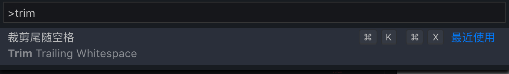

<!-- @import "[TOC]" {cmd="toc" depthFrom=1 depthTo=6 orderedList=false} -->

<!-- code_chunk_output -->

- [1. 界面语言](#1-界面语言)
- [2. 字体](#2-字体)
- [3. 万能入口](#3-万能入口)
- [4. 查看所有快捷键](#4-查看所有快捷键)
- [5. 文本编辑](#5-文本编辑)
    - [5.1. 清除多余的行尾空格](#51-清除多余的行尾空格)
- [6. MPE 使用](#6-mpe-使用)

<!-- /code_chunk_output -->

# 1. 界面语言

按 F1 快捷键或者 Comm + Shift + P, 切入到命令行模式. 输入"Configure Language"(如果是中文版要切换到英文版输入"配置语言").

英文: "en"

中文简体: "zh-CN"

可以查看微软官方语言支持说明

# 2. 字体

"SauceCodePro Nerd Font"

# 3. 万能入口

通过 Com + shift + P 可调出主命令框, 几乎所有功能可从这里获得

# 4. 查看所有快捷键

通过 COM+K COM+S 可打开所有键盘映射

或 Code  ->  首选项  ->  键盘快捷方式 可打开

# 5. 文本编辑

### 5.1. 清除多余的行尾空格

按下 `cmd + shift + p`, 在弹出的命令窗口中输入 `trim`, 选中 Trim Trailing Whitespace 并回车执行.

# 6. MPE 使用

https://zhuanlan.zhihu.com/p/56699805

https://shd101wyy.github.io/markdown-preview-enhanced/#/zh-cn/

