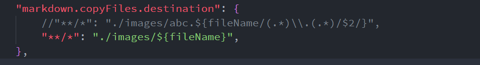

<!-- @import "[TOC]" {cmd="toc" depthFrom=1 depthTo=6 orderedList=false} -->

<!-- code_chunk_output -->

- [1. 设置同步](#1-设置同步)
- [2. 下载插件](#2-下载插件)
- [3. 配置](#3-配置)
  - [3.1. 基本设置](#31-基本设置)
    - [3.1.1. 修改语言](#311-修改语言)
    - [3.1.2. 修改字体](#312-修改字体)
    - [3.1.3. 颜色主题](#313-颜色主题)
    - [3.1.4. 文件图标主题](#314-文件图标主题)
    - [3.1.5. 外观设置](#315-外观设置)
  - [3.2. 万能入口](#32-万能入口)
  - [3.3. 自动保存](#33-自动保存)
  - [3.4. 自动换行](#34-自动换行)
  - [3.5. 更新设置](#35-更新设置)
- [4. Markdown 相关](#4-markdown-相关)
  - [4.1. 原生自带](#41-原生自带)
    - [4.1.1. 配置](#411-配置)
  - [4.2. Markdown Preview Enhanced 插件 (推荐)](#42-markdown-preview-enhanced-插件-推荐)
    - [4.2.1. 配置](#421-配置)
  - [4.3. markdown-index](#43-markdown-index)
  - [4.4. pangu](#44-pangu)
    - [4.4.1. 命令行工具](#441-命令行工具)
    - [4.4.2. 配置](#442-配置)
- [5. Auto-Git](#5-auto-git)
- [6. Settings Sync](#6-settings-sync)
  - [6.1. 设置 (新建) token](#61-设置-新建-token)
  - [6.2. 设置 Gist ID](#62-设置-gist-id)
  - [6.3. 设置](#63-设置)
    - [6.3.1. Gist Settings](#631-gist-settings)
    - [6.3.2. Global Settings](#632-global-settings)
  - [6.4. 上传配置](#64-上传配置)
  - [6.5. 同步下载配置](#65-同步下载配置)
  - [6.6. 重置设置](#66-重置设置)
- [7. Paste Image](#7-paste-image)
- [8. VS Code 调试](#8-vs-code-调试)
  - [8.1. C/C\+\+ 调试](#81-cc-调试)
- [9. SFTP](#9-sftp)
- [10. VSCode Vim 中文输入法切换](#10-vscode-vim-中文输入法切换)
- [11. 最终的配置](#11-最终的配置)

<!-- /code_chunk_output -->



# 1. 设置同步

# 2. 下载插件

- Auto-Git (zeitnergmbh.auto-git): 自动和远端库同步, https://marketplace.visualstudio.com/items?itemName=zeitnergmbh.auto-git

- Bracket Pair Colorizer (coenraads.bracket-pair-colorizer): 彩虹花括号, https://marketplace.visualstudio.com/items?itemName=CoenraadS.bracket-pair-colorizer

- Chinese (Simplified) Language Pack for Visual Studio Code (ms-ceintl.vscode-language-pack-zh-hans
): VS Code 提供本地化界面. https://marketplace.visualstudio.com/items?itemName=MS-CEINTL.vscode-language-pack-zh-hans

- Code Runner (formulahendry.code-runner): 右键即可编译运行单文件, https://marketplace.visualstudio.com/items?itemName=formulahendry.code-runner

- Include Autocomplete (ajshort.include-autocomplete): 提供头文件名字的补全, https://marketplace.visualstudio.com/items?itemName=ajshort.include-autocomplete

- indent-rainbow (oderwat.indent-rainbow): 用不同颜色交替着色文本前面的缩进, https://marketplace.visualstudio.com/items?itemName=oderwat.indent-rainbow
- Markdown All in One, 快捷键, 预览, 创建目录, 更新目录号等等. https://marketplace.visualstudio.com/items?itemName=yzhang.markdown-all-in-one, keyboard shortcuts, table of contents, auto preview and more).
- Markdown Preview Enhanced (shd101wyy.markdown-preview-enhanced): markdown 预览增强 (不用 all in one 和系统的), https://marketplace.visualstudio.com/items?itemName=oderwat.indent-rainbow , https://shd101wyy.github.io/markdown-preview-enhanced/#/zh-cn/customize-css
- One Dark Pro (zhuangtongfa.material-theme): 主题, https://marketplace.visualstudio.com/items?itemName=zhuangtongfa.Material-theme
- pangu (halfcrazy.pangu): 为中英文之间添加空格, https://marketplace.visualstudio.com/items?itemName=halfcrazy.pangu
- Paste Image (mushan.vscode-paste-image): 直接从剪切板复制图片, https://marketplace.visualstudio.com/items?itemName=mushan.vscode-paste-image

- SFTP (liximomo.sftp): 上传下载文件到服务器, https://marketplace.visualstudio.com/items?itemName=liximomo.sftp

- vscode-icons (vscode-icons-team.vscode-icons): 图标, https://marketplace.visualstudio.com/items?itemName=vscode-icons-team.vscode-icons

- YAML (redhat.vscode-yaml): redhat 提供对 YAML 语言的支持, https://marketplace.visualstudio.com/items?itemName=redhat.vscode-yaml

不建议 / 不需要装的扩展:

- GBKtoUTF8: 把 GBK 编码的文档转换成 UTF8 编码的. 此扩展可能有严重的 bug.
- C\+\+ Intellisense: 用的是 gtags, 本文第一个版本的选择. 效果非常非常一般.

重启 VS Code

# 3. 配置

使用 Settings Sync 就能实现部分设置同步, 所以先直接参见 [5 Settings Sync](#5-settings-sync). 然后再确认其他设置.

快捷键获取见 Tips

## 3.1. 基本设置

### 3.1.1. 修改语言

按 F1 快捷键或者 `Comm + Shift + P`, 切入到命令行模式. 输入 "Configure Language"(如果是中文版要切换到英文版输入 "配置语言").

英文: "en"

中文简体: "zh-CN"

### 3.1.2. 修改字体

设置中: SauceCodePro Nerd Font Mono

### 3.1.3. 颜色主题


选择 "One Dark Pro"

### 3.1.4. 文件图标主题


选择 "vscode\-icons"

### 3.1.5. 外观设置


## 3.2. 万能入口

通过 Com + shift + P 可调出主命令框, 几乎所有功能可从这里获得

## 3.3. 自动保存

文件  ->  自动保存

也可以通过 setting 自定义自动保存选项

## 3.4. 自动换行

设置

```
"editor.wordWrap": "on"
```

## 3.5. 更新设置

左下角  ->  "设置"  ->  "用户设置"  ->  "应用程序"  ->  "更新"


# 4. Markdown 相关

截止这一步, 会有两个 markdown 预览功能, 也就对应两个配置, 推荐使用 MPE.

## 4.1. 原生自带

Visual Studio Code 原生就支持 Markdown 语法和预览, 原生的预览可以通过右上角的图标 "打开侧边预览" 就能进入, 或者快捷键 Com+K, 全部松开, 再按 V 即可


### 4.1.1. 配置

打开配置文件,

## 4.2. Markdown Preview Enhanced 插件 (推荐)

功能丰富, 极其强大, 推荐使用. 具体使用见 https://shd101wyy.github.io/markdown-preview-enhanced/#/.

安装了 Markdown Preview Enhanced 插件也会另外有个预览, 通过右上角的图标 "Markdown Preview Enhanced" 能进入, 或通过全局命令栏也能进入


### 4.2.1. 配置

https://shd101wyy.github.io/markdown-preview-enhanced/#/

先在键盘映射中删除原生的预览快捷键, 防止按键冲突. 然后修改默认按键, 改为 Com+K, Com+V. 其余配置使用上面原生的配置.

打开 "首选项" "设置" "Markdown Preview Enhanced"

将 "Image Uploader" 设为 "sm.ms", 将 "Image Folder Path" 设为 "./images"


但是目前复制图片不支持 VS Code, 见官方文档.

MPE 的设置如下

自定义 CSS, CMD-Shift-P, 然后运行 `Markdown Preview Enhanced: Customize Css`, style.less 会被打开, 可以编写样式:

>style.less 文件位于 \~/.mume/style.less

```css
/* Please visit the URL below for more information: */
/*   https://shd101wyy.github.io/markdown-preview-enhanced/#/customize-css */

.markdown-preview.markdown-preview {
  //modify your style here
  background-color: rgb (217, 220, 224);
  font-family: 'SauceCodePro Nerd Font', 'Arial', 'Consolas', 'Courier New';
  //font-family: 'Courier New', Courier, monospace
  font-size: 16px;
  //color: darkslategray;
  h1, h2, h3, h4, h5, h6, pre, code {
    font-family: 'SauceCodePro Nerd Font', 'Arial', 'Consolas', 'Courier New';
  }
}

.md-sidebar-toc.md-sidebar-toc {
  // 边栏目录样式
  font-family: 'SauceCodePro Nerd Font', 'Arial', 'Consolas', 'Courier New';
}
```

注: 它的很多功能, 比如 TOC 功能必须打开 preview 窗口才可以

## 4.3. markdown-index

可以为你的 markdown 标题添加序号的插件

运行 > markdown add index, 即可自动添加序号

注: 重复运行命令可以自动更新序号.

注: 可以在 settings.json 中设置标题的记号, 默认为'#'.

## 4.4. pangu

为 markdown 文档中英文间添加空格

https://github.com/halfcrazy/vscode-pangu

### 4.4.1. 命令行工具

* Pangu: Add whitespace for selection
* Pangu: Add whitespace for all

### 4.4.2. 配置

保存时自动添加

```
{
    /* Auto add whitespace on save, default false */
    "pangu.auto_space_on_save": false
}
```

# 5. Auto-Git

用于自动同步笔记, 注意, 这个不要用于其他项目, 这也是为什么我没有列在上面

https://marketplace.visualstudio.com/items?itemName=zeitnergmbh.auto-git

安装以后先禁用, 后面配置完成后再启用

使用 git credential.helper 来记录远程 git 的 username 和 password

```
git config --global credential.helper osxkeychain
git config credential.helper osxkeychain
```

在当前的 repo 下面会有个目录, `.autogit`, 可自定义配置, 目前, 已经将该 repo 的配置上传

建议将笔记 repo 单独放在一个工作区, 这样, 可以在启用该插件时候选择 "启用 (工作区)", 从而不会影响其他的工作区了

配置完成后, 需要通过 Com + shift + P 可调出主命令框, 搜索 AutoGit, 然后 restart 生效

# 6. Settings Sync

主页: https://marketplace.visualstudio.com/itemdetails?itemName=Shan.code-settings-sync

安装完要重启 VS Code

主要操作可以参考主页

提供了通过 github 的 Gist 完成配置同步的功能. 但是由于它的教程不完整, 导致同步起来会产生省问题. 最常见的问题是无法下载配置, 提示信息为:

```
Sync : Invalid / Expired GitHub Token. Please generate new token with scopes mentioned in readme. Exception Logged in Console.
```

Gist 可以保存上传的配置文件. 拉取配置文件需要配置两个 id, 一个是 Gist Id, 一个是 Token Id. 这两个 Id 前者标识配置文件, 后者用于身份验证. 我们无法下载的原因就是我们使用单单在 Sync:Download Settings 命令中使用了 Gist id, 所以错误提示才是无效的 token.

所以关键点就是两个:

- 进行身份验证, 设置 (新建) token
- 设置 gist id

## 6.1. 设置 (新建) token

还是在 VSCode 中输入命令: Sync:Advanced Options, 然后选择 Sync:Edit Extension Local Settings, 编辑 syncLocalSettings.json 这个配置文件. 这个文件中有一项 token 没有设置(或者是配置的就是以前的过期的 token), 这里就需要设置为 Token Id. 你可以用之前上传配置文件时设置的 Token, 也可以再新建一个 Token. 创建步骤如下:

打开 github,  Settings / Developer settings / Personal access tokens / Generate New Token

选择 "gist"


> 注意: 这里重新生成之后, 有关此 gist id 引用到的地方的 token 也需要同步更新, 否则没办法使用.

## 6.2. 设置 Gist ID

gist ID 也可以从 gist.github.com 获得, 如图:


## 6.3. 设置

有两种类型的自定义设置.

### 6.3.1. Gist Settings

通过命令行的设置影响的就是这里

存在于 VS Code 的设置里面 ($HOME/Library/Application Support/Code/User/settings.json), 通过 "CMD+Shift+P", 输入 "setting", 打开 "首选项: 打开设置 (json)" 即可打开

```
"sync.gist": "c6092de85c1b5fbdc834800397f1c4aa",
"sync.autoDownload": false,
"sync.autoUpload": false,
"sync.forceDownload": false,
"sync.quietSync": false,
"sync.askGistName": false,
"sync.removeExtensions": true,
"sync.syncExtensions": true
```

### 6.3.2. Global Settings

$HOME/Library/Application Support/Code/User/syncLocalSettings.json, 通过 "CMD+Shift+P", 输入 "sync", 打开 "Sync: 高级选项" 即可打开

```
{
    "ignoreUploadFiles": [
        "state.vscdb",
        "state.vscdb.backup",
        "syncLocalSettings.json",
        ".DS_Store",
        "sync.lock",
        "projects.json",
        "projects_cache_vscode.json",
        "projects_cache_git.json",
        "projects_cache_svn.json",
        "gpm_projects.json",
        "gpm-recentItems.json"
    ],
    "ignoreUploadFolders": [
        "workspaceStorage"
    ],
    "ignoreExtensions": [],
    "gistDescription": "Visual Studio Code Settings Sync Gist",
    "version": 328,
    "token": "ec22232ce579301",
    "downloadPublicGist": false,
    "supportedFileExtensions": [
        "json",
        "code-snippets"
    ],
    "openTokenLink": true,
    "disableUpdateMessage": false,
    "lastUpload": "2019-04-09T02:57:55.349Z",
    "lastDownload": null,
    "githubEnterpriseUrl": null,
    "askGistName": false,
    "customFiles": {},
    "hostName": null
}
```

## 6.4. 上传配置

在 VS Code 中, 通过 "CMD+Shift+P", 输入 "sync", 打开 "Sync: 上传配置", 输入上面获得的 token, 回车

打开设置, 就可以看到自己的 token 和 git ID. 分别在上面的两个设置文件中.

gist ID 很关键, 用于在其他电脑同步下载, 所以不能忘记

## 6.5. 同步下载配置

在 VS Code 中, 通过 "CMD+Shift+P", 输入 "sync", 打开 "Sync: 下载设置", 生成你的 token, 输入 token, 回车

输入上面的 gist ID, 回车

## 6.6. 重置设置

在 VS Code 中, 通过 "CMD+Shift+P", 输入 "sync", 打开 "Sync: 重置设置"

# 7. Paste Image

因为 markdown preview enhanced 的不给力, 所以需要这个

官方文档: https://marketplace.visualstudio.com/itemdetails?itemName=mushan.vscode-paste-image

打开 "首选项" "设置"

```
    "pasteImage.path": "${currentFileDir}/images/",
    "pasteImage.forceUnixStyleSeparator": true,
    "pasteImage.prefix": "./",
    "pasteImage.insertPattern": "![${imageFileName}](${imageFilePath}${imageSyntaxSuffix}",
```

# 8. VS Code 调试

官方: https://code.visualstudio.com/docs/editor/debugging

## 8.1. C/C\+\+ 调试

链接: https://github.com/Microsoft/vscode-cpptools/blob/master/launch.md

# 9. SFTP

配置

```
{
    "name": "10.121.2.124",
    "host": "10.121.2.124",
    "protocol": "sftp",
    "port": 22,
    "username": "root",
    "password": "Platform@123",
    "remotePath": "/home/gerry/AutoStack",
    "uploadOnSave": true,
    "ignore": [
        "**/.vscode/**",
        "**/.idea/**",
        "**/.git/**",
        "**/.DS_Store",
        "**/.git",
        "**/.vscode",
        "**/.gitignore"
    ]
}
```

# 10. VSCode Vim 中文输入法切换

参见 `https://github.com/VSCodeVim/Vim#input-method`

1. 先下载安装 `im-select`
2. 配置 vim

```
    "vim.autoSwitchInputMethod.enable": true,
    "vim.autoSwitchInputMethod.defaultIM": "com.apple.keylayout.ABC",
    "vim.autoSwitchInputMethod.obtainIMCmd": "/usr/local/bin/im-select",
    "vim.autoSwitchInputMethod.switchIMCmd": "/usr/local/bin/im-select {im}",
```


# 11. 最终的配置

打开 "首选项" "设置"

```json
{
    "editor.fontFamily": "SauceCodePro Nerd Font Mono, -apple-system",
    "editor.fontSize": 15,
    "editor.wordWrap": "on",
    "breadcrumbs.enabled": true,
    "extensions.autoUpdate": false,
    "telemetry.enableTelemetry": false,
    "telemetry.enableCrashReporter": false,
    "html.autoClosingTags": false,
    "markdown.preview.fontFamily": "SauceCodePro Nerd Font Mono, BlinkMacSystemFont, 'Segoe WPC', 'Segoe UI', 'Ubuntu', 'Droid Sans', sans-serif",
    "markdown.preview.fontSize": 15,
    "workbench.activityBar.visible": true,
    "workbench.statusBar.visible": true,
    "workbench.colorTheme": "One Dark Pro",
    "sync.gist": "55599d7d83447627c58d50495d9dd951",
    "sync.autoDownload": false,
    "sync.autoUpload": true,
    "sync.forceDownload": false,
    "sync.quietSync": false,
    "sync.removeExtensions": true,
    "sync.syncExtensions": true,
    "markdown-preview-enhanced.imageFolderPath": "./images",
    "markdown-preview-enhanced.imageUploader": "sm.ms",
    "markdown-preview-enhanced.automaticallyShowPreviewOfMarkdownBeingEdited": true,
    "pasteImage.path": "${currentFileDir}/images/",
    "pasteImage.forceUnixStyleSeparator": true,
    "pasteImage.prefix": "./",
    "pasteImage.insertPattern": "![${imageFileName}](${imageFilePath}${imageSyntaxSuffix}",
    "update.enableWindowsBackgroundUpdates": false,
    "update.showReleaseNotes": false,
    "update.mode": "manual",
    "workbench.startupEditor": "welcomePage",
    "workbench.iconTheme": "vscode-icons",
    "vsicons.dontShowNewVersionMessage": true,
    "git.alwaysShowStagedChangesResourceGroup": true,
    "pangu.auto_space_on_save": false,
    "vim.normalModeKeyBindingsNonRecursive": [
        {
            "before": ["<c-j>"],
            "after": ["o", "<esc>"]
        }
    ],
    "files.autoSave": "afterDelay",
    "window.zoomLevel": 0,
    "oneDarkPro.editorTheme": "panda",
    "git.confirmSync": false
}
```
