# 下载安装

TONGYI Lingma

如果安装后在侧边导航上找不到通义灵码入口, 可鼠标聚焦在侧边导航后右键查看, 勾选通义灵码后即可将插件入口配置在侧边导航上.

目前已经支持 Qwen2.5,DeepSeek-V3 和 R1 系列模型. 在输入框中选择模型, 可以进行模型切换.

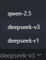

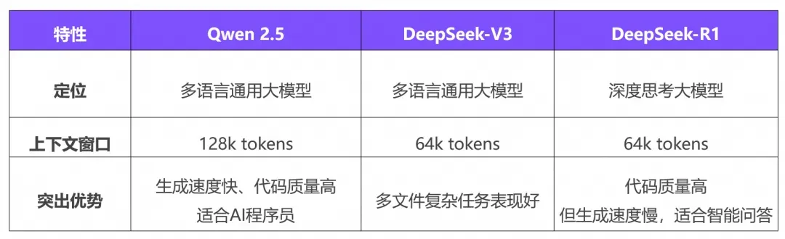

# 核心功能

# 智能补全使用指南

通义灵码提供了多种智能补全的方式, 可以根据当前代码文件, 跨文件的上下文或企业代码规范等, 为您生成行级 / 函数级代码, 让您更专注在技术设计.

## 行级 / 函数级实时补全

当你在 IDE 编辑器区进行代码编写时, 在开启自动云端生成的模式下, 通义灵码会根据当前代码文件及相关代码文件的上下文, 自动为你生成行级 / 函数级的代码建议, 此时你可以使用快捷键采纳, 废弃, 或查看不同的代码建议.

同时, 当你在编码的过程中, 也可以通过快捷键 alt P 手动触发生成代码建议.

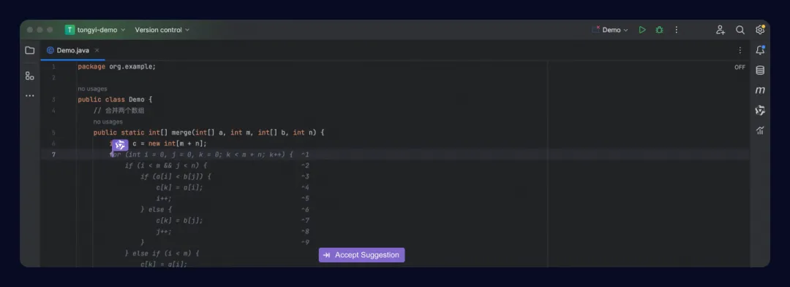

编辑器中代码建议相关操作的快捷键如下:

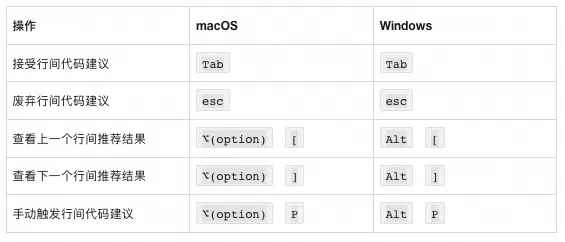

## 自然语言生成代码

在编辑器中, 可以直接通过自然语言的方式描述需要实现的需求, 通义灵码可以在编辑器中生成代码建议, 单击 Tab 可直接采纳.

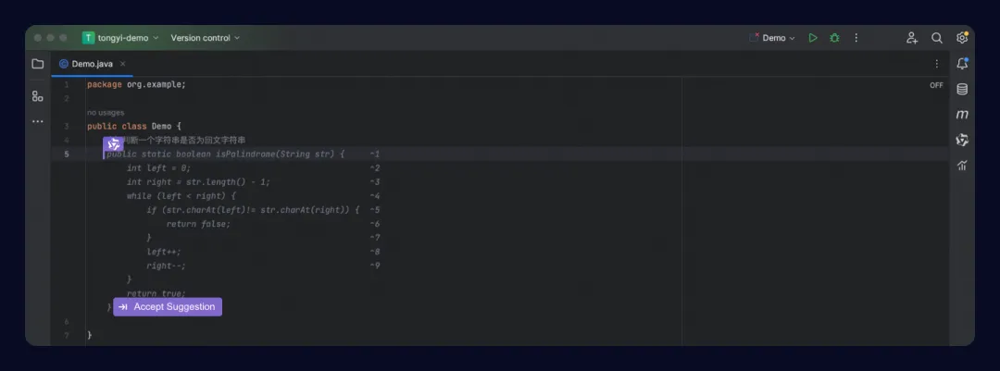

判断一个字符串是否为回文字符串, C 语言版本:

## 企业代码生成增强

企业管理员上传并启用行间代码生成知识库, 并设置为组织内开发者可见成员后, 开发者在 IDE 的代码编辑器中编写代码时, 通过快捷键 ⌥ P 手动触发, 通义灵码将根据知识库中的内容自动生成符合企业规范的代码建议.

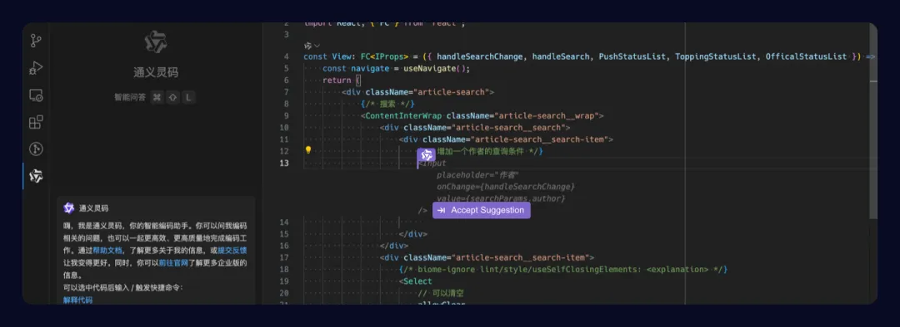

## 离线单行补全

通义灵码代码补全默认使用云端大模型进行智能续写, 当网络情况有限制时, 可使用本地补全模式, 单击状态栏图标切换至本地补全模式后, 编辑器中进行编码时, 通义灵码会给出单行的代码建议.

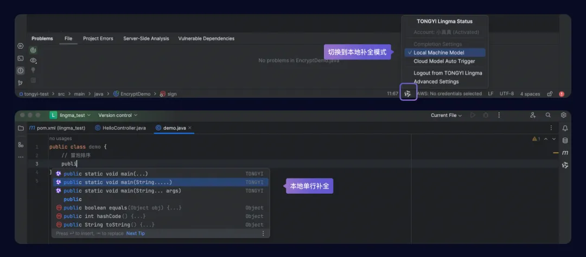

# 智能问答使用

通义灵码, 作为您的智能编码助手, 可以在您进行编码工作遇到疑问时帮您答疑解惑, 并快速为您生成建议代码, 能够帮您生成代码注释, 生成单元测试, 进行代码优化, 解释工程和代码文件, 修复代码问题, 排查编译报错, 生成提交信息等.

## 研发智能问答

使用通义灵码的智能问答时, 为了通义灵码与您的对话能够更友好, 高效, 希望您能够在输入问题时:

* 选中代码, 开始输入您的问题, 通义灵码将围绕着选中代码与您开展对话;

* 精准表达问题, 以及给出相对详细的上下文输入, 比如选中的代码, 日志, 报错信息等;

* 多多互动, 告诉通义灵码, 所给出代码建议或回答是否满足您的预期, 或生成内容存在的具体瑕疵, 通义灵码也会不断改进.

### 自由问答

当编码遇到问题, 缺乏具体解决思路时, 可单击 IDE 侧边工具导航或使用⌘ ⇧ L 唤起通义灵码智能问答助手, 无需离开 IDE 客户端, 即可快速获得答案和解决思路.

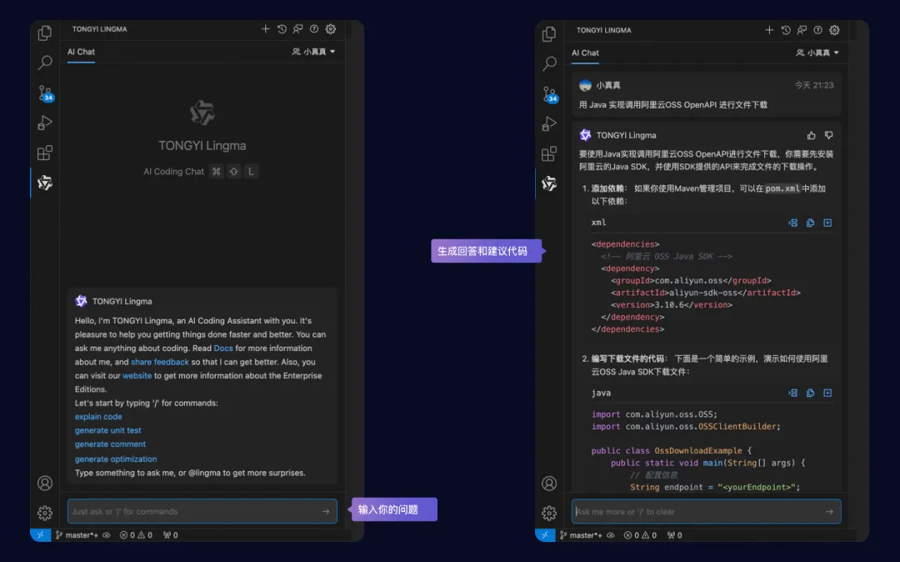

### 代码问答

当您对某段代码有疑问或期望针对代码进行一些问题解决时, 选中代码后, 在智能问答窗口的输入框中输入您的问题, 通义灵码将围绕选中代码与您开展对话.

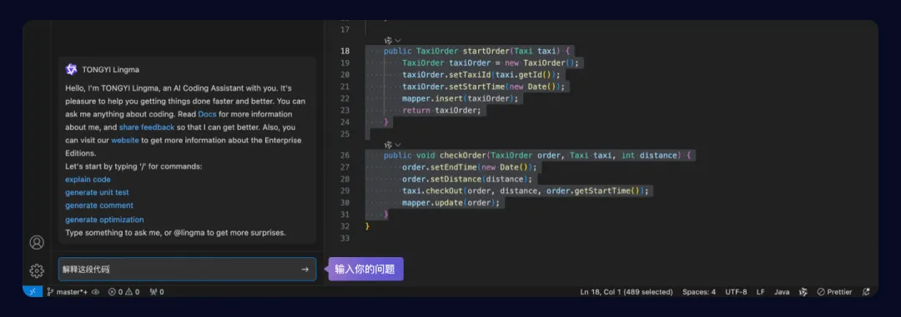

### @workspace 本地工程问答

当您需要快速了解一个工程, 查找工程内的实现逻辑, 或有新的诉求需要进行代码变更时, 可以在智能问答窗口中通过 @ 可唤起 @workspace, 选中后输入您的问题或诉求, 通义灵码可快速结合当前仓库进行工程理解, 代码查询, 代码问答等, 同时可以通过自然语言描述需求, 结合当前工程生成简单需求或缺陷的整体修改建议和相关建议代码.

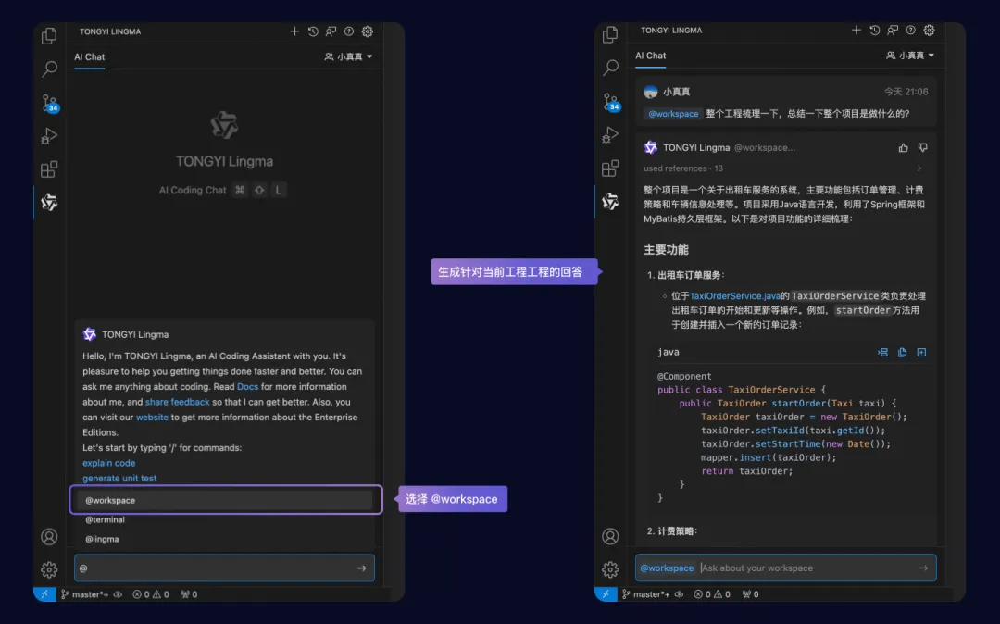

### @terminal 问答

当您遇到执行指令不知道如何写, 或者不清楚某个指令的意思时, 可以在智能问答窗口中通过 @ 可唤起 @terminal, 选择后使用自然语言描述您的需要指令诉求, 通义灵码将可以生成您需要的命令. 生成指令后, 您可以一键插入到 terminal 中进行执行或让通义灵码继续解释. 当然, 您也可以在选择 @terminal 后, 输入指令让通义灵码生成指令解释.

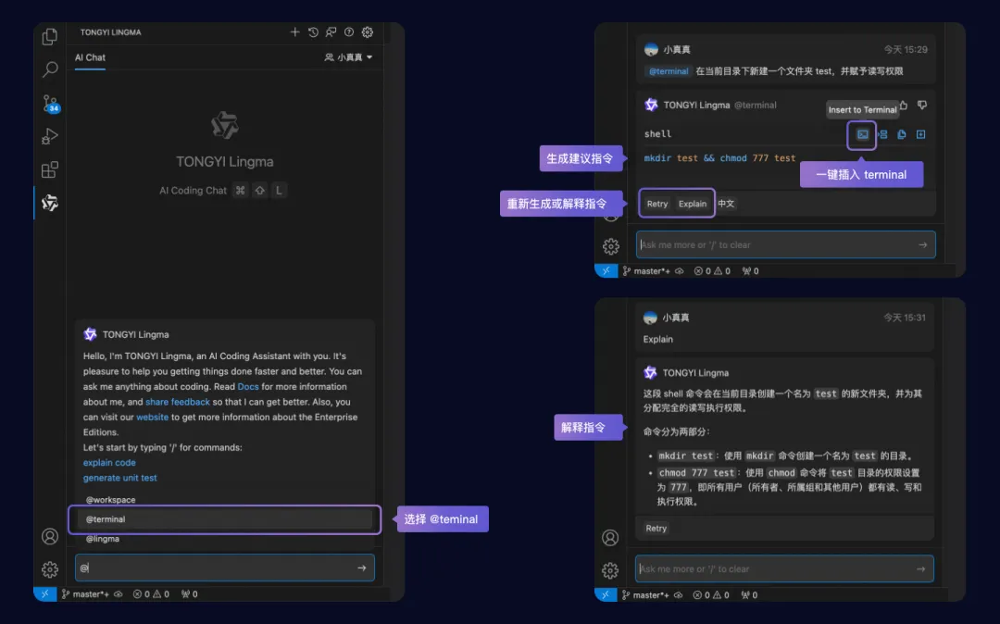

### #teamDocs 知识库问答(企业版)

当您需要结合企业内私域知识信息让通义灵码进行回答时, 可以在智能问答窗口中通过 # 唤起 #teamDocs, 并输入问题, 通义灵码将结合企业知识库 (当前用户有权限的知识库) 对问题进行回答, 在回复中也可以单击查看引用的企业知识库内容.

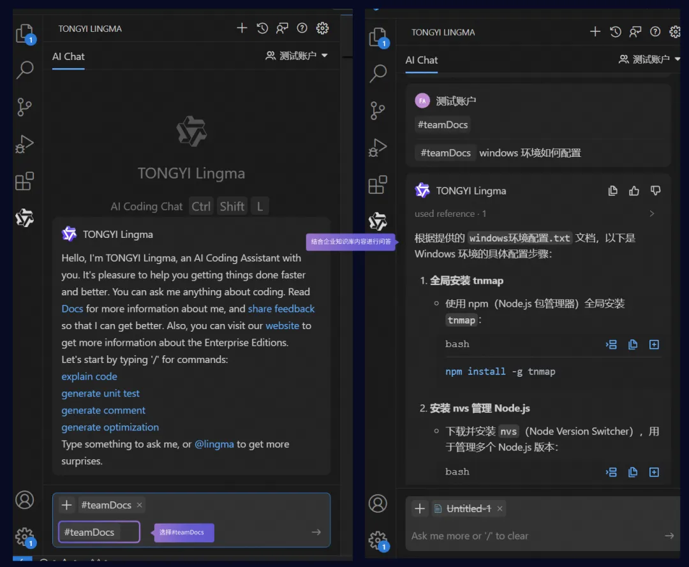

### 清空会话上下文历史记忆

当您在会话中时, 在智能问答输入框中输入 / 即可看到 /clear context 指令, 选择后即可清空当前会话的上下文历史记忆.

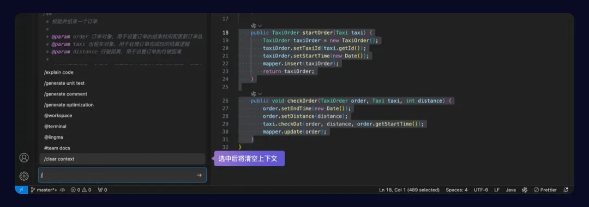

### 新建会话

在智能问答窗口中, 单击右上角的新建按钮即可新建会话窗口, 单击后会话窗口将回到默认状态.

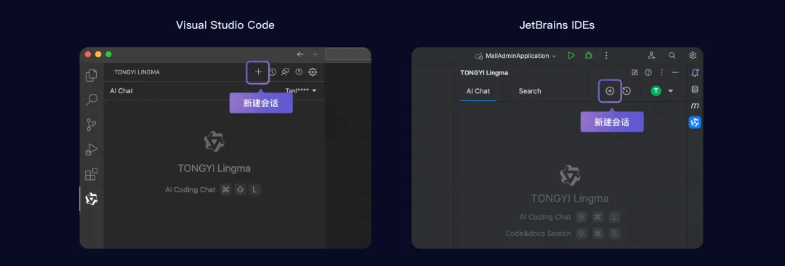

### 查看会话历史

历史会话功能帮助您检索和回顾与通义灵码的交流记录, 方便针对多次的建议进行对比和选择. 不管您在哪个 IDE 客户端上, 哪个工程中, 均可以查看或搜索您和通义灵码的历史会话.

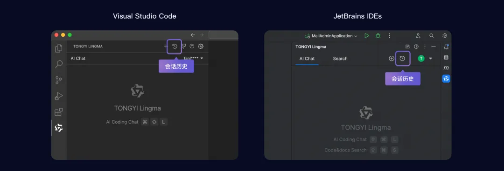

## 智能生成指令

### 指令触发方式

通义灵码提供多处触发单元测试生成, 代码解释, 生成代码注释, 代码优化功能的入口, 当您选中的代码后, 有 3 种触发方式:

在编辑器中, 单击右键找到通义灵码功能操作入口, 单击对应功能操作;

在智能问答中, 直接单击对应功能操作;

在智能问答中, 使用 / 查看快捷指令, 单击对应功能操作.

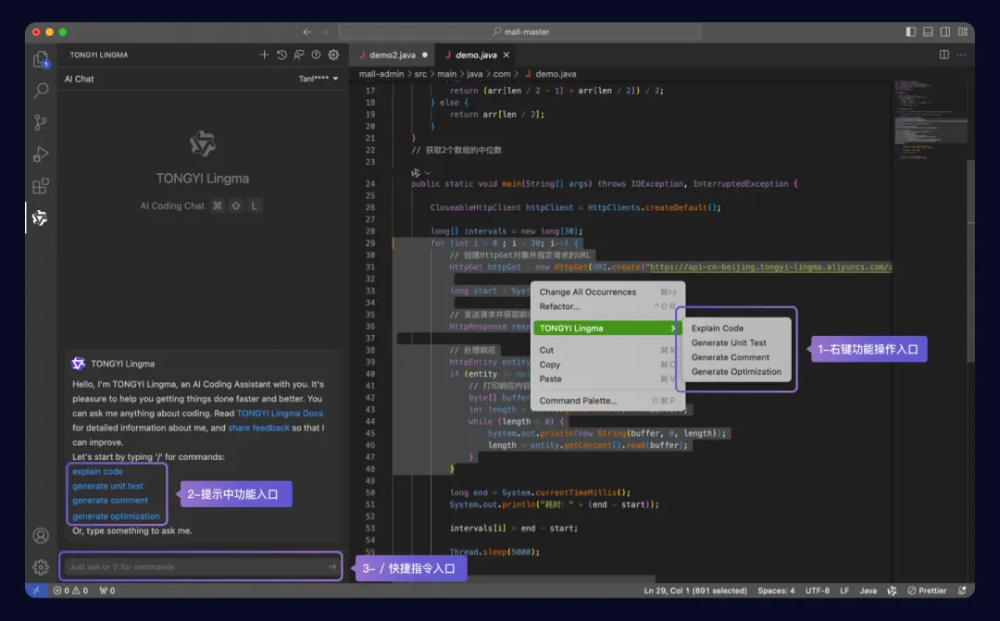

当需要针对一个方法实现生成单元测试, 代码注释, 代码解释, 代码优化时, 无需选中代码, 可直接单击函数上方的快捷入口触发相关功能操作.

选择指令后输入回答要求
当您选中代码后, 并通过在智能问答窗口的输入框输入 / 的方式选中指令后, 可以继续输入附加的要求, 比如:

* 选择 /generate unit test 后, 继续输入您对单元测试生成的要求, 比如使用 JUnit 5 生成;

* 选择 /generate comment 后, 继续输入生成注释的要求, 比如开头标明日期, 并用英文注释.

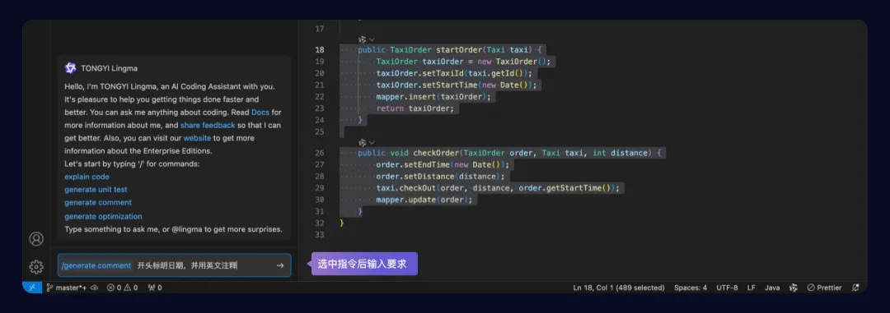

#### 指令一: 解释代码

覆盖各种编程语言, 选中代码后可自动识别编程语言并生成代码解释. 跨越语言的边界, 让您阅读代码更高效.

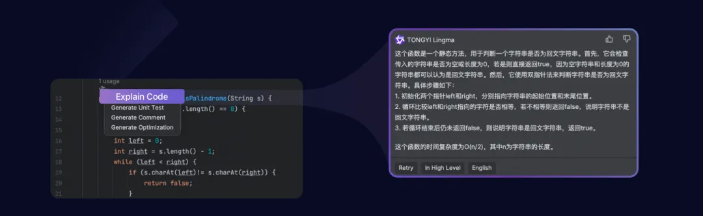

#### 指令二: 生成单元测试

支持根据 JUnit,Mockito,Spring Test,unit test,pytest 等框架生成单元测试.

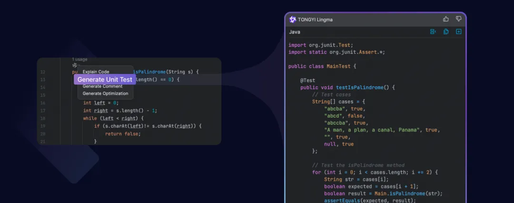

#### 指令三: 生成注释

一键生成方法注释及行间注释, 节省您写代码注释的时间, 并能够有效提升代码可读性.

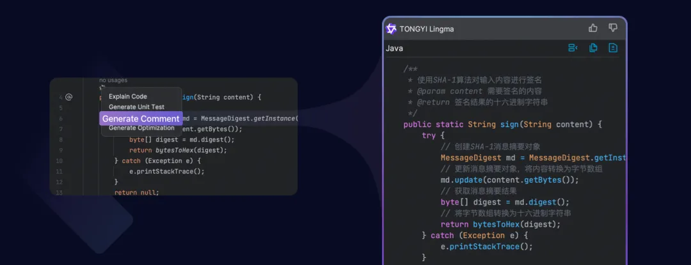

#### 指令四: 代码优化

深度分析代码及其上下文, 迅速识别潜在的编码问题, 从简单的语法错误到复杂的性能瓶颈, 均能够指出问题所在, 并提供具体的优化建议代码.

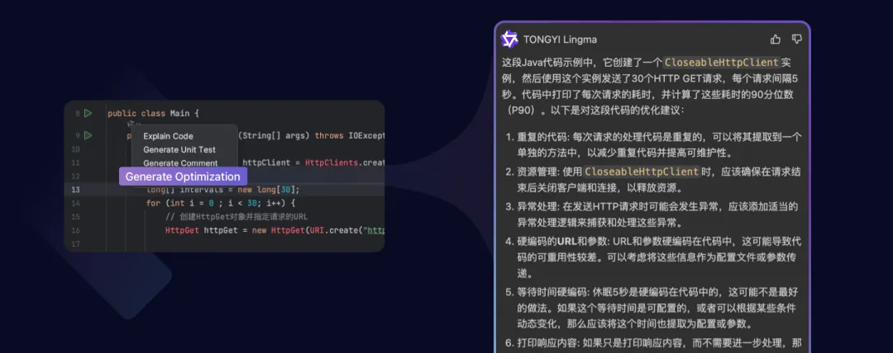

### 生成回答后快捷操作

针对不同的指令生成回答后, 在智能问答区中, 可以继续根据诉求进行操作, 不同功能的对应操作如下:

* 生成单元测试:

  * 采纳单元测试代码建议: 支持一键插入, 复制, 或者新建代码文件, 可快速采纳生成的单元测试代码建议;

  * 更换单元测试框架: 提供基于 JUnit,Mockito,Spring Test,unit test,pytest 等框架生成单元测试代码建议, 在回答完成后, 可以根据需要切换框架重新生成;

  * 新建文件: 支持一键保存单元测试代码为新文件, 方便进行查看和修改.

* 生成代码优化建议

  * 采纳代码优化建议: 针对优化建议中的建议代码, 支持一键插入, 复制, 快速采纳生成的建议代码;

  * 查看 Diff: 单击查看 Diff 按钮, 将快速唤起 IDE Diff 查看窗口, 快速了解建议和源代码的变更;

* 生成代码注释:

  * 采纳代码注释建议: 支持一键插入, 复制, 可快速采纳生成的代码注释建议;

  * 查看 Diff: 单击查看 Diff 按钮, 将快速唤起 IDE Diff 查看窗口, 快速了解建议和源代码的变更.

* 解释代码:

  * 支持重试, 更详细, 更简单, 中文 / 英文解释的追问.

## 问题修复建议

### 代码问题一键修复

当您在编码过程中出现代码问题需要进行修复时, 通义灵码可以一键给出修复建议, 帮您快速修复代码问题. 可以通过编辑器中报错图标中下拉菜单中或 Problem 窗口中聚焦到报错信息后右键菜单中, 单击通义灵码一键修复菜单, 即可生成修复建议和相关建议代码.

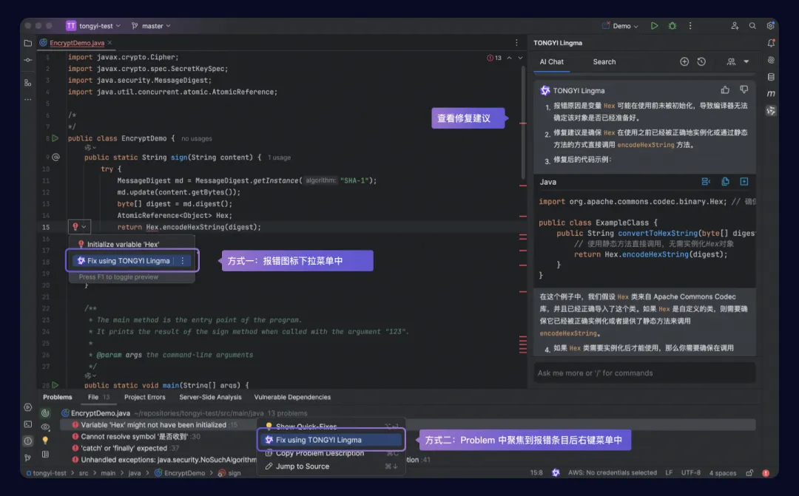

### 异常报错排查(IntelliJ IDEA)

在 IntelliJ IDEA 中, 当运行出现异常报错时, 在运行标准输出窗口中, 即可看到通义灵码的快捷操作按钮, 单击后, 通义灵码将结合运行代码, 异常堆栈等报错上下文, 快速给出排查思路或修复建议.

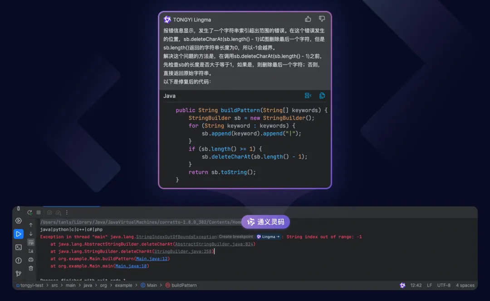

### 执行报错, 编译报错排查(Visual Studio Code)

在 Visual Studio Code 中, 当 terminal 中执行指令后报错, 编译或运行后有大量报错, 需要进行解释或修复时, 可以选中报错信息, 右键选择使用通义灵码一键解释, 也会为您生成相关命令解释及问题解决建议.

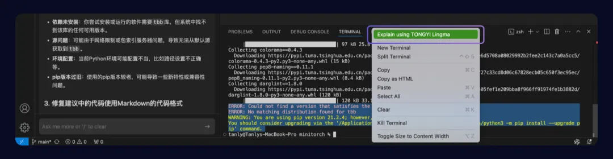

## 提交信息生成

当您有代码变更需要提交, 需要写提交信息时, 可以通过通义灵码一键生成 Git 提交信息, 同时可以在插件设置中配置生成的语言(英文 / 中文).

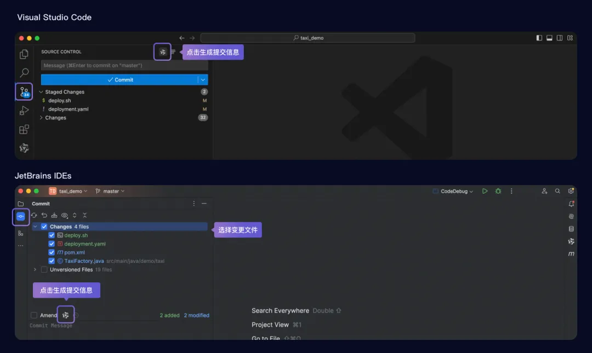

# AI 程序员使用指南

通义灵码 AI 程序员, 具备多文件代码修改 (Multi-file Edit) 和工具使用 (Tool-use) 的能力, 可以与开发者协同完成编码任务, 如需求实现, 问题解决, 单元测试用例生成, 批量代码修改等.

AI 程序员可以帮助开发者快速完成一个研发任务的代码编写工作, 在与 AI 程序员对话过程中, 可以遵循以下几点建议:

清晰的需求描述: 首先需要澄清我们需要 AI 程序员帮我们做什么, 建议包含一个明确的目标, 并通过步骤式的结构化描述, 详细地描述你期望完成的开发任务要求;

指定需要的上下文: 选择代码文件, 图片, codebase,codeChanges 等上下文, 可以帮助 AI 程序员获取需求相关的语境. 同时, 结合详细执行步骤和要求, AI 程序员更精准地了解你的意图, 生成最佳的方案和建议代码;

明确生成要求: 告诉 AI 程序员在生成代码修改建议时, 你期望它遵循的要求, 比如语言, 规范, 格式, 变更目标等, 如 "生成变更时, 同时为每个方法生成英文注释";

善用快照功能: 当 AI 生成内容不符合预期, 或你的需求有变化时, 可以通过快照功能回退到之前的对话轮次和代码变更, 继续重新提问;

审查和修改变更: AI 程序员完成多个文件的代码变更后, 开发者可以通过变更对比查看视图 (Diff View) 进行审查, 以及对局部代码片段进行接受, 拒绝, 修改, 保证最后得到符合预期的代码变更.

通义灵码, 每天进步不止一点点, 可以和开发者协同完成编码任务.

https://mp.weixin.qq.com/s?__biz=MzIzOTU0NTQ0MA==&mid=2247545805&idx=1&sn=b358ba42257c33b186e2a4524914c19f&chksm=e8c54274c1c0d1628239220cb772ec972799da9533f2d2883396a2503280efe9ec4f20f0f0c6&mpshare=1&scene=1&srcid=0213QAqJ9oARggwort8AozYV&sharer_shareinfo=a4540e5144b26803f9c97f8f8b5f3ee8&sharer_shareinfo_first=a4540e5144b26803f9c97f8f8b5f3ee8&version=4.1.31.6017&platform=win&nwr_flag=1#wechat_redirect

