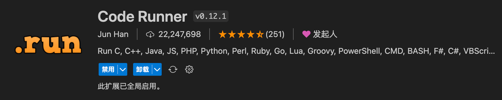

- [1. 外观](#1-外观)
  - [1.1. Chinese](#11-chinese)
  - [1.2. Material Icon Theme](#12-material-icon-theme)
  - [1.3. One Dark Pro](#13-one-dark-pro)
- [2. 项目管理](#2-项目管理)
  - [2.1. Git Graph](#21-git-graph)
  - [2.2. Project Manager](#22-project-manager)
  - [2.3. Git History](#23-git-history)
  - [2.4. GitLens](#24-gitlens)
  - [2.5. Partial Diff](#25-partial-diff)
- [3. Coding\&Debug](#3-codingdebug)
  - [3.1. highlight-words](#31-highlight-words)
  - [3.2. Auto-Align](#32-auto-align)
  - [3.3. letter-transform](#33-letter-transform)
  - [3.4. Code Runner](#34-code-runner)
  - [3.5. Doxygen Documentation Generator](#35-doxygen-documentation-generator)
  - [3.6. Todo Tree](#36-todo-tree)
- [4. C/C++](#4-cc)
  - [4.1. clangd](#41-clangd)
  - [4.2. C/C++](#42-cc)
  - [4.3. C/C++ Advanced Lint](#43-cc-advanced-lint)
  - [4.4. Header Guard Generator](#44-header-guard-generator)
  - [4.5. Better C++ Syntax](#45-better-c-syntax)
- [5. Python](#5-python)
  - [5.1. Python 和 Pylance](#51-python-和-pylance)
- [6. Remote Development](#6-remote-development)
- [7. SFTP](#7-sftp)
- [8. Markdown All in One](#8-markdown-all-in-one)

# 1. 外观

## 1.1. Chinese

这是微软官方提供的 Visual Studio Code 语言包, 专门为中文 (简体) 用户设计. 它将 VSCode 的用户界面翻译为中文, 使得软件更加友好和易于使用. 此外, 它还支持语法高亮, 代码提示等功能, 以适应中文开发环境, 提供更好的用户体验.

## 1.2. Material Icon Theme

它是一个文件图标主题插件, 用于为 Visual Studio Code 中的文件和文件夹添加漂亮的材质设计图标. 这些图标能够以视觉上的方式更好地区分不同类型的文件, 使您的文件结构更加清晰和易于导航. 此插件支持多种文件类型, 包括代码文件, 图像, 音频, 文档等, 让您的项目结构更加美观和直观.

## 1.3. One Dark Pro

颜色主题, 推荐这个, (One Dark Pro Mix)

# 2. 项目管理

## 2.1. Git Graph

它是一个强大的 Git 可视化工具, 用于在 Visual Studio Code 中查看和理解 Git 仓库的历史和分支结构. 它允许您直观地浏览提交记录, 合并请求以及分支之间的关系. 您可以轻松地了解项目的发展情况, 查看谁提交了哪些更改, 以及何时进行了合并等操作. 这对于团队协作和代码维护非常有帮助.

双击被修改的文件, 可对比修改内容

点击图形化图标可查看 git 提交日记, 亦可选择分支来查看

对于命令行使用不熟悉的朋友, 可通过在 commit 上右击做一些简单操作

## 2.2. Project Manager

项目管理是软件开发的一部分, 它可以帮助您轻松地管理项目, 快速切换不同的项目文件夹, 使您的工作流程更加流畅.

## 2.3. Git History

它允许您在 VSCode 中轻松查看文件的 Git 历史记录, 帮助您理解代码的演变过程.

## 2.4. GitLens

它提供了强大的 Git 集成功能, 包括文件注释, 比较和提交历史, 有助于更好地管理和理解版本控制.

##  2.5. Partial Diff

它能够高亮两个文件之间的区别, 使您能够轻松比较和合并更改, 提高协作效率.

# 3. Coding&Debug

## 3.1. highlight-words

可以多个词语高亮, 会显示不同颜色, 默认是字符串匹配, 在配置中可设置成整词匹配

## 3.2. Auto-Align

针对一些枚举和变量赋值等做对齐风格.

## 3.3. letter-transform

1. 选中需要格式化的字符串, 右键弹出菜单可以选择转成驼峰, 帕斯卡 (大驼峰), 下划线命名, 短横线命名以及大小写的转换

2. 也可以使用快捷键 Ctrl + 数字键 123456, 分别对应上述的几种命名方式

3. Ctrl + e 可以快速 console.log(xxx)

插件带如下转换, 其他几个用的比较少, 用的比较多的是, 在书写宏定义时, 直接书写宏定义, 无需关注大小写, 写完后一键转成大写, 非常方便

## 3.4. Code Runner

它允许您在 VSCode 中直接运行代码片段, 提供了快速测试和调试的便捷方式.

## 3.5. Doxygen Documentation Generator

文档编写对于协作和维护代码非常重要. 它可帮助您快速生成代码注释和文档, 提高代码可读性, 减少团队协作的难度.

## 3.6. Todo Tree

它能够扫描您的代码以查找 TODO 注释, 帮助您跟踪未完成的任务和待办事项.

# 4. C/C++

## 4.1. clangd

clangd 插件用于代码语义分析, 代码补全, 跳转等.

clangd 默认通过读取工程编译自动生成的 compile_commands.json 文件来索引其中包含的源文件和关联的头文件, 因此能避免索引非编译的代码造成解析时语义混乱.

## 4.2. C/C++

## 4.3. C/C++ Advanced Lint

对于 C/C++ 开发者, 它提供了代码静态分析和错误检测功能, 有助于提高代码质量.

## 4.4. Header Guard Generator

它可以自动生成 C/C++ 头文件的头文件守卫, 帮助您防止头文件重复引用的问题.

## 4.5. Better C++ Syntax

它为 C++ 开发者提供更好的语法高亮, 使编码更加愉快.

# 5. Python

## 5.1. Python 和 Pylance

Python 开发者不可错过的插件, Python 提供了 Python 开发环境的基本功能, 而 Pylance 则提供了强大的类型检查和智能感知功能.

# 6. Remote Development

如果您需要远程开发支持, 它提供了一整套工具, 包括 SSH 和容器支持, 让您可以随时随地进行开发. 它提供了更好的远程文件系统和服务器支持, 使远程开发更加流畅.

# 7. SFTP

它为您提供了 SFTP 客户端功能, 使文件传输和远程开发变得更加便捷.

# 8. Markdown All in One

如果您经常使用 Markdown 编写文档, 它将成为您的好帮手, 提供了丰富的 Markdown 编辑功能和预览功能.

