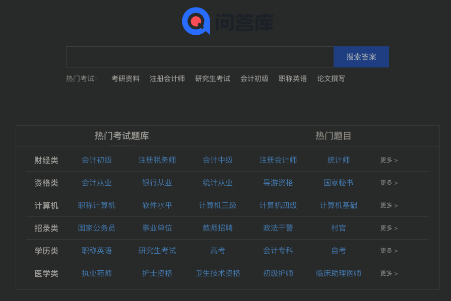

<!-- @import "[TOC]" {cmd="toc" depthFrom=1 depthTo=6 orderedList=false} -->

<!-- code_chunk_output -->

- [1. 综合学习](#1-综合学习)
  - [1.1. Coursada: 公开课搜索引擎](#11-coursada-公开课搜索引擎)
  - [1.2. 科塔学术](#12-科塔学术)
  - [1.3. 1 纳米学习导航网站](#13-1-纳米学习导航网站)
  - [1.4. coursera (重点)](#14-coursera-重点)
  - [1.5. B 站](#15-b-站)
    - [1.5.1. 英语学习](#151-英语学习)
    - [1.5.2. 其他东西](#152-其他东西)
  - [1.6. EDX](#16-edx)
  - [1.7. 网易公开课](#17-网易公开课)
  - [1.8. 中国大学 MOOC (重点)](#18-中国大学-mooc-重点)
  - [1.9. 学堂在线](#19-学堂在线)
  - [1.10. 网易云课堂](#110-网易云课堂)
  - [1.11. 腾讯课堂](#111-腾讯课堂)
  - [1.12. Crash Course 中文字幕组](#112-crash-course-中文字幕组)
  - [1.13. MOOC 中国](#113-mooc-中国)
  - [1.14. 中国教育在线开发资源平台](#114-中国教育在线开发资源平台)
  - [1.15. 慕课网](#115-慕课网)
  - [1.16. 极客时间](#116-极客时间)
- [2. 语言学习](#2-语言学习)
  - [2.1. Maspeak](#21-maspeak)
  - [2.2. 每日英语听力](#22-每日英语听力)
  - [2.3. 普特英语听力](#23-普特英语听力)
  - [2.4. 沪江英语](#24-沪江英语)
  - [2.5. 译学馆](#25-译学馆)
- [3. 软件学习](#3-软件学习)
  - [3.1. doyoudo](#31-doyoudo)
  - [3.2. 我要自学网](#32-我要自学网)
  - [3.3. Oeasy](#33-oeasy)
- [4. 考试学习](#4-考试学习)
  - [4.1. 问答库](#41-问答库)
  - [4.2. 粉笔网](#42-粉笔网)
- [5. 特定领域](#5-特定领域)
  - [5.1. 医学微视](#51-医学微视)

<!-- /code_chunk_output -->

# 1. 综合学习

* 国外主要看 coursera, https://www.coursera.org
* 国内主要看 中国大学 MOOC, https://www.icourse163.org
* 公开课搜索 Coursada, https://www.coursade.com

## 1.1. Coursada: 公开课搜索引擎

https://www.coursade.com/

在线公开课搜索引擎, 你能在上面找到全世界的优秀课程

## 1.2. 科塔学术

https://site.sciping.com/

不是一个自学网站, 是一个质量非常高的学术导航网站.

需要查询一些报告、期刊等, 网站涵盖 15 大分类, 从学术导航到期刊分类都有.

## 1.3. 1 纳米学习导航网站

http://www.1nami.com/

非常专业的学习导航网站, 里面收录了国内外优秀的学习网站, 包括网易云课堂、多贝网、腾讯课堂等众所周知的高质量学习平台.

## 1.4. coursera (重点)

https://www.coursera.org/

知名课程学习网站, 与世界顶尖大学零距离接触的网站, 也就是国外版的 MOOC.

## 1.5. B 站

强推, 我自己会在上面学很多.

举例

### 1.5.1. 英语学习

重点推荐两位老师. 一个来自国内的英语大牛, 一个是地道的国外英语老师

⓵ 赖世雄老师

1. 赖世雄英语学习方法: https://www.bilibili.com/video/av45291459?from=search&seid=6185544147991646475

赖老师亲身传授自己从 0 到 1 的英语学习心得.

2. 赖世雄美语音标: https://www.bilibili.com/video/av18344760?from=search&seid=5076246622670199795

学会正确的音标读法.

更多的可以搜索"赖世雄"即可.

比如, up 主: "坚强小海绵"的, 主页 https://space.bilibili.com/40830187

- 赖世雄美语从头学 入门篇: https://www.bilibili.com/video/av18371827
- 美语从头学 初级篇(上): https://www.bilibili.com/video/av23601906
- 美语从头学 初级篇(下): https://www.bilibili.com/video/av20135721
- 美语从头学 中级篇(上): https://www.bilibili.com/video/av23611400
- 美语从头学 中级篇(下): https://www.bilibili.com/video/av23613166

⓶ Coach Shane

Youtube 主页: https://www.youtube.com/user/DailyEasyEnglish , 需翻墙

他还有微博: english coach shane

听力提高很有用.

推荐他的两门经典课程:

1. DEEE(Daily Easy English Expression)

每一期会通过讲解和对话的形式教你一个英语表达, 同时帮你拆解美国人的发音习惯. 这些知识你在课本上是学不到的. 视频的时长很适合碎片化学习, 控制在 3~10 分钟. 目前已经出了 1224 期(youtubo 上截止 2019-09-09)

搬运的 up 主主页: https://space.bilibili.com/7467858

- Daily Easy English Expression #1~#1000: https://www.bilibili.com/video/av42989444 , 有英文字幕, 没有中文字幕, 不过听起来应该没什么压力
- Daily Easy English Expression #1001~#1224: https://www.bilibili.com/video/av43061931 , 无字幕, 但是听起来也没什么问题.

2. DD(Daily Dictation)

DEEE 的讲解语速较慢, 也是比较基础的口语教程, 如果你想进一步提升口语水平, Coach Shane 的 Daily Dictation 就非常合适.

https://www.bilibili.com/video/av24173069

### 1.5.2. 其他东西

比如短视频剪辑, 使用 Pr. 比如: https://www.bilibili.com/video/av33803637

## 1.6. EDX

https://www.edx.org/

麻省理工和哈佛大学, 于 2012 年 4 月联手创建的大规模开放在线课堂平台. 它免费给大众提供大学教育水平的在线课堂.

全球超 60 所高校的精品课程, 中国的清华、北大、香港大学、香港科技大学四所高校也在内.

## 1.7. 网易公开课

https://open.163.com/

网易公开课上集合了 TED、国际名校公开课、中国大学视频公开课、可汗学院等一系列优质教学内容.

## 1.8. 中国大学 MOOC (重点)

https://www.icourse163.org/

国内提供课程的平台, 是网易跟教育部爱课程网一起推出的, 目前有三十几所高校, 三百多门课程.

有很多国家精品课程.

## 1.9. 学堂在线

http://www.xuetangx.com/

国内提供课程的平台, 由清华大学主导推出, 为广大学习者提供来自清华、北大、斯坦福、MIT 等知名高校创业、经管、语言、计算机等各类 1000 余门课程. 基于 edX 开放源代码研发的中文在线教育平台.

## 1.10. 网易云课堂

https://study.163.com/

一个专注职业技能提升的在线学习平台, 有计算机体系 MOOC、微专业、还有技能课程, 偏重于技能实践.

比如 PS 大神李涛老师的经典教程, 是很多人入门 PS 的必备之选！

- 李涛 PhotoShop 高手之路基础篇: https://study.163.com/course/introduction/203001.htm
- 李涛 PhotoShop 高手之路提高篇: https://study.163.com/course/introduction/197001.htm

## 1.11. 腾讯课堂

https://ke.qq.com/

## 1.12. Crash Course 中文字幕组

https://crashcourse.club/category/

翻译了几百集国外高质量视频课程的完全免费学习网站; 它的视频课程全部来自国外, 质量非常高, 并且网站全部翻译成了中文字幕.

## 1.13. MOOC 中国

https://www.mooc.cn/

汇集课程资讯的网站, 无社区, 本身不提供课程, 课程资讯包括国内和国外.

## 1.14. 中国教育在线开发资源平台

http://www.eol.cn/

包括哈弗大学, 耶鲁大学, 斯坦福大学, 复旦大学等国内外知名高校开放课程.

## 1.15. 慕课网

https://www.imooc.com/

IT 技能学习平台, 号称是程序员的梦工厂. 提供了丰富的移动端开发、php 开发、web 前端、android 开发以及 html5 等视频教程资源公开课.

## 1.16. 极客时间

https://time.geekbang.org/

专注 IT 领域, 很专业, 多数付费, 强推

# 2. 语言学习

## 2.1. Maspeak

https://maspeak.com/

一个学习多语言的实用网站, 它支持 11 种语中学习: 法语、英语、西班牙语、意大利语、德语、阿拉伯语、俄语、韩语、日语, 中文, 朝鲜语.

通过翻页的形式, 帮助我们以及词语, 也会有语境, 帮助我们快速理解学习. 如果你想利用闲暇时间学习一些其他语言, 可以试试这个网站, 学习完全免费.

## 2.2. 每日英语听力

https://dict.eudic.net/ting/

有【每日英语听力】APP, 不过, 网站上听英语受限制较多, 推荐你选择《每日英语听力》APP.

## 2.3. 普特英语听力

https://www.putclub.com/

老牌的英语学习网站, 海量英语资源

## 2.4. 沪江英语

https://www.hjenglish.com/

跟普特英语听力类似, 也是一个收集了大量英语学习资料的网站.

## 2.5. 译学馆

https://www.yxgapp.com/

英语学习者的乐园, 不仅能看到很多国外的优质视频, 学到知识, 你也可以报名成为网站英语翻译的一份子.

# 3. 软件学习

## 3.1. doyoudo

http://www.doyoudo.com/

各种设计软件的教学视频, diyoudo 在 B 站也有入驻

## 3.2. 我要自学网

https://www.51zxw.net/

专注学习软件操作技巧, 但是课程大多偏基础.

这里推荐几个你可能会感兴趣的 PS、Ai、Pr、AE 基础课程链接:

## 3.3. Oeasy

http://oeasy.org/

各种软件以及操作教程.

# 4. 考试学习

## 4.1. 问答库

https://www.asklib.com/

自学进行考证必备, 收录了数百万的公务员考试,建筑工程,IT 认证,资格考试,会计从业,医药考试,外语考试,外贸考试,学历考试等各类题库以及一些常见的普通练习的题目题库

## 4.2. 粉笔网

https://fenbi.com/web/

覆盖考研, 四六级, 雅思, 托福, 公务员考试, 司法考试等.

# 5. 特定领域

## 5.1. 医学微视

https://www.mvyxws.com/

以视频的方式, 分享各种医学知识的良心网站, 网站内容特别全.  这个网站是中国医学科学院做的, 内容很扎实, 并且都是最新的医学知识. 分类做的超级细致.

想要学习医学, 或者了解相关知识, 这个网站就足够了.
