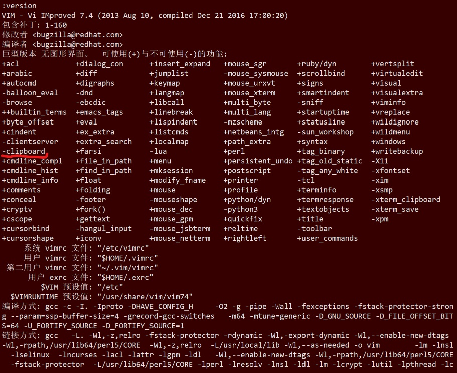
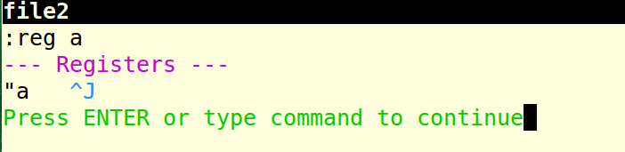
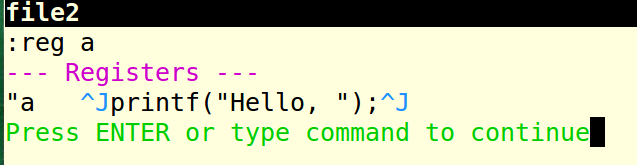
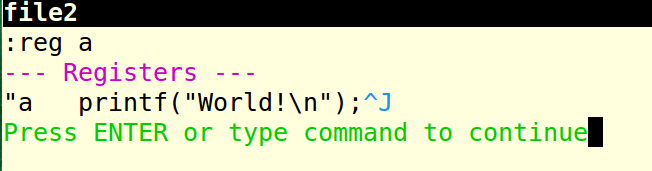
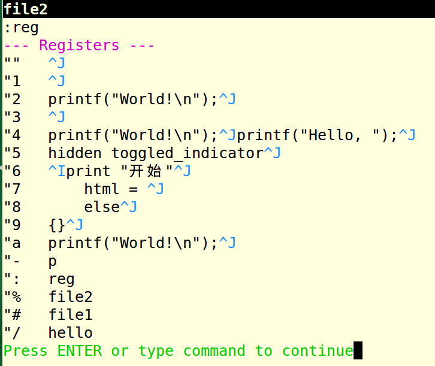

<!-- @import "[TOC]" {cmd="toc" depthFrom=1 depthTo=6 orderedList=false} -->

<!-- code_chunk_output -->

- [1. 官方帮助手册](#1-官方帮助手册)
- [2. 寄存器分类](#2-寄存器分类)
  - [2.1. 无名寄存器(默认寄存器): "](#21-无名寄存器默认寄存器-)
  - [2.2. 复制专用寄存器: 0](#22-复制专用寄存器-0)
  - [2.3. 系统剪切板寄存器: +](#23-系统剪切板寄存器-)
    - [2.3.1. windows](#231-windows)
    - [2.3.2. Linux](#232-linux)
    - [2.3.3. 使用](#233-使用)
  - [2.4. 黑洞寄存器: _](#24-黑洞寄存器-_)
  - [2.5. 命名寄存器: a-z](#25-命名寄存器-a-z)
  - [2.6. 表达式寄存器: =](#26-表达式寄存器-)
  - [2.7. 特定信息寄存器](#27-特定信息寄存器)
- [3. 各种复制粘贴命令说明](#3-各种复制粘贴命令说明)
- [4. 在普通模式中使用寄存器](#4-在普通模式中使用寄存器)
- [5. 在插入模式中使用寄存器](#5-在插入模式中使用寄存器)
- [6. 查看当前寄存器的内容](#6-查看当前寄存器的内容)

<!-- /code_chunk_output -->

参考《vim 实用技巧》第 10 章

# 1. 官方帮助手册

:help registers

:help :registers

# 2. 寄存器分类

首先对 vim 中的寄存器来进行个大致浏览, 它主要分为这么几个部分:

- 1. 无名(unnamed)寄存器: (`"`), 缓存**最后一次操作内容**, **默认寄存器**;

- 2. 数字(numbered)寄存器: (`0 ~ 9`), 缓存最近操作内容, 复制与删除有别, **0 寄存器**缓存最近一次**复制的内容**, 1-9 缓存**最近 9 次删除内容**

- 3. 行内删除(small delete)寄存器: (`-`), 缓存行内删除内容;

- 4. 具名(named)寄存器: (`a ~ z`), 指定时可用;

- 5. 只读(read\-only)寄存器: (`:`), (`.`), (`%`), (`#`), 分别缓存最近命令、最近插入文本、当前文件名、当前交替文件名;

- 6. 表达式(expression)寄存器: (`=`), 只读, 用于执行表达式命令;

- 7. 选择及拖拽(selection and drop)寄存器: (`*`), (`+`), (`~`), 存取 GUI 选择文本, 可用于与外部应用交互, **使用前提为系统剪切板(clipboard)可用**;

>`+`: 系统剪切板寄存器, 关联系统剪切板, 保存在这个寄存器中的内容可以被系统其他程序访问, 也可以通过这个寄存器访问其他程序保存到剪切板中的内容.

- 8. 黑洞(black hole)寄存器: (`_`), 不缓存操作内容(干净删除);

- 9. 模式寄存器(last search pattern): (`/`), 缓存最近的搜索模式.

## 2.1. 无名寄存器(默认寄存器): "

**无名寄存器(")**, 它用一个双引号(")来标识, 这个是我们接触的最多的寄存器了, 如果没有特别指定的话, 复制(y), 剪切(x,s,d,c 和他们的大写), 粘贴(p)命令都会将内容存放到这个寄存器里面, 或是从这个寄存器里面来读取内容.

## 2.2. 复制专用寄存器: 0

**复制专用寄存器(0)**, 就是使用**y 命令复制**的内容都会存放到这个寄存器中, 比如这么一段文本:

```
printf("Hello, ");
printf("world!\n");
```

把光标停留在第一行上, 按下 yy 命令, 将第一行复制, 然后再移到第二行, 按下 dd 命令, 删除第二行. 此时如果我们想要粘贴第一行的内容的话, 直接按 p 是不行的, 因为此时的**p**将引用**无名寄存器**中的内容, 而它的内容已经被**第二行的内容给覆盖**了, 所以此时就轮到**复制专用寄存器**大显身手了, 此时如果按下这个命令:

```
"0p
```

这时, 将会粘贴**复制专用寄存器**中的内容.

## 2.3. 系统剪切板寄存器: +

### 2.3.1. windows

配置文件中添加

```
set clipboard=unnamed
```

添加到~/.vimrc, 注意只在 gvim 有效, 因为 gvim 有一个`+`寄存器, 可以与外部程序共享.

### 2.3.2. Linux

可以下载源码重新编译, 在 configure 的时候增加 --with-features=huge.

你可以卸载 vim , 然后下载源码, 重新编译安装, 配置时使用 ./configure --with-features=huge 就可以使用加号寄存器和系统剪贴板了 但是, 不必这样麻烦, 可以安装一个 vim 的 增强包. 但是, 不是 vim-common(各个 vim 版本共用的库), 也不是什么 vim-gui, 而是/而且只需要 安装 vim-X11(大写的 X), 这个是为了补充/vim 为 X graphic system 使用的. 安装 vim-X11,会 安装一个 vim 的图形程序,即 gvim, 但是这个一般都不习惯使用.(gvim 也同样可以使用 vim 的各种插件,包括 NERDTree 等.) 同时, 会给 vim 添加 加号寄存器, 从而可以使用系统剪贴板. vim-X11 添加一些附加的命令, 比如 evim, gvim 等, 最重要的是这个 vimx 命令, 他就是 在 vim 的基础上增加 x 系统的支持. 即 vimx 是命令行下的 vim 支持系统剪贴板的版本. 所以只要在 gnome-terminal 下, 运行 vimx 就能使 vim 支持 加号寄存器.

最基本的版本是 vi (即 vim -v 就是 vi) , 然后安装 vim-enhanced, 就得到基本增强的 vim 版本, 但是还不能使用系统剪贴板和加号寄存器. 然后, 要安装, vim-X11, 就得到 gvim 软件, 和 vimx 的 +clipboard 和 +xterm-clipboard 版本.

https://harttle.land/2020/09/04/vim-clipboard.html

### 2.3.3. 使用

系统剪贴板寄存器(`+`)和 X11 视窗系统的主剪贴板寄存器(`*`). 众所周知, 任何操作系统都有一个剪贴版板, 而 vim 就是用`+`寄存器来代表这个剪贴版.

复制到系统剪贴板, 这时打开 vim 想要粘贴到 vim 中, 那么只需要这个命令就好了

```
"+p
```

这样就把系统剪贴板中的内容直接贴进 vim 的缓冲区了.

需要声明的一点是这个剪贴板需要 vim 在编译的时候加上 clipboard 这个选项, 想要查看自己的 vim 有没有这个选项, 只要打开 vim, 在 ex 模式下输入 version 命令, 就可以查看自己的 vim 支不支持这个特性了, 如下图所示:



还有一个主剪贴板的寄存器, 这个是在 Linux 下的 X11 视窗系统中才存在的东西, 这个寄存器中存放的就是上次高亮选中的内容.

## 2.4. 黑洞寄存器: _

**黑洞寄存器(`_`)**. 这个寄存器的功能和/**dev/null 设备**非常地相似, 就是将一切输入其中的东西都吞噬掉. 平常我们经常用**x 命令**来删除某个字符, 用**dd 命令**来删除某行, 其实这些都**不是删除**, 是剪贴, 真正的删除应该是这些命令:

```
"_dd         //删除某行
"_x          //删除光标下的字符
```

## 2.5. 命名寄存器: a-z

**命名寄存器(`a-z`)**. 这个一共是 a\-z26 个寄存器, 分别用英文字母来表示.

这个感觉主要需要讲的就是大写字母和小写字母的区别, 当**向寄存器中写入内容**的时候(即**复制或者剪切**的时候), **大写字母**表示的是将**当前要复制的内容追加到寄存器**中, 而**小写字母**表示的是将**当前要复制的内容**将寄存器中的**原有内容**给覆盖掉. 这个可以类比于数据流重定向中的">"和">>"命令.

举个例子, 比如现在有个文件 file2, 其中的内容是这样

```
printf("Hello, ");
printf("World!\n");
```

而 a 寄存器中的内容刚开始是这样:



在第一行上执行了 "Ayy 命令之后, a 寄存器中的内容就变成了这样, 第一行的内容被追加到了寄存器中:



接着我再在第二行上执行 "ayy 命令之后, a 寄存器中的内容就变成了这样, 寄存器中原来的内容都被覆盖掉了:



## 2.6. 表达式寄存器: =

**表达式寄存器(`=`)**. normal 模式下按"=或者插入模式下按<C-r>,=来进入编辑 vim 表达式的模式, 表达式运行的结果将被插入到 vim 的缓冲区中.

## 2.7. 特定信息寄存器

**特定信息的寄存器**, 主要是下面这几个:

- 当前文件名寄存器 (`%`)

- 轮换文件名寄存器 (`#`)

- 上次执行的 ex 命令 (`:`)

- 上次查找的关键字 (`/`)

打开了两个文件 file1 和 file2,然后切换到了 file2,并进行了一次查找, 查找了 hello 关键字, 执行了两次 reg 命令, 第二次 reg 命令执行结果如下图:



最后四行分别就是对应我们上面讲的那四个寄存器, 这里需要注意的的是关键字寄存器(/)比较特殊, 它是可以通过 let 命令来更改的, 具体的执行命令如下:

```
let @/="the"
```

# 3. 各种复制粘贴命令说明

在详细了解这些寄存器之前, 我们还得了解几个和寄存器有关的命令:

```
yy      //复制当前行
yw      //当前光标下面的这个单词
yit     //复制一个 html 标签中的内容
yft     //复制当前行上光标到第一个 t 之间的所有内容
```

# 4. 在普通模式中使用寄存器

在执行**粘贴(p)命令**, 或者**复制(y**)和**剪切(x,s,d,c 和他们的大写)命令**时, 可以在前面**加上** `"{register}`(其中那个{register}代表的是**寄存器的名字**), 这样我们就可以使用相应的寄存器了,

如果**不加**的话, **默认**使用的是**无名寄存器**.

比如, %代表的是文件名寄存器, 存放的是当前**正在编辑的文件名**, 我现在打开了一个文件 file2, 并且正处于普通模式, 此时如果我输入以下内容:

```
"%p  //表示将文件名寄存器的内容粘贴到当前行
```

实现"将 Vim 剪贴板里面的东西粘贴到 Vim 之外的地方?": 只需要将内容复制到剪切板寄存器(+)中即可, 其他程序便可以访问到了.

- `"+yy`  // 复制当前行到系统剪切板

- `"+p`   // 将剪切板内容粘贴到光标后面

- `"ayy`  // 复制当前行到寄存器 a

- `"ap`   // 将寄存器 a 中的内容粘贴到光标后面

系统剪切板中的内容可在其他程序中使用. 上面的复制指令都可以配合剪切板进行操作.

- `"nyw` 复制当前单词到 n 号剪切板(双引号开始)

- `"np` 粘贴 n 号剪切板内容到当前位置后
      `
- `"+Y` 复制当前行到系统剪切板
      `
- `"+ny` 复制当前行加下面 n 行到系统剪切板
      `
- `"+p` 粘贴系统剪切板内容到当前位置后

# 5. 在插入模式中使用寄存器

在插入模式, 当我们按下 \<CTRL\> + r 键, 再加上相应的寄存器的名字, 就可以插入寄存器中的内容了.

比如=代表的是表达式寄存器, 比如我在 vim 中输入如下命令:

```
i           #进入插入模式
<C-r>=      #按下<Ctrl>+r 键, 再按等号键, 此时就可以输入表达式了
```

# 6. 查看当前寄存器的内容

在 ex 模式下输入:reg 或者:dis 命令, 就可以查看当前所有寄存器的内容了.

```
:reg 寄存器名  //查看单个寄存器内容
```
