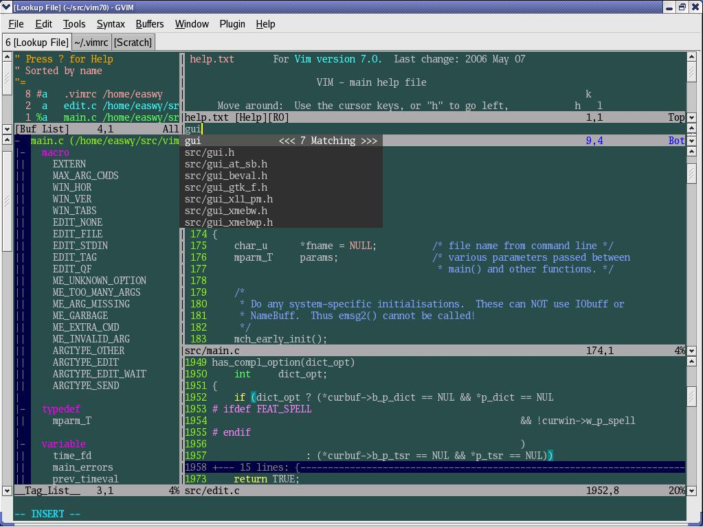
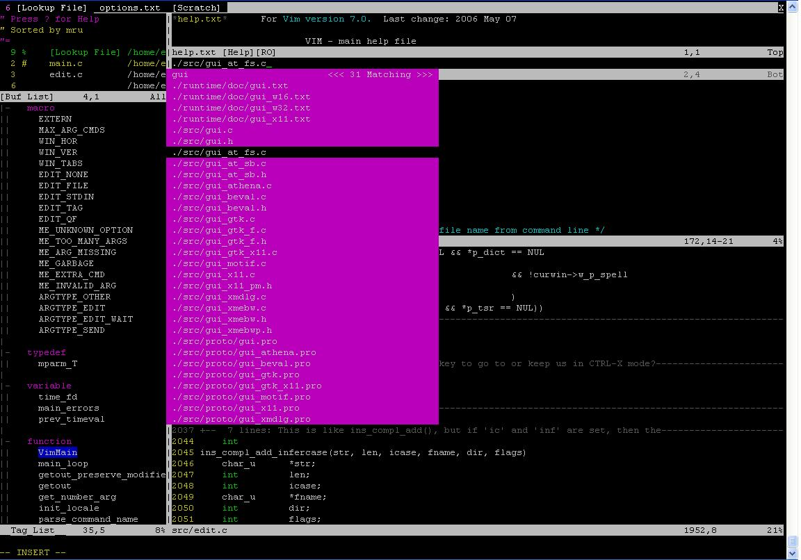

对vim的初学者提一些建议: 

- 如果你的工作以文本编辑(不是指Microsoft word中的文本编辑)为主, 那么学习vim或emacs是值得的; 

- 刚开始使用vim或emacs的经历是很痛苦的, 因为它们可能完全不同于你已经习惯的windows编辑器. 我的建议是: 坚持下去！咬牙坚持下去！你会获得回报的. 

- vim手册 (help files) 是学习如何高效使用vim的重要资源, 一定要多读手册. 如果你是因为害怕读英文手册而不肯学习vim的话, 那么, 到[vim中文文档](http://vimcdoc.sourceforge.net/)下载vim 7.0的中文手册, 安装好后, 再使用":help @cn"命令, 你就可以看到中文手册了. 

- 如果你是第一次接触vim, 那么使用":help tutor"或":help tutor@cn", 你就会看到一个30分钟的vim教程, 会教会你vim的一些基本命令. 

- 有时间的话, 一定要阅读一下Bram Moolenaar(vim的作者)写的Seven habits of effective text editing(七个有效的文本编辑习惯), 你可以知道怎样提高你的编辑效率. 在 http://vimcdoc.sourceforge.net/ 下载PDF格式的手册, 在附录二你可以看到它的中文译本. 

本系列文章都针对vim 7.0版本. 源码[从vim主页](https://vim.sourceforge.io/)可以下载. 

附图是我所使用vim环境, 在这图中, 我打开了三个标签页, 一个是主编程区, 一个是打开的.vimrc文件, 另外一个是草稿区. 在主编程标签页中有几个不同的窗口, 分别是当前打开的buffer, 当前文件中的tag, help窗口, lookupfile窗口, src/main.c和src/edit.c. 其中使用了三个vim插件(plugin): [winmanager](http://easwy.com/blog/archives/advanced-vim-skills-netrw-bufexplorer-winmanager-plugin/), [taglist](http://easwy.com/blog/archives/advanced-vim-skills-taglist-plugin/), [lookupfile](http://easwy.com/blog/archives/advanced-vim-skills-lookupfile-plugin/). 

从这副图中可以看出vim的一些特性: 多标签支持(tab)、多窗口支持、插件支持(plugin)、[语法高亮功能(syntax)](http://easwy.com/blog/archives/advanced-vim-skills-syntax-on-colorscheme/)、[文本折叠功能(folding)](http://easwy.com/blog/archives/advanced-vim-skills-advanced-move-method/)......这些特性, 以及其它数不清的特性, 我都将在后续文章中尽量给予介绍. 

上图是GUI界面的vim, 下图是控制台(console)下的vim的抓图. 使用putty远程登录到linux服务器上, 使用控制台的vim开发软件: 

