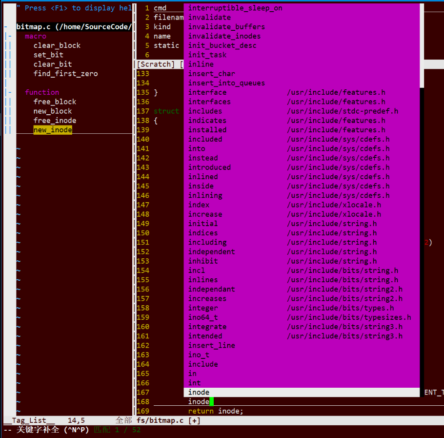

除智能补全外, 最常用的补全方式应该是CTRL-N和CTRL-P补全了. 它们会在当前缓冲区、其它缓冲区, 以及当前文件所包含的头文件中查找以光标前关键字开始的单词. 智能补全不能对局部变量进行补全, 而CTRL-N和CTRL-P补全则可以很好的胜任. 

下图是采用CTRL-P补全的一个例子, 输出字符"pa", 然后按CTRL-P, vim会在下拉菜单中列出所有的匹配功能供选择, 此时再按一下CTRL-P, 就选中了第一个项目, 也就是我想输入的"parmp". 我们第一次输入CTRL-P的是进行补全, 第二次输入的CTRL-P是在下拉菜单中向上选择, 二者的含义是不同的. 



我们知道, CTRL-P一般的含义是向上, 因此CTRL-P补全是向上查找以进行补全, 而CTRL-N是向下查找以进行补全, 在不同场合使用不同的快捷键可以加速补全的速度. 

使用CTRL-N和CTRL-P补全时, 由'complete'选项(set complete)控制vim从哪些地方查找补全的内容. 例如, 对于比较大的软件项目, 文件包含关系复杂, 如果CTRL-N和CTRL-P补全时查找所包含的头文件, 耗时会比较久. 此时, 可以在'complete'选项中去掉'i'标记, 这样CTRL-N和CTRL-P补全就不在头文件中查找了, 速度会快很多; 当然, 弊端就是你无法对头文件中出现的某些内容进行补全了. 'complete'选项中其它标记的含义, 请阅读手册页. 

vim中其它的补全方式包括: 

```
整行补全                        CTRL-X CTRL-L
根据当前文件里关键字补全        CTRL-X CTRL-N
根据字典补全                    CTRL-X CTRL-K
根据同义词字典补全              CTRL-X CTRL-T
根据头文件内关键字补全          CTRL-X CTRL-I
根据标签补全                    CTRL-X CTRL-]
补全文件名                      CTRL-X CTRL-F
补全宏定义                      CTRL-X CTRL-D
补全vim命令                     CTRL-X CTRL-V
用户自定义补全方式              CTRL-X CTRL-U
拼写建议                        CTRL-X CTRL-S 
```

例如, 当我们按下"CTRL-X CTRL-F"时, vim就会弹出下拉菜单, 显示出当前目录下的可选目录和文件, 如下图所示. 这样, 在输入文件名时方便多了. 

可以在vimrc中定义下面的键绑定, 以减少按键次数: 

```
inoremap <C-]>             <C-X><C-]>
inoremap <C-F>             <C-X><C-F>
inoremap <C-D>             <C-X><C-D>
inoremap <C-L>             <C-X><C-L> 
```

SuperTab插件会记住你上次所使用的补全方式, 下次再补全时, 直接使用TAB, 就可以重复这种类型的补全. 比如, 上次你使用CTRL-X CTRL-F进行了文件名补全, 接下来, 你就可以使用TAB来继续进行文件名补全, 直到你再使用上面列出的补全命令进行了其它形式的补全. 这个插件在下面的链接下载: 

http://www.vim.org/scripts/script.php?script_id=1643

可以对下面两个选项进行配置, 以调整SuperTab的缺省行为: 

- g:SuperTabRetainCompletionType的值缺省为1, 意为记住你上次的补全方式, 直到使用其它的补全命令改变它; 如果把它设成2, 意味着记住上次的补全方式, 直到按ESC退出插入模式为止; 如果设为0, 意味着不记录上次的补全方式. 

- g:SuperTabDefaultCompletionType的值设置缺省的补全方式, 缺省为CTRL-P. 
你可以在vimrc中设置这两个变量, 例如: 

```
let g:SuperTabRetainCompletionType = 2
let g:SuperTabDefaultCompletionType = "<C-X><C-O>" 
```

现在你可以使用TAB来进行补全了, 就像在shell中那样, 方便了很多！