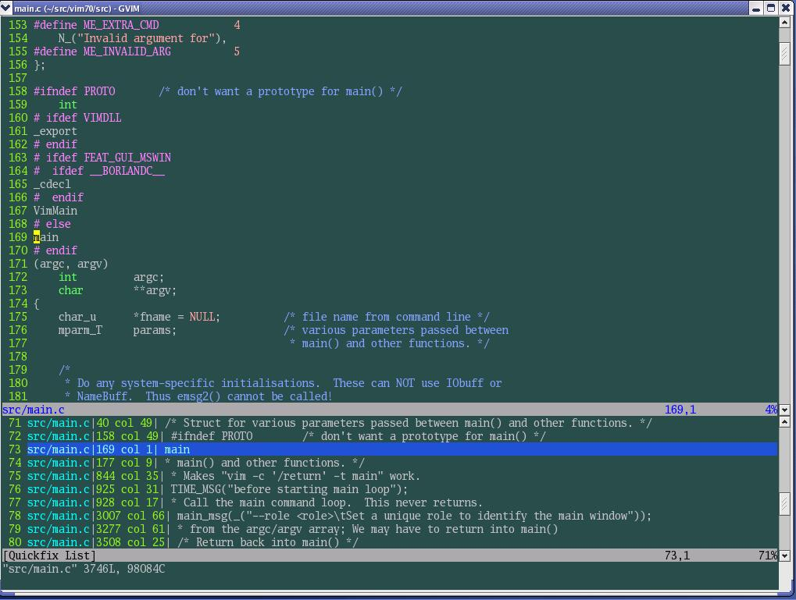

本文介绍了如何使用Exuberant ctags生成tag文件以及在vim中如何使用tag文件进行跳转、查找等操作. 还简要介绍了tag文件的格式, 在后面介绍的Lookupfile插件中, 会利用tag文件便捷的查找、打开文件. 

本节所用命令的帮助入口: 

```
:help 'tags'
:help :tag
:help :tags
:help CTRL-]
:help CTRL-T
:help vimgrep
:help cw
:help pattern 
```

Tag文件(标签文件)无疑是开发人员的利器之一, 有了tag文件的协助, 你可以在vim查看函数调用关系, 类、结构、宏等的定义, 可以在任意标签中跳转、返回......相信使用过Source Insight的人对这些功能并不陌生, 而在vim中, 此功能的实现依赖于tag文件. 

对于程序来说, Tag文件中保存了诸如函数、类、结构、宏等的名字, 它们所处的文件, 以及如何通过Ex命令跳转到这些标签. 它是一个纯文本文件, 因此你可以手工的编辑它, 也可以使用脚本对其进行操作. 

通常我们使用名为ctags的程序来生成这样的tag文件. vim能直接使用ctags程序所生成的tag文件. 在UNIX系统下的ctags功能比较少, 所以一般我们使用Exuberant Ctags(在大多数Linux系统上, 它是缺省的ctags程序), 它能够支持多达33种程序语言, 足以满足我们开发的需要了. [这里](http://easwy.com/blog/archives/exuberant-ctags-chinese-manual/)是它的中文手册. 如果你的系统上未安装此程序, 请到 http://ctags.sourceforge.net 下载. 

emacs则使用etags来生成tag文件, 如果希望vim也能支持etags的tag文件格式, 需要编译vim时加入"+emacs_tags"选项. 在这篇文章介绍了编译vim的方法. 

Tag文件需要遵循一定的格式, 由Exuberant Ctags生成的tag文件, 缺省是如下格式: 

```
{tagname} {TAB} {tagfile} {TAB} {tagaddress} {term} {field} ..  
```

- {tagname} – 标识符名字, 例如函数名、类名、结构名、宏等. 不能包含制表符. 

- {tagfile} – 包含 {tagname} 的文件. 它不能包含制表符. 

- {tagaddress} – 可以定位到 {tagname}光标位置的 Ex 命令. 通常只包含行号或搜索命令. 出于安全的考虑, vim会限制其中某些命令的执行. 

- {term} – 设为 ;" , 这是为了兼容Vi编辑器, 使Vi忽略后面的{field}字段. 

- {field} .. – 此字段可选, 通常用于表示此{tagname}的类型是函数、类、宏或是其它. 
 
在{tagname}、{tagfile}和{tagaddress}之间, 采用制表符(TAB符, 即C语言中的"\t")分隔, 也就是说{tagname}、{tagfile}的内容中不能包含制表符. 

Tag文件的开头可以包含以"!_TAG_"开头的行, 用来在tag文件中加入其它信息. vim能够识别两种这样的标记, 经常用到的是"\_TAG_FILE_SORTED"标记, 例如: 

```
!_TAG_FILE_SORTED<Tab>1<Tab>{anything} 
```

上面这个标记说明tag文件是经过排序的, 并且排序时区分了大小写, 对排序的tag, vim会使用二分法来进行查找, 大大加快了查找速度; 如果值为0, 则表示tag文件未经排序; 如果值为2, 则表示tag文件是忽略大小写排序的. 

之所以在这里介绍tag文件的格式, 是因为我们在后面提到的lookupfile插件中, 会自己生成tag文件. 

虽然ctags有为数众多的选项, 但通常我们所使用的非常简单. 还是以vim 7.0的代码为例, 我们执行: 

```
cd ~/src/vim70
ctags –R src 
```

上面这条命令会在\~/src/vim70/目录下生成一个名为tags的文件, 这个文件中包含\~/src/vim70/src/目录下所有.c、.h文件中的标签. 它一个文本文件, 你可以用vim打开它看一下. 此文件缺省按区分字母大小写排序, 所以直接可以被vim使用. 

现在我们进入vim, 执行下面的命令: 

```
:cd ~/src/vim70	"切换当前目录为~/src/vim70
:set tags=tags	"设置tags选项为当前目录下的tags文件 
```

现在, 我们设置好了tags选项, 接下来我们使用它: 

```
:tag VimMain
```

你会看到vim打开了src/main.c文件, 并把光标定位到第167行VimMain上. 

我们知道, 一般主程序的函数名为main, 如果你尝试下面的命令: 

```
:tag main
# pri kind tag               file
1 F   f    main              src/xxd/xxd.c
main(argc, argv)
2 FS  d    main              src/if_python.c
46
Choice number (<Enter> cancels): 
```

这里并没有src/main.c文件, 怎么回事呢?这是因为ctags并不是编译器, 它在处理编译预处理指令受到局限, 因此并没有生成src/main.c中main()函数的标签. 你可以在生成tag文件时给ctags指定参数来解决这个问题. 见ctags手册. 

或者你可以用":grep"或":vimgrep"来查找main(这篇文章讲解grep及vimgrep的用法): 

```
:cd ~/src/vim70
:vimgrep /\<main\>/ src/*.c
:cw 
```

这时下面的quickfix窗口将显示出来, 在quickfix窗口中找到我们想跳转的位置(本例中是src/main.c), 按回车, 就可以跳到对应的位置了. 



如果你只记得部分的标签名, 那么可以使用"tag"命令的搜索模式, 你可以输入一个vim正则表达式来表示你所查找的名字, 如: 

```
:tag /\C\<\k\+ain\>
# pri kind tag               file
1 F   f    VimMain           src/main.c
VimMain
2 F   d    bindtextdomain    src/vim.h
483
3 F   d    bindtextdomain    src/vim.h
502
4 F   d    bindtextdomain    src/vim.h
504
5 F   f    main              src/xxd/xxd.c
main(argc, argv)
6 F   d    textdomain        src/vim.h
488
7 F   d    textdomain        src/vim.h
510
8 F   d    textdomain        src/vim.h
512
9 FS  d    bindtextdomain    src/gui_gtk.c
54
10 FS  d    bindtextdomain    src/gui_gtk_x11.c
37
11 FS  f    cmdsrv_main       src/main.c
cmdsrv_main(argc, argv, serverName_arg, serverStr)
12 FS  d    main              src/if_python.c
46
13 FS  d    textdomain        src/gui_gtk.c
51
14 FS  d    textdomain        src/gui_gtk_x11.c
34
Choice number (<Enter> cancels): 
```

这表示我想查找一个以一个或多个keyword开始的标签, 此标签以ain做为结尾, 在查找时区分大小写. 要读懂这个正则表达式, 请":help pattern". 

vim会保存一个跳转的标签栈, 以允许你在跳转到一个标签后, 再跳回来, 可以使用":tags"命令查找你处于标签栈的哪个位置. 

我们经常用到的tag跳转命令见下(一般只需要知道CTRL-]和CTRL-T就可以了): 

```
:tag {ident}            "跳转到指定的标签
:tags                   "显示标签栈
CTRL-]                  "跳转到当前光标下的标签
CTRL-T                  "跳到标签栈中较早的标签 
```

如果想了解更多命令, 可以":help 29.1"(强烈建议程序员完整的阅读usr\_29.txt和usr\_30.txt). 

如果想更深入了解tag命令和相关知识, 可以":help tagsrch". 

熟练的使用ctags仅需记住下面七条命令: 

```
1. $ctags –R * ($为linux系统Shell提示符)
2. $ vi –t tag (请把tag替换为您欲查找的变量或函数名)
3. :ts(ts助记字: tagslist, ":"开头的命令为VI中命令行模式命令)
4. :tp(tp助记字: tagspreview)---此命令不常用, 可以不用记
5. :tn(tn助记字: tagsnext) ---此命令不常用, 可以不用记
6. Ctrl+ ]跳到光标所在函数或者结构体的定义处
7. Ctrl+ T返回查找或跳转
```

下面我们逐条的解释上面的命令: 

- "$ctags –R \*": "-R"表示递归创建, 也就包括源代码根目录(当前目录)下的所有子目录. "\*"表示所有文件. 这条命令会在当前目录下产生一个"tags"文件, 当用户在**当前目录中**运行vi时, 会自动载入此tags文件. 

Tags文件中包括这些对象的列表: 用#define定义的宏枚举型变量的值函数的定义、原型和声明名字空间(namespace)类型定义(typedefs)变量(包括定义和声明)类(class)、结构(struct)、枚举类型(enum)和联合(union)类、结构和联合中成员变量或函数VIM用这个"tags"文件来定位上面这些做了标记的对象. 

剩下的命令就是定位这些对象的方法: 

- "$vi –t tag" : 在运行vim的时候加上"-t"参数, 例如: [/usr/src]$vim -t main这个命令将打开定义"main"(变量或函数或其它)的文件, 并把光标定位到这一行. 

- 如果这个变量或函数有多处定义, 在VI命令行模式": ts"命令就能列出一个列表供用户选择. ": tp"为上一个tag标记文件, ": tn"为下一个tag标记文件. 当然, 若当前tags文件中用户所查找的变量或函数名只有一个, ":tp,:tn"命令不可用. (最方便的方法是把光标移到变量名或函数名上, 然后按下"Ctrl+]", 这样就能直接跳到这个变量或函数定义的源文件中, 并把光标定位到这一行. 用"Ctrl+T"可以退回原来的地方. 即使用户使用了N次"Ctrl+]"查找了N个变量, 按N次"Ctrl+t"也能回到最初打开的文件, 它会按原路返回 ). 

- 注意: 运行vim的时候, 必须在"tags"文件所在的目录下运行. 否则, 运行vim的时候还要用":set tags="命令设定"tags"文件的路径, 这样vim才能找到"tags"文件. 在完成编码时, 可以手工删掉tags文件. 

- 有时候系统提示"找不到tag"时不要一味着急, 有可能你想要查询的函数是系统函数, 可以使用Shift+K来查询.  
