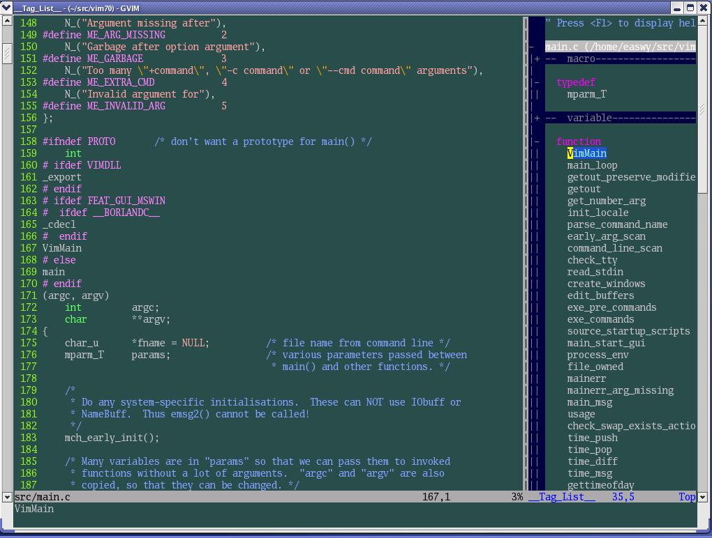

TagList插件,是一款基于ctags,在vim代码窗口旁以分割窗口形式(如上图所示)显示当前的代码结构概览,增加代码浏览的便利程度的vim插件.

本节所用命令的帮助入口: 

```
:help helptags
:help taglist.txt 
```

上篇文章介绍了在vim中如何使用tag文件, 本文主要介绍如何使用taglist插件(plugin). 

想必用过Source Insight的人都记得这样一个功能: SI能够把当前文件中的宏、全局变量、函数等tag显示在Symbol窗口, 用鼠标点上述tag, 就跳到该tag定义的位置; 可以按字母序、该tag所属的类或scope, 以及该tag在文件中出现的位置进行排序; 如果切换到另外一个文件, Symbol窗口更新显示这个文件中的tag. 

在vim中的taglist插件所实现的就是上述类似的功能, 有些功能比SI弱, 有些功能比SI更强. 而且, taglist插件还在不断完善中！

要使用taglist plugin, 必须满足: 

- 打开vim的文件类型自动检测功能: filetype on

- 系统中装了Exuberant ctags工具, 并且taglist plugin能够找到此工具(因为taglist需要调用它来生成tag文件)

- 你的vim支持system()调用

在文章《vimrc初步》中, 我们使用了vim自带的示例vimrc, 这个vimrc中已经打开了文件类型检测功能; 在上篇文章中, 我们也已用到了Exuberant ctags; system()调用在一般的vim版本都会支持(suse Linux发行版中出于安全考虑, 关闭了此功能), 所以我们已经满足了这三个条件. 

现在我们到 http://www.vim.org/scripts/script.php?script_id=273 下载最新版本的taglist plugin, 目前版本是4.3. 

下载后, 把该文件在\~/.vim/目录中解压缩, 这会在你的\~/.vim/plugin和\~/.vim/doc目录中各放入一个文件: 

```
plugin/taglist.vim – taglist插件
doc/taglist.txt    - taglist帮助文件 
```

使用下面的命令生成帮助标签(下面的操作在vim中进行): 

```
:helptags ~/.vim/doc 
```

生成帮助标签后, 你就可以用下面的命令查看taglist的帮助了: 

```
:help taglist.txt 
```

Taglist提供了相当多的功能, 我的vimrc中这样配置: 

```
""""""""""""""""""""""""""""""
" Tag list (ctags)
""""""""""""""""""""""""""""""
if MySys() == "windows"                "设定windows系统中ctags程序的位置
let Tlist_Ctags_Cmd = 'ctags'
elseif MySys() == "linux"              "设定linux系统中ctags程序的位置
let Tlist_Ctags_Cmd = '/usr/bin/ctags'
endif
let Tlist_Show_One_File = 1            "不同时显示多个文件的tag, 只显示当前文件的
let Tlist_Exit_OnlyWindow = 1          "如果taglist窗口是最后一个窗口, 则退出vim
let Tlist_Use_Right_Window = 1         "在右侧窗口中显示taglist窗口 
```

这样配置后, 当你输入":TlistOpen"时, 显示如下窗口: 



在屏幕右侧出现的就是taglist窗口, 你从中可以看到在main.c文件中定义的所有tag: 宏、定义、变量、函数等; 你也可以双击某个tag, 跳到该tag定义的位置; 你还可以把某一类的tag折叠起来(使用了vim的折行功能), 方便查看, 就像上图中macro和variable那样. 更多的功能, 请查看taglist的帮助页, 本文也会介绍一些常用功能. 

下面介绍常用的taglist配置选项, 你可以根据自己的习惯进行配置: 

- Tlist_Ctags_Cmd选项用于指定你的Exuberant ctags程序的位置, 如果它没在你PATH变量所定义的路径中, 需要使用此选项设置一下; 

- 如果你不想同时显示多个文件中的tag, 设置Tlist_Show_One_File为1. 缺省为显示多个文件中的tag; 

- 设置Tlist_Sort_Type为"name"可以使taglist以tag名字进行排序, 缺省是按tag在文件中出现的顺序进行排序. 按tag出现的范围(即所属的namespace或class)排序, 已经加入taglist的TODO List, 但尚未支持; 

- 如果你在想taglist窗口是最后一个窗口时退出vim, 设置Tlist_Exit_OnlyWindow为1; 

- 如果你想taglist窗口出现在右侧, 设置Tlist_Use_Right_Window为1. 缺省显示在左侧. 

- 在gvim中, 如果你想显示taglist菜单, 设置Tlist_Show_Menu为1. 你可以使用Tlist_Max_Submenu_Items和Tlist_Max_Tag_Length来控制菜单条目数和所显示tag名字的长度; 
- 缺省情况下, 在双击一个tag时, 才会跳到该tag定义的位置, 如果你想单击tag就跳转, 设置Tlist_Use_SingleClick为1; 

- 如果你想在启动vim后, 自动打开taglist窗口, 设置Tlist_Auto_Open为1; 

- 如果你希望在选择了tag后自动关闭taglist窗口, 设置Tlist_Close_On_Select为1; 

- 当同时显示多个文件中的tag时, 设置Tlist_File_Fold_Auto_Close为1, 可使taglist只显示当前文件tag, 其它文件的tag都被折叠起来. 

- 在使用:TlistToggle打开taglist窗口时, 如果希望输入焦点在taglist窗口中, 设置Tlist_GainFocus_On_ToggleOpen为1; 

- 如果希望taglist始终解析文件中的tag, 不管taglist窗口有没有打开, 设置Tlist_Process_File_Always为1; 

- Tlist_WinHeight和Tlist_WinWidth可以设置taglist窗口的高度和宽度. Tlist_Use_Horiz_Window为1设置taglist窗口横向显示; 

在**taglist窗口**中, 可以使用下面的快捷键: 

```
<CR>(回车)    跳到光标下tag所定义的位置, 用鼠标双击此tag功能也一样
o             在一个新打开的窗口中显示光标下tag
p             预览标记定义(仍然在taglist窗口)
<Space>       显示光标下tag的原型定义
u             更新taglist窗口中的tag
s             更改排序方式, 在按名字排序和按出现顺序排序间切换
x             taglist窗口放大和缩小, 方便查看较长的tag
+             打开一个折叠, 同zo
-             将tag折叠起来, 同zc
*             打开所有的折叠, 同zR
=             将所有tag折叠起来, 同zM
[[            跳到前一个文件
]]            跳到后一个文件
q             关闭taglist窗口
<F1>          显示帮助 
d             删除光标所在的taglist文件
              (如用vi打开了两个文件f1.c,f2.c可以删除f1.c的标记)
```

可以用":TlistOpen"打开taglist窗口, 用":TlistClose"关闭taglist窗口. 或者使用":TlistToggle"在打开和关闭间切换. 在我的vimrc中定义了下面的映射, 使用<F9>键就可以打开/关闭taglist窗口: 

```
map <silent> <F9> :TlistToggle<cr> 
```

Taglist插件还提供了很多命令, 你甚至可以用这些命令创建一个taglist的会话, 然后在下次进入vim时加载此会话. 

Taglist插件还可以与winmanager插件协同使用, 这将在下篇文章中介绍. 