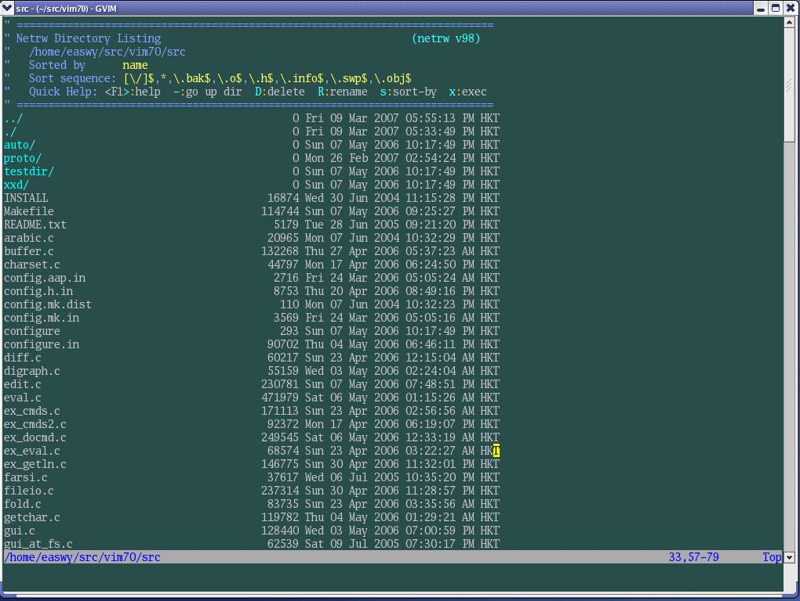
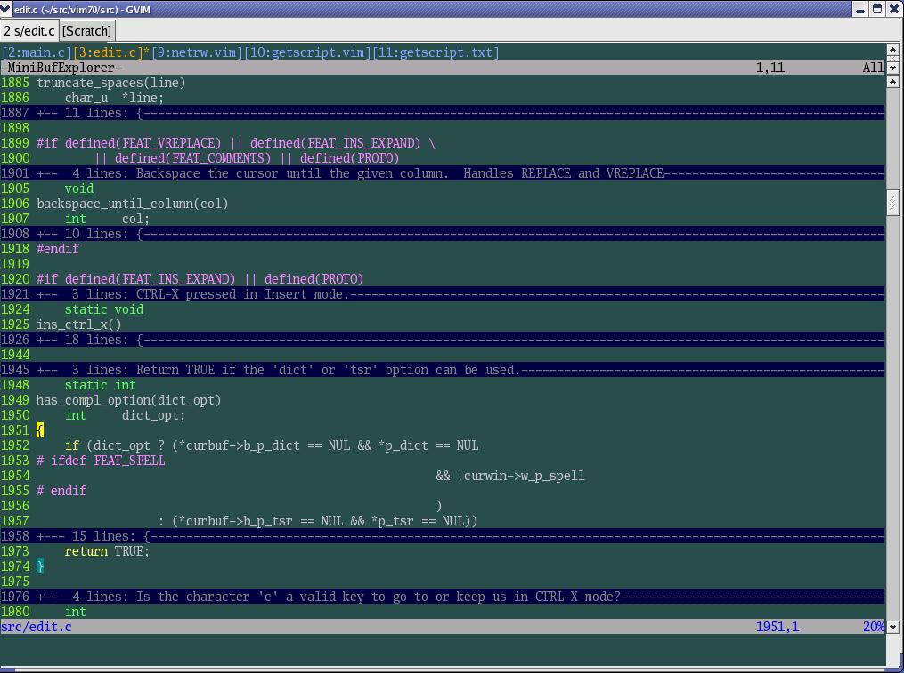
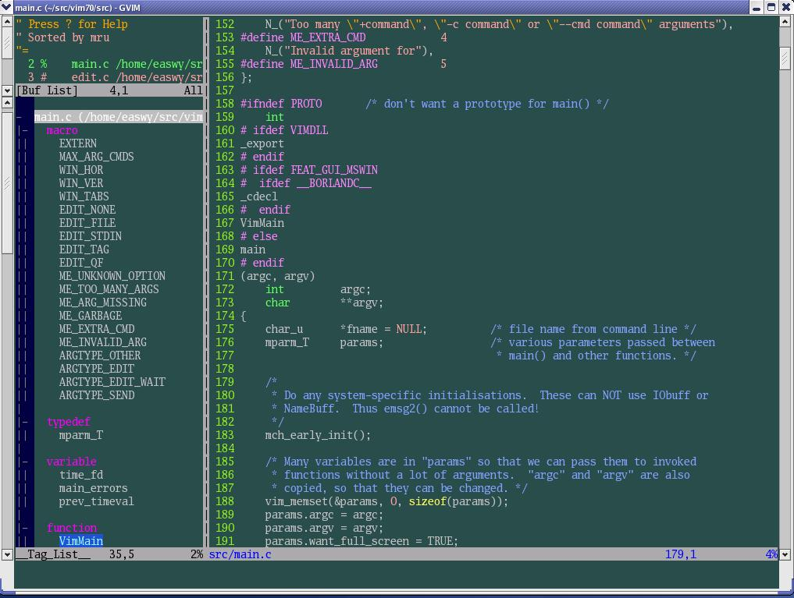

本节介绍了如何在vim中浏览文件, 以及如何查看当前打开的缓冲区. 利用netrw插件, 可以方便的在vim中浏览各个目录、打开指定文件, 而不用切换到文件浏览器或shell; 当然, netrw插件的作用并不仅仅局限于此. 利用bufexplorer插件, 则可以方便的查看打开的缓冲区(buffer), 在缓冲区间进行切换. 本文的最后介绍了winmanager插件, 使用这个插件, 可以把netrw插件、bufexplorer插件和taglist插件整合起来, 使vim看起来更像一个集成开发环境(IDE). 

本节所用命令的帮助入口: 

```
:help netrw-browse
:help bufexplorer
:help winmanager 
```

### [文件浏览]

在开发过程中, 经常需要查找某个文件. 我们前面在介绍path选项时, 介绍过使用find命令查找文件的方法. 本节介绍vim的文件浏览插件. 

在vim 7.0以前, 文件浏览功能由explorer.vim插件提供, 在vim 7.0中, 这个插件被netrw.vim插件所代替. 本文以vim 7.0为例, 主要介绍netrw.vim插件. 

netrw.vim是vim的标准插件, 它已经伴随vim而发行, 不需要安装. 

我们现在试一下vim文件功能, 当你使用vim尝试打开目录时, vim会自动调用netrw.vim插件打开该目录(从操作系统的视角来看, 目录其实是一种特殊的文件). 例如, 我们在vim中执行命令":e ~/src/vim70/src/", 会显示下面的窗口: 



这个窗口类似于文件管理器, 你可以创建、删除、改名文件或目录; 在目录上按回车时, 会进入该目录; 在文件上按回车时, 会使用vim打开该文件; 可以更改排序方式、排序风格; 隐藏目录或文件(使之不在上述窗口中显示)等等. 

Netrw插件中常用键绑定有: 

```
<F1>        显示帮助
<cr>        如果光标下为目录, 则进入该目录; 如果光标下是文件, 则用vim打开该文件
-           返回上级目录
c           切换vim的当前工作目录为正在浏览的目录
d           创建目录 
D           删除文件或目录
i           切换显示方式
R           改名文件或目录
s           选择排序方式
x           定制浏览方式, 使用你指定的程序打开该文件 
```

其它常用键, 诸如使用书签、隐藏符合条件的文件等, 请参阅netrw帮助页. 

上面我们用":e ~/src/vim70/src/"的方式打开netrw, 我们还可以使用":Explore"等Ex命令来打开文件浏览器. 我的vimrc中这样配置: 

```
""""""""""""""""""""""""""""""
" netrw setting
""""""""""""""""""""""""""""""
let g:netrw_winsize = 30
nmap <silent> <leader>fe :Sexplore!<cr> 
```

这样, 在我输入",fe"时, 就会打开一个垂直分隔的窗口浏览当前文件所在的目录, 窗口的宽度为30. 

浏览本地文件只是netrw插件的一项小功能, netrw插件最主要的功能是支持远程文件读写. 利用该插件, 你可以通过ftp, ssh, http等多种协议来编辑远程文件, 也可以浏览远程机器的目录. 

在软件开发过程中不常使用此功能, 本文中不再介绍. 参阅netrw手册页获取更多信息. 

### [缓冲区浏览]

在开发过程中, 经常会打开很多缓冲区, 尤其是使用tag文件在不同函数间跳转时, 会不知不觉打开很多文件. 要知道自己当前打开了哪些缓冲区, 可以使用vim的":ls"Ex命令查看. 

开发过程中, 又经常需要在不同文件间跳转. 我习惯于使用"CTRL-^"来切换文件, 这就需要知道文件所在的缓冲区编号. 每次都使用":ls"来找缓冲区编号很麻烦, 所以我使用BufExplorer插件来显示缓冲区的信息. 

BufExplorer插件在此处下载: http://vim.sourceforge.net/scripts/script.php?script_id=42

下载后, 把该文件在~/.vim/目录中解压缩, 这会在你的~/.vim/plugin和~/.vim/doc目录中各放入一个文件: 

```
plugin/ bufexplorer.vim - bufexplorer插件
doc/ bufexplorer.txt    - bufexplorer帮助文件 
```

使用下面的命令生成帮助标签(下面的操作在vim中进行): 

```
:helptags ~/.vim/doc 
```

然后, 就可以使用":help bufexplorer"命令查看BufExplorer的帮助文件了. 

BufExplorer功能比较简单, 这里就不做介绍了. 我的vimrc里这样设置BufExplorer插件: 

```
""""""""""""""""""""""""""""""
" BufExplorer
""""""""""""""""""""""""""""""
let g:bufExplorerDefaultHelp=0       " Do not show default help.
let g:bufExplorerShowRelativePath=1  " Show relative paths.
let g:bufExplorerSortBy='mru'        " Sort by most recently used.
let g:bufExplorerSplitRight=0        " Split left.
let g:bufExplorerSplitVertical=1     " Split vertically.
let g:bufExplorerSplitVertSize = 30  " Split width
let g:bufExplorerUseCurrentWindow=1  " Open in new window.
autocmd BufWinEnter \[Buf\ List\] setl nonumber 
```

BufExplorer已经映射了几个键绑定, 例如, 使用",bv"就可以打开一个垂直分割窗口显示当前的缓冲区. 

有一个称为minibufexpl.vim的插件, 也可以把缓冲区列表显示出来, 这个插件在此处下载: http://vim.sourceforge.net/scripts/script.php?script_id=159

使用这个插件后, 屏幕截图看起来是这样, 最上面一个窗口就是minibuffer窗口, 列出了当前打开的缓冲区: 



这个插件没有帮助文件, 参考下载页上的说明, 以及脚本代码来进行配置. 

### [winmanager插件]

winmanager插件可以把上面介绍的Explorer插件(vim 7.0以前的文件浏览插件)和BufExplorer插件集成在一起, 我们上篇文章中介绍过的taglist插件也提供了对winmanager插件的支持. 

Winmanager插件在这里下载: http://vim.sourceforge.net/scripts/script.php?script_id=95

下载后, 把该文件在\~/.vim/目录中解压缩, 这会把winmanager插件解压到\~/.vim/plugin和~/.vim/doc目录中: 

```
plugin/winmanager.vim – winmanager插件
plugin/winfileexplorer.vim  - 改良的Explorer插件
plugin/wintagexplorer.vim – winmanager提供的tag插件, 用处不大
doc/winmanager.txt – 帮助文件 
```

仍然用":helptags \~/.vim/doc"命令来生成帮助标签, 然后就可以使用":help winmanager"来查看帮助了. 

使用winmanager插件可以控制各插件在vim窗口中的布局显示. 我的vimrc中这样设置: 

```
""""""""""""""""""""""""""""""
" winManager setting
""""""""""""""""""""""""""""""
let g:winManagerWindowLayout = "BufExplorer,FileExplorer|TagList"
let g:winManagerWidth = 30
let g:defaultExplorer = 0
nmap <C-W><C-F> :FirstExplorerWindow<cr>
nmap <C-W><C-B> :BottomExplorerWindow<cr>
nmap <silent> <leader>wm :WMToggle<cr> 
```

g:winManagerWindowLayout变量的值定义winmanager的窗口布局, 使用上面的设置, 我们的窗口布局看起来是这样的: 



左边有两个窗口, 上面的是BufExplorer窗口, 下面是taglist窗口. FileExplorer窗口和BufExplorer共用一个窗口, 在BufExplorer窗口中使用"CTRL-N"可以切换到FileExplorer窗口, 再使用一次则又切换回BufExplorer窗口. 也就是说, 在变量g:winManagerWindowLayout中, 使用","分隔的插件, 在同一个窗口中显示, 使用"CTRL-N"在不同插件间切换; 使用"|"分隔的插件, 则在另外一个窗口中显示. 

在屏幕右边的窗口则是主编辑区. 

在上面的vimrc设置中, 还定义了三个键映射, 分别用于跳到左上窗口、左下窗口, 以及显示/关闭winmanager窗口. 

注: 安装后, 如果未设置g:winManagerWindowLayout变量, winmanager插件需要与BufExplorer插件一起才能使用. 所以需要下载BufExplorer. 

在 http://vim.sourceforge.net/scripts/script.php?script_id=1440 有一个winmanager插件的修改版本, 如果在FileExplorer中打开文件时, 它会使用与该文件相关联的程序来打开该文件, 而不是使用vim. 我没有使用过这个插件, 有兴趣你可以试试. 