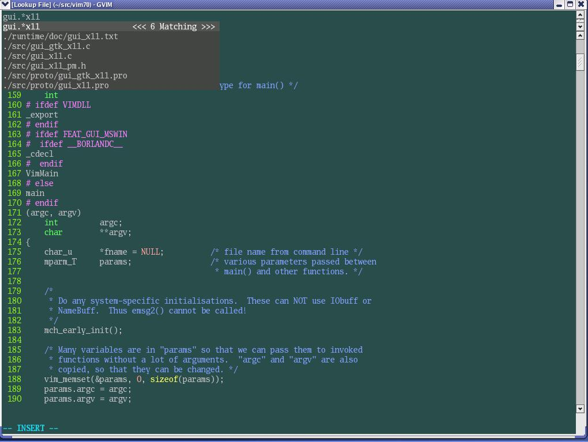

如果你在开发一个大的项目, 当你想在一大堆文件中查找或者编辑指定文件时, Lookupfile插件是必不可少的. 使用它, 可以快速查找项目文件、可以在缓冲区查找指定文件、可以浏览指定目录等. 在查找时甚至可以使用正则表达式(regex), 在你只记得部分文件名或目录名时, 这可是救命的手段. 

本节所用命令的帮助入口: 

```
:help lookupfile
```

在文章<保存项目相关配置>中, 我们讲过通过":find"命令打开指定的文件, 不过使用":find"命令并不是非常的方便: 一是如果项目比较大、文件比较多, find查找起来很慢; 二是必须输入全部的文件名, 不能使用正则表达式(regex)查找. 

我们也介绍过vim提供的<文件浏览>插件, 你可以在浏览器中根据目录去查找, 但这种方式在浏览目录时比较方便, 查找一个已知名字(或知道部分名字)的文件效率就比较低了. 

相比之下, 在source insight中查找文件非常简单, 只要输入部分的文件名, 就可以找到符合条件的文件. 

我一直被这个问题所困扰, 直到有一天, 在http://www.vim.org/上发现了一个非常出色的插件, 才彻底解决了查找文件效率低下的问题, 它的功能毫不逊于source insight. 这个插件是: lookupfile！

Lookupfile插件可以在下面的链接下载: http://www.vim.org/scripts/script.php?script_id=1581

它使用vim 7.0中插入模式下的下拉菜单补全功能, 因此只能在vim 7.0及以上版本中使用. 

下载该插件后, 把它解压到你的~/.vim目录中, 就完成了安装. 然后在vim中执行":helptags ~/.vim/doc"命令, 生成help文件索引, 然后就可以使用":help lookupfile"命令查看lookupfile插件的帮助文件了. 

注: windows用户需要把这个插件解压在你的$vim/vimfiles或$HOME/vimfiles目录. 

Lookupfile插件还需要最新的genutils支持, 因此, 需要下载genutils: http://www.vim.org/scripts/script.php?script_id=197

这个插件提供了一些通用的函数, 可供其它的脚本使用. 它的安装方法也是在~/.vim目录解压就可以了. 需要注意的是, 最新版本的genutils使用了新的自动加载方式, 所以和以前的版本不兼容. 如果你的其它插件需要使用genutils的旧版本的话, 你需要参照genutils的说明进行配置, 以便使新旧两个版本能协同工作. 

现在我们介绍lookupfile插件. 虽然名字为lookupfile, 其实这个插件它不仅能用来查找文件, 还可以在打开的缓冲区中查找, 按目录查找, 等等. 

### [项目文件查找]

Lookupfile在查找文件时, 需要使用tag文件. 它可以使用ctags命令生成的tag文件, 不过查找效率会比较低. 因此我们会专门为它生成一个包含项目中所有文件名的tag文件. 

我编写了下面的shell脚本, 为vim70的源代码, 生成一个文件名tag文件. 

```
#!/bin/sh
# generate tag file for lookupfile plugin
echo -e "!_TAG_FILE_SORTED\t2\t/2=foldcase/" > filenametags
find . -not -regex '.*\.\(png\|gif\)' -type f -printf "%f\t%p\t1\n" | \
    sort -f >> filenametags 
```

回想一下我们在"使用标签(tag)文件"一文中介绍的tag文件的格式. 再对照脚本命令来看: 

- echo命令用来生成filenametags文件中的"!_TAG_FILE_SORTED"行, 表明此tag文件是经过排序的. 

- find命令用来查找所有类型为普通文件, 文件后缀名不是.png和.gif的文件, 找到的文件按"文件名\t文件路径\t1″的格式输出出来. 

- sort命令则把find命令的输出重新排序, 然后写入filenametags文件中

在\~/src/vim70/目录下运行该脚本, 会生成一个名为filenametags的文件, 包含了vim70目录下的所有文件的名字及其所在目录. 

现在我们需要让lookupfile插件知道到哪去找文件名tag文件. 我们假定vim当前工作目录为~/src/vim70/, 执行下面的命令: 

```
:let g:LookupFile_TagExpr = '"./filenametags"' 
```

注: 如果不设定g:LookupFile_TagExpr的值, 那么lookupfile插件会以tags选项定义的文件作为它的tag文件. 

现在我们就可以使用lookupfile来打开文件了, 按"<F5>"或输入":LookupFile"在当前窗口上方打开一个lookupfile小窗口, 开始输入文件名(至少4个字符), 随着你的输入, 符合条件的文件就列在下拉列表中了. 文件名可以使用vim的正则表达式, 这大大方便了文件的查找. 你可以用"CTRL-N"和"CTRL-P"(或者用上、下光标键)来在下拉列表中选择你所需的文件. 选中文件后, 按回车, 就可以在之前的窗口中打开此文件. 

下图是使用lookupfile插件查找文件的一个例子: 

