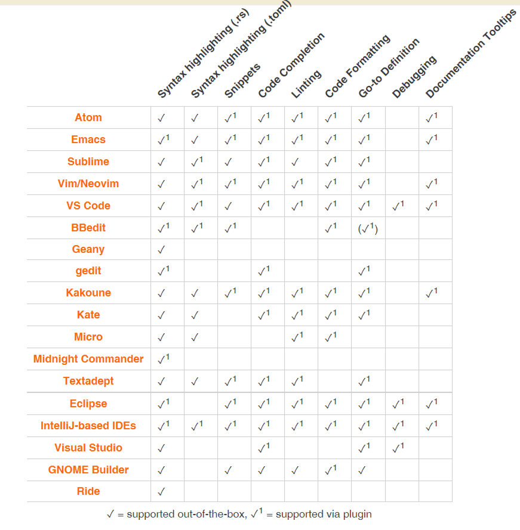
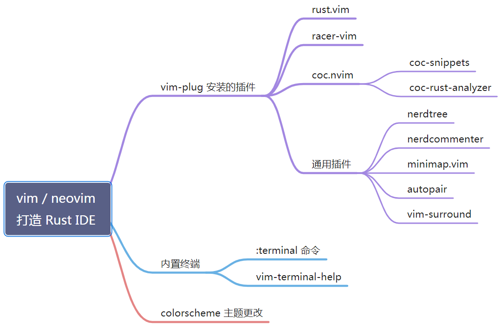

<!-- @import "[TOC]" {cmd="toc" depthFrom=1 depthTo=6 orderedList=false} -->

<!-- code_chunk_output -->

- [1. 安装软件](#1-安装软件)
- [剪切板](#剪切板)
- [2. 下载字体](#2-下载字体)
- [3. 下载 vim 配置](#3-下载-vim-配置)
- [4. 功能开启](#4-功能开启)
- [5. complete 功能](#5-complete-功能)
  - [5.1. asynccomplete](#51-asynccomplete)
  - [5.2. YouCompleteMe](#52-youcompleteme)
    - [5.2.1. rust 支持 (optional)](#521-rust-支持-optional)
- [lsp 功能](#lsp-功能)
  - [项目配置](#项目配置)
    - [法一: compile_commands.json](#法一-compile_commandsjson)
      - [基于 CMake 的项目](#基于-cmake-的项目)
      - [基于其它构建系统的项目](#基于其它构建系统的项目)
    - [法二: compile_flags.txt](#法二-compile_flagstxt)
- [6. Rust(Optional)](#6-rustoptional)
  - [6.1. 语法增强](#61-语法增强)
  - [6.2. 代码片段](#62-代码片段)
  - [6.3. 代码 补全 | 检查 | 跳转 利器](#63-代码-补全--检查--跳转-利器)
- [7. reference](#7-reference)

<!-- /code_chunk_output -->

参照: https://www.zhihu.com/people/tracyone/posts

# 1. 安装软件

```
sudo apt-get install exuberant-ctags cscope git wmctrl fonts-powerline ccls build-essential cmake python3-dev vim-athena npm pip curl git zsh pycodestyle bear xorg lightdm
```

或者 `vim-gtk3` 并添加 `export DISPLAY=:10.0`

# 剪切板

或者 `vim-gtk3` 并添加 `export DISPLAY=:10.0`

开启 SSHD X 转发, 修改 SSHD 配置文件 / etc/ssh/sshd_config, 找到下面按需求取消注释进行启用

```
# 开启 X 图形转发. yes 开启转发, no 关闭转发.
X11Forwarding yes
# 设置显示编号, 从 10 开始. 当第一个用户连接使用 10, 第二个用户则 11, 以此类推.
X11DisplayOffset 10
# 设置 SSHD 本地监听方式, yes 使用 unix 套接字, no 使用网络模式.
X11UseLocalhost yes
```

```
export DISPLAY=:10.0
```

检查系统当前使用的显示管理器:

```
# cat /etc/X11/default-display-manager
/usr/sbin/gdm3
```

sudo systemctl enable --now gdm3

```
# 确保 SSH 客户端启用 X 转发
ssh -X user@host
```

systemctl status display-manager

systemctl status gdm3

apt reinstall xserver-xorg

startx

​验证 X11 功能:

```bash
xclock
```


# 2. 下载字体

`https://github.com/Magnetic2014/YaHei-Consolas-Hybrid-For-Powerline/raw/master/YaHei%20Consolas%20Hybrid%201.12%20For%20Powerline.ttf`

```
mkdir /usr/share/fonts/YaHei

chmod -R 755 /usr/share/fonts/YaHei

fc-cache

fc-list  | grep -i yahei
```

# 3. 下载 vim 配置

```
git clone https://github.com/haiwei-li/vinux.git ~/.vim
```

# 4. 功能开启

打开任意文件, 会下载一部分插件, 然后 `<SPC>fe`, 输入 all, 打开所有的, 会自动下载插件

结束后, 修改 `~/.vim/feature.vim`

`let g:feat_enable_fun=0`, 关闭番茄时钟

`let g:fuzzysearcher_plugin_name.cur_val='fzf'`, 启用悬浮窗口

内嵌终端:

- 空格 av, 悬浮

- 空格 as, 下面

- 空格 ns, 新 buffer

悬浮窗口有限制不能跳转, 非悬浮的可以用 alt-k

easy motion:

normal 模式按下大写 W, 然后按对应的字母就能跳过去. 按下空格 jw 是整个文件

```
let g:vinux_coding_style.cur_val='linux'
let g:feat_enable_writing=1
let g:feat_enable_tools=1
let g:feat_enable_airline=1
let g:vinux_plugin_dir.cur_val='/root/.vim/bundle/'
let g:feat_enable_frontend=1
let g:fuzzy_matcher_type.cur_val='py-matcher'
let g:enable_auto_plugin_install.cur_val='on'
"let g:feat_enable_lsp=0
let g:feat_enable_vim=1
let g:git_plugin_name.cur_val='vim-fugitive'
let g:enable_powerline_fonts.cur_val='on'
let g:feat_enable_edit=1
let g:grepper_plugin.cur_val='neomake-multiprocess'
let g:feat_enable_c=1
let g:tagging_program.cur_val='cscope'
let g:feat_enable_jump=1
let g:feat_enable_basic=1
let g:ctrlp_caching_type.cur_val='limit'
let g:feat_enable_fun=0
let g:enable_sexy_mode.cur_val='off'
let g:feat_enable_gui=1
let g:feat_enable_tmux=1
"let g:fuzzysearcher_plugin_name.cur_val='ctrlp'
let g:fuzzysearcher_plugin_name.cur_val='fzf'
let g:complete_plugin_type.cur_val='YouCompleteMe'
"let g:complete_plugin_type.cur_val='asyncomplete.vim'
let g:feat_enable_complete=1
let g:feat_enable_markdown=1
let g:feat_enable_zsh=1
let g:feat_enable_git=1
let g:feat_enable_help=1
let g:vinux_version='vinux V1.2.0-dev @8.2.2434'
```

# 5. complete 功能

```
let g:feat_enable_complete=1
```

## 5.1. asynccomplete

`let g:complete_plugin_type.cur_val='asyncomplete.vim'`

vim8 以上, 这个是支持 lsp 功能的

## 5.2. YouCompleteMe

```
let g:complete_plugin_type.cur_val='YouCompleteMe'
```

vim 应该 enable `+python` 或者 `+python3` feature; YouCompleteMe 不支持 lsp

这个比较难以编译, 所以只是安装没有编译.

YouCompleteMe 相关设置在 `rc/complete.vim` 中

安装参考: https://github.com/ycm-core/YouCompleteMe#linux-64-bit

现在 C-family 的支持开始使用 clangd, 替换掉 libclang.

```
apt install build-essential cmake python3-dev
```

```
cd ~/.vim/bundle/YouCompleteMe
git submodule update --init --recursive
```

```
python3 install.py --clangd-completer
```


### 5.2.1. rust 支持 (optional)

* rust 源码: rust src
* 补全工具: rust analyzer

> YCM 使用了 rust analyzer, 所以不依赖 racer? 不用安装 racer?? `cargo install racer`

YCM 目前已经不用 rls 了, 而是使用 rust-analyzer 作为工具链 (因为 Rust 社区决定使用 rust-analyzer)

所以直接安装使用

```
python3 install.py --clang-completer --system-libclang --rust-completer
```

* 自动下载 rust-analyzer binary 到 `./third_party/ycmd/third_party/rust-analyzer/bin/rust-analyzer`
* 自动下载 rust src 到 `./third_party/ycmd/third_party/rust-analyzer/bin/rust-analyzer/lib/rustlib/src/rust/src`

YCM 不需要额外配置, 自动识别这两个

当然, 你可以指定自己的 toolchain

下载:

```
rustup +nightly component add rust-src rust-analyzer-preview
```

* rust-src 是 rust 源码, 代码补全需要源码的. 安装在 `/root/.rustup/toolchains/nightly-x86_64-unknown-linux-gnu/lib/rustlib/src/rust/src/`
* rust-analyzer-preview 是 rust-analyzer binary 文件, 安装在 `/root/.rustup/toolchains/nightly-x86_64-unknown-linux-gnu/bin/` 下面

修改 vimrc

```
// 指定 toolchain root
let g:ycm_rust_toolchain_root = '/root/.rustup/toolchains/nightly-x86_64-unknown-linux-gnu'
```

YCM 已经没有这个配置项了

```
let g:ycm_rust_src_path = '/root/.rustup/toolchains/nightly-x86_64-unknown-linux-gnu/lib/rustlib/src/rust/src'
```

# lsp 功能

> https://ttys3.dev/post/neovim-c-cpp-lsp-integration-tips/#%E9%A1%B9%E7%9B%AE%E9%85%8D%E7%BD%AE----%E6%94%AF%E6%8C%81clangd

```
let g:feat_enable_lsp=1
```

`:LspInstallServer`, 会根据相应的文件类型安装 server, linux kernel 代码下默认是 clangd

`:LspStatus`, 查看状态

安装 server 错误:

```
apt update
apt install libz3-dev
apt-cache show libz3-dev |grep -i version
```

ln -s  /usr/lib/x86_64-linux-gnu/libz3.so.4 /usr/lib/x86_64-linux-gnu/libz3.so.4.8

叫做. clang_xxxx 之类的

错误 2:

```
"Retrieving declaration not supported for c"
```

需要配置项目

## 项目配置

> https://ttys3.dev/post/neovim-c-cpp-lsp-integration-tips/#%E9%A1%B9%E7%9B%AE%E9%85%8D%E7%BD%AE----%E6%94%AF%E6%8C%81clangd

目的是让 lsp server(clangd) 找到那些头文件.

主要原因在于, C 和 C++ 这俩语言比较古老, 不像 Rust 或 Golang 那样自带包管理,  因此需要外部工具来帮助 lang server 理解代码.

对于 clangd 来说, 主要有两种解决办法:

### 法一: compile_commands.json

虽然 clangd 的文档里说 clangd 会在你所编辑的文件的父目录中查找 compile_commands.json,  但实际使用中发现能自动加载 build/compile_commands.json 文件, 不知道是 neovim hack 了还是 clangd 本身支持?

#### 基于 CMake 的项目

这里又分两种情况, 对于基于 CMake 的项目, 只需要启用 `CMAKE_EXPORT_COMPILE_COMMANDS` 即可 ** 自动生成 ** `compile_commands.json` 文件.

启用 `CMAKE_EXPORT_COMPILE_COMMANDS` 的方法主要有两种:

一是直接在 ** 命令行参数 ** 中指定, 比如:

```
cmake -B build -DCMAKE_EXPORT_COMPILE_COMMANDS=1 .

# or

cmake -S . -B build -DCMAKE_EXPORT_COMPILE_COMMANDS=1
```

二是在 CMakeLists.txt 中添加:

```
set(CMAKE_EXPORT_COMPILE_COMMANDS ON)
```

#### 基于其它构建系统的项目

对于其它构建系统 ( 主要是一些上古的 Makefile 类项目), 要生成 compile_commands.json 需要用到一个叫 Bear 的工具.

```
sudo apt-get install -y bear
```

Bear 的用法比较简单, 直接在构建命令前面加 bear 即可

```
bear -- make -j16
```

如果报错:

```
# bear -- make -j16
wrapper: failed with: gRPC call failed: Socket closed
```

则

```
export no_proxy=localhost
```

除了 Bear, 还有其它工具也能生成 `compile_commands.json`:

ninja build 也支持生成, 如:

```
# Format: ninja -t compdb rule_names... > compile_commands.json
ninja -C out/Release -t compdb cxx cc > compile_commands.json
```

meson 也会自动生成:

```
meson build # generates compile_commands.json in the `build` directory
```

https://github.com/nickdiego/compiledb (基于 python)

https://github.com/rizsotto/scan-build (python 版, 基于 libear, uses Bear as a backend)

### 法二: compile_flags.txt

compile_flags.txt 法主要是针对于项目中的所有文件都使用相同的 build flags 的情况. 这个时候, 你可以手撸一个 compile_flags.txt 来帮助 clangd 理解你的代码.

需要注意的是, This should contain one argument per line.

```
-xc++
-I
libwidget/include/
这里 -I libwidget/include 是两个参数, 因此要各放一行 ( one argument per line ).
```

如果是相对路径, 则该路径相对于 compile_flags.txt 文件所在目录.

# 6. Rust(Optional)

持续更新: https://www.yuque.com/zhoujiping/programming/rust-vim-settings





## 6.1. 语法增强

rust.vim: 提供 Rust 文件检测, 语法高亮, 格式设置与语法检测工具 Syntastic 集成等功能

```
" === rust.vim 配置 ===
syntax enable
filetype plugin indent on
" 保存时代码自动格式化
let g:rustfmt_autosave = 1

"手动调用格式化,  Visual 模式下局部格式化, Normal 模式下当前文件内容格式化" 有时候代码有错误时, rust.vim 不会调用格式化, 手动格式化就很方便
vnoremap <leader>ft :RustFmtRange<CR>
nnoremap <leader>ft :RustFmt<CR>
" 设置编译运行 (来自 rust.vim, 加命令行参数则使用命令 `:RustRun!`)
nnoremap <M-r> :RustRun<CR>
"使用 `:verbose nmap <M-t>` 检测 Alt-t 是否被占用" 使用 `:verbose nmap` 则显示所有快捷键绑定信息
nnoremap <M-t> :RustTest<CR>
```

## 6.2. 代码片段

> Always async, never slows you down. 始终保持异步, 永不减慢您的速度


## 6.3. 代码 补全 | 检查 | 跳转 利器

https://rust-analyzer.github.io/manual.html#vimneovim


Racer: Rust Auto-Complete-er, 代码补全. 而 vim 下的 `racer-rust/vim-racer` 插件已经停止开发, 不建议使用. 应该改用 LSP 插件 (vim-lsp, nvim-lspconfig), 补全用 YCM 是否就可以了?


# 7. reference

Rust: vim 环境配置:


https://blog.stdio.io/1103#method4

https://github.com/rust-lang/rust.vim

