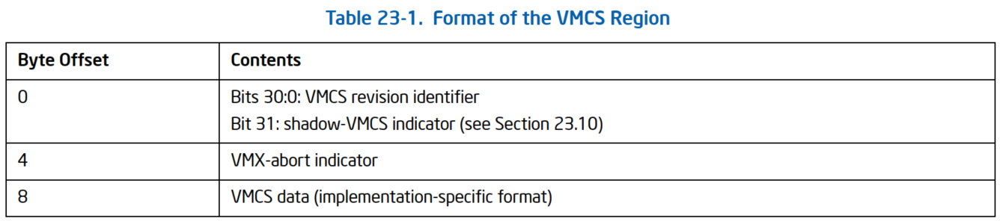

<!-- @import "[TOC]" {cmd="toc" depthFrom=1 depthTo=6 orderedList=false} -->

<!-- code_chunk_output -->

- [1. VMXON 区域的分配](#1-vmxon-区域的分配)
- [2. VMXON 区域初始设置](#2-vmxon-区域初始设置)

<!-- /code_chunk_output -->

在虚拟化平台上, 可能**只有一份 VMM** 存在, 但可以有**多个 VM 实例**存在.

* **每个 VM** 需要有**对应的 VMCS**(虚拟机控制结构)区域来控制;

* **VMM 本身**也需要**一个 VMXON 区域**来进行一些记录或维护工作.

```x86asm
vmxon [ebp + PCB.VmxonPhysicalPointer]
```

如上面, **执行 VMXON 指令**, 需要提供一个 VMXON 指针作为操作数, 这个指针是**物理地址**, 指向 VMXON 区域.

软件应为每个 cpu 使用单独的区域, 并且不应在 cpu 执行 VMXON 指令和 VMXOFF 指令之间访问或修改该这个 VMXON 区域. 否则可能会导致不可预知的行为.

> 所以这个区域是 `per-cpu` 的

# 1. VMXON 区域的分配

执行 **VMXON 指令**进入 VMX operation 模式**前**, 需要分配一块**物理内存区域**作为 VMXON 区域.

**VMCS 指针**(地址)的**约束**也适用于 **VMXON 指针**(即地址):

* 这块物理内存区域需要**对齐在 4K 字节边界**上(`bits 11:0`必须为 0)

* VMXON 指针不得设置任何超出处理器物理地址宽度的位.

>注:
> 软件能够通过 `CPUID.80000008H` 查到处理器的物理地址宽度, 在返回的 `eax[7:0]` 中表示了宽度
> 如果 `IA32_VMX_BASIC[48]` 是 1, VMXON 指针的 `bits[63:32]` 任何位不能被设置; 具体见 `2.5.4`

**VMXON 区域**的**大小**和**内存 cache 类型**可以通过检查`IA32_VMX_BASIC MSR`(480H)寄存器来获得.

```x86asm
        ;;
        ;; 分配 VMXON region
        ;;
        call get_vmcs_access_pointer                    ; edx:eax = pa:va
        REX.Wrxb
        mov [ebp + PCB.VmxonPointer], eax
        REX.Wrxb
        mov [ebp + PCB.VmxonPhysicalPointer], edx
```

如上代码所示, 在初始化 VMXON 区域阶段 `initialize_vmxon_region` 函数里调用 `get_vmcs_access_pointer` 来分配 VMXON 区域, 返回的物理地址保存在 `PCB.VmxonPhysicalPointer` 值里, 虚拟地址保存在 `PCB.VmxonPointer` 值里.

# 2. VMXON 区域初始设置

**VMXON 区域**的**首 8 个字节**结构与 **VMCS 区域**是一样的:

* **首 4 个字节**为 `VMCS revision ID`(VMCS 修订版标识符) 值;
* 下一个 **DWORD** 位置是 `VMX-abort indicator` 字段, 存放 `VMX-abort` 发生后的 ID 值

VMCS 区域格式如图.



在**执行 VMXON 之前**, 软件应将 `VMCS revision ID` 写入 VMXON 区域. 具体来说, 它应该将 31 位 `VMCS revision ID` 写入 VMXON 区域前 4 个字节的 `bit 30:0` 位; 第 31 位应清除为 0.

这个 `VMCS ID` 值可以从 `IA32_VMX_BASIC[31:0]` 来获得, 执行 **VMXON 指令前**必须将这个 `VMCS ID` 值写入 **VMXON 区域首 DWORD 位置**. 具体见`2.5.4`.

如果 `VMCS ID` 值与处理器当前 VMX 版本下的 VMCS ID 值**不符**, 则产生 `VmfailInvalid` 失败(参见第 2.6.2 节), 此时 `CF=1`, 指示 **VMCS 指针无效**.

```x86asm
        ;;
        ;; 设置 VMCS region 信息
        ;;
        REX.Wrxb
        mov ebx, [ebp + PCB.VmxonPointer]
        mov eax, [ebp + PCB.VmxBasic]                   ; 读取 VMCS revision identifier 值
        mov [ebx], eax                                  ; 写入 VMCS ID
```

上面代码来自 `initialize_vmxon_region()` 函数, 从 `PCB.VmxBasic` 里读取 32 位的 revision ID 值, 然后写入 VMXON region 的首 4 个字节位置. `PCB.VmxBasic` 值在 stage1 阶段执行 `get_vmx_global_data` 函数时, 从 `IA32_VMX_BASIC` 寄存器里读取.

> 注意: 由于 VMXON 区域是**物理内存区域**, 那么在设置 VMXON 区域之前, 必须将 VMXON 区域映射到一个虚拟地址, 然后通过虚拟地址进行写入操作.

代码中的 `PCB.VmxonPointer` 就是 VMXON 区域对应的虚拟地址指针, 而 `VmxonPhysicalPointer` 则表示物理地址指针, 这个物理指针使用在 VMXON 指令里.

