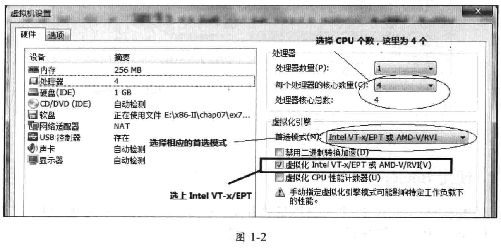

<!-- @import "[TOC]" {cmd="toc" depthFrom=1 depthTo=6 orderedList=false} -->

<!-- code_chunk_output -->

- [1. 平台信息和状态](#1-平台信息和状态)
  - [1.1. 处理器编号](#11-处理器编号)
  - [1.2. 运行阶段](#12-运行阶段)
  - [1.3. 处理器个数](#13-处理器个数)
  - [1.4. 处理器模型](#14-处理器模型)
  - [1.5. VMX 开启](#15-vmx-开启)
  - [1.6. EPT 开启](#16-ept-开启)
- [2. 使用 VMware](#2-使用-vmware)
- [3. 使用 Bochs](#3-使用-bochs)
- [4. 在真实机器上运行](#4-在真实机器上运行)
- [5. Build 工具](#5-build-工具)

<!-- /code_chunk_output -->

# 1. 平台信息和状态

以 4 个逻辑处理器平台为例, 机器启动后最终进入一个等待状态, 如图.

图 1\-1:

图 1-1 所显示的信息是处理器最后调用`updata_system_status`例程的结果, 它输出当前系统的信息, 在`lib/crt.asm`模块里实现.

## 1.1. 处理器编号

**CPUIndex**指示处理器的编号, 从 0 开始编号.

在 PCB(Processor Control Block, 处理器控制块)结构中的 ProcessorIndex 记录.

## 1.2. 运行阶段

**Stage**指示系统当前运行在哪个阶段. 系统平台分为三个阶段(参见第 1.5 节).

- Stage1: 处理器处于 32 位未分页的保护模式, 此时关闭分页机制.
- Stage2: 处理器处于 32 位已分页的保护模式, 这是 legacy 模式的最终环境.
- Stage3: 处理器处于 IA\-32e(即 long\-mode)下的 64 位模式.

图 1\-1 显示, 处理器当前处于 stage3 阶段(64 位模式).

## 1.3. 处理器个数

CPUs 指示当前可用的处理器个数, 这是在启动阶段检测出来的. 实际上, 使用代码枚举出来更可靠. 因为, 存在**BIOS 关闭某些处理器**的可能性.

图显示, 有 4 个可用的逻辑处理器

## 1.4. 处理器模型

CpuModel 指示处理器的模型信息, 包括了处理器家族与型号. 显示当前处理器是 0625H. 06H 指 P6 家族(包括了 Core 家族), 25H 属于第 1 代的 Core 架构, 具体为 Westmere 架构.

## 1.5. VMX 开启

VMX enable 指示 VMX 模式已经开启, VMX disable 则指示 VMX 模式关闭.

实际上, 每个处理器都开启了 VMX 模式. 由调用`vmx_operation_enter`函数进入, 实现在`lib/Vmx/VmxInit.asm`.

## 1.6. EPT 开启

EPT enable 指示 EPT 映射机制已经开启.

处理器在进入 guest 前, 根绝 guest 的设置决定是否开启 EPT 映射机制.

# 2. 使用 VMware

多数例子可以运行在 VMware 中, 只有少数需要在真实机器上运行.

下面介绍如何使用 VMware 运行例子中的`demo.img`映像文件.

运行 VMware 后, 使用典型配置新建一个虚拟机, 名为"**demo**". "**客户机操作系统**"选"**其他**", 版本为"**其他 64 位**". **虚拟机内存**使用**256MB**足够.

接下来设置处理器个数以及虚拟化引擎, 如图 1-2.

物理处理器数量为 1, 处理器核心数量可以根据自己的平台, 这里选 4.

假如选择了 2 个核心数量, 运行 demo.img 的结果如图: 检测到的 CPU 个数为 2.

虚拟化引擎选择"虚拟化 Intel VT-x/EPT 或 AMD-V/RVI(V)". 首选模式选为"intel VT-x/EPT 或 AMD-V/RVI". 这才能在 VMware 中使用 VMX 模式.

在 VMware 中, 我们使用`软盘映像文件 demo.img`, 这个映像文件位于每个例子目录中. 例如 1-4 图中的 chap07/ex7-5/demo.img.

# 3. 使用 Bochs

Bochs 只支持基本的 VMX 特性. 所以不使用

# 4. 在真实机器上运行

在后面看到, 实现了一个 Build 工具, 用于编译和生成所需的映像文件. 其中包括写入物理 U 盘, 我们将使用 U 盘启动, 在真实机器上运行.

# 5. Build 工具

