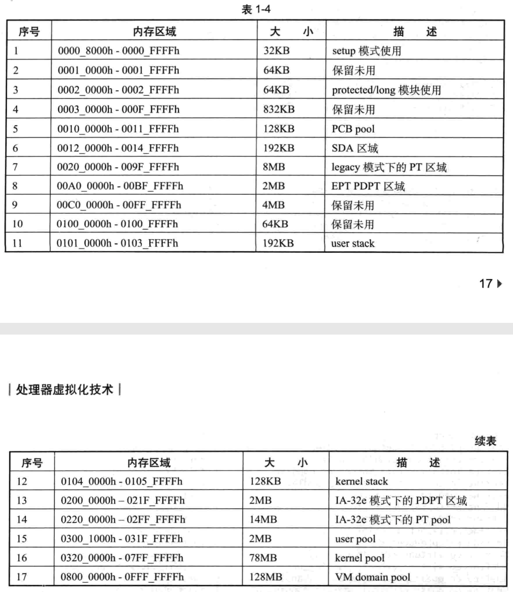

我们机器上至少有 256MB 物理内存.

# 物理地址空间

我们划分的物理地址空间如表 1-4 所示.

PCB pool 基址在物理地址`100000h`上共有 128KB, 支持 16 个逻辑处理器. 每个逻辑处理器拥有自己的 PCB 区域, 每个 PCB 大小为 8KB. 因此, CPU0 的 PCB 位于`100000h`上, 而 CPU1 的 PCB 位于`102000h`上, 依此类推.

VM domain pool 用于分配逻辑处理器的 VM domain, 共 128MB. 每个逻辑处理器对应一个 VM domain, 大小为 8MB, 因此共支持 16 个逻辑处理器.

