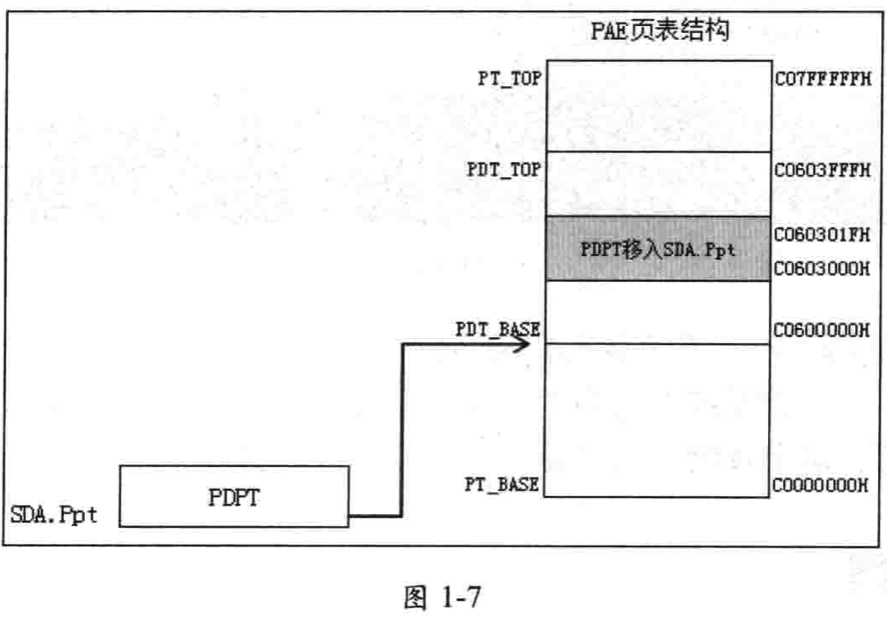
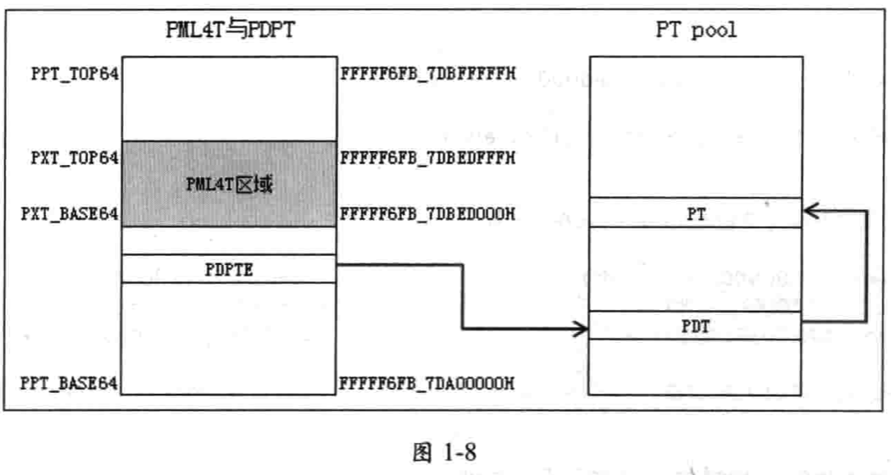

<!-- @import "[TOC]" {cmd="toc" depthFrom=1 depthTo=6 orderedList=false} -->

<!-- code_chunk_output -->

- [1. 分页机制](#1-分页机制)
  - [1.1. PAE 分页模式实现](#11-pae-分页模式实现)
    - [1.1.1. 初始化页表结构](#111-初始化页表结构)
    - [1.1.2. 实现虚拟地址映射](#112-实现虚拟地址映射)
  - [1.2. IA-32e 分页模式实现](#12-ia-32e-分页模式实现)
    - [1.2.1. 初始化页表结构](#121-初始化页表结构)
    - [1.2.2. 实现虚拟地址映射](#122-实现虚拟地址映射)
- [2. 多处理器机制](#2-多处理器机制)
  - [2.1. 调度任务](#21-调度任务)
    - [2.1.1. IPI routine](#211-ipi-routine)
  - [2.2. 处理器切换](#22-处理器切换)
- [3. 调试记录机制](#3-调试记录机制)

<!-- /code_chunk_output -->

# 1. 分页机制

可以参考: `Architecture/x86/IA32 和 x64 架构分页数据结构`

系统运行在 stage2 阶段使用 PAE 分页模式, 运行在 stage3 阶段使用 IA\-32e 分页模式.

PAE 分页模式的页表结构很大程度参考了 Windows NT 的设计.

而**IA\-32e 分页模式**在映射时 **PDT** 与 **PT 表**采用了**动态分配**的策略.

## 1.1. PAE 分页模式实现

2 + 9 + 9 + 12

PAE 分页模式下存在`PDPT`、`PDT`和`PT`三级页表结构, 在 `inc/page.inc`文件中定义了 PAE 分页模式下的三个页表结构地址值:

- `PT_BASE` 与 `PT_TOP`, **值**分别为 `C0000000H` 与 `C07FFFFFH`, 这个 PT 区域共**8MB**, 是**整个 PAE 分页模式**下的**页表结构区域**, 这里是**虚拟地址**区域.
- `PT_PHYSICAL_BASE` 与 `PT_PHYSICAL_TOP`, 值分别为 `200000H` 与 `9FFFFFH`, 定义 PT 区域的**物理地址**.
- `PDT_BASE` 与 `PDT_TOP`, 值分别为 `C0600000H` 与 `C0603FFFH`, 共**16KB**. PDT 区域**内嵌在 PT 区域内**, 这里是**虚拟地址**区域.
- `PDT_PHYSICAL_BASE` 与 `PDT_PHYSICAL_TOP`, 值分别为 `800000H` 与 `803FFFH`, 定义 PDT 区域的**物理地址**.

在 Windows NT 设计中, `PDPT_BASE` 与 `PDPT_TOP` 值分别为 `C0603000H` 与 `C060301FH`, 也嵌在 PDT 区域内. 但我们这里, 将这个 **32 字节(4 x 8 字节**)的 PDPT 区域移到了 SDA.Ppt 区域内, 并没有使用内嵌的 PDPT 区域.

注: 这个 8MB、16KB 和 32 字节, 可参照`Architecture/x86/IA32 和 x64 架构分页数据结构 3.1 4Kb 页面线性地址翻译`

SDA.Ppt 存放在**4 个 PDPTE 表项**, 在初始化时分别指向**4 个 PDT 区域**, 如图 1-7.



**整个 PT 区域**的**物理地址**区域是从 `200000H` 到 `9FFFFFH`(共 8MB), 对应**虚拟地址** `C0000000H` 到 `C07FFFFFFH`.

### 1.1.1. 初始化页表结构

在 `pre-stage2` 阶段(protected 模块头部, 参见 1.5.3 节代码片段 1-41)调用`init_ppt_area`函数初始化 PDPT 区域.

```assembly

```

`init_ppt_area`函数所做的工作是: 将**4 个 PDT 区域**的**物理地址**写入`SDA.Ppt`区域内. 形成下面 4 个 PDPTE 的设置:

1) `PDPT[0]`(地址为 SDA.Ppt)写入值 `800000H`.

2) `PDPT[1]`(地址为 SDA.Ppt + 8)写入值 `801000H`.

3) `PDPT[2]`(地址为 SDA.Ppt + 16)写入值 `802000H`.

4) `PDPT[3]`(地址为 SDA.Ppt + 24)写入值 `803000H`.

注: 这里写入的是物理地址, 一个 PDPTE 占用空间是 8 字节(所以加 8), 一个 PDT 占用空间是 4KB(2\^12, 所以值每次加 1000H)

在 `pre-stage2` 阶段也调用了`init_pae_page`函数建立基本的页映射关系(参见`1.5.3`节代码片段`1-42`). `init_pae_page`函数内部调用`map_pae_page_transition_table`函数初始化页表结构区域, 并建立`PT_BASE`到`PT_TOP`区域(`C0000000H`到`C07FFFFFH`)的映射关系.

```assembly

```

### 1.1.2. 实现虚拟地址映射

`do_virtual_address_mapping32`函数(被重定义为`do_virtual_address_mapping`)是虚拟地址映射到物理地址的实现函数, 在`lib/page32.asm`文件里实现.

```assembly

```

在虚拟地址映射时使用页表 walk 方式. PDPT 已经设置好, 只需从 PDT 开始 walk 到 PT. 当检查到表项属于 not\-present 时写入相应的表项处理.

## 1.2. IA-32e 分页模式实现

在 IA-32e 分页模式下, PML4T 与 PDPT 区域拥有固定区域, PDT 与 PT 表需要从 PT pool 里动态分配. `inc/page.inc`头文件里定义了下面的值.

- `PPT_BASE64` 与 `PPT_TOP64`, 值分别为 `FFFFF6FB_7DA00000H` 与 `FFFFF6FB_7DBFFFFFFH`, 定义 PDPT 区域, 共**2MB 大小**, 这是**虚拟地址**.
- `PPT_PHYSICAL_BASE64` 与 `PPT_PHYSICAL_TOP64`, 值分别为 `2000000H` 与 `21FFFFFH`, 定义 PDPT 区域的**物理地址**.
- `PXT_BASE64` 与 `PXT_TOP64`, 值分别是 `FFFFF6FB_7DBED000H` 与 `FFFFF6FB_7DBEDFFFH`, 定义 PML4T 区域, 共**4KB 大小**, 这是**虚拟地址**.
- `PXT_PHYSICAL_BASE64` 与 `PXT_PHYSICAL_TOP64`, 值分别为`21ED000H` 与 `21EDFFFH`, 定义 PML4T 区域**物理地址**.

注: 这个 2MB 和 4KB, 可参照`Architecture/x86/IA32 和 x64 架构分页数据结构 4.1 4Kb 页面线性地址翻译`

PDT 与 PT 在 PT pool(或备用 PT pool, 参见表 1-6)里分配, 如图 1-8.



4K 大小的 PML4T 区域嵌入在 PDPT 区域内, 其中部分 PML4TE 与 PDPTE 重叠在一起.

### 1.2.1. 初始化页表结构

### 1.2.2. 实现虚拟地址映射

# 2. 多处理器机制

1.5 中所述的系统启动完毕后, 多处理器环境被开启, BSP 处于工作状态, 而所有 APs 处于 HLT 状态, 等待 BSP 分派任务执行.

## 2.1. 调度任务

所有处理器都可以通过 IPI(Inter-processor interrupt, 处理器间中断)消息形式调度目标处理器执行某个任务, 也可以广播 IPI 给一组处理器共同执行某个程序.

### 2.1.1. IPI routine

## 2.2. 处理器切换

# 3. 调试记录机制

