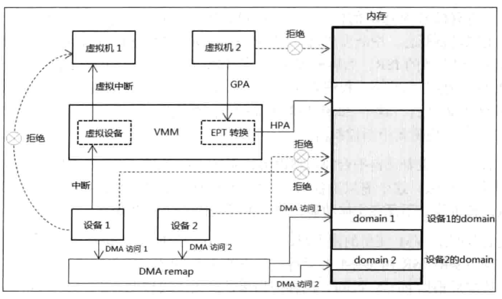

<!-- @import "[TOC]" {cmd="toc" depthFrom=1 depthTo=6 orderedList=false} -->

<!-- code_chunk_output -->

- [1. Intel 虚拟化技术](#1-intel-虚拟化技术)
  - [1.1. VT-x](#11-vt-x)
  - [1.2. VT-d](#12-vt-d)
  - [1.3. VT-c](#13-vt-c)
- [2. 处理器虚拟化技术概述](#2-处理器虚拟化技术概述)

<!-- /code_chunk_output -->

# 1. Intel 虚拟化技术

为支持虚拟化环境, 在计算机结构体系中的**CPU域**和**PCI总线域**上, Intel提供了**三个层面的虚拟化技术**(Intel Virtualization Technology).

## 1.1. VT-x

(1) 基于**处理器的虚拟化技术**(`Intel VT-x`): 全称为Virtualization Technology for x86, 在处理器上实现虚拟化技术, 它的实现架构是Virtual\-Machine Extensions(VMX). 在VMX下引入了两种处理器模式, 即VMX root与VMX non\-root, 分别支持host和guest软件的运行, 使guest软件能直接在处理器硬件上运行.

## 1.2. VT-d

(2) 基于**PCI总线域设备**实现的**I/O虚拟化技术**(`Intel VT-d`): 全称是Virtualization Technology for Directed I/O, 这个虚拟化技术实现在**芯片组(Chipset)层面**上, 提供了诸如**DMA remapping**与**Interrupt remapping**等技术来支持**外部设备I/O访问**的**直接虚拟化**.

## 1.3. VT-c

(3) 基于**网络的虚拟化技术**(`Intel VT-c`): 全称为Virtualization Technology for Connectivity, 部署在**Intel的网络设备**上, 这也是基于**PCI总线域设备**的**虚拟化技术**.

根据Intel的介绍, 在所有Intel的**10 Gigabit Server Adapter**和**部分Gigabit Server Adapter**上, **VT\-c**提供了两个关键的技术:

* Virtual Machine Device Queues(**VMDq**). **VMDq**可以做到为**各个guest OS**处理**分类好的packet**, 能**明显提升I/O吞吐量**.

* 和Virtual Machine Direct Connect(**VMDc**). **VMDc**使用PCI\-SIG Single Root I/O(**SR\-IOV**)技术, 允许虚拟机**直接使用访问网络I/O硬件**改善虚拟化性能.

在处理器虚拟化方面, Intel也为Itanium平台(IA64, 忽略)提供了虚拟化, 即Intel VT-i.

本书中所讨论的虚拟化技术主要是基于**处理器虚拟化(Intel VT\-x**)中的Virtual\-Machine Extensions(**VMX**)架构.

关于`VT-d`技术可下载`<Intel Virtualization Technology for Directed I/O Architecture Specification>` 文档, 它并不在本书讨论范围. `VT-d`技术在桌面平台并不是每款处理器都提供, `VT-c`技术提供在服务器平台.

# 2. 处理器虚拟化技术概述

虚拟机的运用需要以**处理器平台提供Virtualization Technology(VT, 虚拟化技术**)为前提, 是以资源的虚拟化管理的结果.

在**虚拟化技术之前**, 软件运行在物理机器上, 对物理资源进行直接控制, 譬如设备的中断请求, guest的内存访问, 设备的I/O访问等. 软件更改这些资源的状态将**直接反映在物理资源**上, 或设备的请求得到直接响应.

在**CPU端的虚拟化**里, 实现了VMX(Virtual\-Machine Extensions, 虚拟机扩展)架构. 这个虚拟机架构中, 存在两种角色环境: **VMM(Virtual Machine Monitor, 虚拟机监管者**)和**VM(Virtual Machine, 虚拟机**). **host端软件**运行在**VMM环境**中, 可以**仅作为hypervisor角色**存在(作为**全职的虚拟机管理者**), 或者**包括VMM(虚拟机监管者**)职能的**host OS**.

guest端软件运行在VM环境中. 一个VM代表一个虚拟机实例, 一个处理器平台可以有多个虚拟机实例, 由于VM里的资源被虚拟化, 每个MV彼此独立.

**guest软件**访问的**资源受到VMM监管**, **guest**希望**修改某些物理资源**时, **VMM**返回一个**虚拟化后的结果给guest**. 例如, **guest**软件对**8259控制器**的状态进行修改, **VMM拦截**这个修改, 进行**虚拟化操作**, 实时修改或不修改8259控制器的物理状态, 反馈一个不真实的结果给guest软件.

下图展示前面提到的虚拟化环境里的三种虚拟化管理:

(1) 设备中断请求

(2) guest内存访问

(3) 设备的I/O访问

设备的**中断请求**经由**VMM监管**, 模拟出**虚拟设备(！！！**)反馈一个**虚拟中断**给guest执行, 在这个模型中, **设备中断请求不直接发给guest执行**.

而**guest访问的物理地址**也**不是最终的物理地址**, 而是**经过EPT进行转换**才得到的最终物理地址.

设备1和设备2使用**DMA访问**时, 它们**最终的目标物理地址**经过**VT\-d(！！！**)技术的**DMA重新映射功能**映射到**属于自己的domain(区域**).
