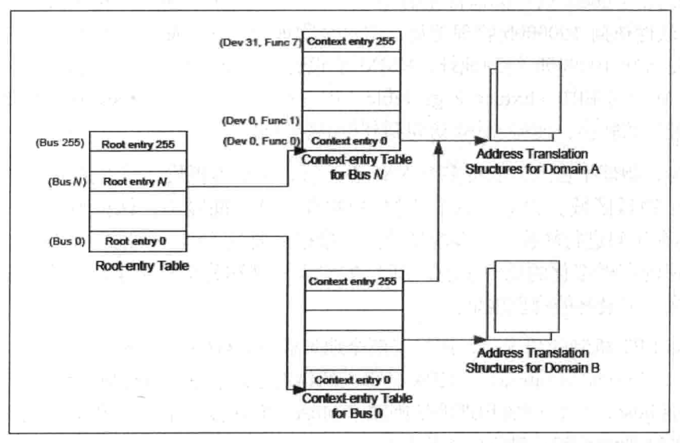

在由**CPU 发起访问外部设备(！！！**)时, 需要通过**PCI\PCIe 总线**的**内存读写事务**、**I/O 读写事务**或**配置读写事务**进行. 当**guest**软件发起这样的访问, **VMM**可以通过**内存虚拟化**和**I/O 地址虚拟化**达到**虚拟化设备的目的**.

当由**设备主动发起访问内存**(即**DMA 读写事务**), 在 DMA 读写下**CPU 不参与**, 也就**不能**为这个读写内存提供**地址转换**, VMM 单纯依赖 CPU 来监控设备访问是比较难的.

于是, **基于 PCI 总线域(！！！**)的**虚拟化**需要提供支持, **VT\-d**就是为解决这个提出的. VT\-d 的其中一个重要功能就是进行**DMA remapping(DMA 重新映射**), DMA remapping 机制在**芯片组或 PCI 设备(！！！**)上实现**地址转换(！！！**)功能, 其原理和分页机制下的**虚拟地址转换到物理地址**是相似的.

**DMA remapping**需要**识别设备的 source\-id**, 这个 source\-id 代表着**发起 DMA 访问设备(即 requester, 请求者)的身份**, 实际上它就是**PCI 总线域的 ID(！！！**), 由**bus、device 和 function 组成**. 根据**source\-id**找到设备**对应的页表(！！！**)结构, 然后**通过页表进行转换**.

如图, 首先, 一个被称为**Root\-entry table(！！！**)的结构需要在**内存中构造(！！！**), 由**Root\-entry**指出**Context\-entry table(！！！**), 再由**context\-entry**得到**页表结构(！！！**), 最后**经过页表**得到最终的**物理地址**.

**Root\-entry table 的基址**被提供在**MCH(Memory Control Hub！！！**)部件, 一般位于**Bus0、Device0、Function0 设备(内存控制器！！！**)扩展空间里的**MEREMAPBAR 寄存器(！！！**), 在**这个寄存器**提供一个**remap MMIO 空间**, 其中的**RTADDR\_REG 寄存器(！！！**)提供**Root\-entry table 指针值**, 但不同处理器, 这个 remap MMIO 空间的基址也存放在**不同的位置**.

DMA remapping 提出了一个**domain(域**)的概念, 实际上就是为**设备**在内存中分配一个**对应的区域**. 例如, 为**设备 1**分配**domain 1**, 为设备 2 分配 domain 2, 它们访问各自独立的区域. 这个 domain 值可能被用作标记, 处理器使用它来标记内部的 cache. 当然, 不同的设备也可以访问同一个 domain, 但必须使用同一个 domain 值.