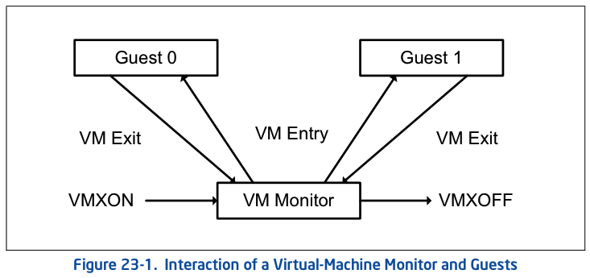

进入 VMX operation 模式后, **VMM**运行在**root**环境里, 而**VM**需要运行在`non-root`环境里. 虚拟化平台中经常会发生从 VMM 进入 VM, 或者从 VM 返回到 VMM 的情况.

- `VM entry`(VM 进入): 从`VMX root operation`切换到`VMX non-root operation`就是 VM entry, 表示**从 VMM 进入到 VM 执行 guest 软件**.
- `VM exit`(VM 退出): 从`VMX non-root operation`切换到 VMX root operation 就是 VM exit, 表示**从 VM 返回到 VMM**. VMM 接管工作, **VM 失去处理器控制权**.

VM 的 entry 与 exi, 顾名思义, 是以 VM 的角度来定义. 如果处理器要执行 guest 软件, 那么 VMM 需要发起 Vm-entry 操作, 切换到 `VMX non-root operation` 模式执行. VM 会获得控制权, 直到某些引发 **VM exit** 的事件发生

**VM\-exit 发生**后, 处理器控制权重新回到 VMM. **VMM**设置"**VM exit"退出的条件是基于虚拟化处理器目的**. 因此, **VMM**需要**检查 VM**遇到了**什么事件退出**, 从而**虚拟化某些资源**, **返回一个虚拟化后的结果给 guest 软件**, 然后再次发起 VM\-entry, 切入 VM 让 guest 软件继续执行.

**首次进入 VM**和**退出后再次进入 VM**恢复执行, 使用**不同的指令进行(！！！**). **VMLAUNCH 指令**发起**首次进入 VM**, **VMRESUME 指令**恢复被中断的 VM 执行.

下图清晰描述了 VMM 与 VM(guest)之间的切换关系. 利用 VM entry 与 VM exit 行为, VMM 在多个 VM 之间来回切换. 这个过程类似于 OS 对进程的调度, 而每个 VM 就像一个进程, VMM 其中一个职能类似于 OS 进程调度器.

上图说明了 VMM 及其来宾软件的生命周期以及它们之间的交互.  以下各项概述了该生命周期:

* **VMM 软件**通过执行**VMXON**指令进入**VMX 操作模式**.
* 然后, 使用`VM entry`, VMM 可以将客户机进入虚拟机.  VMM 使用指令**VMLAUNCH**和**VMRESUME**让虚拟机进入 VM;  它使用 VM exits 重新获得控制权.
* `VM exit`到 VMM**指定的入口点**的传输控制.  VMM 可以采取适合于 VM 退出原因的操作, 然后可以使用 VM entry 返回虚拟机.
* 最终, VMM 可能决定关闭自身并退出 VMX 操作.  它通过执行 VMXOFF 指令来实现.
