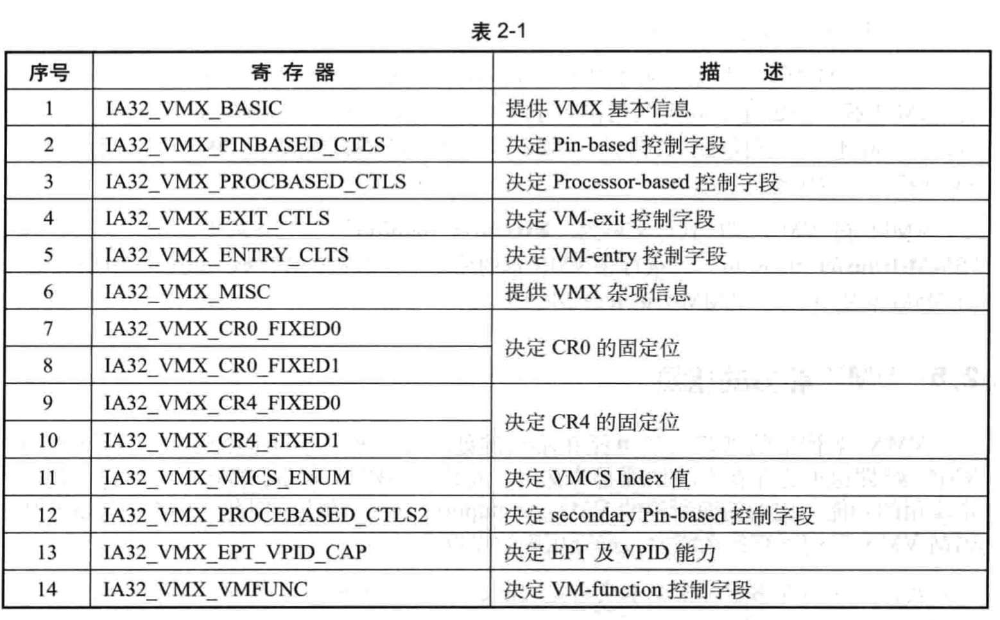

VMX 体系结构被设计为**可扩展**的, 以便将来扩展其他功能. 通过使用**一组 VMX 功能 MSR** 将**可扩展的 VMX 功能**的可用性报告给**软件**.

这些 MSRs 是从地址 `480H` 开始进行索引. **VMX 功能 MSR 是只读的**.

* 尝试使用 `WRMSR` **写入**它们会产生**一般保护异常**(general-protection exception, `#GP(0)`);

* 在**不支持 VMX** 的处理器上**不存在**, 尝试在此类处理器上读取它们(使用 `RDMSR`)会产生一般保护异常(`#GP(0)`).

VMX 架构提供了众多项目能力的检测, 包括: **VMX 的基本信息**、**杂项信息**、**VPID 与 EPT 能力**, 还有对 VMCS 内的`control fields`(**控制字段**)允许设置的位. **控制字段**的位**允许被置为 1**时, 代表着**处理器拥有这个能力**. 比如, `secondary processor-based control` 字段的 `bit 7` 是 "`Unrestricted guest`" 位, 当它**允许被置为 1 时**, **表明**处理器**支持** unrestricted guest(不受限制的 guest 端)功能. 反之, 则表明处理器**不支持该功能**.

VMX 的这些能力的检测提供在几组共 **14** 个 **MSR**(Model Specific Register)里, 如表 2-1, 除此, 还有 **4 个扩展**的 **TRUE 系列寄存器**, 详见 `2.5.4` 节和 `2.5.5` 节



软件通过读取这些寄存器的值来确定.

在本书例子中, 对这些寄存器的读取在 stage1 阶段执行的 `get_vmx_global_data` 函数中完成.

```x86asm
;------------------------------------------------------
; get_vmx_global_data()
; input:
;       none
; output:
;       none
; 描述:
;       1) 读取 VMX 相关信息
;       2) 在 stage1 阶段调用
;------------------------------------------------------
get_vmx_global_data:
        push ecx
        push edx

        ;;
        ;; VmxGlobalData 区域
        ;;
        mov edi, [gs: PCB.PhysicalBase]
        add edi, PCB.VmxGlobalData

        ;;
        ;; ### step 1: 读取 VMX MSR 值 ###
        ;; 1) 当 CPUID.01H:ECX[5]=1 时, IA32_VMX_BASIC 到 IA32_VMX_VMCS_ENUM 寄存器有效
        ;; 2) 首先读取 IA32_VMX_BASIC 到 IA32_VMX_VMCS_ENUM 寄存器值
        ;;

        mov esi, IA32_VMX_BASIC

get_vmx_global_data.@1:
        mov ecx, esi
        rdmsr
        mov [edi], eax
        mov [edi + 4], edx
        inc esi
        add edi, 8
        cmp esi, IA32_VMX_VMCS_ENUM
        jbe get_vmx_global_data.@1

        ;;
        ;; ### step 2: 接着读取 IA32_VMX_PROCBASED_CTLS2 ###
        ;; 1) 当 CPUID.01H:ECX[5]=1, 并且 IA32_VMX_PROCBASED_CTLS[63] = 1 时, IA32_VMX_PROCBASED_CTLS2 寄存器有效
        ;;
        test DWORD [gs: PCB.ProcessorBasedCtls + 4], ACTIVATE_SECONDARY_CONTROL
        jz get_vmx_global_data.@5

        mov ecx, IA32_VMX_PROCBASED_CTLS2
        rdmsr
        mov [gs: PCB.ProcessorBasedCtls2], eax
        mov [gs: PCB.ProcessorBasedCtls2 + 4], edx

        ;;
        ;; ### step 3: 接着读取 IA32_VMX_EPT_VPID_CAP
        ;; 1) 当 CPUID.01H:ECX[5]=1, IA32_VMX_PROCBASED_CTLS[63]=1, 并且 IA32_PROCBASED_CTLS2[33]=1 时, IA32_VMX_EPT_VPID_CAP 寄存器有效
        ;;
        test edx, ENABLE_EPT
        jz get_vmx_global_data.@5

        mov ecx, IA32_VMX_EPT_VPID_CAP
        rdmsr
        mov [gs: PCB.EptVpidCap], eax
        mov [gs: PCB.EptVpidCap + 4], edx

        ;;
        ;; ### step 4: 读取 IA32_VMX_VMFUNC　###
        ;; 1) IA32_VMX_VMFUNC 寄存器仅在支持 "enable VM functions" 1-setting 时有效, 因此需要检测是否支持!
        ;; 2) 检查 IA32_VMX_PROCBASED_CTLS2[45] 是否为 1 值
        ;;
        test DWORD [gs: PCB.ProcessorBasedCtls2 + 4], ENABLE_VM_FUNCTION
        jz get_vmx_global_data.@5

        mov ecx, IA32_VMX_VMFUNC
        rdmsr
        mov [gs: PCB.VmFunction], eax
        mov [gs: PCB.VmFunction + 4], edx


get_vmx_global_data.@5:

        ;;
        ;; ### step 5: 读取 4 个 VMX TRUE capability 寄存器 ###
        ;;
        ;; 如果 bit55 of IA32_VMX_BASIC 为 1 时, 支持 4 个 capability 寄存器:
        ;; 1) IA32_VMX_TRUE_PINBASED_CTLS  = 48Dh
        ;; 2) IA32_VMX_TRUE_PROCBASED_CTLS = 48Eh
        ;; 3) IA32_VMX_TRUE_EXIT_CTLS      = 48Fh
        ;; 4) IA32_VMX_TRUE_ENTRY_CTLS     = 490h
        ;;
        bt DWORD [gs: PCB.VmxBasic + 4], 23
        jnc get_vmx_global_data.@6

        mov BYTE [gs: PCB.TrueFlag], 1                                  ; 设置 TrueFlag 标志位
        ;;
        ;; 如果支持 TRUE MSR 的话, 那么就更新下面 MSR:
        ;; 1) IA32_VMX_PINBASED_CTLS
        ;; 2) IA32_VMX_PROCBASED_CTLS
        ;; 3) IA32_VMX_EXIT_CTLS
        ;; 4) IA32_VMX_ENTRY_CTLS
        ;; 用 TRUE MSR 的值替代上面 MSR!
        ;;
        mov ecx, IA32_VMX_TRUE_PINBASED_CTLS
        rdmsr
        mov [gs: PCB.PinBasedCtls], eax
        mov [gs: PCB.PinBasedCtls + 4], edx
        mov ecx, IA32_VMX_TRUE_PROCBASED_CTLS
        rdmsr
        mov [gs: PCB.ProcessorBasedCtls], eax
        mov [gs: PCB.ProcessorBasedCtls + 4], edx
        mov ecx, IA32_VMX_TRUE_EXIT_CTLS
        rdmsr
        mov [gs: PCB.ExitCtls], eax
        mov [gs: PCB.ExitCtls + 4], edx
        mov ecx, IA32_VMX_TRUE_ENTRY_CTLS
        rdmsr
        mov [gs: PCB.EntryCtls], eax
        mov [gs: PCB.EntryCtls + 4], edx


get_vmx_global_data.@6:
        ;;
        ;; ### step 6: 设置 CR0 与 CR4 的 mask 值(固定为 1 值)
        ;; 1) Cr0FixedMask = Cr0Fixed0 & Cr0Fixed1
        ;; 2) Cr4FixedMask = Cr4Fixed0 & Cr4Fxied1
        ;;
        mov eax, [gs: PCB.Cr0Fixed0]
        mov edx, [gs: PCB.Cr0Fixed0 + 4]
        and eax, [gs: PCB.Cr0Fixed1]
        and edx, [gs: PCB.Cr0Fixed1 + 4]
        mov [gs: PCB.Cr0FixedMask], eax                                 ; CR0 固定为 1 值
        mov [gs: PCB.Cr0FixedMask + 4], edx
        mov eax, [gs: PCB.Cr4Fixed0]
        mov edx, [gs: PCB.Cr4Fixed0 + 4]
        and eax, [gs: PCB.Cr4Fixed1]
        and edx, [gs: PCB.Cr4Fixed1 + 4]
        mov [gs: PCB.Cr4FixedMask], eax                                 ; CR4 固定为 1 值
        mov [gs: PCB.Cr4FixedMask + 4], edx

        ;;
        ;; 关于 IA32_FEATURE_CONTROL.lock 位:
        ;; 1) 当 lock = 0 时, 执行 VMXON 产生 #GP 异常
        ;; 2) 当 lock = 1 时, 写 IA32_FEATURE_CONTROL 寄存器产生 #GP 异常
        ;;

        ;;
        ;; 下面将检查 IA32_FEATURE_CONTROL 寄存器
        ;; 1) 当 lock 位为 0 时, 需要进行一些设置, 然后锁上 IA32_FEATURE_CONTROL
        ;;
        mov ecx, IA32_FEATURE_CONTROL
        rdmsr
        bts eax, 0                                                      ; 检查 lock 位, 并上锁
        jc get_vmx_global_data.@7

        ;; lock 未上锁时:
        ;; 1) 对 lock 置位(锁上 IA32_FEATURE_CONTROL 寄存器)
        ;; 2) 对 bit 2 置位(启用 enable VMXON outside SMX)
        ;; 3) 如果支持 enable VMXON inside SMX 时, 对 bit 1 置位!
        ;;
        mov esi, 6                                                      ; enable VMX outside SMX = 1, enable VMX inside SMX = 1
        mov edi, 4                                                      ; enable VMX outside SMX = 1, enable VMX inside SMX = 0

        ;;
        ;; 检查是否支持 SMX 模式
        ;;
        test DWORD [gs: PCB.FeatureEcx], CPU_FLAGS_SMX
        cmovz esi, edi
        or eax, esi
        wrmsr


get_vmx_global_data.@7:

        ;;
        ;; 假如使用 enable VMX inside SMX 功能, 则根据 IA32_FEATURE_CONTROL[1] 来决定是否必须开启 CR4.SMXE
        ;; 1) 本书例子中没有开启 CR4.SMXE
        ;;
%ifdef ENABLE_VMX_INSIDE_SMX
        ;;
        ;; ### step 7: 设置 Cr4FixedMask 的 CR4.SMXE 位 ###
        ;;
        ;; 再次读取 IA32_FEATURE_CONTROL 寄存器
        ;; 1) 检查 enable VMX inside SMX 位(bit1)
        ;;    1.1) 如果是 inside SMX(即 bit1 = 1), 则设置 CR4FixedMask 位的相应位
        ;;
        rdmsr
        and eax, 2                                                      ; 取 enable VMX inside SMX 位的值(bit1)
        shl eax, 13                                                     ; 对应在 CR4 寄存器的 bit 14 位(即 CR4.SMXE 位)
        or DWORD [ebp + PCB.Cr4FixedMask], eax                          ; 在 Cr4FixedMask 里设置 enable VMX inside SMX 位的值　

%endif

get_vmx_global_data.@8:
        ;;
        ;; ### step 8: 查询 Vmcs 以及 access page 的内存 cache 类型 ###
        ;; 1) VMCS 区域内存类型
        ;; 2) VMCS 内的各种 bitmap 区域, access page 内存类型
        ;;
        mov eax, [gs: PCB.VmxBasic + 4]
        shr eax, 50-32                                                  ; 读取 IA32_VMX_BASIC[53:50]
        and eax, 0Fh
        mov [gs: PCB.VmcsMemoryType], eax


get_vmx_global_data.@9:
        ;;
        ;; ### step 9: 检查 VMX 所支持的 EPT page memory attribute ###
        ;; 1) 如果支持 WB 类型则使用 WB, 否则使用 UC
        ;; 2) 在 EPT 设置 memory type 时, 直接或上 [gs: PCB.EptMemoryType]
        ;;
        mov esi, MEM_TYPE_WB                                            ; WB
        mov eax, MEM_TYPE_UC                                            ; UC
        bt DWORD [gs: PCB.EptVpidCap], 14
        cmovnc esi, eax
        mov [gs: PCB.EptMemoryType], esi

get_vmx_global_data.done:
        pop edx
        pop ecx
        ret
```

在 stage1 阶段期间执行的 `update_processor_basic_info` 函数内部将调用这个函数来收集 VMX 的相关信息.

共分为 9 个步骤读取 VMX 的相关信息, 其中一个额外的工作是设置前面 `2.3.2.1` 节提到的 `IA32_FEATURE_CONTROL` 寄存器.

