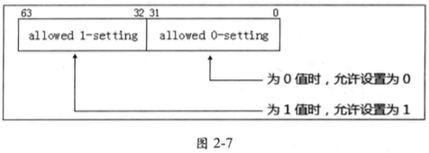
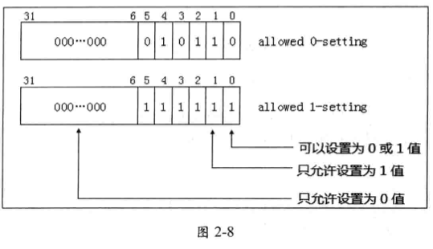

<!-- @import "[TOC]" {cmd="toc" depthFrom=1 depthTo=6 orderedList=false} -->

<!-- code_chunk_output -->

- [1. CTLS 寄存器的使用](#1-ctls-寄存器的使用)
- [2. 保留位](#2-保留位)
- [3. default1 位的值](#3-default1-位的值)
- [4. 决定 VMX 支持的功能](#4-决定-vmx-支持的功能)
- [5. 确定某个 control 位的值](#5-确定某个-control-位的值)
  - [5.1. 算法一](#51-算法一)
- [6. 控制字段设置算法](#6-控制字段设置算法)

<!-- /code_chunk_output -->

# 1. CTLS 寄存器的使用

在表 2-2 (上一节)里列举的**两组寄存器**(在 `IA32_VMX_BASIC[55] = 1` 时 **TRUE 寄存器**才可以使用), 共 **8 个寄存器**, 它们的**结构**和**使用方法**是**一致**的, 结构如图 2-7 所示.



这些 64 位的寄存器**低 32 位**是 `allowed 0-setting`(**允许设置为 0**)位值, **高 32 位**是  `allowed 1-setting`(**允许设置为 1**) 位值. 这**两组 32 位值**对应**一个 VMCS 区域**的 `control field`(**控制字段**)值, 这些控制字段是 **32 位值**, 用法如下所示.

* `bits 31:0` 的用法: 只有当其中的位为 **0** 值时, **对应**的**控制字段相应的位**才允许为 **0** 值(并**不意味**着对应的位**必须为 0**, 但是如果**其中位为 1！！！**, 则一定表明**不能为 0, 只能为 1！！！**).

> 为 0, 可为 0; 为 1, 只能为 1(并不意味着这个功能肯定可用, 取决于 bits 63:32)

* `bits 63:32` 的用法: 只有当其中的位为 **1** 值时, 对应的控制字段相应的位才**允许为 1 值**(并**不意味**着对应的位**必须为 1**, 但是如果**其中位为 0**, 则一定表明**不能为 1, 只能为 0**).

> 为 1, 可为 1(功能可用); 为 0, 只能为 0

> 最终形成的控制字段是 32 位.

举个例子说明, 在图 2-5 的运行结果里显示, `IA32_VMX_TRUE_PINBASED_CTLS` 的**低 32 位值**为 `00000016h`, **高 32 位**为 `0000003Fh`. 它对应控制 `Pin-based control` 字段, 那么表明:

(1) `00000016h`, `Pin-based control` 字段除了 `bit 1`、`bit 2` 以及 `bit 4`(值为 **16h**)**不能为 0 值**外(**因为位为 1**), 其他位都可以设置为 0 值.

(2) `0000003Fh`, `Pin-based control` 字段**只**允许 `bit 0` 到 `bit 5` 位可以设置 **1** 值, **其余位必须为 0 值**(**因为位为 0**).

那么, 形成 `Pin-based control` 字段的**设置要求**如图 2-8 所示



从上面的 `allowed 0-setting` 与 `allowed 1-setting` 的设置来看, `bit 0` **既可以为 0 值**, **也可以为 1 值**. 而 `bit 1` **只允许为 1 值**. 那么代表着 Pin-based control 字段的合法设置如下.

(1) `bit 0`、`bit 3` 以及 `bit 5` **可以设为 0 或 1 值**.

(2) `bit 1`、`bit 2` 以及 `bit 4` **只能设为 1 值**.

(3) `bits 31:6` **只能设为 0 值**.

推广开来, `表 2-2` 中的 **8 个寄存器**, 都使用**相同的设置原理**, 不同的是设置的目标字段不一样.

# 2. 保留位

我们看到对于一个控制字段的设置: "**某些位必须为 1**, **某些位必须为 0**"(它们属于**保留位**).

> 注意: 这些**必须为 0 值**的**保留位**被称为 "**default0**" 位, 必须为 1 值的保留位被称为 "**default1**" 位. 这与通常接触到的数据结构中的"保留位必须为 0 值"有些区别(例知 PTE 中的保留位).

当**控制字段**的保留位**不符合**这些 **default0** 和 **default1** 值, **在 VM entry 操作时**, 字段的检查会失败, 从而导致 VM-entry 失败.

# 3. default1 位的值

**default1** 在 `pin-based VM-execution controls`, `primary processor-based VM-execution controls`, `VM-exit controls`和 `VM-entry controls` 中存在, 而 `secondary processor-based VM-execution controls` 中**没有**

而 `IA32_VMX_BASIC MSR` 中的 `bit 55` 决定了相应的 **default1 位是否可以为 0**:

* 如果 `IA32_VMX_BASIC[55]` 为 0, **所有的 default1 都是保留位**且**必须为 1**. 也就是说, `IA32_VMX_BASIC[55]` 为 0, 决定了**大多数**的相应位的允许设置值, 而从原有 CTL 寄存器读取的 default1 位肯定也必须为 1.

* 如果 `IA32_VMX_BASIC[55]` 为 1, 不是所有的 default1 都是保留位, 一些可以是 0(也并不意味着所有都是 0). 而是使用新的 4 个 TRUE 寄存器决定相应位. 也就是说, `IA32_VMX_BASIC[55]` 为 1, 决定了**所有**的相应位的允许设置值.

> 所以, `XX_CTLS` 和 `TRUE_XX_CTLS` 的高 32 位(**allowed 1-setting**)肯定是相同的, 两个的低 32 位可能((**allowed 0-setting**)不同, 都是因为 default1 是否可以为 0.
> 具体见下面

> 所以 `IA32_VMX_BASIC[55]` 为 1, 并**不意味**着**原有 CTLS 完全不可用**.

# 4. 决定 VMX 支持的功能

前面所述, 控制字段中**必须为 0** 及**必须为 1** 值的位都是**保留位**. 当一个位**可以设置为 1 值**时, 表明处理器将**支持该项功能**, 也就是**非保留位**指示支持该位对应的功能.

以 `Pin-based VM execution control` 字段为例, 它的 `bit 6` 是"`activate VMX-preemption timer`" 功能, **只有** `bit 6` **允许设置为 1 值**时, 才代表处理器支持 `Vmx-preemption timer` 功能. 在图 2-8 中, 我们看到, bit 6 **只能设置为 0 值**. 因此, 这个处理器并**不支持这项功能**.

又如, 该字段的 `bit 0` 为"external-interrupt exiting"功能位, 而该位**可以设置为 0 或 1 值**, 因而表明处理器支持该项功能.

# 5. 确定某个 control 位的值

软件可能会使用以下高级算法之一来确定**正确的默认 control 位设置**:

> 这些算法仅适用于`pin-based VM-execution controls`, `primary processor-based VM-execution controls`, `VM-exit controls`和 `VM-entry controls`. 因为 `secondary processor-based VM-execution controls` 中没有 default1, 所以 VMM 始终可以将其含义未知的任何此类 control 值始终设置为 0.

## 5.1. 算法一

这个算法不需要使用下面几节中给出的详细信息:

1. 忽略 `IA32_VMX_BASIC[55]`

2. 使用 RDMSR, 读取 VMX 功能 MSR, 包括`IA32_VMX_PINBASED_CTLS MSR`, `IA32_VMX_PROCBASED_CTLS MSR`, `IA32_VMX_EXIT_CTLS MSR`和 `IA32_VMX_ENTRY_CTLS MSR`. 不用那些 `TRUE_XX_CTLS`

3. 按下面来设置 VMX control:

i) 如果相关的 VMX 功能 MSR 报告 control 位具有 `1-setting` , 则直接**设置 1**.

ii) 如果(1)相关的 VMX 能力 MSR 报告**可以将 control 位设置为 0 或 1**;  (2)VMM**知道 control 的含义**; 然后**根据功能需要**选择性设置 control 位.

iii) 如果(1)相关的 VMX 功能 MSR 报告**可以将 control 设置为 0 或 1**;  (2)VMM**不知道** control 的含义; 然后**将 control 设置为 0**.

使用此算法的 VMM 会将 **default1** 的**所有 control 位**设置为**1**(在步骤(c)(i)中). 即使在**允许 default1 位为 0 的处理器**上, 它**也将正确运行**.

但是, 这样 VMM 将无法对新功能的这个 control 位进行 0 设置. 因此, 不建议使用此算法.

2. 以下算法使用附录 A.2 中给出的详细信息. 此算法要求软件知道 default1 类中 control 的身份:

a. 使用 RDMSR, 读取 IA32_VMX_BASIC MSR.

b. 如下使用该 MSR 的位 55:

i)如果位 55 为 0, 请使用 RDMSR 读取 VMX 功能 MSR IA32_VMX_PINBASED_CTLS, IA32_VMX_PROCBASED_CTLS, IA32_VMX_EXIT_CTLS 和 IA32_VMX_ENTRY_CTLS.
ii)如果位 55 为 1, 请使用 RDMSR 读取 VMX 功能 MSR IA32_VMX_TRUE_PINBASED_CTLS, IA32_VMX_TRUE_PROCBASED_CTLS, IA32_VMX_TRUE_EXIT_CTLS 和 IA32_VMX_TRUE_ENTRY_CTLS.


# 6. 控制字段设置算法

根据前面所述的 VMX 能力寄存器 `allowed 0-setting` 与 `allowed 1-setting` 位, 对 **VMCS 区城**中相应的控制字段设置, 可以分两步进行.

* 首先**根据自身的设计需求设置相应位**, 这是一个**初始值**.
* 然后使用 `allowed 0-setting` 与 `allowed 1-setting` 位**合成最终值**. 合成最终值的算法如下.

(1) Result1 = 初始值 "**OR**" `allowed 0-setting` 值

(2) Result2 = Result1 "**AND**" `allowed 1-setting` 值

这个 Result2 就是最终值, 这个值确保**满足**在 `VM-entry` 时处理器对该控制字段的检查. 下面的代码片段是对 Pin-based VM-execution control 字段的设置.

```x86asm
        ;;
        ;; 设置 Pin-based 控制域:
        ;; 1) [0]  - external-interrupt exiting: Yes
        ;; 2) [3]  - NMI exiting: Yes
        ;; 3) [5]  - Virtual NMIs: No
        ;; 4) [6]  - Activate VMX preemption timer: Yes
        ;; 5) [7]  - process posted interrupts: No
        ;;
        ;; 注意:
        ;; 1) 如果 VMB.VmxTimerValue = 0 时, 不使用 VMX-preemption timer
        ;;

        mov ebx, EXTERNAL_INTERRUPT_EXITING | NMI_EXITING
        mov eax, EXTERNAL_INTERRUPT_EXITING | NMI_EXITING | ACTIVATE_VMX_PREEMPTION_TIMER

        cmp DWORD [esi + VMB.VmxTimerValue], 0
        cmove eax, ebx

        ;;
        ;; 注意, PCB.PinBasedCtls 的值在 stage1 阶段时已更新, 它的值为:
        ;; 1) 当 IA32_VMX_BASIC[55] = 1 时, 等于 IA32_VMX_TRUE_PINBASED_CTLS 寄存器
        ;; 2) 当 IA32_VMX_BASIC[55] = 0 时, 等于 IA32_VMX_PINBASED_CTLS 寄存器
        ;;

        ;;######################################################################################
        ;; PCB.PinBasedCtls 值说明:
        ;; 1) [31:0]  - allowed 0-setting 位
        ;;              当 bit 为 1 时, Pin-based VM-execution control 位为 0, 则出错!
        ;;              当 bit 为 0 时, Pin-based VM-execution control 位可为 0 值.
        ;;     因此:    当 bit 为 1 时, Pin-based VM-execution control 必须为 1 值!!!
        ;;
        ;; 2) [63:32] - allowed 1-setting 位
        ;;              当 bit 为 0 时, Pin-based VM-execution control 位为 1, 则出错！
        ;;              当 bit 为 1 时, Pin-based VM-execution control 位可为 1 值.
        ;;     因此:    当 bit 为 0 时, Pin-based VM-execution control 必须为 0 值!!!
        ;;
        ;; 3) 当 [31:0] 的位为 0, 而 [63:32] 的相应位同时为 1 时,
        ;;    说明 Pin-based VM-execution control 位允许设置为 0 或 1 值
        ;;
        ;; 生成最终的 Pin-based VM-execution control 值说明:
        ;; 1) 当 eax 输入用户设置的值后, 下面算法生成最终的值
        ;; 算法一:
        ;; 1) mask1 = (allowed 0-setting) AND (allowed 1-setting): 得出必须为 1 的 mask 值
        ;; 2) eax = (eax) OR (mask1): 置 1 值
        ;; 3) mask0 = (allowed 0-setting) OR (allowed 1-setting): 得出必须为 0 的 mask 值
        ;; 4) eax = (eax) AND (mask0): 清 0 值
        ;;
        ;; 算法二:
        ;; 1) eax = (eax) OR (allowed 0-setting)
        ;; 2) eax = (eax) AND (allowed 1-setting)
        ;;
        ;; 算法二是算法一的简便实现, 它们的结果是一样的！
        ;; 这是因为当前:
        ;;      1) allowed 0-setting = (allowed 0-setting) AND (allowed 1-setting)
        ;;      2) allowed 1-setting = (allowed 0-setting) OR (allowed 1-setting)
        ;;
        ;;######################################################################################


        ;;
        ;; 使用算法二, 生成最终的 Pin-based VM-execution control 值
        ;;
        or eax, [ebp + PCB.PinBasedCtls]                                ; OR  allowed 0-setting
        and eax, [ebp + PCB.PinBasedCtls + 4]                           ; AND allowed 1-setting

        ;;
        ;; 写入 Pin-based VM-execution control 值
        ;;
        mov [ExecutionControlBufBase + EXECUTION_CONTROL.PinControl], eax
```

代码中对 `Pin-based Vm-execution control` 字段的初始值设为 **49H**(`01001001b`), 然后依据上面的算法合成最终值. 这是必须进行的一步, 否则在执行 `VM-entry` 操作时, 将由于检查 `Pin-based VM-execution control` 字段 **default 位**不满足要求而失败.


疑问(以 4bit 为例):

* 低 32: 0110
* 高 32: 1001
