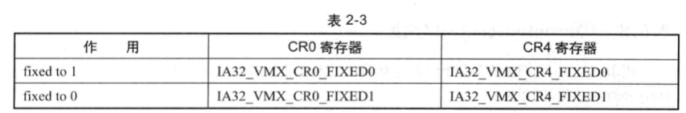

CRO 与 CR4 寄存器分别对应各自的 FIXEDO 和 FIXED1 能力寄存器, 如表 2-3 所示



**编号为 0** 的 FIXED 寄存器指示固定为 1 值, 编号为 1 的 FIXED 寄存器指示固定为 0 值. 需要这两个寄存器(FIXEDO 和 FIXED)来控制, 是由于在 64 位模式下, CRO 与 CR4 寄存器是 64 位的. 因此, 一个用来描述固定为 1 值, 一个用来描述固定为 0 值.

* 当 **FIXED0**(编号为 0) 寄存器的位为 **1** 值时, CRO 和 CR4 寄存器**对应的位**必须为 1 值.
* 当 **FIXED1**(编号为 1) 寄存器的位为 **0** 值时, CRO 和 CR4 寄存器**对应的位**必须为 0 值.

VMX 架构还保证了另一种现象:

* 当 **FIXED0** 寄存器的位为 **1** 时, **FIXED1** 寄存器**相应的位**也**必定**返回 **1** 值.

* 当 **FIXED1** 寄存器的位为 **0** 时, **FIXED0** 寄存器**相应的位**也**必定**为 **0** 值.

举例来说:

* `IA32_VMX_CR4_FIXEDO` 的 `bit 13` 为 1 值, 那么 `IA32_VMX_CR4_FIXED1` 的 `bit 13` 也会保证为 1 值.

* `IA32_VMX_CR4_FIXED1` 的 `bit 20` 为 0 值, `IA32_VMX_CR4_FIXEDO` 的 `bit 20` 也保证为 0 值.

另外注意: 如果 FIXEDO 寄存器的某位为 0, 而 FIXEDI 寄存器对应的该位为 1 时, 表明这个位允许设为 0 或者 1 值. 例如, FIXEDO 的 bit1 为 0, 而 FIXEDI 的 bit1 为 1 时, 则 CRO 或 CR4 寄存器的 bit1 可以为 0, 也可以为 1. 实际上, 它与前面的控制字段保留位为 default 与 defaulti 值有相似之处.

以图 2-5 的运行结果为例, 注意, 结果里只输出了低 32 位, 因此以低 32 位为例说明. CRO 寄存器对应的 IA32 VMX CRO FIXEDO 的值为 80000h, IA32 VMX CRO FIXEDI 的值为 FFFFFFFFH. CR4 寄存器对应的 IA32 VMX CR4 FIXED0 值为 000000, A32 VMX CR4 FIXEDI 的值为 000027FFh.

那么说明以下几种现象:

(1) CRO 寄存器的 bit0、bit5 以及 bit31 必须为 1 值(FXED 与 FIXED1 寄存器的这些位都为 1). 也就是 `CRO.PE`、`CRO.NE` 以及 `CRO.PG` 位必须为 1, 表示必须要开启分页的保护模式, 并且使用 native 的 x87FPU 浮点异常处理方法.

(2) CR4 寄存器的 bit13 必须为 1 值(FIXEDO 与 FIXEDI 寄存器的 bit13 都为) . 也就是 CR4.VMEX 位必须为 1, 表示必须开启 VMX 模式的许可.

(3) CRO 寄存器的其余位可为 0 或 1 值.

(4) CR4 寄存器的 bits12:11 和 bits31:14 必须为 0 值.

CRO 与 CR4 寄存器的固定位是 VMX 架构的制约条件之一, 详见第 2.3.2 节所述

# CRO 与 CR4 寄存器设置算法

CRO 与 CR4 寄存器的设置和前面所说的控制字段方法是一样的.

(1) Result1 = 初始值 "OR" FIXED0 寄存器

(2) Result2 = Result1 "AND" FIXED1 寄存器

这个 Result2 就是 CRO 与 CR4 寄存器的最终合成值, 也有下面的算法:

(1) FIXED0 "AND" FIXED1 可以找到哪些位必须为 1 值.

(2) FIXED0 "OR" FIXED1 可以找到哪些位必须为 0 值.

```
        ;;
        ;; 读 CR0 当前值
        ;;
        REX.Wrxb
        mov ecx, cr0
        mov ebx, ecx

        ;;
        ;; 检查 CR0.PE 与 CR0.PG 是否符合 fixed 位, 这里只检查低 32 位值
        ;; 1) 对比 Cr0FixedMask 值(固定为 1 值), 不相同则返回错误码
        ;;
        mov eax, STATUS_VMX_UNEXPECT                    ; 错误码(超出期望值)
        xor ecx, [ebp + PCB.Cr0FixedMask]               ; 与 Cr0FixedMask 值异或, 检查是否相同
        js initialize_vmxon_region.done                 ; 检查 CR0.PG 位是否相等
        test ecx, 1
        jnz initialize_vmxon_region.done                ; 检查 CR0.PE 位是否相等

        ;;
        ;; 如果 CR0.PE 与 CR0.PG 位相符, 设置 CR0 其它位
        ;;
        or ebx, [ebp + PCB.Cr0Fixed0]                   ; 设置 Fixed 1 位
        and ebx, [ebp + PCB.Cr0Fixed1]                  ; 设置 Fixed 0 位
        REX.Wrxb
        mov cr0, ebx                                    ; 写回 CR0

        ;;
        ;; 直接设置 CR4 fixed 1 位
        ;;
        REX.W
        mov ecx, cr4
        or ecx, [ebp + PCB.Cr4FixedMask]                ; 设置 Fixed 1 位
        and ecx, [ebp + PCB.Cr4Fixed1]                  ; 设置 Fixed 0 位
        REX.W
        mov cr4, ecx
```

上面的代码是在进入 VMX 模式前对 CRO 和 CR4 寄存器进行设置. 首先, 检查 CRO 寄存器的初始值是否满足 CROPE=1 和 CRO.PG=1, 表示当前处于分页保护模式. 然后"或"FIXEDO 寄存器, 以及"与"FIXEDI 寄存器值.

CR4 寄存器"或"Cr4 Fixed Mask 值, 这个值记录的是哪些位必须为 1, 使用 Cr4 Fixedmask 而不是 FIXEDO 寄存器是因为: Cr4 Fixedmask 也记录着是否需要开启 CR4.SMXE 位.
