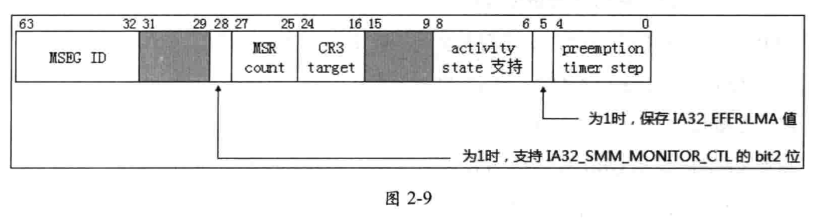

`IA32_VMX_MISC` 寄存器提供了一些 vmx 的杂项信息.

`bits 4:0`(**5 个 bit**) 提供一个 X 值(**最大 31**), 当 **TSC** 值的 `bit X`(低 32 位) 改变时, `VMX-preemption timer count` 计数值将减 1.

>假如这个 **X** 值是 5, 那么表示当 TSC 的 `bit 5` 发生改变(0 变 1 或 1 变 0) 时, preemption timer count 计数值减 1. 也就是说, **TSC 计数 32 次时**, preemption timer count 值减 1.

`bit 5` 为 1 时, 表示**当发生 VM-exit 行为**时, 将保存 `IA32.EFER.LMA` 的值在 `VM-entry control` 字段的"`IA-32e mode guest`"位里. 只有当 VMX 支持 `unrestricted guest`(不受限制的 guest)功能时, 这个位才为 1 值.

`bits 8:6` 是一个 mask 位值, 提供**虚拟处理器 inactive 状态值**的**支持度**, 有下面的几个 inactive 状态值:

* `bit 6` 为 1 时, 支持 **HLT** 状态

* `bit 7` 为 1 时, 支持 **shutdown** 状态

* `bit 8` 为 1 时, 支持 `wait-for-SIPI` 状态

只有这些 inactive 状态被支持时, 才允许在 **guest state** 区域 `activity state` 字段设置相应的 inactive 状态值. `bits 8:6` 一般会**返回 7**(**全部支持**).

`bit 13:9` 是保留位, 读出来是 0.

`bit 14` 为 1 时, Intel Processor Trace(Intel PT, ) 可以在 **VMX operation** 中使用.

> 如果处理器支持 Intel PT 但不允许在 VMX operation 中使用它, 则**执行 VMXON**会清除 `IA32_RTIT_CTL.TraceEn`(请参阅第 30 章中的" `VMXON-Enter VMX operation`"); 在`VMX operation`(包括`VMX root operation`)中进行任何写入`IA32_RTIT_CTL`的尝试都会导致 `#GP`.

`bit 15` 为 1 时,

`bits 24:16` 指示支持的 `CR3-target` 值的**数量**, 一般会返回 **4** 值, 表示支持 4 个 CR3 寄存器目标值.

`bits 27:25` 返回一个 N 值, 这个 N 值用来计算出在 MSR 列表(VM-exit MSR-load、VM-exit MSR-store 以及 VM-entry MSR-load 列表)里推荐的 MSR 最大个数. 计算方法是: 个数= `(N+1) ×512`. 一般会返回 0 值, 表示列表里推荐最多支持 512 个 MSR.

`bit 28` 为 1 时, 表示支持 `IA32_SMM_MONITOR_CTL` 寄存器的 bit 2 位能被设为 1 值. 这个 bit 2 置位时, 表示执行 VMXOFF 指令时, SMI 能被解开阻塞. 一般情况下  VMXOFF 指令的执行将阻塞 SMI 请求.

`bit 29` 为 1 时, 软件可以使用**VMWRITE**写入任何 VMCS 中支持的字段; 否则, VMWRITE**不能**修改 **VM-exit information 字段**.

`bit 30` 为 1 时,

`bit 31` 是保留位, 读出来是 0.

`bit 63:32` 报告了 32 位的 MSEG

