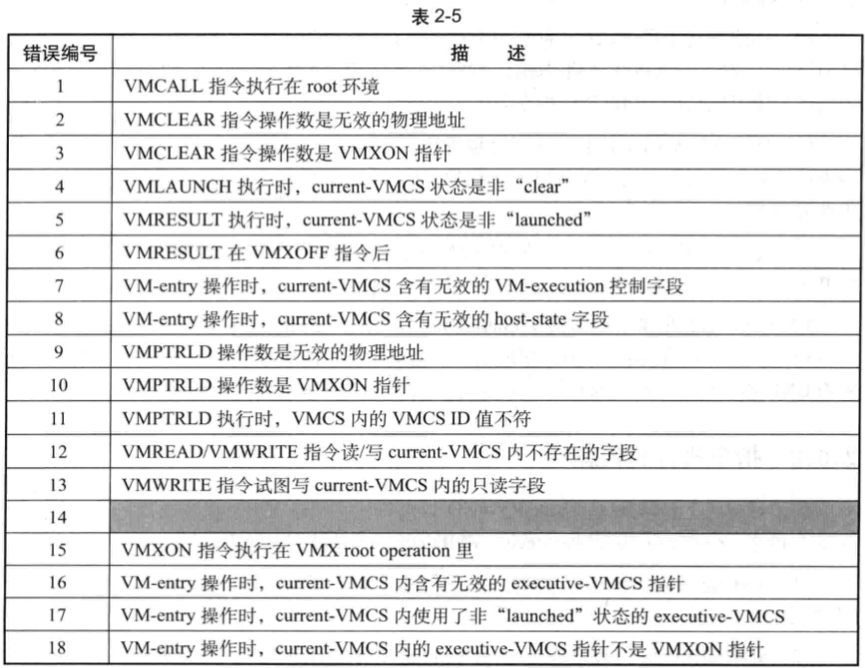
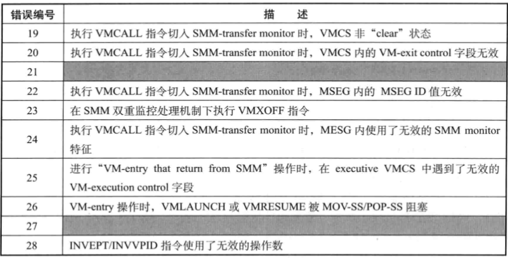

VMX 指令产生的 **VMfailValid** 失败会**对应一个编号**, 这个编号就记录在 `VM-instruction error` 字段里. 这个字段是 `VM-exit` 信息区域内的其中一个 **32 位字段**. 如表 2-5 所示.

表 2-5 列出了所有可能发生的 VMfailValid 原因, 编号 `14`,`21` 以及 `27` 没有使用. 其中有数个失败产生于 VM-entry 和 SMM 双重监控处理机制下的切入 Smm-transfer monitor 时.