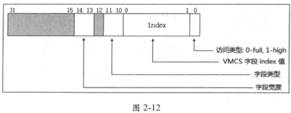

<!-- @import "[TOC]" {cmd="toc" depthFrom=1 depthTo=6 orderedList=false} -->

<!-- code_chunk_output -->

- [1. VMPTRLD 指令](#1-vmptrld-指令)
- [2. VMPTRST 指令](#2-vmptrst-指令)
- [3. VMCLEAR 指令](#3-vmclear-指令)
- [4. VMREAD 指令](#4-vmread-指令)
- [5. VMWRITE 指令](#5-vmwrite-指令)

<!-- /code_chunk_output -->

有 5 条 VMX 指令涉及 VMCS 区域的管理. 下面介绍用法.

# 1. VMPTRLD 指令

VMPTRLD 指令从**内存**中加载一个**64 位物理地址**作为 `current-VMCS pointer`.

这个 `current-VMCS pointer` 由**处理器内部自动记录和维护**, 除了 **VMXON**、**VMPTRLD** 和 **VMCLEAR** 指令需要提供 **VMXON** 或 **VMCS** 指针作为**操作数**外, **其他的指令**都是在 `current-VMCS` 上操作.

```
vmptrld [gs: PCB.GuestA]    ; 加载 64 位 VMCS 地址
```

注意: 这条指令读取的是 **64 位物理地址值**, 即使在 **32 位环境**下. 如上面代码所示, 在 `PCB.GuestA` 里保存着一个 **VMCS 区域**的物理地址值, 执行这条指令将更新 `current-VMCS pointer` 值. 在指令**未执行成功**时, `current-VMCS pointer` 将维持**原有值**.

处理器会根据提供的 VMCS 指针, 进行下面的检查事项:

(1) 物理地址是否超过**物理地址宽度**, 并且需要在 **4K 地址边界**上. 当 `IA32_VMX_BASIC[48]` 为 1 时, **物理地址宽度**在 **32** 位内, 否则为 **MAXPHYADDR** 值(参见第 2.5.4 节).

(2) VMCS 指针是否为 **VMXON 指针**.

(3) 目标 VMCS 区域**首 DWORD 值**是否符合 `VMCS ID` 值.

当上面检查不通过时, 如果原来已经存在 `current-VMCS pointer`, 则会产生  **VmfailValid** 失败, `current-vmcs pointer` 将**维持不变**, 并且在 current-VMCS 的**指令错误字段**里记录错误号是 **11**(如表 2-5 所示). 指示: "执行 VMPTRLD 时, VMCS 内的  VMCS ID 值不符". 否则, 产生 **VmfailInvalid** 失败.

# 2. VMPTRST 指令

VMPTRST 将 **64** 位的 `current-vmcs pointer` **保存**在**提供的内存**中, 如下面示例.

```
vmptrst  [gs: PCB.VmcsPhysicalPointer)     ;保存 64 位 WMCS 地址
```

VMPTRST 指令**不会**产生 `VmfailValid` 或 `VmfailInvalid` 失败, 除了产生**异常**或 `VM-exit` 外, 它总是成功的.

如果没有 current VMCS, 那么将存 `FFFFFFFF_FFFFFFFFH`

# 3. VMCLEAR 指令

VMCLEAR 指令根据提供的 **64** 位 **VMCS 指针**, 对目标 VMCS 区域进行一些**初始化工作**, 并将**目标 VMCS 的状态**设置为"`clear`".

这个初始化工作, 其中有一项是将**处理器内部维护**的关于 VMCS 的数据写入**目标 VMCS 区域**内. 这部分 VMCS 数据可能与处理器相关, 这是正确使用 VMCS 的前提.

在使用 `VMLAUNCH` 指令**进入 VM 时！！！**, `current-VMCS` 的 **launch** 状态**必须！！！** 为 "`clear`". 因此, 当 **VMCLEAR 指令**对目标 VMCS 进行初始化后, 使用 `VMPTRLD` 指令将目标 VMCS 加载为 `current-VMCS`, 同时也更新 current-vmcs pointer 值. 如下面代码示例.

```x86asm
vmclear  [gs: PCB.GuestA]   ;对 GuestA 进行初始化, 置"clear"
jc @1
jz @1

vmptrld  [gs: PCB.GuestA]   ;将 GuestA 加载为 current-WMCS
jc @1
jz @1
```

执行上述操作后, 在**后续工作**里对 GuestA 区域进行配置, 然后就可以**使用  VMLAUNCH 指令进入 VM 执行**.

VMCLEAR 指令也会对目标 VMCS 指针进行与 VMPTRLD 指令相同的检查(参见第 2.6.5.1 节). 如果在**执行 VMCLEAR 指令前已经加载过**当前 VMCS 指针, 并且  VMCLEAR 指令的目标 VMCS 是 `current-VMCS`, 则会设置 `current-VMCS pointer` 为 `FFFFFFFF_FFFFFFFFH` 值.

# 4. VMREAD 指令

VMREAD 指令需要提供一个 **32** 位的 **VMCS 字段 ID 值**放在寄存器里作为**源操作数**. **目标操作数**是寄存器或者内存操作数, 将读取到的相应字段值放在目标寄存器或者内存地址中.

VMREAD 指令在 **32 位模式**下固定使用 **32 位的操作数**, 在 **64 位**模式下固定使用 **64 位操作数**. (包括源操作数和目的操作数)

在非 `IA-32e` 模式之外, 无论`CS.D`的值如何, **源操作数**都具有**32 位**. 在 64 位模式下, **源操作数**具有**64 位**.

**目标操作数**的**有效大小**(可能是寄存器或内存)在非 `IA-32e` 模式始终为**32 位**(相对于操作数大小, `CS.D`的设置被忽略), 在 64 位模式下始终为**64 位**. 而 **VMCS 字段**有**不同的宽度**, 例如, 存在 16 位字段和 natural-width 类型的字段. natural-width 类型的字段在支持 64 位架构的处理器上是 64 位, 在不支持 64 位架构的处理器上是 32 位.

为了**适应不同宽度的字段**, VMREAD 指令使用下面的读取原则

* 如果 **VMCS 字段**的 **size** 小于**目标操作数** size, 则 **VMCS 字段值**读入目标操作数后, 目标操作数的**高位部分清 0**.

* 如果 **VMCS 字段**的 **size** 大于**目标操作数** size, 则 VMCS 字段的低位部分读入目标操作数, VMCS 字段的**高位部分忽略**.

由于 **VMCS 字段 ID 值**为 **32** 位, 在 **64** 位模式下源操作数的 `bits 63:32` 必须为 0. 否则会因为尝试读取一个不支持的 VMCS 字段而产生 **Vmfailvalid** 失败.

```
vmread  [ebp+ EXIT_INFO. Exitreason], eax
vmread ebx. Eax
```

上面的代码中, VMCS 字段 ID 值放在源操作数 EAX 里, 读到的值放在内存及 EBX 寄存器里. VMCS 的字段 ID 也被称为"**字段 encode**", 由几个部分组成, 如图 2-12 所示.



在前面第 2.5.12 节所提到的 IA32 VMX VMCS ENUM 寄存器(图 2-10) 的 bis9:1 提供最大的 VMCS 区域字段 index 值. 这个最大 index 值就是指图 2-12 字段编码中的  index 最大值. 关于字段编码的详细说明在第 3.3.1 节里描述

在 inclvmx.inc 文件里提供了两个宏, 用来读取 VMCS 字段: Dovmread 宏读取 VMCS 字段放在内存 buffer 中, Getvmcsfield 宏读取 VMCS 字段值放在 EAX 寄存器中. 如代码片段 2-13 所示.

......


# 5. VMWRITE 指令

VMWRITE 指令的**源操作数**是寄存器或者内存操作数, 提供需要**写入 VMCS 字段的值**. **目标操作数**是寄存器, **32 位**的**字段 ID 值**提供在目标寄存器操作数里.

VMREAD 指令在 **32 位模式**下固定使用 **32 位的操作数**, 在 **64 位**模式下固定使用 **64 位操作数**. (包括源操作数和目的操作数)

在非 `IA-32e` 模式之外, 无论`CS.D`的值如何, **目的操作数**都具有**32 位**. 在 64 位模式下, **目的操作数**具有**64 位**.

**源操作数**的**有效大小**(可能是寄存器或内存)在非 `IA-32e` 模式始终为**32 位**(相对于操作数大小, `CS.D`的设置被忽略), 在 64 位模式下始终为**64 位**. 而 **VMCS 字段**有**不同的宽度**, 例如, 存在 16 位字段和 natural-width 类型的字段. natural-width 类型的字段在支持 64 位架构的处理器上是 64 位, 在不支持 64 位架构的处理器上是 32 位.

为了适合不同宽度的字段, WMWRITE 指令使用下面的写原则

* 如果**写入值**的 size **小于** VMCS 字段的 size, 则值写入 VMCS 字段后, VMCS 字段的**高位**部分**清 0**

* 如果**写人值**的 size **大于** VMCS 字段的 size, 则**忽略**写入值的**高位**部分, **低位**部分写入 VMCS 字段里.

由于 VMCS 字段 ID 值为 32 位, 在 64 位模式下目标操作数的 `bits 63:32` **必须为 0**. 否则会因为尝试写入一个不支持的 VMCS 字段而产生 **Vmfailvalid** 失败.