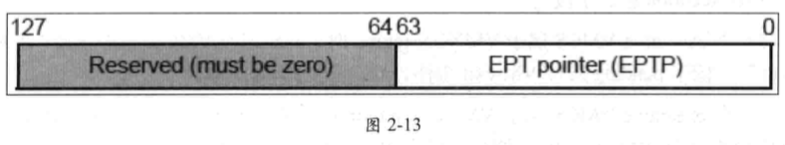
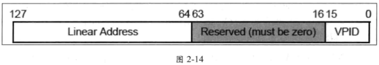

VMX 架构下提供了两条用于刷新 cache 的指令: **INVEPT** 与 **INVVPID** 指令. 它们都对 **TLBs** 与 **paging-structure caches** 进行刷新. 关于 TLBs 与 paging-structure caches 的描述 可以参考《x86/64 体系探索及编程》第 11.6 节, 或者《Intel 开发人员手册》ol3A 第 4.10 节.

在 VMX 架构下实现了**三类映射途径**下的 `TLB caches` 与 `paging-structure caches` 信息, 它们是

(1) **linear mapping**, 当 **EPT 机制未启用**时(或者在 **VMX root opeation** 模式下), 这类 cache 信息用来缓存 **linear address** 到 **physical address** 的转换(详见第 6.2.1 节).

(2) **guest-physical mapping**, 当 **EPT 机制启用**时, 这类 cache 信息用来缓存 **guest physical address**(GPA) 到 **host physical address**(HPA) 的转换(详见第 6.2.2 节).

(3) **combined mapping**, 当 **EPT 机制启用**时, 这类 cache 信息结合了 linear address 和 guest-physical address 到 host-physical address 的转换. 也就是缓存了 **linear address**(`GVA`) 到 **host-physical address**(`HPA`) 的转换信息(详见第 6.2.3 节).

这几类 cache 信息, 我们将在后面的篇章里进行探讨(参见第 6.2 节). **INVEPT** 与  **INVVPID** 指令的**不同之处**就是: **刷新的 cache 信息**, 以及**刷新的 cache 域**.

# 1. INVEPT 指令

在**启用 EPT 机制**时, 可以使用 **INVEPT** 指今对 "**GPA 转换 HPA**" 而产生的相关 cache 进行刷新.

它根据提供的 **EPTP 值**(`EPT pointer`)来刷新 **guest-physical mapping**(`guest-physical address` 转换到 `host-physical address`)和 **combined mapping**(`guest linear address` 转换到 `host-physical address`)产生的 cache 信息.

```
invept rax, [InveptDescriptor]  ;刷新 TLBs 及 paging- structure caches
```

在上面的指令示例里:

* **rax** 寄存器提供 **INVEPT type**, 指示使用**何种刷新方式**;

* **内存操作数**里存放着 **INVEPT 描述符**, **EPTP 值**提供在这个 INVEPT 描述符里, 如图 2-13 所示.



INVEPT 描述符的结构, 共 **16 个字节**(128 位), `bits 63:0` 存放 **EPTP 值**. EPTP 值的 `bits N-1:12` 指向 **EPT 结构的 PML4T 表**, INVEPT 指令将 `EPTP[N-1:12]` 所引伸出来的**层级转换表结构**作为依据进行**刷新 cache**, 这个 EPTP 字段 `bits N-1:12`(`N= MAXPHYADDR`)提供的值被称为 "**EP4TA**"(`EPT PML4T address`, **扩展页表的 PML4T 地址**).

INVEPT 指令支持**两种刷新类型**: `single-context` 与 `all-context`. 详见第 6.2.6.4 节所述.

(1) 当 type 值为 **1** 时, 使用 `single-context` 刷新方式. 处理器刷新 **INVEPT 描述符**里提供的 **EP4TA 值**所**对应**的 `guest-physical mapping` 与 `combined mapping` 信息.

(2) 当 type 值为 **2** 时, 使用 `all-context` 刷新方式. 处理器刷新**所有 EP4TA 值**对应的 gues physical mapping 与 combined mapping 信息. 也就是说, 此时**将忽略 INVEPT 描述符**.

另外需要特别注意的是: 处理器也刷新**所有 VPID 与 PCID 值**所**对应**的 **combined mappings** 信息. 软件应该要查询**处理器**的 INVEPT 指令**是否支持**上述的 ype 值.

前面第 2.5.13 节描述了 INVEPT 指令支持的刷新类型, 当使用不支持的类型时产生  Vmfailvalid 失败, **错误编号**为**28**, 指示 "**无效的 INVEPT/INVVPID 操作数**".

# 2. INVVPID 指令

**INVVPID** 指令依据提供的 **VPID 值**对 **linear mapping** 及 **combined mapping** 的 cache 信息进行刷新. 也就是 INVVPID 指令可以刷新 **EPT** 机制**启用或者未启用**时的**线性地址**到**物理地址**转换而产生的 cache 信息.

```
invvpid rax, [Invvpiddescriptor】; 刷新 TLBs 及 paging- structure caches
```

INVVPID 指令也需要:

* 在**寄存器操作数**里提供 **INVVPID type** 值;

* 在**内存操作数**里提供 **INVVPID 描述符**. INVVPID 描述符结构如图 2-14 所示



INVVPID 描述符的 `bits 127:64` 提供**线性地址**, `bits 15:0` 提供 **VPID 值**. INVVPID 指令依据这两个值进行刷新.

INVVPID 指令支持 **4 个刷新类型**(详见第 6.2.6.3 节所述).

* 当 type 值为 **0** 时, 使用 **individual-address** 刷新方式. 指令将**刷新目标 VPID**, **所有 PCID** 以及**所有 EP4TA 域**内与**目标线性地址**匹配的 cache 信息, 具体为:
  1. 匹配描述符内提供的**目标线性址**与**目标 VPID 值**.
  2. **所有 PCID 域**下对应的 linear mappings 与 combined mappings 信息.
  3. **所有 EP4TA 域**下对应的 combined mappings 信息.

* 当 type 值为 **1** 时, 使用 **single-context** 刷新方式. 指令将刷新目标 VPID, 所有 PCID 以及所有 EP4TA 域的 cache 信息, 具体为:
  1. 匹配描述符内提供**目标 VPID 值**.
  2. 所有 PCID 域下对应的 linear mappings 与 combined mappings 信息
  3. 所有 EP4TA 域下对应的 combined mappings 信息.

* 当 type 值为 **2** 时, 使用 **all-context** 刷新方式. 指令将刷新默认 VPID 值(0000) 外的所有 VPID, 所有 PCID 以及所有 EP4TA 域的 cache 信息, 具体为:
  1. 所有 VPID 值(除了 0000).
  2. 所有 PCID 域下对应的 linear mappings 与 combined mappings 信息.
  3. 所有 EP4TA 域下对应的 combined mappings 信息.

* 当 type 值为 **3** 时, 使用 **single-context-retaining-global** 刷新方式. 指令行为与类型 2 的 single- context 刷新方式相同, 除了保留 global 的转换表外.

在所有的刷新方式里, 都不能刷新 VPID 值为 0000 的 cache 信息. 否则产生  Vmfailvalid 失败, 错误编号为 28, 指示"无效的 INVEPT/INVVPID 操作数.

软件也应该使用第 2.5.13 节里描述的方式, 查询当前处理器支持哪种刷新类型. 如果提供不支持的刷新类型, 也同样产生编号为 28 的 Vmfailvalid 失败.

