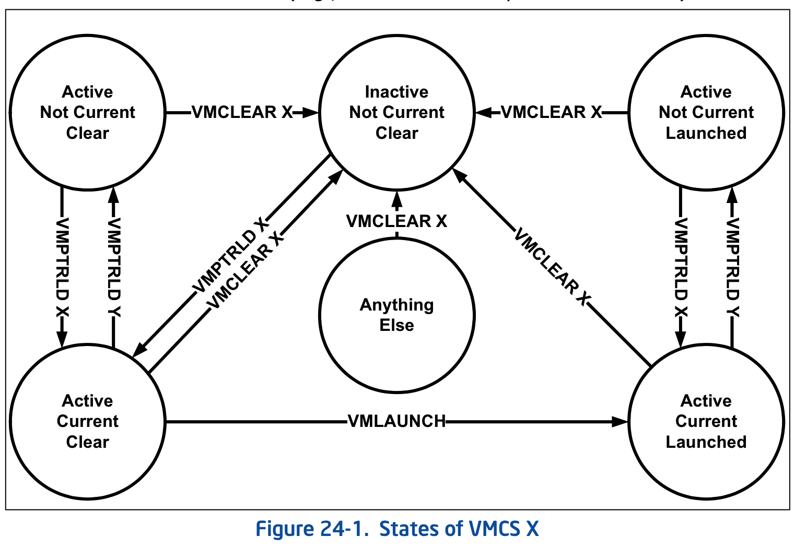

综合**三节描述**, VMCS 状态随着下面指令的执行而改变:

(1) **VMCLEAR** 指令将目标 VMCS 置为 "**inactive**", "**not current**" 及 "**clear**" 状态.

(2) **VMPTRLD** 指令将目标 VMCS 置为 "**active**" 及 "**current**" 状态, 并**更新 current-VMCS 指针**.

(3) **VMLAUNCH** 指令将 `current-VMCS` 置为 "**launched**" 状态.

处理器会记录 VMCS 的这些状态信息. 这些状态信息存放在目标 VMCS 的**不可见字段**里, 这样处理器就很容易知道 VMCS 目前处于哪种状态.

这些不可见字段并没有实现对应的字段 ID, 因此, 不能使用 VMREAD 与 VMWRITE 指令进行访问.
