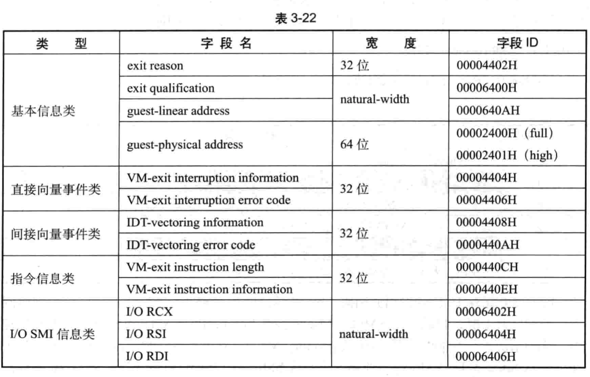
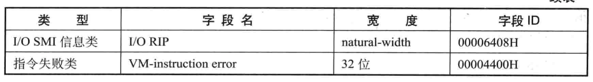

VMCS 的 VM-exit 信息类字段用来保存发生 **VM-exit 事件**的**原因**和**明细信息**, VMM 利用这些信息来决定**如何管理和控制 VM**.

VM Exit信息区域:

**VM-exit 信息类字段**的 `VM-instruction error`字段也保存着 VMX 指令发生 **VMfailValid** 失败后的**原因值**(见 2.6.3 节).

如表 3-22 , **VM-exit 信息类字段**分为**6 个类别**.

如前面, `VM-instruction error`字段保存着执行 VMX 指令发生 VMfailValid 失败时的错误原因值.

当 VMX 指令发生 **VMfailInvaild** 失败时, 不会产生错误原因值.
