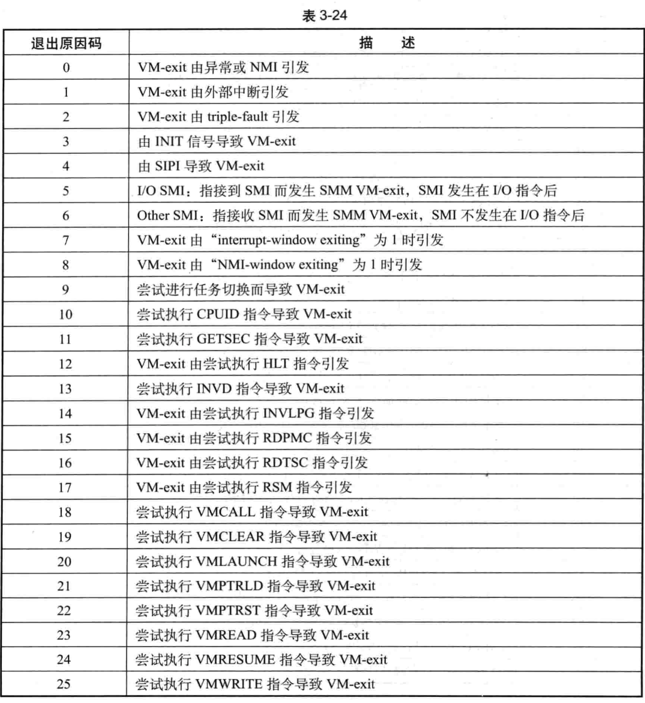
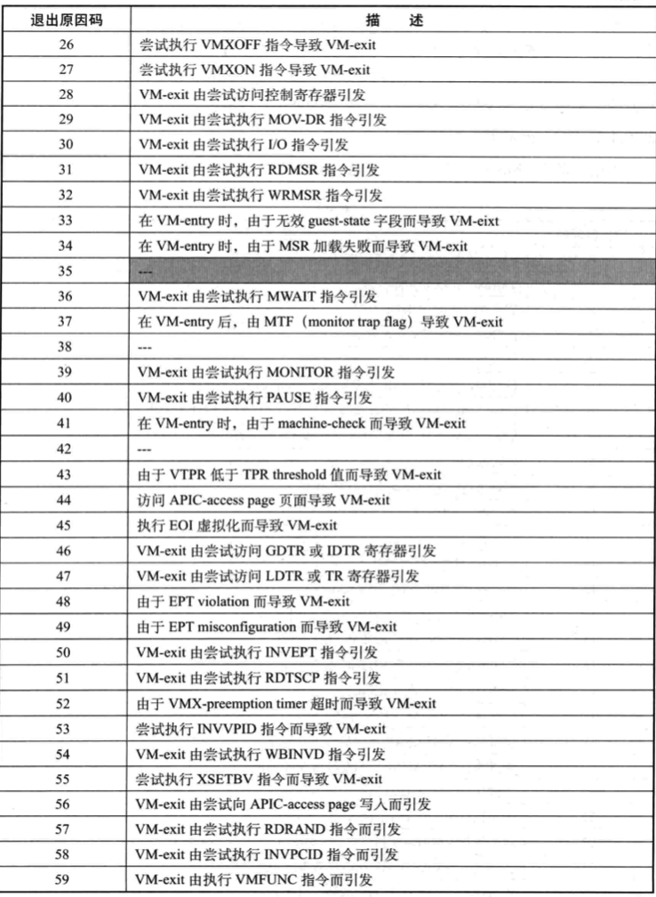
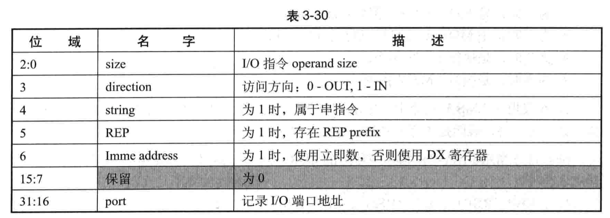

# 基本信息类字段

包括如下 4 个字段:

(1) exit reason 字段, 32 位宽, 保存导致 VM-exit 的原因值.

(2) exit qualification 字段, 属于 natural-width 类型字段, 提供导致 VM-exit 的某些事件的明细信息.

(3)

# Exit reason 字段

# VM-exit 原因

详细见 Intel 手册 `APPENDIX C VMX BASIC EXIT REASONS`

AMD 的见手册`Appendix C SVM Intercept Exit Codes`

当前 VMX 架构一共有 57 个退出原因码, 如表 3-24 所示.






# Exit qualification 字段

Exit qualification 字段属于 natural-widh 类型(在 64 位架构处理器上是 64 位, 否则为 32 位). 在 VM-exit 时, 这个字段记录由于下面的原因导致 Vm-exit 的明细信息:

 (1) 由某些指令而引发的 VM-exi, 包括: INVEPT, INVLPG, INVPCID, INVVPID, LGDT, SGDT, LIDT. SIDT, LLDT. SLDT. LTR. STR. VMCLEAR. VMPTRLD, VMPTRST, VMREAD, VMWRITE, VMXON, MWAIT 指令.

 (2) 由#DB 异常而引发的 VM-exit

 (3) 由 PF 异常而引发的 VM-exit

 (4) 由于接收到 SIPI 消息而引发的 VM-exit

 (5) 由于接收到 SMI 请求而引发的 VM-exit

 (6) 由于进行任务切换而引发的 M-exit.

 (7) 由访问控制寄存器而引发的 VM-exit.

 (8) 由于执行 MOV-DR 指令而引发的 VM-exi

(9)由于访问 I/O 地址而引发的 VM-exi

 (10) 由于访问 APIC- access page 而引发的 VM-exit

 (11) 由于 EPT violation 而引发的 VM-exit.

 (12) 由 EOI 虚拟化而导致的 VM-exit.

 (13) 由 APIC- write VM-exit 而导致的 VM-exit

对于其他原因导致的 VM-exit, exit qualification 字段将清为 0 值. 根据不同的 VM- exit 原因, exit qualification 字段记录的信息格式也不同. 下面分别描述上面介绍的 13 种 VM-exit 明细信息.

## 由某些指令引发的 VM-exit


如上面这条指令,在 guest 中尝试执行它将产生 VM-exit,在 exit qualification 字段中保存的值是 0CH.如果内存操作数是 `[rbx]`, 则 exitqualification 字段的值为 0.

在 X64 体系中支持 RIP-relative 寻址,当在 64 位模式下使用这种寻址时, exilqualification 字段保存 RIP 加上偏移量后的值.

```
invept rax,[rip + 0ch]
```

在上面这条指令中,如果 RIP 的值是 400000H,那么 exit qualification 字段的值是
40000CH、
注意:在指今内存操作数寻扯里,address-size 可能会被 address-size overrideprefix 改
写.例如,在 64-bit 模式下:使用 67Hprefix 改写为 32 位 address-size.那么会在 VM-
exitinstructioninformation 字段中记录实际的 address-size

## 由 I/O 指令引发的 VM-exit

I/O 指令有两类, 分为串(string)指令 INS/OUTS 系列和非串指令 IN/OUT . INS/OUTS 系列指令还可以使用 REP 前缀来实现重复指令 I/O 指令, 如表 3-30 所示.



exit qualification 字段的 `bits 2:0`记录 I/O 指令访问的数据大小:
* 为 0 时, 1 个字节, 例如: `in al, 92h`.
* 为 1 时, 2 个字节, 例如: `in ax, 92h`.
* 为 3 时, 4 个字节, 例如: `in eax,92h`.


# guest-linear address 字段

# guest-physical address 字段